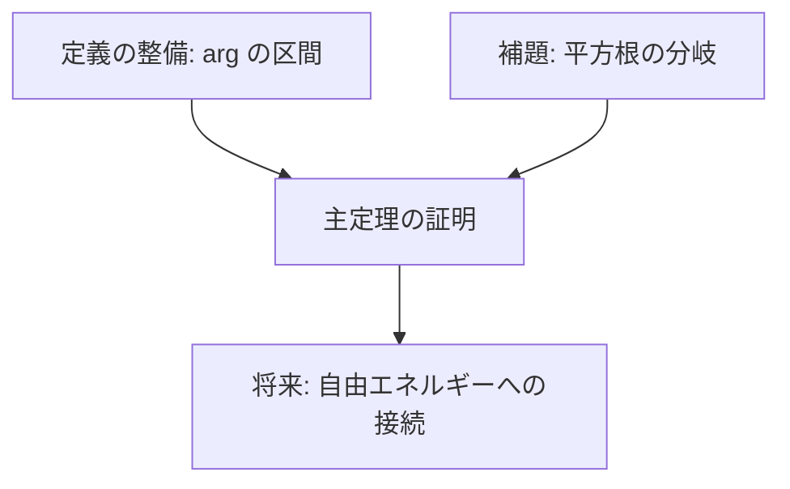

# タスクファイル共通ルール

タスクファイルを生成・消化するすべてのスキル（`project-manager`, `task-manager`, `math-prover` 等）が
従う共通ルールを定義する。

**このファイルはタスクファイルの形式だけを定める。** 数学的厳密性・記号の帰属・$\mathbb{R}$ 脱出の
記録・一ステップ一定理の正本は下表の文書と `math-prover` スキルであり、ここでは重複して持たない。

---

## 着手前に読むもの（厳守・省略不可）

| 文書 | 何の正本か |
|---|---|
| [CLAUDE.md](../../../CLAUDE.md) / [AGENTS.md](../../../AGENTS.md) | リポジトリ最優先の規約。構成・命名規則・**証明の記述形式（正本は構造化テキスト。Typst で新規に書かない）**・検証コマンド・**「文書・定理を番号や記号で管理しない」**・完了の定義 |
| 作業対象プロジェクトの `README.md` と `MEMORY.md` | プロジェクト固有のゴール・道具立ての制限・引き継ぎ状況 |
| [math-prover スキル](../math-prover/SKILL.md) | 証明の記述ルール（一ステップ1定理・根拠のラベル参照・インデント・帰属と $\mathbb{R}$ 脱出） |
| [docs/discussion/対数順序群上の統計力学/](../../../docs/discussion/対数順序群上の統計力学/) | 可算コアと $\mathbb{R}$ 脱出という立場の一次情報 |

---

## リポジトリの前提

数学研究プロジェクトのモノレポである。各プロジェクトはトップレベルのサブディレクトリに置かれる
（一覧と構成は [CLAUDE.md](../../../CLAUDE.md)）。タスクを書くときの前提は次のとおり。

- **証明の正本形式は構造化テキスト（`<project>/structured-latex/`）**。
  入力言語の定義はリポジトリ直下の `structured-latex/`（システム）が持つ。
- **Typst による記述は廃止された。** 新規に Typst で書かない。移行済みの原本は
  `<project>/_old/typst/` の温存アーカイブであり、タスクの成果物の置き場所ではない。
- **相互参照・数値検証・Lean との対応はすべて `labels`（安定識別子）で行う。**
  ファイルパスに依存させない。
- **文書・定理・タスクを番号や記号で管理しない。** 名前で呼ぶ（CLAUDE.md の該当節）。

---

## ディレクトリ構造と名前の付け方

タスクファイルは `<project>/docs/tasks/<scope-name>/` 配下に格納する。

`<scope-name>` はタスクの起点が分かる名前にする（例: `fix-arg-interval`, `fermion-bilinear`）。

```
<project>/docs/tasks/<scope-name>/
├── task-dependency-graph.md       # 必須: 依存関係グラフ。**実行順序はここが正本**
└── proof/                         # 証明タスク
    ├── <task-name>.md
    ├── <task-name>.md
    └── ...
```

カテゴリは内容に応じて `proof/`, `definition/`, `refactor/`, `verification/` 等を使い分けてよい。

**ファイル名に連番プレフィックスを付けない。** タスク名は、それだけ読めば何をするタスクか分かる
名前にする（`extract-taylor-coefficient.md` であって `010_task.md` ではない）。
**実行順序・優先度は `task-dependency-graph.md` に依存関係と言葉で書く**
（ファイル名の並びは順序を意味しない）。会話・報告でもタスクは**名前で**呼ぶ。

---

## task-dependency-graph.md

タスク間の依存関係と実行順序を記述する。以下の要素を **必ず** 含めること:

````markdown
# Task Dependency Graph

## 概要

- **スコープ**: <scope-name>
- **タイトル**: <タイトル>
- **概要**: <概要の要約>

## 依存状況

- <関連する既存のブロック（ラベル）>: <ステータス（完了/WIP/未着手）>

## 依存関係図



## タスク一覧

| ファイル | カテゴリ | 概要 | 依存先 | 並列可否 |
| -------- | -------- | ---- | ------ | -------- |
| fix-arg-interval.md | definition | ... | なし | 可 |
````

---

## 個別タスクファイルの共通構造

すべてのタスクファイルは以下のセクションを含む:

```markdown
# <タスクタイトル>

## 概要

<このタスクで達成する数学的目標>

## 背景・前提

- <出典（参考文献の該当箇所、既存ブロックのラベル等）>
- <依存タスク・依存する Definition/Claim/Theorem（ラベルで指定）>
- <必要な前提知識（例: arg の定義、√ の分岐条件、反交換関係 等）>
- 着手前に対象プロジェクトの README と CLAUDE.md を読むこと

## スコープ

<このタスクの対象範囲を明確に記述>

## 記号の帰属と ℝ 脱出の見込み

- <このタスクで扱う量が ℕ/ℤ/ℚ/Λ/ℚ̄/ℝ/ℂ のどこに住むか>
- <ℝ 脱出が起きる見込みがあるなら、その型（見かけだけの ℝ 脱出／実対数による ℝ 脱出／
  指数評価による ℝ 脱出／極限・積分による ℝ 脱出／完備性・可分性を要する構造）と理由。
  見かけだけの脱出なら、書き換えて消す方針を書く>

## 作業内容

### <具体的な作業ステップ>

- <詳細な指示（どの式からどの式への変形か、どの公式・ラベルを使うか等）>

### <具体的な作業ステップ>

- <詳細な指示>

## 対象ファイル

- `<project>/structured-latex/content/<file>.ts`（ブロック `<id>` / ラベル `<label>`）

## 完了条件

- [ ] <数学的な完了条件（例: ○○の等式が証明されている）>
- [ ] ステートメントと証明が整合している
- [ ] 参照（`ref`）が全て解決し、未解決参照がゼロである
- [ ] 記号の帰属を書き、ℝ/ℂ が現れる行に脱出の型と理由を書いた
- [ ] `(cd <project>/structured-latex && npm run check)` が通る
- [ ] `node <project>/structured-latex/tools/validate-content.ts` が通る
- [ ] `(cd <project>/structured-latex && npm run build:pdf)` が通る（最終成果物を伴うタスクの場合）
- [ ] 検証がどこまで済んだかを明示した（SageMath 検証・Lean が別タスクなら、その旨とタスク名）
```

スキルごとに追加セクションを設けてもよいが、上記セクションは省略しない。

---

## タスク記述のガイドライン

### 数学的厳密性

- 証明の各ステップで使用する既存の Definition/Claim/Theorem を**ラベルで**明示する
  （読みやすさのためにファイル名を添えてよいが、**紐づけの正本はラベル**）。
- 式変形の方針を具体的に記述する（「適宜計算する」ではなく、どの公式を使ってどう変形するかを書く）。
- arg の範囲条件、√ の分岐条件など、場合分けが必要な箇所を明示する。
- **登場する記号の所属集合を書く。** $\mathbb{R}/\mathbb{C}$ を要求するタスクなら脱出の型と理由を書く。
  見かけだけの脱出なら、可算側へ書き換えて消すことがタスクの内容である。
- 有限系の主張と極限後の主張が 1 タスクに混ざらないようにする（混ざるなら 2 タスクに割る）。

### 独立性

- 各タスクは、依存タスクの完了条件が満たされていれば、他のコンテキストなしに着手できるようにする。
- ただし CLAUDE.md とプロジェクト README の一読は、どのタスクでも前提として書く。

### 粒度

- 1 タスク = 1 つの Claim/Theorem の証明完成、または関連する複数の Definition の整備程度とする。
- 1 タスク = 1 コミットで完結する程度が望ましい。

### 構造化テキストの記述規約

- ブロックの `kind` は `definition` / `claim` / `theorem` / `remark` / `heading`。
- `id` は `<章名>_<type>_<内容>`、`labels` に相互参照のキーとなる安定識別子を置く。
  **連番だけの id・ラベルを作らない**（機械が使う一意キーだが、内容の分かる名前にする）。
- 相互参照は `ref("<label>")`。**数式文字列の中には書けない**ので、参照する行で式変形を切る。
- 補足計算・具体例・物理的解釈・採用しなかった経路は `notes/` に置く
  （`targets` に紐づけ先のラベル）。**正しさに必要なものは本文に書く。**
- ラベル・ブロックを増減したら `npm run gen` で生成物を作り直す。
- 書き方の詳細は [math-prover スキル](../math-prover/SKILL.md)。
