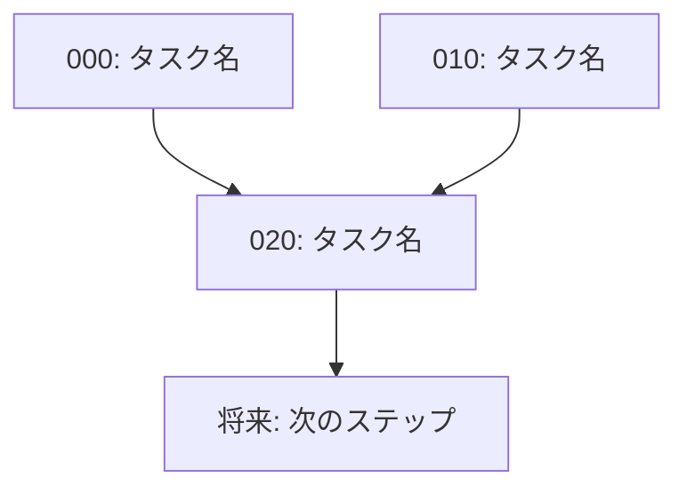

# タスクファイル共通ルール

タスクファイルを生成するすべてのスキル（project-manager 等）が従う共通ルールを定義する。

---

## 1. プロジェクト概要

本プロジェクトは、2次元イジングモデルの厳密解を数学的に厳密な形で導出するものである。

- **文書形式**: Typst (.typ)
- **本文構成**: `main.typ` が `parts/` 以下の .typ ファイルを `#include` して構成
- **数学的構造**: Definition → Claim/Theorem → Proof の流れで厳密な証明を積み上げる
- **計算検証**: Python (`check_calc.py`) および SageMath (`sage/`) で数値的に検証する場合がある
- **参考文献**: ホロノミック量子場（佐藤幹夫ほか）付録B 等

---

## 2. ディレクトリ構造

タスクファイルは `docs/tasks/<scope-id>/` 配下に格納する。

`<scope-id>` はタスクの起点に応じて命名する（例: `fix_arg_interval`, `fermion-B13`）。

```
docs/tasks/<scope-id>/
├── task-dependency-graph.md       # 必須: 依存関係グラフ
└── proof/                         # 証明タスク
    ├── 000_<task-name>.md
    ├── 010_<task-name>.md
    └── ...
```

カテゴリは内容に応じて `proof/`, `definition/`, `refactor/` 等を使い分けてよい。

---

## 3. 番号体系

- **10 飛ばしで連番** を振る（例: 000, 010, 020...）
- タスクの追加や順序変更があっても、既存ファイル名を変更せずに済む

---

## 4. task-dependency-graph.md

タスク間の依存関係と実行順序を記述する。以下の要素を **必ず** 含めること:

````markdown
# Task Dependency Graph

## 概要

- **スコープ**: <scope-id>
- **タイトル**: <タイトル>
- **概要**: <概要の要約>

## 依存状況

- <関連する既存の .typ ファイルや Claim>: <ステータス（完了/WIP/未着手）>

## 依存関係図



## タスク一覧

| #   | ファイル   | カテゴリ | 概要 | 依存先 | 並列可否 |
| --- | ---------- | -------- | ---- | ------ | -------- |
| 000 | 000_xxx.md | proof    | ...  | なし   | 可       |
````

---

## 5. 個別タスクファイルの共通構造

すべてのタスクファイルは以下のセクションを含む:

```markdown
# <タスクタイトル>

## 概要

<このタスクで達成する数学的目標>

## 背景・前提

- <出典（参考文献の該当箇所、既存の .typ ファイルへの参照等）>
- <依存タスク・依存する Definition/Claim/Theorem>
- <必要な前提知識（例: arg の定義、√ の分岐条件、反交換関係 等）>

## スコープ

<このタスクの対象範囲を明確に記述>

## 作業内容

### 1. <具体的な作業ステップ>

- <詳細な指示（どの式からどの式への変形か、どの公式を使うか等）>

### 2. <具体的な作業ステップ>

- <詳細な指示>

## 対象ファイル

- `parts/XXX/YYY.typ`

## 完了条件

- [ ] <数学的な完了条件（例: ○○の等式が証明されている）>
- [ ] ステートメントと証明が整合している
- [ ] #ref による他の Definition/Claim への参照が正しく解決される
- [ ] `typst compile main.typ` がエラーなしで通過する
```

スキルごとに追加セクションを設けてもよいが、上記セクションは省略しない。

---

## 6. タスク記述のガイドライン

### 数学的厳密性

- 証明の各ステップで使用する既存の Definition/Claim/Theorem を明示する（ファイル名と label の両方を記載）
- 式変形の方針を具体的に記述する（「適宜計算する」ではなく、どの公式を使ってどう変形するかを書く）
- arg の範囲条件、√ の分岐条件など、場合分けが必要な箇所を明示する

### 独立性

- 各タスクは、依存タスクの完了条件が満たされていれば、他のコンテキストなしに着手できるようにする

### 粒度

- 1 タスク = 1 つの Claim/Theorem の証明完成、または関連する複数の Definition の整備程度とする
- 1 タスク = 1 コミットで完結する程度が望ましい

### Typst の記述規約

- Definition は `#definition("名前")[...]` で記述
- Claim は `#claim("名前")[...]` で記述
- Theorem は `#theorem("名前")[...]` で記述
- Proof は `#proof[...]` で記述
- 相互参照は `<label>` と `@label` または `#ref(<label>)` を使用
