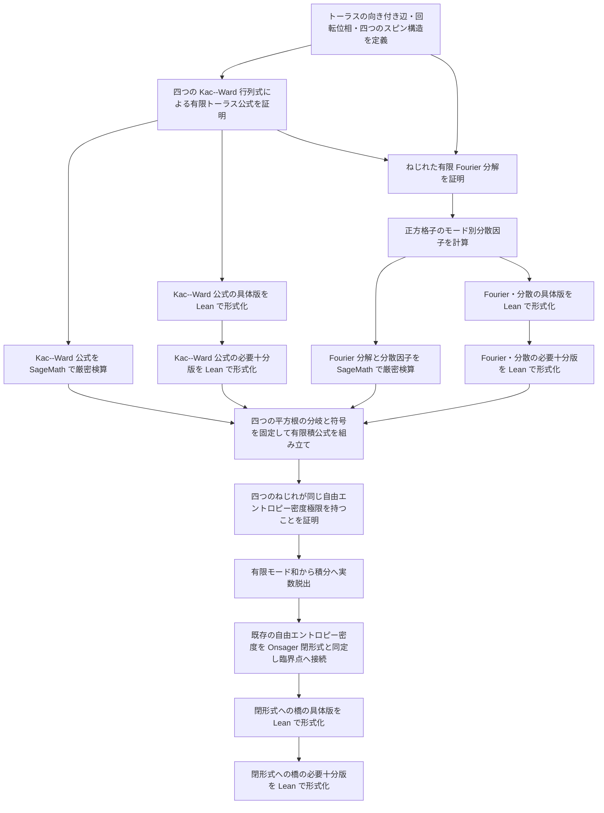

# Onsager 閉形式への接続 — Task Dependency Graph

## 概要

- **スコープ**: `onsager-closed-form-connection`
- **タイトル**: 有限トーラスの分配多項式から Onsager 閉形式までの可算的導出
- **概要**: 既存の分配多項式・高温展開・巻き付きセクター・熱力学極限を出発点に、トーラス上の四つの Kac--Ward 行列式、有限 Fourier 因数分解、分散因子、Riemann 和の極限を順に証明し、既存の周期境界自由エントロピー密度を Onsager 積分表示と同定する。有限系の全段は円分体を含む可算な代数世界に置き、実数への脱出は対数・極限・積分だけに隔離する。

## 依存状況

- `def_partition_polynomial`, `theorem_partition_polynomial_is_trace`: 完了
- `claim_high_temperature_polynomial_identity`, `claim_high_temperature_sector_decomposition`: 完了
- `claim_low_temperature_trivial_sector_expression`, `claim_sector_value_duality`: 完了
- `def_kw_dual_transform`, `claim_kw_self_dual_quadratic_equivalence`, `def_critical_point`: 完了
- `def_periodic_free_energy_density_le_one`: 完了
- トーラス版 Kac--Ward 公式、有限 Fourier 分解、Onsager 閉形式との同定: 未着手

## 採用する経路と出典

- 採用経路は Kac--Ward である。Fisher--Kasteleyn--Pfaffian 経路は参照ノートに残し、本文の主経路には混ぜない。
- トーラスでは単一行列式ではなく、四つのスピン構造に対応する行列式平方根の符号付き和を使う。正本となる外部出典は David Cimasoni, *A generalized Kac--Ward formula*, arXiv:1004.3158 とする。
- 設計ノートは `docs/discussion/対数順序群上の統計力学/09_2DIsing閉形式の可算的導出.md` と `10_Step3の厳密化_KacWardとPfaffian.md`。後者の単一行列式の記述は平面の場合に限り、トーラスへはそのまま適用しない。

## 依存関係図

## タスク一覧

| ファイル | カテゴリ | 概要 | 依存先 | 並列可否 |
|---|---|---|---|---|
| `definition/define-torus-kac-ward-data.md` | 定義 | 向き付き辺、反転、回転位相、四つのねじれ行列 | 既存の有限トーラス | 不可 |
| `proof/prove-torus-kac-ward-formula.md` | 証明 | 偶部分グラフ母関数を四行列式の平方根の符号付き和で表す | Kac--Ward データ | 不可 |
| `verification/verify-kac-ward-formula-with-sagemath.md` | 検算 | 小さい格子で係数ごとに厳密検算 | トーラス版公式 | 可 |
| `formalization/formalize-kac-ward-concrete-in-lean.md` | Lean 具体版 | 本文の有限和・行列式展開と一対一対応 | トーラス版公式 | 可 |
| `formalization/formalize-kac-ward-essential-in-lean.md` | Lean 必要十分版 | 公式に必要な有限組合せ構造だけを抽出 | Lean 具体版 | 不可 |
| `proof/prove-finite-fourier-factorization.md` | 証明 | 四ねじれごとの有限 Fourier ブロック対角化 | Kac--Ward データと公式 | 不可 |
| `proof/compute-square-lattice-dispersion-factor.md` | 証明 | 小行列式を計算し分散因子を得る | Fourier 分解 | 不可 |
| `verification/verify-fourier-and-dispersion-with-sagemath.md` | 検算 | ブロック対角化と小行列式を円分体上で検算 | 分散因子 | 可 |
| `formalization/formalize-fourier-dispersion-concrete-in-lean.md` | Lean 具体版 | 本文の Fourier・小行列式計算と一対一対応 | 分散因子 | 可 |
| `formalization/formalize-fourier-dispersion-essential-in-lean.md` | Lean 必要十分版 | 有限巡回移動の指標分解に必要な仮定を抽出 | Lean 具体版 | 不可 |
| `proof/assemble-finite-volume-closed-product.md` | 証明 | 四つの平方根の分岐・符号を固定し有限積公式を得る | Kac--Ward と分散の全検証 | 不可 |
| `proof/prove-twists-share-thermodynamic-limit.md` | 証明 | 四ねじれの自由エントロピー密度差が消えることを示す | 有限積公式 | 不可 |
| `proof/pass-from-mode-sums-to-integral.md` | 証明 | 実対数を導入し Riemann 和を積分へ送る | 共通極限 | 不可 |
| `proof/identify-onsager-closed-form-and-critical-point.md` | 証明 | 既存の極限を Onsager 積分と同定し自己双対点の特異性へ接続 | 積分極限 | 不可 |
| `formalization/formalize-closed-form-bridge-concrete-in-lean.md` | Lean 具体版 | 有限積から既存の極限対象までを本文対応で形式化 | Onsager 同定 | 不可 |
| `formalization/formalize-closed-form-bridge-essential-in-lean.md` | Lean 必要十分版 | 閉形式への接続に本質的な仮定を抽出 | Lean 具体版 | 不可 |

## 実行順序

依存関係図の上流から進める。最初に実行可能なのは「トーラスの向き付き辺・回転位相・四つのスピン構造を定義する」である。SageMath と Lean の検証を後回しにして先の数学へ進めず、有限公式と分散因子の各段で四層を閉じてから有限積公式を組み立てる。
