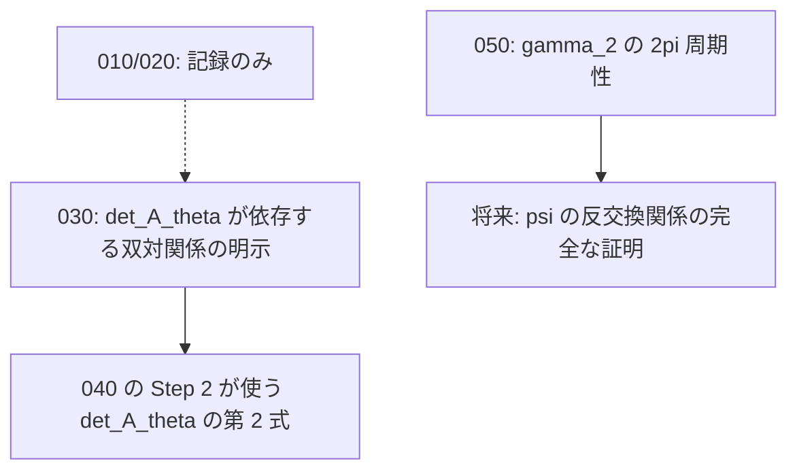

# 原文（`structured-latex/content/`）の穴 5 件 — 一次情報の引き渡し

## 概要

- **スコープ**: 2026-07\_original-text-gaps
- **タイトル**: Lean 形式化の過程で見つかった原文の穴 5 件の一次情報
- **概要**: `008_TV1_hatZ_hatY_part1.mjs` / `part2.mjs` の 4 ブロックについて、
  抜けている条件・正しいステートメント・反例／検算の根拠を、本文を直す担当が
  そのまま使える形で書き出したもの。

## 本文修正の担当（重要）

**このスコープのファイルは調査結果の引き渡しであり、本文（`structured-latex/content/`）の
修正は別セッション（ゴール設定の全体適用を担当）が行う。**
このスコープを作ったセッションは `structured-latex/content/` を一切編集していない。

各ファイルは次の 3 点を必ず含む。

1. どの主張のどの条件が抜けているか（対象ブロックの `id` と `labels`）
2. 正しくはどうあるべきか（修正後のステートメント案）
3. 反例または検算の根拠（数値例・具体的な計算・対応する Lean の定理名）

## 現況の要約（着手前に必ず読む）

**5 件のうち 3 件は、この調査の時点で既に原文側が修正済みだった。** 「Lean のコメントに
書いてあるから直っていない」と決めつけず、必ず現物の当該ブロックを読んでから作業すること。
下表の「現況」は 2026-07-26 に `structured-latex/content/` の現物を読んで判定した結果である。

| #   | ファイル                                   | 対象ブロック（label）                              | 現況 | 残っている作業 |
| --- | ------------------------------------------ | -------------------------------------------------- | ---- | -------------- |
| 010 | 010_gamma2_zero_s2star_assumption.md       | `TV1_hatZ_hatY_022`（`gamma_2_theta_is_0`）         | **解消済み** | なし（記録のみ） |
| 020 | 020_sin_theta_mu_zero_condition.md         | `TV1_hatZ_hatY_022`（`gamma_2_theta_is_0`）         | **解消済み** | なし（記録のみ） |
| 030 | 030_det_A_theta_duality.md                 | `TV1_hatZ_hatY_035`（`det_A_theta`）                | **一部未解消** | 参照先の張り替えと前提の明記 |
| 040 | 040_A_theta_identity_gamma1_geq_1.md       | `TV1_hatZ_hatY_027`（`eigenvector_of_A_theta`）     | **解消済み** | なし（記録のみ） |
| 050 | 050_psi_anticommutator_sqrt_branch.md      | `TV1_hatZ_hatY_032`（`anticommutator_of_psi`）      | **未解消（内容は当初の指摘と異なる）** | γ₂ の 2π 周期性の補題を立てて参照する |

## 依存関係

- 030 と 050 は互いに独立で、並列に着手できる。
- 010・020・040 は本文の修正を要さない。**このスコープでは「なぜ解消済みと判定したか」の
  根拠を残すことが目的**であり、同じ指摘が Lean のコメントや `MEMORY.md` から再浮上したときに
  二重作業しないための記録である。

## Lean 側の裏づけ

すべて `exact-solution-of-2d-ising-model/lean/` にあり、`lake build` と
`bash scripts/check-no-sorry.sh` を通っている（`sorry` / `admit` はゼロ）。
各ファイルの「(3) 反例・検算の根拠」に定理名を書いてある。
