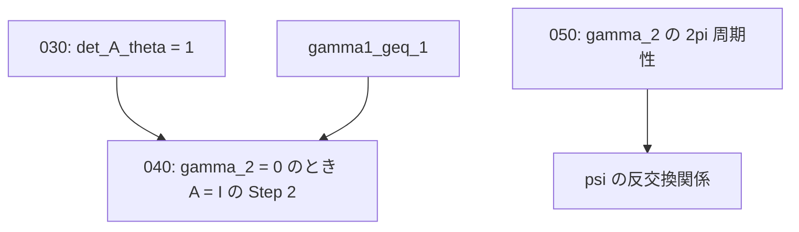

# 原文（`structured-latex/content/`）の穴 5 件 — 一次情報の引き渡し

## 概要

- **スコープ**: 2026-07\_original-text-gaps
- **タイトル**: Lean 形式化の過程で見つかった原文の穴 5 件の一次情報
- **概要**: `008_TV1_hatZ_hatY_part1.mjs` / `part2.mjs` の 4 ブロックについて、
  抜けている条件・正しいステートメント・反例／検算の根拠を、本文を直す担当が
  そのまま使える形で書き出したもの。

## 本文修正の担当（重要）

**このスコープのファイルは調査結果の引き渡しであり、本文（`structured-latex/content/`）の
修正は別セッション（ゴール設定の全体適用を担当）が行う。**
このスコープを作ったセッションは `structured-latex/content/` を一切編集していない。

各ファイルは次の 3 点を必ず含む。

1. どの主張のどの条件が抜けているか（対象ブロックの `id` と `labels`）
2. 正しくはどうあるべきか（修正後のステートメント案）
3. 反例または検算の根拠（数値例・具体的な計算・対応する Lean の定理名）

## 現況の要約（着手前に必ず読む）

**5 件とも、2026-07-26 時点で原文側が修正済みである。本文の修正作業はもう残っていない。**
「Lean のコメントや `MEMORY.md` に書いてあるから直っていない」と決めつけず、必ず現物の
当該ブロックを読んでから作業すること。

内訳:

- 3 件（010・020・040）は、この調査に着手した時点で既に解消されていた。
- 2 件（030・050）は調査時点では未解消で、本スコープに修正案を書いた。その後、
  並行セッションのコミット `733a5ee`（「008: Lean 形式化が検出した本文の穴 5 件を解消
  （分枝・双対関係・可逆性）」）が本文を修正して解消した。**採られた修正はこのスコープの
  修正案と実質的に同じ内容である**（030 は `def_A_theta` から直接 det を計算して 3 関係を明示、
  050 は γ₂ の 2π 周期性を Step 0 として追加）。各ファイルにその対応を追記してある。

したがって**このスコープは記録（何が穴で、なぜそれが穴で、何を根拠に解消したと言えるか）
としてのみ意味を持つ**。同じ指摘が再浮上したときの二重作業を防ぐために残す。

| #   | ファイル                                   | 対象ブロック（label）                              | 現況 | 残っている作業 |
| --- | ------------------------------------------ | -------------------------------------------------- | ---- | -------------- |
| 010 | 010_gamma2_zero_s2star_assumption.md       | `TV1_hatZ_hatY_022`（`gamma_2_theta_is_0`）         | **解消済み** | なし（記録のみ） |
| 020 | 020_sin_theta_mu_zero_condition.md         | `TV1_hatZ_hatY_022`（`gamma_2_theta_is_0`）         | **解消済み** | なし（記録のみ） |
| 030 | 030_det_A_theta_duality.md                 | `TV1_hatZ_hatY_035`（`det_A_theta`）                | **解消済み**（`733a5ee`） | なし（記録のみ） |
| 040 | 040_A_theta_identity_gamma1_geq_1.md       | `TV1_hatZ_hatY_027`（`eigenvector_of_A_theta`）     | **解消済み** | なし（記録のみ） |
| 050 | 050_psi_anticommutator_sqrt_branch.md      | `TV1_hatZ_hatY_032`（`anticommutator_of_psi`）      | **解消済み**（`733a5ee`）。当初の指摘「分枝の一致を暗黙に仮定」は不正確だった | なし（記録のみ） |
| 060 | 060_TV_action_coefficients_verified.md     | `TV1_hatZ_hatY_002/005/012/018`（`T_V_hatZ_hatY` 系） | **穴なし**。係数を独立に導出して突き合わせた結果、原文はすべて正しかった（2026-07-26） | なし（否定的結果の記録のみ） |

## 依存関係

5 件とも解消済みなので、着手すべき依存関係は残っていない。参考までに、証明の依存だけ記す。

**このスコープの目的は「なぜ解消済みと判定したか」の根拠を残すこと**であり、
同じ指摘が Lean のコメントや `MEMORY.md` から再浮上したときに二重作業しないための記録である。

## Lean 側の裏づけ

すべて `exact-solution-of-2d-ising-model/lean/` にあり、`lake build` と
`bash scripts/check-no-sorry.sh` を通っている（`sorry` / `admit` はゼロ）。
各ファイルの「(3) 反例・検算の根拠」に定理名を書いてある。
