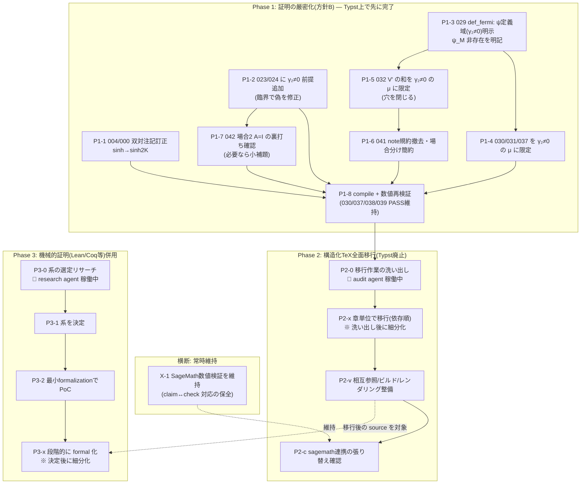

# Task Dependency Graph — Toolchain & Rigor Roadmap (2026-07)

## 概要

- **スコープ**: 2026-07_toolchain-and-rigor
- **タイトル**: 証明の厳密化(方針B) → Typst廃止・構造化TeX全面移行 → Lean/Coq等での機械的証明併用
- **概要**: (1) 検討中の非臨界モード扱い(方針B: per-μ γ₂≠0 限定・ψ_M非存在明示)を完了させ、(2) Typstを廃止し構造化TeX(structured-latex/)へ全面移行、(3) SageMath数値検証を維持しつつ、(4) Lean/Coq等の証明支援系での機械的検証を併用する。

## ステータス凡例

`⬜ 未着手` / `🟡 進行中` / `✅ 完了` / `🔬 調査中(サブエージェント稼働)` / `⏸ 保留`

## 依存関係図

## タスク一覧

| #    | 内容 | Phase | 依存 | 状態 |
| ---- | ---- | ----- | ---- | ---- |
| P1-1 | `004/000` 双対関係注記を `sinh(2K)sinh(2K*)=1` に訂正 | 1 | なし | ⬜ |
| P1-2 | `023`/`024` に `γ₂(θ_μ)≠0` 前提を追加(臨界で偽を修正) | 1 | なし | ⬜ |
| P1-3 | `029` def_fermi: ψ_μ を γ₂≠0 の μ に限定・ψ_M 非存在を note で明示 | 1 | なし | ⬜ |
| P1-4 | `030`/`031`/`037` のステートメントを γ₂≠0 の μ,ν に限定 | 1 | P1-3 | ⬜ |
| P1-5 | `032` V' の和を `{μ∈{1..M}:γ₂(θ_μ)≠0}` に限定(穴を閉じる) | 1 | P1-3 | ⬜ |
| P1-6 | `041` note規約撤去・場合分け簡約(032依存解消) | 1 | P1-5 | ⬜ |
| P1-7 | `042` 場合2の `A=I@γ₂=0` の裏打ち確認・必要なら小補題追加 | 1 | P1-2 | ⬜ |
| P1-8 | `typst compile` + 数値再検証(030/037/038/039 PASS維持) | 1 | P1-1..7 | ⬜ |
| X-1  | SageMath数値検証を全工程で維持(claim↔sagemath/check 対応保全) | 横断 | — | 🟡 |
| P2-0 | Typst→構造化TeX 全面移行の作業洗い出し | 2 | P1-8 | 🔬 |
| P2-x | 章単位で移行(洗い出し後に細分化) | 2 | P2-0 | ⬜ |
| P2-v | 相互参照・ビルド・レンダリング整備 | 2 | P2-x | ⬜ |
| P2-c | sagemath連携(claim↔check)の張り替え確認 | 2 | P2-v | ⬜ |
| P3-0 | Lean/Coq/Isabelle/Agda の選定リサーチ(本問題との相性・mathlib被覆・事例) | 3 | なし | 🔬 |
| P3-1 | 使用する系を決定(要ユーザー確認) | 3 | P3-0 | ⬜ |
| P3-2 | 最小formalizationターゲットでPoC | 3 | P3-1 | ⬜ |
| P3-x | 段階的に formal 化(決定後に細分化) | 3 | P3-2 | ⬜ |

## 決定待ち(ユーザー判断が要る論点)

- **P3-1 系の決定**: research agent の推奨を受けて、Lean4/Coq 等のどれを採用するか(大きなアーキテクチャ選択のため最終確認したい)。
- **移行と formal 化の source 単一化方針**: 構造化TeXの source から formal proof をどう対応づけるか(二重管理回避)。P2-0/P3-0 の結果を見て詰める。

## メモ

- Phase 1 は Typst 上で完了させる(移行前に content を確定させるため)。方針は「大域非臨界(方針A)は採らず、per-μ γ₂≠0 限定で臨界モードは 041/042 保持」。
- `021`/`043` の proof は本ロードマップでは TODO 保持(方針Bの厳密性には必須でない)。
- research/audit の2サブエージェント結果が返り次第、Phase 2/3 を細分化してこの表を更新する。
