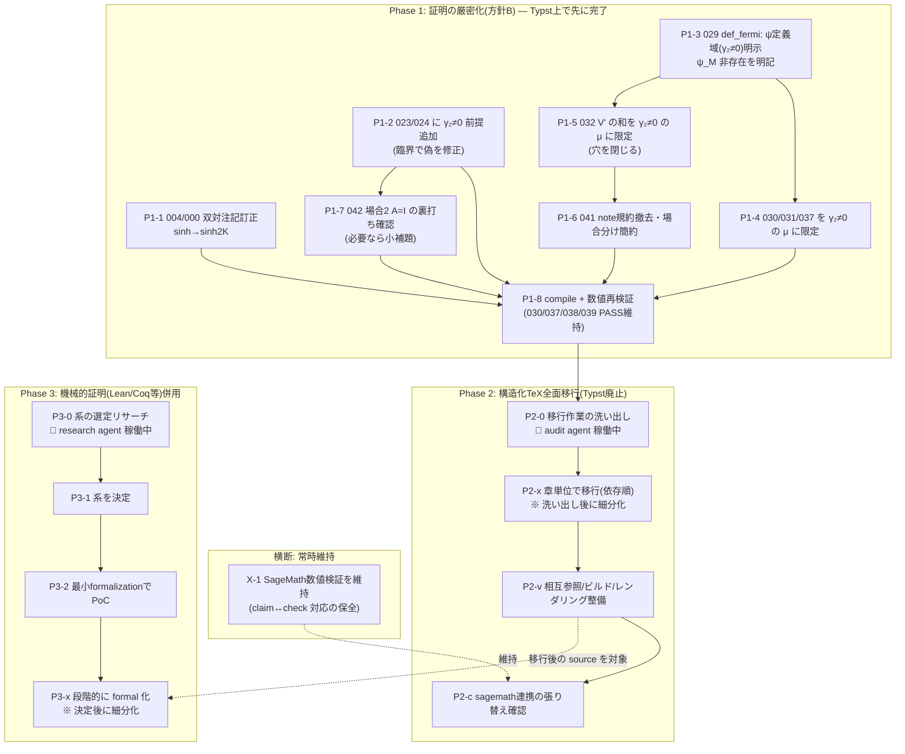

# Task Dependency Graph — Toolchain & Rigor Roadmap (2026-07)

## 概要

- **スコープ**: 2026-07_toolchain-and-rigor
- **タイトル**: 証明の厳密化(方針B) → Typst廃止・構造化TeX全面移行 → Lean/Coq等での機械的証明併用
- **概要**: (1) 検討中の非臨界モード扱い(方針B: per-μ γ₂≠0 限定・ψ_M非存在明示)を完了させ、(2) Typstを廃止し構造化TeX(structured-latex/)へ全面移行、(3) SageMath数値検証を維持しつつ、(4) Lean/Coq等の証明支援系での機械的検証を併用する。

## ステータス凡例

`⬜ 未着手` / `🟡 進行中` / `✅ 完了` / `🔬 調査中(サブエージェント稼働)` / `⏸ 保留`

## 依存関係図

```mermaid
graph TD
  subgraph P1["Phase 1: 証明の厳密化(方針B) — Typst上で先に完了"]
    P1_1["P1-1 004/000 双対注記訂正<br/>sinh→sinh2K"]
    P1_2["P1-2 023/024 に γ₂≠0 前提追加<br/>(臨界で偽を修正)"]
    P1_3["P1-3 029 def_fermi: ψ定義域(γ₂≠0)明示<br/>ψ_M 非存在を明記"]
    P1_4["P1-4 030/031/037 を γ₂≠0 の μ に限定"]
    P1_5["P1-5 032 V' の和を γ₂≠0 の μ に限定<br/>(穴を閉じる)"]
    P1_6["P1-6 041 note規約撤去・場合分け簡約"]
    P1_7["P1-7 042 場合2 A=I の裏打ち確認<br/>(必要なら小補題)"]
    P1_8["P1-8 compile + 数値再検証<br/>(030/037/038/039 PASS維持)"]
  end
  subgraph X["横断: 常時維持"]
    X_1["X-1 SageMath数値検証を維持<br/>(claim↔check 対応の保全)"]
  end
  subgraph P2["Phase 2: 構造化TeX全面移行(Typst廃止)"]
    P2_0["P2-0 移行作業の洗い出し<br/>🔬 audit agent 稼働中"]
    P2_x["P2-x 章単位で移行(依存順)<br/>※ 洗い出し後に細分化"]
    P2_v["P2-v 相互参照/ビルド/レンダリング整備"]
    P2_c["P2-c sagemath連携の張り替え確認"]
  end
  subgraph P3["Phase 3: 機械的証明(Lean/Coq等)併用"]
    P3_0["P3-0 系の選定リサーチ<br/>🔬 research agent 稼働中"]
    P3_1["P3-1 系を決定"]
    P3_2["P3-2 最小formalizationでPoC"]
    P3_x["P3-x 段階的に formal 化<br/>※ 決定後に細分化"]
  end

  P1_1 --> P1_8
  P1_2 --> P1_8
  P1_3 --> P1_4
  P1_3 --> P1_5
  P1_4 --> P1_8
  P1_5 --> P1_6
  P1_6 --> P1_8
  P1_2 --> P1_7
  P1_7 --> P1_8
  P1_8 --> P2_0
  P2_0 --> P2_x
  P2_x --> P2_v
  P2_v --> P2_c
  X_1 -.維持.-> P2_c
  P3_0 --> P3_1
  P3_1 --> P3_2
  P3_2 --> P3_x
  P2_v -.移行後の source を対象.-> P3_x
```

## タスク一覧

| #    | 内容 | Phase | 依存 | 状態 |
| ---- | ---- | ----- | ---- | ---- |
| P1-1 | `004/000` 双対関係注記を `sinh(2K)sinh(2K*)=1` に訂正 | 1 | なし | ✅ |
| P1-2 | `023`/`024` に `γ₂(θ_μ)≠0` 前提を追加(臨界で偽を修正) | 1 | なし | ✅ |
| P1-3 | `029` def_fermi: ψ_μ を γ₂≠0 の μ に限定・ψ_M 非存在を note で明示 | 1 | なし | ✅ |
| P1-4 | `030`/`031`/`037` のステートメントを γ₂≠0 の μ,ν に限定 | 1 | P1-3 | ✅ |
| P1-5 | `032` V' の和を `{μ∈{1..M}:γ₂(θ_μ)≠0}` に限定(穴を閉じる) | 1 | P1-3 | ✅ |
| P1-6 | `041` note規約撤去・場合分け簡約(032依存解消) | 1 | P1-5 | ✅ |
| P1-7 | `042` 場合2の `A=I@γ₂=0` の裏打ち確認・小補題 `044`(`<A_theta_is_identity_when_gamma2_zero>`) 追加 | 1 | P1-2 | ✅ |
| P1-8 | `typst compile` exit 0(新規警告/未解決ref なし) + 数値再検証 030/038/039 **ALL PASS**(限定は数値不変) | 1 | P1-1..7 | ✅ |
| X-1  | SageMath数値検証を全工程で維持(claim↔sagemath/check 対応保全) | 横断 | — | 🟡 |
| P2-0 | Typst→構造化TeX 全面移行の作業洗い出し | 2 | — | ✅ |
| T1/T2 | content を parts/ 現状に完全同期完了(9ブロック追加・Phase1改変分再同期・劣化変換25→0)。validate 132ブロック/参照142全解決 | 2 | P1-8 | ✅ |
| T3   | main.typ のインライン内容移行(記号表/見出し/文書順) ※作業メモは非移行 | 2 | T4b | ✅ |
| T4   | ref をラベルに統一(レンダラにラベル→id解決)＋validateにref解決チェック追加(実装・疎通確認済、未コミット) | 2 | — | ✅ |
| T4b  | heading ブロックをスキーマに追加(章題保持) → T3 と一体で実施 | 2 | — | ✅ |
| T5   | 描画疎通確認 ✅(142ブロック配信/数式1659件エラー0/参照144全解決/横溢れ64件は全て横スクロール可)。可換図式代替は未 | 2 | T1..T4 | ✅ |
| T6   | sagemath連携をラベル対応に移行＋機械検証(`sagemath/tools/verify-check-linkage.mjs`)。移行で落ちていた主要2定理のラベルを復旧 | 2 | T1 | ✅ |
| T7   | Typst を `_old/typst/` へ退避完了(**削除せず温存**)。出自パス141件を更新、退避先で `typst compile` 成功を確認 | 2 | T1..T6 | ✅ |
| P3-0 | Lean/Coq/Isabelle/Agda の選定リサーチ(本問題との相性・mathlib被覆・事例) | 3 | なし | ✅ |
| P3-1 | 使用する系を決定 → **Lean 4 + mathlib4 に確定(ユーザー承認済 2026-07)** | 3 | P3-0 | ✅ |
| P3-2 | 最小formalizationターゲットでPoC(`lean/` 雛形・`002/000`・`000/045`・`002/001`・`002/003` を `lake build` 通過・sorry 0) | 3 | P3-1 | ✅ |
| P3-3 | `Mat(2,ℂ)^{⊗M}` の表現方式を決定 → **行列表現 `Matrix (Fin M → Fin 2) (Fin M → Fin 2) ℂ` を採用**(両表現の ℂ-代数同型も証明済) | 3 | P3-2 | ✅ |
| P3-x | 段階的に formal 化。完了: 交換子恒等式 / σ,Z,Y,ε の定義 / Z,Y の反交換関係3式 / Z,Y が環を生成 | 3 | P3-2 | ✅ |
| P3-y | 次段: Z,Y の線型独立 → 離散Fourier変換した演算子の定義とM周期性 → その反交換関係 → 逆変換 | 3 | P3-x | 🟡 |
| W-1  | 人手証明の未完(TODO)26件を土台から順に埋める(複素数の体構造 → 行列ノルム劣乗法性 → exp の収束・積公式 → Z,Y 線型独立) | 横断 | — | 🟡 |

## Phase 2 監査結論(2026-07) — 構造化TeX移行

- **実態はほぼ完了**: content 13ファイル/123ブロックで parts 129中 **121をカバー済み**(`validate-content.mjs` PASS 確認)。「部分移行」ではなく残8ファイル+品質整合の詰め。
- **残8ファイル(staleness)**: 045,046(000章)/002-003/004-013,014/008-041,042,043。全て 2026-06以降の新規追加分で content が未追随なだけ(表現力の問題ではない)。
- **品質ギャップ**: `partially_simplified` 25ブロックは proof を要点圧縮した劣化変換 → CLAUDE.md 厳密性要件から再変換対象。TODO保持27箇所。
- **レンダラは既存**: `realtime-web-preview/`(React+**KaTeX**, HTMLプレビュー/PDFではない, source=structured-latex/content)。MEMORY の「ビューア未実装」は古い。数式は Typst構文でなく **KaTeX向けLaTeX文字列**で保持(手翻訳、自動コンバータは無い)。
- **相互参照の不整合(要対処)**: content は ref target に**ラベル**を入れる規約だが、レンダラは**block.id**でアンカー化 → ラベル参照37件がブラウザ上デッドリンク。`validate-content.mjs` は ref解決を検査しない(未解決ref 2件検出)。
- **schema の構造的ギャップ**: heading/section, figure/可換図式(005/000 の fletcher), table/grid の node が無い。文書順・章題は main.typ の #include 順にしか無く、ファイル名順と不一致。
  → heading と文書順は T3/T4b で解消済(後述)。figure/可換図式・table/grid は未解消。

## 決定待ち(ユーザー判断が要る論点)

- **P3-1 系の決定**: **Lean4+mathlib4 を推奨・暫定決定**。大きな投資のため最終確認したい(異論なければ確定)。
- **T4 相互参照モデル**: ref.target をラベルに統一(レンダラにラベル→id解決を実装)か、id に統一か。content は既にラベル規約なので**ラベル統一+レンダラ改修**が自然だが最終確認したい。
- ~~**T3 main.typ の散文・メモ・埋め込みsagemath**~~: 決定済 — 作業メモは非移行、章題は schema の
  `heading` ブロックで正準保持(T3/T4b 完了、下記参照)。
- **T7 Typst 廃止のタイミング**: parts/ を SSOT から外すのは不可逆に近い。T1..T6 完了・レンダリング疎通確認後に実行してよいか。
- **source 単一化**: leanblueprint(LaTeX blueprint) と 構造化TeX(KaTeX LaTeX) を寄せて、人手証明↔formal↔閲覧の source を一本化するか。Phase 2/3 を跨ぐ設計。

## Phase 3 調査結論(2026-07) — 機械証明の系

- **推奨: Lean 4 + mathlib4**（次点 Isabelle/HOL、Coq/Rocq は第3、Agda 非推奨）。
- 根拠: (1) 中核数学の被覆が単一ライブラリ最良（`MatrixExponential`/Kronecker⇔TensorProduct 線型同値/`CliffordAlgebra`/`Complex.arg`(-π,π]）、(2) フェルミオン第二量子化の既存形式化(PhysLean: Wick・反交換代数)が Lean のみ存在、(3) leanblueprint で人手証明↔formal の同期＋進捗可視化(構造化TeX移行と直結・二重管理回避)、(4) 単独+AIエージェント運用で最有利、(5) 実解析/熱力学極限の将来被覆も厚い。
- ギャップ(ブロッカーでない): `Real.arccosh` は自前定義(容易)、`Ad(exp)=exp(ad)`(005/008) は級数展開ルート(003/007)で回避、Ising厳密解の既存形式化は無く新規(全系共通)。
- **最初の formalization ターゲット**: ① `002/000`テンソル基底(= `Mat(2,ℂ)^{⊗M}` の表現を「抽象テンソル冪 vs Fin(2^M) Kronecker」で確定させる最重要設計判断を最初に固める) → ② `000/045` 共役=環準同型(自己完結・038を支える)。005 は級数ルートで 045 の後。
- SageMath は反例探索/予想生成のオラクルとして併存(Sage↔Lean 自動ブリッジは無い)。有限代数的恒等式は Lean で `ring`/`norm_num`/`Finset.sum` により「証明」に格上げ可(注: ℝ/ℂ上は `decide`/`native_decide` 不可)。

## Phase 3 着手結果(2026-07) — Lean 4 プロジェクト構築と最初の formalization

実体は `exact-solution-of-2d-ising-model/lean/`(セットアップ・対応規約は `lean/README.md`)。

- **環境**: elan 導入、`lean-toolchain` = `leanprover/lean4:v4.32.1`、mathlib4 を同名タグ
  `v4.32.1` に固定(`lakefile.toml` の `rev` / `lake-manifest.json`)。`lake exe cache get` で
  ビルド済み .olean を取得、`lake build` 成功。`.lake/` は追跡外。
- **`Mat(2,ℂ)^{⊗M}` の表現(最重要設計判断) — 行列表現を採用**。
  - 採用: `TensorPow M := Matrix (Fin M → Fin 2) (Fin M → Fin 2) ℂ`(添字型 = スピン配置)。
  - 比較対象: `AbstractTensorPow M := ⨂[ℂ] (_ : Fin M), Matrix (Fin 2) (Fin 2) ℂ`。
  - **両者が ℂ-代数同型であることを証明済**(`Ising2D.tensorPowAlgEquiv`。同型写像は
    `⨂ₜ x ↦ [(s,t) ↦ ∏ᵢ (xᵢ)_{s(i)t(i)}]` = Kronecker 積)。よって命題は相互移送できる。
  - 決め手: 抽象テンソル冪には `NormedRing` インスタンスが無く **`NormedSpace.exp` が使えない**
    (`infer_instance` 失敗を確認)。`V_1, V_2` が exp を含む本プロジェクトでは致命的。行列表現なら
    `Matrix.exp_units_conj` 等がそのまま使える。加えて `Matrix.center_eq_scalar_image` で
    `<centralizer_is_scalar>` が既存に帰着、行列式・跡・`Matrix.reindex` も利用可。
- **形式化済み**: `<tensor_basis>`(`Basis.piTensorProduct` へ帰着)、
  `<conjugation_is_ring_homomorphism>`(mathlib の `MulSemiringAction (ConjAct Rˣ) R` へ帰着、
  加法性まで込みで環準同型)、`<scalar_identity_commutes>`、`<centralizer_is_scalar>`、
  行列単位の積公式・単位元展開。**`sorry` は 0**(`lean/scripts/check-no-sorry.sh` で機械確認)。
- **原文の要修正点(形式化で表面化)**:
  - `002/000`(`<tensor_basis>`): 「各 `(i_1,…,i_m)` について `e_{i_1}⊗⋯⊗e_{i_m}` **は基底である**」は
    誤り。基底なのは**族全体**であって個々の元ではない。また添字 `m` を「`V` の次元」と
    「テンソル冪の階数」に二重使用している(独立な量なので分離が必要)。
  - `000/045` Step 3: 合成則 `T_A ∘ T_B = T_{AB}` に `A, B` の正則性は不要
    (mathlib の `Matrix.mul_inv_rev` は特異行列込みで成立するため)。原文が仮定しているのは冗長。

## 移行で表面化した原文(Typst)の要検証箇所(2026-07) — 別トラック

劣化変換の厳密再変換の過程で、原文の未完成・疑わしい箇所が表面化(移行が原因ではない・忠実に再現し自動修正はしていない)。数学的正しさに関わるため別途要精査:

- **既知TODO(想定内)**: 008/043(臨界条件, proof TODO), 008/001(交換子ネスト, TODO), 003/000(証明略), 003/002(骨格のみ), 001/003(trace展開なし), 008/025(γ2の商のarg, 原文 `???`)。
- **未検証・疑わしい(私は未確認)**:
  - 008/004(テイラー係数抽出)の `h1.y / h2.z^-` が不完全・誤植の疑い。
  - 008/017(T_V の hatZ,hatY への作用)の最終行列積が Mathematica 確認のみ(人手証明なし)。
  - 008/000 part(2) の `−0` 項消滅が非自明、008/011・017 の行列符号不整合を確立済み `B_1` に正規化して整合を取った。
- 対処: 021/043 の proof(TODO保持)と併せ、Phase 1 とは別の「原文厳密化」トラックとして扱う候補。

## T3/T4b 完了(2026-07) — 章見出し・文書順・記号表の移行

- **schema に `heading` ブロックを追加**(`structured-latex/schema.{mjs,d.ts}`)。`kind: "heading"` +
  `level`(1 が最上位, Typst `=` が 1 / `==` が 2) + 必須 `title`、本文(statement/proof/notes)は不許可。
  レンダラ側の契約(`realtime-web-preview/domain-model/src/block.ts`)も `kind` による
  discriminated union へ更新し、`heading-view.tsx` で描画。タイトルの `tex` は KaTeX で描画するよう修正
  (従来は LaTeX ソースがそのまま文字列表示されていた)。
- **文書順の正準表現 = ブロック配列の並び**(content/*.mjs をファイル名昇順 → 各ファイル内は配列順)。
  この順序が旧 main.typ の `#include` 順と**完全一致**することを機械照合済み(130 include / 130 sourcePath, 差分0)。
  `sourceOrdinal` は「parts 章内でのソースファイル通し番号」であって文書順ではない(名前順と `#include` 順が
  不一致のため)。002章(000,001,**003,002**)と 008章(017 の直後に **036**、031 の後 034,035,033,032,037,044,
  041,042,038,039,040,043)を実文書順へ並べ替えた。008 の content 2ファイルは連番範囲で命名できなくなったため
  `008_TV1_hatZ_hatY_part{1,2}.mjs` へ改名。
- **記号表**: main.typ のインライン `#definition("記号の定義")` は `parts/004_転送行列/000`
  (`def_transfer_matrix_symbols`)と同内容の重複(相違は双対関係注記の旧版 `sinh(K)sinh(K*)=1` のみ、
  P1-1 で訂正済み)。よって重複ブロックは作らず、インライン側にのみ在った σ_k^y, σ_k^z,
  I_{(Mat(2,C))^{⊗M}}, Z_m/Y_m の p_m/q_m 対応を既存ブロックへ補記して集約した。
- **非移行(確定)**: main.typ 末尾の作業メモ(`= 全体のノリ` / `= メモ` / 「次回やること」と埋め込み
  SageMath スニペット)は証明本体でないため移行しない。
- 検証: `validate-content.mjs` = 142ブロック/14ファイル(見出し10, ラベル72, ref142 全解決)、
  `pnpm -r build` / `pnpm -r typecheck` / `biome check` 通過、KaTeX 全1647式レンダー0エラー、
  API 疎通(GET /api/document)で見出し10件が文書順で配信されることを確認。

## Phase 2 残り

- **T5**(realtime-web-preview で全142ブロックの KaTeX 描画疎通・可換図式代替): KaTeX 側の機械検証
  (全1647式 0エラー)と API 疎通は済。ブラウザ実表示の目視確認と可換図式(005/000 の fletcher)代替は未。
- **T6**(sagemath連携 claim↔check の維持確認): 未。
- **T7**(Typst 廃止): ⏸ T3/T5/T6 完了・描画疎通後に別途確認。

## Phase 4(2026-07 追加): 出版を見据えたノートの分離

**目的**: 構造化テキスト化の狙いは最終的に論文・書籍にすること。ノートの大半は最終成果物に
そのままは載らないが、証明以外の部分(動機・背景・他人への説明)を書く際の素材として参照したい。

**方針(ユーザー確定)**:
- **文書本体(`content/`)には出版に載るものだけを置く。** 最終成果物の生成は content のみを読むので、
  ノートは構造上いっさい混入しない(フラグ付け忘れによる漏れが起きない設計)。
- ノートは `structured-latex/notes/` に別置きし、関連する定理・主張を**ラベルで参照**する(パス非依存)。
- **数学的に不可欠な注記は注記ではなく主張本体(statement)へ格上げ**する。
  原則は「**正しさに必要ならそれは注記ではない**」。これにより出版時の取捨選択の判断が不要になる。

**移行元の実態**: Typst の注記は3種類。(1) 定理・主張に付随する注記 → 17ブロックの `notes` 欄へ移行済、
(2) 独立した注記ブロック 2件、(3) 文書末尾の作業ログ(134行、日付つき作業記録・デバッグ・数値スニペット)
→ **非移行**(退避先に残置。引き継ぎメモとタスク管理に置き換わっているため)。

| # | 内容 | 状態 |
| --- | --- | --- |
| N-1 | スキーマにノート定義(`defineNotes`、targets でラベル参照必須)を追加 | ✅ |
| N-2 | 19件を分類し再編(格上げ5・移設16)。本文は142→140ブロック、移設分は内容完全一致を機械確認 | ✅ |
| N-3 | 検証に notes を追加(targets/ref の未解決をエラーに)。ノート16件・targets 16 全解決 | ✅ |
| N-4 | ビューアでノート表示(琥珀色の破線・折りたたみ・非掲載明示)。描画確認 数式1655件エラー0 | ✅ |

## メモ

- Phase 1 は Typst 上で完了させる(移行前に content を確定させるため)。方針は「大域非臨界(方針A)は採らず、per-μ γ₂≠0 限定で臨界モードは 041/042 保持」。
- `021`/`043` の proof は本ロードマップでは TODO 保持(方針Bの厳密性には必須でない)。
- research/audit の2サブエージェント結果が返り次第、Phase 2/3 を細分化してこの表を更新する。
