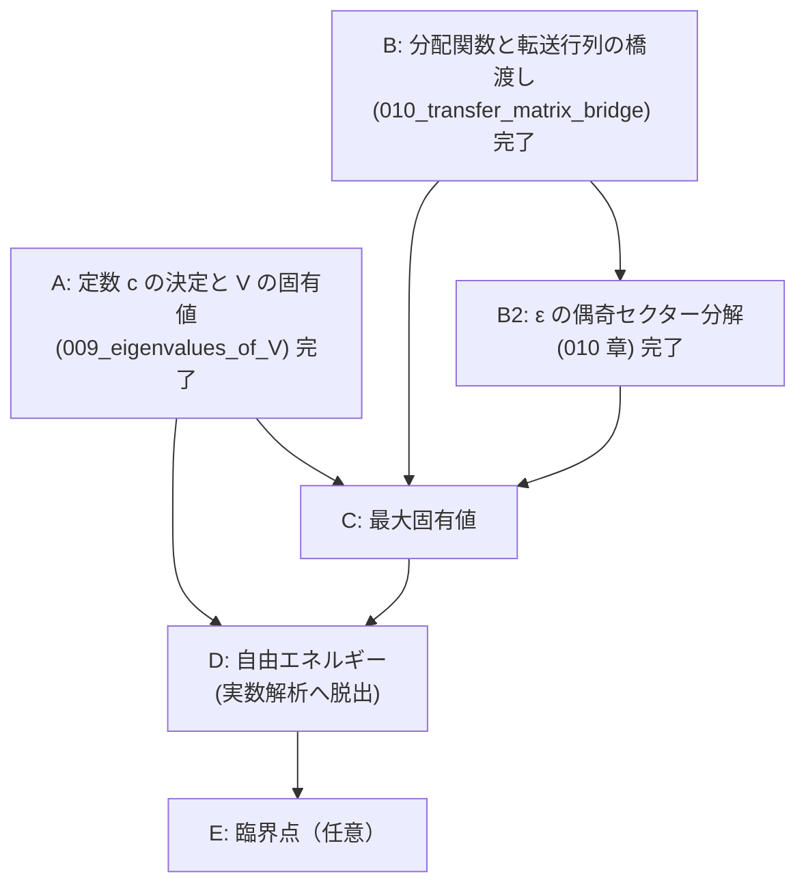

# V = cV' から Onsager の自由エネルギーまで — 章立てと依存順

## 概要

- **スコープ**: free-energy-roadmap
- **タイトル**: 転送行列の定数決定・固有値・分配関数・自由エネルギー・熱力学極限
- **概要**: 本文の証明は `V_eq_Vprime`（$V = cV'$、定数倍を除いて一致）まで到達しているが、
  そこから先——定数 $c$ の決定、$V$ の固有値、分配関数の固有値表式、最大固有値、
  自由エネルギーの閉じた表式、熱力学極限——は本文に**一切存在しない**。
  この文書はその未到達部分を、依存順に並べた章立てとして確定させる。

## 現状の一次情報（着手前に確認した事実）

`structured-latex/content/` を全走査して確認した:

- 「自由エネルギー」「熱力学極限」「free energy」に相当するブロックは content・notes とも **0 件**。
- 到達点は `008_TV1_hatZ_hatY_part2.ts` の `V_eq_Vprime`:
  「ある $c \in \mathbb{C}^\times$ が存在して $V = cV'$」。**$c$ の値は決めていない。**
- `V := (V_1^{(\pm)})^{1/2} V_2 (V_1^{(\pm)})^{1/2}$、
  `V' := exp( Σ_{μ∈{1..M}, γ₂(θ_μ)≠0} γ(θ_μ)(ψ_μ† ψ_{-μ} − 1/2) )`。
- **重大な断絶を発見した**: 001 章の転送行列（`def_transfer_matrix`、成分で定義された
  $V_1,V_2 \in \mathrm{Mat}(2^N,\mathbb{C})$）と、004 章以降の $V_1,V_2 \in \mathrm{Mat}(2,\mathbb{C})^{\otimes M}$
  （$\sigma$ 行列で定義）を**同一視する主張がどこにも無い**。
  `partition_function_via_transfer_matrix`（$Z = \mathrm{tr}((V_1V_2)^M)$）を参照しているブロックは
  content 全体で **0 件**であり、004 章以降は 001 章から切り離された島になっている。
  分配関数へ戻るには、この橋を架けることが必須である。
- **記号の衝突**: 001 章は「$M$ 行 $N$ 列」で $Z=\mathrm{tr}((V_1V_2)^M)$、
  004 章以降は鎖長が $M$（$\mathrm{Mat}(2,\mathbb{C})^{\otimes M}$）。$M$ と $N$ の役割が入れ替わっている。
  橋渡しの章で明示的に対応を取る必要がある。

## 章立て（依存順）



---

### 章 A: 定数 $c$ の決定と $V$ の固有値 ← **本セッションで執筆済み**

ファイル: `structured-latex/content/009_eigenvalues_of_V.ts`

| # | 命題 | ラベル | 状態 |
|---|---|---|---|
| A1 | フェルミオン数演算子 $n_\mu := \psi_\mu^\dagger\psi_{-\mu}$ の定義 | `def_number_operator` | 完了 |
| A2 | $n_\mu^2 = n_\mu$、$\psi_{-\mu}\psi_\mu^\dagger = I - n_\mu$ | `number_operator_idempotent` | 完了 |
| A3 | $\mu \neq \nu$ で $n_\mu n_\nu = n_\nu n_\mu$ | `number_operators_commute` | 完了 |
| A4 | $\mathrm{tr}(n_{\mu_1}\cdots n_{\mu_k}) = 2^{M-k}$（相異なる添字） | `trace_of_number_operator_product` | 完了 |
| A5 | 同時固有空間分解（$2^M$ 個・各 1 次元） | `joint_eigenspace_decomposition` | 完了 |
| A6 | $V'$ の固有値 $\exp(\sum_\mu \gamma(\theta_\mu)(n_\mu - 1/2))$ | `eigenvalues_of_Vprime` | 完了 |
| A7 | $\mathrm{tr}(V') = \mathrm{tr}(V'^{-1}) = \prod_\mu 2\cosh(\gamma(\theta_\mu)/2) > 0$ | `trace_of_Vprime` | 完了 |
| A8 | $iK_1H_1^{(\pm)}$、$iK_2^*H_2$ は実対称 | `iH_is_real_symmetric` | 完了 |
| A9 | $V$ は実対称正定値、ゆえに $\mathrm{tr}(V) > 0$ | `V_is_positive_definite` | 完了 |
| A10 | $U_2 H_1^{(\pm)} U_2^{-1} = -H_1^{(\pm)}$、$U_2 H_2 U_2^{-1} = -H_2$ | `sign_flip_conjugation` | 完了 |
| A11 | $c = (2\sinh 2K_2)^{M/2}$、すなわち $V = (2s_2)^{M/2}V'$ | `constant_c_value` | 完了 |
| A12 | $V$ の固有値 | `eigenvalues_of_V` | 完了 |

**採った証明方針（重要）**: $c$ の決定に行列式（Leibniz 定義・乗法性）を使わずに済ませた。
$\mathrm{tr}(V)/\mathrm{tr}(V^{-1}) = c^2$ と、符号反転共役 $U_2$ による
$\mathrm{tr}(e^{2S}e^{R}) = \mathrm{tr}(e^{-2S}e^{-R})$ から $c^2 = (2s_2)^M$ を出し、
正定値性から $c > 0$ を出して符号を確定する。
行列式経由（$\det V = c^{2^M}\det V'$）でも同じ結果になるが、そちらは
$\det(AB) = \det A \det B$ の証明（置換と符号の一般論）を新たに要するため採らなかった。

### 章 B: 分配関数と転送行列の橋渡し ← **完了**（`structured-latex/content/010_transfer_matrix_bridge.ts`）

**これが無いと、どれだけ固有値を求めても分配関数に戻れない。**

| # | 命題 | ラベル | 状態 |
|---|---|---|---|
| B1 | 記号対応（001 章の `N` = 004 章の `M`、001 章の `M` = `N_row`、`J' = K_1`、`J = K_2`） | 010 章冒頭の remark | 完了 |
| B2 | 配置と標準基底の同一視 `ι` | `def_config_basis_iso` | 完了 |
| B3 | `σ^z_m f_{ι(μ)} = μ(m) f_{ι(μ)}` | `sigma_z_diagonal_action` | 完了 |
| B4 | 対角行列の指数関数 | `exp_of_diagonal_matrix` | 完了 |
| B5 | `V_1` の成分定義とパウリ表示の一致 | `V1_component_equals_pauli` | 完了 |
| B6 | `2×2` の恒等式 `A = (2 sinh 2K_2)^{1/2} exp(K_2^* σ^x)` | `two_by_two_transfer_identity` | 完了 |
| B7 | `V_2` の成分定義とパウリ表示の一致 | `V2_component_equals_pauli` | 完了 |
| B8 | `Z(J,J') = tr((V_1V_2)^{N_row})`（004 章の記号で） | `partition_function_in_pauli_form` | 完了 |

**結合定数の向きの根拠（一次情報）**: 001 章の `V_1` の指数には `J' μ(j)μ(j+1)`、すなわち
**同一の鎖の隣接サイトどうし**の積が現れ、004 章の `V_1 = exp(K_1 Σ σ^z_m σ^z_{m+1})` も同じ。
`V_2` はどちらも隣り合う 2 本の鎖の同じサイトどうしを結ぶ。したがって `K_1 = J'`、`K_2 = J`。
数値でも、`N_row ≠ M` のときに `K_1` と `K_2` を取り違えると `Z` と相対誤差 0.09〜0.44 で
合わないことを確認した（`sagemath/check/043_.../check_04_partition_function.sage`）。

### 章 B2: $\varepsilon$ の偶奇セクター分解 ← **完了**（同じく 010 章）

$V$ は $V_1^{(\pm)}$ を使って定義されており、$V_1^{(\pm)}$ は $\mathcal{F}^{(\pm)}$ 上でのみ $V_1$ と一致する
（`V1_restriction_to_eigenspaces`）。したがって全空間のトレースを $V$ の固有値だけで書くには、
射影子 $P^{(\pm)} := \frac{1}{2}(I \pm \varepsilon)$ による分解が要る。

| # | 命題 | ラベル | 状態 |
|---|---|---|---|
| B2-1 | `P^{(±)} := (I ± ε)/2` の定義 | `def_epsilon_projectors` | 完了 |
| B2-2 | `P^{(±)}` の性質と `im P^{(±)} = F^{(±)}` | `epsilon_projector_properties` | 完了 |
| B2-3 | `ε` が `V_1, V_2, V_1^{(±)}, (V_1^{(±)})^{1/2}` と可換 | `epsilon_commutes_with_transfer_matrices` | 完了 |
| B2-4 | `V_1 P^{(±)} = V_1^{(±)} P^{(±)}` とその冪 | `sector_replacement_of_V1` | 完了 |
| B2-5 | `Z` の偶奇セクター分解（4 項展開も） | `partition_function_sector_decomposition` | 完了 |

**当初 B2-5 に挙げていた「`ε` をフェルミオン数で書く」（`ε = ±Π(I − 2n_μ)` の形）は不要だった。**
射影子 `P^{(±)} = (I ± ε)/2` を使えば、`ε` をフェルミオンで書き直さなくても
`Z = tr(P^{(+)}(V^{(+)})^{N_row}) + tr(P^{(-)}(V^{(-)})^{N_row})` まで到達できる。
ただし章 C で `tr(ε (V^{(±)})^{N_row})` を固有値で評価する段になると `ε` のフェルミオン表示が要る見込みで、
そのときは符号を数値で先に確定させること。

### 章 C: 最大固有値 ← **完了**（`structured-latex/content/011_max_eigenvalue.ts`）

| # | 命題 | ラベル | 状態 |
|---|---|---|---|
| C1 | 対称化転送行列 `W = V_1^{1/2} V_2 V_1^{1/2}` | `def_symmetrized_transfer_matrix` | 完了 |
| C2 | `Z = tr(W^{N_row})` | `Z_equals_trace_of_W` | 完了 |
| C3 | `W` は実対称正定値 | `W_is_real_symmetric_positive_definite` | 完了 |
| C4 | `W` の成分はすべて正 | `W_has_positive_entries` | 完了 |
| C5 | 半正定値形式の Cauchy–Schwarz | `psd_cauchy_schwarz` | 完了 |
| C6 | `c(M) := sup_{‖x‖=1} x^T W x` | `def_rayleigh_sup` | 完了 |
| C7 | `‖Wx‖ ≤ c(M)‖x‖` | `rayleigh_bounds_operator_norm` | 完了 |
| C8 | `c^n ≤ tr(W^n) ≤ 2^M c^n` | `trace_power_sandwich` | 完了 |
| C9 | `c(M)^{N_row} ≤ Z ≤ 2^M c(M)^{N_row}` | `partition_function_sandwich` | 完了 |
| C10 | `c(M) = max(c_+, c_-)`、`W P^{(±)} = V^{(±)} P^{(±)}` | `sector_decomposition_of_rayleigh_sup` | 完了 |

**採った方針（重要）**: **スペクトル定理（実対称行列の対角化可能性）を使わずに**挟み撃ちを出した。
`c(M)` は最大固有値ではなく Rayleigh 商の**上限**として定義し、
上からの評価は `psd_cauchy_schwarz` から出る `‖Wx‖ ≤ c‖x‖`、
下からの評価はモーメント列 `m_k = x^T W^k x` の対数凸性による。
対角化可能性は正しいが本文にまだ無く、挟み撃ちには不要だったため導入しなかった。

### 章 D: 自由エネルギーと熱力学極限 ← **完了**（`structured-latex/content/012_free_energy.ts`）。**実数解析への脱出はここだけ**

| # | 命題 | ラベル | 状態 |
|---|---|---|---|
| D1 | 実数解析へ移行するのはこの章のこの箇所だけ、という宣言と使う外部事実 (R1)(R2) | `remark_real_analysis_escape_point` | 完了 |
| D2 | `γ_1(θ) ≥ cosh(2K_1 − 2K_2^*) ≥ 1`（**すべての実数 θ**） | `gamma1_lower_bound_all_theta` | 完了 |
| D3 | `γ` は `R` 上連続・周期 `2π`（★移行に実際に使う条件） | `gamma_is_continuous` | 完了 |
| D4 | `(1/(M N_row)) log Z → (1/M) log c(M)`（誤差 `≤ log2/N_row`） | `limit_of_log_Z_in_N_row` | 完了 |
| D5 | **★実数解析への移行点**: `(1/M) Σ g(2π(μ−δ)/M) → (1/2π)∫g`、誤差 `≤ ω(2π/M)` | `riemann_sum_to_integral` | 完了 |
| D6 | Onsager の表式（`δ` に依らない） | `onsager_free_energy_expression` | 完了 |
| D7 | 残っている入力の明示 | `remark_remaining_input_even_sector` | 完了 |

**移行点で持ち込んだ外部事実は 2 つだけ**: (R1) Heine–Cantor（有界閉区間上の連続関数は一様連続）、
(R2) 連続関数の Riemann 可積分性（区間加法性・`|∫h| ≤ |I| sup|h|`・定数の積分）。
`δ ∈ [0,1)` を許す形にしたので、整数運動量（`δ=0`）と半整数運動量（`δ=1/2`）を 1 つの主張で扱える。
**どちらでも極限が同じ**であることが、熱力学極限でセクターの区別が消える理由である。

### 章 C′: 偶セクターの固有値（半整数運動量） ← **C′-1〜C′-15 すべて完了**（`013`〜`017` の 5 章）

章 C・章 D により、分配関数から自由エネルギーまでの経路で**残っていたのは 1 点だけ**だった：

> `c_+(M)`（`ε` の固有値 `+1` のセクターでの Rayleigh 上限）が `Λ^{(1/2)}_M` に等しいこと。
> すなわち `V^{(+)}` の固有値が**半整数運動量** `2π(μ−1/2)/M` で与えられること。

**`V^{(+)}` の固有値については C′-15（017 章）で決着した**：固有値は
`Λ̌_ε = (2 sinh 2K_2)^{M/2} exp(Σ_{μ=1}^{M} γ(θ~_μ)(ε_μ − 1/2))` で尽き、その最大値は
`Λ^{(1/2)}_M` に一致し、しかも**単純固有値**である（`max_eigenvalue_of_V_plus_simple`）。
**残っているのは「`V^{(+)}` の最大固有値」と「`c_+(M)`（Rayleigh 上限）」を結びつける一手だけ**である
（下記「接続」）。

**本文に無い理由（一次情報で特定済み）**: `def_hatZ_hatY` の `hatZ_μ^{(±)}` は第 1 項に符号 `∓` を持つ。
`commutator_of_H_and_Z_Y` の (C) `[H_2, hatZ_μ^{(-)}] = −2 hatY_μ` は `[H_2, Z_j] = −2Y_j` を
各項に適用して係数を比べる形で示されるが、`hatZ_μ^{(+)}` では第 1 項だけ符号が反転しているため
右辺が `−2 hatY_μ` にならない。したがって 008 章以降は `(−)` セクター専用である。
数値でも `(−)` 側は残差 1e-15、`(+)` 側は残差 1e-3 以上で不成立（`045_.../check_03`）。

#### 完了した部分（013 章、8 ブロック）

| # | 命題 | ラベル | 状態 |
|---|---|---|---|
| C′-1 | 008 章が `(−)` 専用である理由を等式で確定：`[H_2, hatZ^{(+)}_μ] = −2 hatY_μ + 4e^{−iθ_μ}Y_1 ≠ −2 hatY_μ` | `why_008_applies_only_to_minus_sector` | 完了 |
| C′-2 | 半整数運動量の指数和 `Σ_μ e^{ikθ~_μ} = M(−1)^l`（`k=lM`）/ `0` | `antiperiodic_exp_sum` | 完了 |
| C′-3 | `checkZ_μ, checkY_μ` の定義、反周期性 `e^{−iMθ~_μ} = −1`、添字周期性、共役添字 `1−μ` | `def_half_integer_modes` | 完了 |
| C′-4 | (A)〜(D)：`H_1^{(+)}, H_2` との交換関係が 008 章と**同じ形**で閉じる | `commutator_of_H_and_check_Z_Y` | 完了 |
| C′-5 | 反交換関係（対は `μ+ν ≡ 1 (mod M)`） | `anticommutator_of_check_Z_Y` | 完了 |
| C′-6 | 復元公式 `Z_j = (1/M)Σ_μ checkZ_μ e^{ijθ~_μ}` と生成性 | `recover_Z_Y_from_check_Z_Y` | 完了 |
| C′-7 | `H_1^{(+)}, H_2` を `checkZ, checkY` で表す | `H1_H2_via_check_Z_Y` | 完了 |

数値検証は `sagemath/check/046_claim_even_sector_modes/`（3 チェック、全 PASS、`M = 2,3,4,5`）。

**仕組みは 1 つの等式に集約される**: `e^{−iMθ~_μ} = −1`（反周期性）。
`hatZ^{(±)}` が境界の符号を第 1 項に置いていたのに対し、`checkZ` では位相が `j = M` から `j = 0` へ
回るときに自動的に符号を出す。整数運動量では `e^{−iMθ_μ} = +1` なので同じ計算が閉じない。

#### 完了した部分（014 章、11 ブロック）

`structured-latex/content/014_even_sector_T_action.ts` で C′-8〜C′-11 を閉じた。到達点は

```
(T_{(V^{(+)})}(checkZ_μ), T_{(V^{(+)})}(checkY_μ)) = (checkZ_μ, checkY_μ) A(θ~_μ)
A(θ~_μ) = B_1(θ~_μ) B_2 B_1(θ~_μ)
```

| # | 命題 | ラベル | 状態 |
|---|---|---|---|
| — | `V^{(+)} := (V_1^{(+)})^{1/2}V_2(V_1^{(+)})^{1/2}`、`T_{(V^{(+)})}`。可逆性・平方根であること・合成 = 共役 | `def_V_plus_and_T_V_plus` | 完了 |
| C′-8 | (A)〜(D) の n 重交換子（4 式、`n` に関する帰納法） | `nesting_of_commutator_of_H_and_check_Z` | 完了 |
| C′-9 | 生成子のスケール `(i/2)K_1H_1^{(+)}, iK_2^*H_2` / テイラー係数の抽出 | `cosh_sinh_coefficient_conversion_for_check` / `extract_taylor_coefficient_of_check_Z_Y` | 完了 |
| C′-10 | `T_{(V_1^{(+)})^{1/2}}, T_{V_2}` の作用と `B_1(θ~_μ), B_2` による右乗 | `T_actions_on_check_Z_Y` / `linearity_of_T_on_check_Z_Y` / `def_B1_theta_B2` / `calc_of_TxT_check_Z_Y` | 完了 |
| C′-11 | `B_1(θ)B_2B_1(θ) = A(θ)`（**θ ∈ R 一般**）と `T_{(V^{(+)})}` の作用 | `factorization_of_A_theta_general` / `T_V_plus_check_Z_Y` | 完了 |

数値検証は `sagemath/check/047_claim_even_sector_T_action/`（4 チェック、全 PASS、`M = 2,3,4,5`、
`(K1,K2)` は臨界点上・臨界点近傍を含む 5 組）。

**008 章の証明がそのまま流用できた理由（一次情報で確認済み）**: 008 章の
`nesting_of_commutator_of_H_and_Z` から `T_V_hatZ_hatY` までの各証明は、1 重の交換子 (A)〜(D) と
交換子の双線型性・exp 共役の級数展開・`e^{iθ}e^{-iθ}=1` しか使っておらず、`θ_μ` に固有の性質
（`e^{-iMθ_μ}=+1`、添字集合 `calM`、`hatZ_hatY_M_periodicity`）を使っていない。`θ_μ` 固有の性質が
効いていたのは (A)〜(D) を導く `commutator_of_H_and_Z_Y` の段だけで、そこは
`commutator_of_H_and_check_Z_Y`（013 章）が半整数運動量について独立に済ませている。

**書き換えでなく新規ブロックにした点**:
- 008 章の `V` は `why_008_applies_only_to_minus_sector` により実質 `(−)` 専用なので、
  混同を避けて `V^{(+)}, T_{(V^{(+)})}` という別記号で定義し直した（008 章の `def_T_V` は参照していない）。
- 008 章の `factorization_of_A_theta` は `μ ∈ calM` で量化されており `θ~_μ` に適用できないため、
  `θ ∈ R` 一般の `factorization_of_A_theta_general` として立て直し、行列計算を書き下した。
- 008 章は `(V_1^{(±)})^{1/2}` を「`exp(iK_1H_1)` の 1/2 乗」と書いて proof 中で
  `exp((1/2)iK_1H_1)` に読み替えていたが、014 章では後者を定義とし、それが平方根であることを示した。
- `B_1(θ), B_2` は 008 章では `θ_μ` に限って導入されているので、`θ ∈ R` 一般の定義
  `def_B1_theta_B2` を新設した。

#### C′-8〜C′-15 の一覧（すべて完了）

`A(θ~_μ)` の対角化から `V^{(+)}` の固有値までは、**009 章と同じ道筋**を半整数運動量で辿った。

| # | 対応する既存ブロック | 内容 |
|---|---|---|
| C′-8 | `nesting_of_commutator_of_H_and_Z` | (A)〜(D) の n 重交換子。**完了**（`content/014_even_sector_T_action.ts`、`nesting_of_commutator_of_H_and_check_Z`） |
| C′-9 | `cosh_sinh_coefficient_conversion` / `extract_taylor_coefficient_of_Z_Y` | 生成子のスケールとテイラー係数の抽出。**完了**（014 章、`cosh_sinh_coefficient_conversion_for_check` / `extract_taylor_coefficient_of_check_Z_Y`） |
| C′-10 | `ホロノミック量子場_p142下段_1` / `calc_of_TxT_hatZxhatY` | `T_{(V_1^{(+)})^{1/2}}, T_{V_2}` の作用と `B_1(θ~), B_2`。**完了**（014 章、`T_actions_on_check_Z_Y` / `calc_of_TxT_check_Z_Y` / `def_B1_theta_B2`） |
| C′-11 | `T_V_hatZ_hatY` / `factorization_of_A_theta` | `B_1B_2B_1 = A(θ~)` と `T_{(V^{(+)})}(Ž,Y̌) = (Ž,Y̌)A(θ~_μ)`。**完了**（014 章、`factorization_of_A_theta_general` / `T_V_plus_check_Z_Y` / `def_V_plus_and_T_V_plus`）。既存 `factorization_of_A_theta` は `μ ∈ calM` で量化されていて再利用できず、θ ∈ R 一般へ立て直した |
| C′-12 | `eigenvector_of_A_theta` / `diagonalization_P_D` / `det_A_theta` / `gamma1_geq_1` / `lambda_eq_exp_gamma` | `A(θ~)` の対角化。**完了**（`structured-latex/content/015_A_theta_tilde_diagonalization.ts`、9 ブロック。下記） |
| C′-13 | `def_fermi` / `anticommutator_of_psi` | 半整数運動量のフェルミオン `checkψ_μ`（対は `μ+ν ≡ 1`）。**完了**（`structured-latex/content/016_even_sector_fermions.ts`、`def_check_fermi` / `periodicity_of_check_fermi` / `anticommutator_of_check_psi`。下記） |
| C′-14 | `commutation_V_psi` / `action_of_T_Vprime_on_psi` / `T_V_eq_T_Vprime` / `V_eq_Vprime` | `V^{(+)} = c checkV'`。**完了**（016 章、`commutation_V_plus_check_psi` / `def_check_Vprime` / `action_of_T_check_Vprime_on_check_psi` / `T_V_plus_eq_T_check_Vprime` / `V_plus_eq_c_check_Vprime`。下記） |
| C′-15 | 009 章全体 | 数演算子・同時固有空間分解・`c = (2 sinh 2K_2)^{M/2}`・固有値。**完了**（`structured-latex/content/017_even_sector_eigenvalues.ts`、11 ブロック。下記） |

**簡単になる点（見込みではなく確定した）**: 半整数運動量では `γ_2(θ~_μ) ≠ 0` が**常に**成り立つ。
実際 `γ_2(θ) = 0` は `sin θ = 0` かつ `c_1 cos θ = s_1 c_2` を要するが、
`sin θ~_μ = 0` は `2μ−1 = kM` を要し、**左辺が奇数なので `k` は奇数**、よって `cos θ~_μ = cos(kπ) = −1`。
すると `s_1c_2 = −c_1 < 0` となり `c_1, s_1, c_2 > 0` に矛盾する。
したがって 008 章・009 章にあった臨界点の例外処理（`μ = M` の除外、`m = M−1`）が
偶セクターでは**不要**になる。C′-12（下記）でこれを本文の主張 `gamma_2_theta_tilde_nonzero` として確定させた。

#### C′-12 の成果（`structured-latex/content/015_A_theta_tilde_diagonalization.ts`、9 ブロック）

| ラベル | 内容 |
|---|---|
| `def_gamma1_gamma2_of_theta` | `γ_1(θ), γ_2(θ)` を `θ ∈ R` の関数として**ラベル付きで**定義し、`A(θ)` の成分表示を与える（008 章の同じ定義はラベルが無く参照できない） |
| `gamma_2_theta_tilde_nonzero` | **`γ_2(θ~_μ) ≠ 0`（全 `μ`、全 `K_1,K_2 > 0`、臨界点を含む）** |
| `relation_of_gamma_2_theta_tilde` | `γ_2(−θ~) = −conj(γ_2(θ~))`、積 `= −|γ_2|² < 0`、`arg = π`、`sqrt(−積) = |γ_2| > 0`、`sqrt(積) = i|γ_2|` |
| `eigenvector_of_A_theta_tilde` | `λ_{±,μ} = γ_1 ± |γ_2| ∈ R`（実数・相異なる）と固有ベクトル。**場合分けなし** |
| `diagonalization_check_P_D` | `A(θ~_μ) = P̌_μ Ď_μ P̌_μ^{-1}`、`det P̌_μ = −|γ_2|/(2M γ_2(−θ~_μ)) ≠ 0`。正規化は 008 章の `P_μ` と同じ `c = 1/(2√M γ_2(−θ~_μ))` |
| `det_A_theta_tilde` | `det A = 1`、`γ_1² + γ_2γ_2(−) = 1`、`λ_+λ_- = 1`、`γ_1² = 1 + |γ_2|²` |
| `gamma1_gt_1_theta_tilde` | **`γ_1(θ~_μ) > 1`（狭義）** |
| `def_gamma_theta_tilde_mu` | `γ(θ~_μ) := arccosh(γ_1(θ~_μ)) > 0`（狭義） |
| `lambda_eq_exp_gamma_theta_tilde` | `λ_± = e^{±γ(θ~_μ)}`、`λ_+ > 1 > λ_- > 0`（**固有値は常に分離**） |

数値検証は `sagemath/check/048_claim_A_theta_tilde/`（5 チェック、全 PASS、`M = 2..8` の全 `μ`、
厳密な臨界点とその近傍を含む 16 組の `(K_1, K_2)`）。整数運動量では同じ `K` の臨界点で
`γ_2(2π) = 0`、`γ(2π) = 0` になることも対比として記録してある。

**C′-13 以降へ引き継ぐ道具**: `γ(θ~_μ) > 0` と `λ_+ > 1 > λ_- > 0`。
C′-15 で最大固有値の一意性を言うときに、整数運動量側で必要だった臨界点の例外処理を持ち込まずに済む。
なお `def_gamma1_gamma2_of_theta` は `θ ∈ R` について述べてあるので、C′-13 以降でも
`θ~` 版を作り直さずそのまま使える。

#### C′-13・C′-14 の成果（`structured-latex/content/016_even_sector_fermions.ts`、10 ブロック）

到達点は `V^{(+)} = c checkV'`（ある `c ∈ C^×` について）。**`c` の値の決定は C′-15 で行う。**

| ラベル | 内容 |
|---|---|
| `def_check_fermi` | `(checkψ_μ^†, checkψ_μ) := (Ž_μ, Y̌_μ) P̌_μ`。**すべての `μ ∈ Z` で定義できる**（`γ_2(θ~_μ) ≠ 0` ゆえ分母が 0 にならない） |
| `periodicity_of_check_fermi` | (1) `γ_1, γ_2(±), γ` の `M` 周期性、(2) `checkψ_{μ+kM} = checkψ_μ`、(3) 共役添字 `γ_2(θ~_{1−μ}) = γ_2(−θ~_μ)`、`γ(θ~_{1−μ}) = γ(θ~_μ)` |
| `anticommutator_of_check_psi` | `[ψ̌^†_μ, ψ̌^†_ν]_+ = 0`、`[ψ̌^†_μ, ψ̌_ν]_+ = δ^M_{(μ+ν,1)} I`、`[ψ̌_μ, ψ̌_ν]_+ = 0`。**対は `μ+ν ≡ 1 (mod M)`** |
| `commutation_V_plus_check_psi` | `T_{(V^{(+)})}(ψ̌^†_μ) = e^{+γ(θ~_μ)} ψ̌^†_μ`、`T_{(V^{(+)})}(ψ̌_μ) = e^{−γ(θ~_μ)} ψ̌_μ` |
| `def_check_Vprime` | `X̌ = Σ_{μ=1}^{M} γ(θ~_μ)(ψ̌^†_μ ψ̌_{1−μ} − I/2)`、`checkV' = exp(X̌)`。**和の範囲に例外が要らない**。可逆性も示した |
| `action_of_T_check_Vprime_on_check_psi` | `T_{(checkV')}(ψ̌^†_μ) = e^{+γ} ψ̌^†_μ`、`T_{(checkV')}(ψ̌_μ) = e^{−γ} ψ̌_μ` |
| `T_V_plus_eq_T_check_Vprime_on_check_Z_Y` | `T_{(V^{(+)})}` と `T_{(checkV')}` が `Ž_μ, Y̌_μ` 上で一致（**場合分けなし**） |
| `T_V_plus_eq_T_check_Vprime` | `T_{(V^{(+)})} = T_{(checkV')}`（`Mat(2^M,C)` 全体。復元公式 `recover_Z_Y_from_check_Z_Y` と `Z_Y_generate_algebra` を経由） |
| `V_plus_eq_c_check_Vprime` | **`V^{(+)} = c checkV'`（ある `c ∈ C^×`）**。`centralizer_is_scalar` による（クリフォード群には依存しない） |

数値検証は `sagemath/check/049_claim_even_sector_fermions/`（6 チェック、全 PASS、`M = 2,3,4,5`、
厳密な臨界点 2 組を含む 6 組の `(K_1,K_2)`）。`V^{(+)}` と `checkV'` はどちらも行列指数関数から
直接構成しており、証明が使う交換子の級数展開とは独立な経路になっている。
`T_{(V^{(+)})} = T_{(checkV')}` は行列単位 `e_{ij}`（`2^M × 2^M` 個）すべてで直接確認した。

**008 章から消えたもの（一次情報で確認済み）**:

1. **臨界点の場合分けが全部消えた。** 008 章の `def_fermi` の定義域限定、`def_Vprime` の和の範囲限定、
   `A_theta_is_identity_when_gamma2_zero`、`T_Vprime_fixes_hatZ_hatY_when_gamma2_zero`、
   `T_V_eq_T_Vprime_on_hatZ_hatY` の「場合 2」は、いずれも `γ_2(θ_μ) = 0` になりうることだけに
   由来していた。`gamma_2_theta_tilde_nonzero`（C′-12）により偶セクターでは起こらない。
2. **複素平方根の分枝の議論が消えた。** 008 章の `anticommutator_of_psi` は Step 0 で
   `√(γ_2(θ_μ)γ_2(−θ_μ))` の分枝が `μ` と `ν` で一致することを示す必要があったが、
   `relation_of_gamma_2_theta_tilde` (4)(5) により根号が `|γ_2|`（非負実数）と `i|γ_2|` に確定するので、
   係数の一致は絶対値の計算だけで従う。
3. **`μ` の符号による場合分けが消えた。** 008 章の `action_of_T_Vprime_on_psi` は添字集合が
   `calM = {−M,…,−1,1,…,M}` だったため `μ` の符号で 3 通りに分けていた。016 章は `μ ∈ Z` で扱い、
   `periodicity_of_check_fermi` を先に立てることで場合分けを不要にした。

**C′-15 へ引き継ぐ道具**: `anticommutator_of_check_psi`（数演算子 `ψ̌^†_μ ψ̌_{1−μ}` の冪等性に使う）、
`def_check_Vprime` の `X̌`、`V_plus_eq_c_check_Vprime`、および C′-12 の `γ(θ~_μ) > 0` / `λ_+ > 1 > λ_- > 0`。
`c = (2 sinh 2K_2)^{M/2}` は数値では全ケースで一致を確認済み（`049_.../check_06`、相対差 ≤ 2.3e-13）で、
**証明は C′-15 で与えた**（下記）。

#### C′-15 の成果（`structured-latex/content/017_even_sector_eigenvalues.ts`、11 ブロック）

到達点は **`V^{(+)}` の固有値の完全な決定**と **`Λ̌_max = Λ^{(1/2)}_M` の単純性**。

| ラベル | 内容 |
|---|---|
| `def_check_number_operator` | `ň_μ := ψ̌_μ^† ψ̌_{1−μ}`（**全 `μ ∈ ℤ`** で定義可能）、`M` 周期性、`X̌ = Σ_{μ=1}^{M} γ(θ~_μ)(ň_μ − I/2)` |
| `check_number_operator_idempotent` | `(ψ̌_μ^†)² = 0`、`ψ̌_{1−μ}ψ̌_μ^† = I − ň_μ`、`ň_μ² = ň_μ` |
| `check_number_operators_commute` | `μ ≠ ν ∈ {1,…,M}` で `ň_μ ň_ν = ň_ν ň_μ`。消える δ は `δ^M_{(μ+(1−ν),1)} = δ^M_{(μ−ν,0)}` |
| `trace_of_check_number_operator_product` | `tr(ň_{μ_1}⋯ň_{μ_k}) = 2^{M−k}`（`k` は **`M` まで**走れる） |
| `check_joint_eigenspace_decomposition` | `Q̌_ε`（`ε ∈ {0,1}^{1..M}`）、`tr(Q̌_ε) = 1`、**各同時固有空間は 1 次元**、`ℂ^{2^M}` は `2^M` 個の 1 次元空間の直和 |
| `eigenvalues_of_check_Vprime` | `V̌' Q̌_ε = e^{ǧ(ε)} Q̌_ε`、`ǧ(ε) = Σ_μ γ(θ~_μ)(ε_μ − 1/2)`。固有値はすべて正 |
| `trace_of_check_Vprime` | `tr(V̌') = tr((V̌')^{−1}) = Π_μ 2cosh(γ(θ~_μ)/2) > 0`（009 章の前因子 `2^{M−m}` は消える） |
| `V_plus_is_positive_definite` | `V^{(+)} = (2s_2)^{M/2} exp(S_1^{(+)}/2) exp(S_2) exp(S_1^{(+)}/2)` は正定値、`tr(V^{(+)}) > 0` |
| `constant_c_value_even_sector` | **`c = (2 sinh 2K_2)^{M/2}`**。`tr(V^{(+)})/tr((V^{(+)})^{−1}) = c²` と符号反転共役 `U`、正定値性からの符号確定。行列式は使わない |
| `eigenvalues_of_V_plus` | `Λ̌_ε = (2 sinh 2K_2)^{M/2} exp(ǧ(ε))` が `V^{(+)}` の固有値を尽くす（`2^M` 個）。`Λ̌_max Λ̌_min = c²` |
| `max_eigenvalue_of_V_plus_simple` | **`Λ̌_max = Λ^{(1/2)}_M`** かつ `ε ≠ (1,…,1)` で狭義に `Λ̌_ε < Λ̌_max`、ゆえに**単純固有値**（固有空間 `= im Q̌_{(1,…,1)}`、1 次元） |

数値検証は `sagemath/check/050_claim_even_sector_eigenvalues/`（6 チェック、全 PASS、`M = 2,3,4,5`、
`{0,1}^M` を全列挙、厳密な臨界点 2 組を含む 6 組の `(K_1,K_2)`）。
`V^{(+)}` の `2^M` 個の固有値全体が `{Λ̌_ε}` と**相対誤差 9.0e-12 以下**で一致する（`check_06`）。

**009 章から変わった点（一次情報で確認済み）**:

1. **`iH_is_real_symmetric` と `sign_flip_conjugation` はそのまま (+) 側に使える。** どちらも
   `S_1^{(±)} = iK_1H_1^{(±)}` について**複号同順**で述べられているので、上の符号を取るだけでよい。
   数値でも `S_1^{(+)}` の実対称性と `U S_1^{(+)} U^{−1} = −S_1^{(+)}` の残差は `0.0`（`check_05`）。
   一方 009 章の `V_is_positive_definite` は `V_eq_Vprime` の `V`（実質 `(−)` 専用）に結びついているので、
   `V_plus_is_positive_definite` として `V^{(+)}` について改めて述べた（証明の内容は同一）。
2. **臨界点の縮退が消えた。** 009 章の `m = |I|` は臨界点で `M−1` になり同時固有空間が 2 次元に
   なりえたが、`gamma_2_theta_tilde_nonzero` により `m = M`、各空間は常に 1 次元。
3. **最大固有値の単純性が言える。** `def_gamma_theta_tilde_mu` の `γ(θ~_μ) > 0`（狭義）から
   `ε ≠ (1,…,1)` で `Λ̌_ε < Λ̌_max` が狭義に従う。009 章では `γ(θ_μ) ≥ 0` しか言えず単純性は出ない。

**本文が主張しないこと（重要・一次情報で確認済み）**: `V^{(+)}` の固有値が「すべて相異なる」ことは
**成り立たない**。`periodicity_of_check_fermi` (1)(3) から `γ(θ~_μ) = γ(θ~_{M+1−μ})` なので、
`ε` の成分を `μ ↔ M+1−μ` で入れ替えても `Λ̌_ε` は変わる。`check_03` で
（`M = 2..5`・6 組の `(K_1,K_2)` で）縮退ペアが 144 件現れることを記録してある。
**単純性を主張するのは最大固有値だけ**である。

#### 接続（残っている一手）

`Λ̌_max = Λ^{(1/2)}_M` は確定した。残るのは **`c_+(M) = Λ̌_max`**、すなわち
`sector_decomposition_of_rayleigh_sup` の `c_+(M)`（`ε` の固有値 `+1` の固有空間上での
Rayleigh 上限）が `V^{(+)}` の最大固有値に等しいことを本文で示す一手である。
そこまで進めば `c(M) = max(c_+, c_-)` と `onsager_free_energy_expression` の
「極限が `δ` に依らない」を合わせて `(1/M) log c(M)` の極限が Onsager の式に一致し
（`c_-` 側も同じ極限をもつので `max` を取っても変わらない）、
`remark_remaining_input_even_sector` が解消されて厳密解が本文で閉じる。

**次に着手する人への引き継ぎ**: 使える道具は 017 章の `eigenvalues_of_V_plus` /
`max_eigenvalue_of_V_plus_simple`、011 章の `def_rayleigh_sup` /
`rayleigh_bounds_operator_norm` / `sector_decomposition_of_rayleigh_sup` /
`W_is_real_symmetric_positive_definite` / `W_has_positive_entries`、010 章の
`transfer_matrix_bridge` 系である。`V^{(+)}` と 011 章の `W`（対称化した転送行列）の関係、
および `ε` の固有空間への制限（`def_eigenspaces_of_epsilon` / `V1_restriction_to_eigenspaces` /
`end_is_algebra_isomorphism`）をどう繋ぐかを、まず一次情報で確認すること。
なお `V^{(+)}` は `Mat(2^M,ℂ)` 全体に作用する行列であって `ε = +1` の固有空間への
制限ではないので、**両者を同一視してはならない**（この点はまだ本文に無い）。

### 章 E: 臨界点（任意） ← 未着手

`critical_condition_c1_eq_s1_c2` は既に $\sinh 2K_1\sinh 2K_2 = 1$ と $\gamma_2$ の零点の対応を確立している。
自由エネルギーの $K$ 依存性の特異性（比熱の対数発散）をここで扱える。README 5 節の「読み物」素材でもある。

---

## 未着手部分の前提として不足しているもの（新たに要る道具）

| 道具 | 要否 | 現状 |
|---|---|---|
| トレースの線型性・巡回性 | **必須**（章 A で使用） | 本文に定義ブロックが無い。章 A で `def_trace` として新規に定義した |
| 行列式の定義と乗法性 | **回避した** | 章 A では使わない方針を採ったため不要。将来必要になれば独立の章として立てる（既存の `det_A_theta` が $2\times2$ で $\det$ を無定義に使っているのは別途の課題） |
| 実対称行列の正定値性 | **必須**（章 A で使用） | 章 A で定義から書き下した |
| 有限次元の同時固有空間分解 | **必須**（章 A で使用） | 章 A で冪等元の直和分解として初等的に書き下した |
| Riemann 和と積分 | 章 D で必須 | 未整備。**実数解析への脱出点なので、そこで定義を導入し脱出を明示する** |
| 対数関数の連続性・単調性 | 章 D で必須 | 未整備 |

#### 章 C′ の式変形の厳密性（「1 ステップ 1 定理」への適合）— 完了

013〜016 章の証明を `.claude/skills/math-prover/SKILL.md` の
**「1 ステップ 1 定理の原則」と「定理適用の明示」**に適合させた。**数学的内容は変えていない**
（やったのは (a) 潰れていたステップの分割、(b) 欠けていた定理参照の追加、(c) 暗黙の前提の明示 の 3 つだけ。
statement の内容・ラベル・ブロック id はいずれも変更していない）。

structured-latex での書き方の規約（この章で確立し、以後もこれに従う）:

- 複数行の式変形は `displayMath` の `\begin{aligned} ... \\ ... \end{aligned}` で縦に並べ、
  **各行の末尾に `\quad(\because \text{...})`** を置く。本文の Definition/Claim/Theorem を
  適用した行はその**ラベル名**を `\because` の中に書く（例: `\text{def\_half\_integer\_modes (3)}`）。
- `\because` の中は素の文字列で型検査に掛からないので、**同じ displayMath の直前か直後の段落に
  `ref("...")` を必ず張る**（型検査で参照が解決されることを担保する）。両方やること。
- 高校の教科書レベルで自明な操作（四則・分配法則・移項・有限和の添字の付け替え）は注記を省略してよい。
  **本文中の主張の適用は、同じ証明に何度出てきても省略しない。**

分割の結果（`&=` の式変形ステップ数 / `\because` 注記数）:

| 章 | 作業前 | 作業後 |
|---|---|---|
| 013 | 18 / 1 | 136 / 103 |
| 014 | 129 / 43 | 164 / 128 |
| 015 | 16 / **0** | 84 / 78 |
| 016 | 32 / 17 | 93 / 80 |

とくに直した箇所:

- **015 の `relation_of_gamma_2_theta_tilde`**（作業前の 015 章は `\because` が 0 件）。
  `conj(γ_2(θ))` の計算が 1 行に「積の共役・`conj(i) = −i`・`conj(e^{iθ}) = e^{−iθ}`・
  `s_2^*` が実数・括弧内の共役・`γ_2` の定義の再適用」の 5 つ以上を潰していた。8 段に分割し、
  **`conj(e^{iθ}) = e^{−iθ}` が `θ ∈ R` を使っていること**を本文で明示した。
- **013 の `H1_H2_via_check_Z_Y`**。`def_half_integer_modes` の代入と同 (3)（`θ~_{1−μ} = −θ~_μ`）の
  適用が同一行、「積を二重和へ分配」と「有限和の順序交換」も同一行で、いずれも無注記だった。
  `checkZ_{1−μ}` の表示を 3 段、二重和の展開を 4 段に分けた。
- **016 の `anticommutator_of_check_psi`**。反交換子の双線型性（本文中の主張）の適用が無注記だった。
  4 項展開を明示し、`scalar_identity_commutes` への参照を張った。
- 複素指数の指数法則 `e^{z}e^{w} = e^{z+w}` を暗黙に使っていた箇所（013・014・015 の多数）に、
  `theorem_exp_product` を `n = 1`（`Mat(1,C) = C`）に適用したものであることを明示した。

**新しい補題が要ると判明した箇所は無かった。** 分割の過程で本文に無い性質を暗黙に使っている箇所は
見つからず、すべて既存のラベル付き主張（`anticommutator_of_Z_and_Y`, `theorem_exp_product`,
`euler_formula_cos_sin`, `abs_basic_properties`, `scalar_identity_commutes`,
`conjugation_is_ring_homomorphism`, `def_T_g`, `mat_mult`, `def_invertible_elements_of_R` 等）で
根拠を書き切れた。

数値検証は `sagemath/check/051_stepwise_identities_of_chapter_Cprime/`（4 チェック、全 PASS）。
**結論だけでなく、分割で本文に現れるようになった中間式を 1 段ずつ**検証している
（013: 92 段 / 015: 66 段 / 014: 100 段 / 016: 58 段、合計 316 種類）。
`046`〜`049` が各ブロックの statement（結論）を検証しているのに対し、`050` は各段を検証する。

## 作業順の推奨

- 章 A（009 章）・章 B・章 B2（010 章）・章 C（011 章）・章 D（012 章）は**完了**。
  章 C′ は **C′-1〜C′-15 すべて完了**（013 章・014 章・015 章・016 章・017 章）。
- **次は `c_+(M) = Λ̌_max`（Rayleigh 上限と `V^{(+)}` の最大固有値の接続）**。
  詳細と引き継ぎは上記「接続（残っている一手）」を参照。
  これが済めば `c_+(M) = Λ^{(1/2)}_M` が確定し、章 C・章 D と合わせて
  Onsager の自由エネルギーが本文で閉じる。
- 章 E（臨界点）はそのあと。
