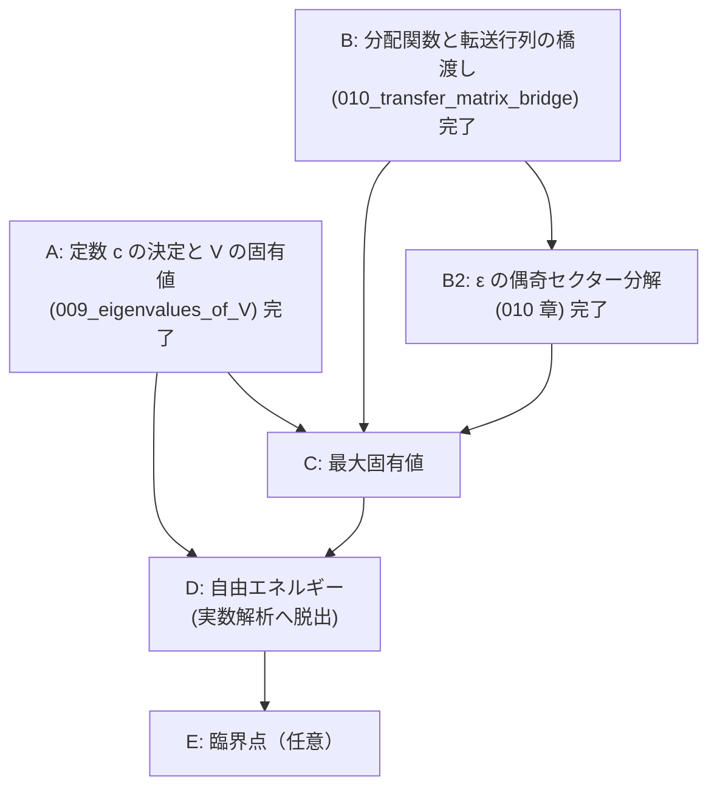

# V = cV' から Onsager の自由エネルギーまで — 章立てと依存順

## 概要

- **スコープ**: free-energy-roadmap
- **タイトル**: 転送行列の定数決定・固有値・分配関数・自由エネルギー・熱力学極限
- **概要**: 本文の証明は `V_eq_Vprime`（$V = cV'$、定数倍を除いて一致）まで到達しているが、
  そこから先——定数 $c$ の決定、$V$ の固有値、分配関数の固有値表式、最大固有値、
  自由エネルギーの閉じた表式、熱力学極限——は本文に**一切存在しない**。
  この文書はその未到達部分を、依存順に並べた章立てとして確定させる。

## 現状の一次情報（着手前に確認した事実）

`structured-latex/content/` を全走査して確認した:

- 「自由エネルギー」「熱力学極限」「free energy」に相当するブロックは content・notes とも **0 件**。
- 到達点は `008_TV1_hatZ_hatY_part2.ts` の `V_eq_Vprime`:
  「ある $c \in \mathbb{C}^\times$ が存在して $V = cV'$」。**$c$ の値は決めていない。**
- `V := (V_1^{(\pm)})^{1/2} V_2 (V_1^{(\pm)})^{1/2}$、
  `V' := exp( Σ_{μ∈{1..M}, γ₂(θ_μ)≠0} γ(θ_μ)(ψ_μ† ψ_{-μ} − 1/2) )`。
- **重大な断絶を発見した**: 001 章の転送行列（`def_transfer_matrix`、成分で定義された
  $V_1,V_2 \in \mathrm{Mat}(2^N,\mathbb{C})$）と、004 章以降の $V_1,V_2 \in \mathrm{Mat}(2,\mathbb{C})^{\otimes M}$
  （$\sigma$ 行列で定義）を**同一視する主張がどこにも無い**。
  `partition_function_via_transfer_matrix`（$Z = \mathrm{tr}((V_1V_2)^M)$）を参照しているブロックは
  content 全体で **0 件**であり、004 章以降は 001 章から切り離された島になっている。
  分配関数へ戻るには、この橋を架けることが必須である。
- **記号の衝突**: 001 章は「$M$ 行 $N$ 列」で $Z=\mathrm{tr}((V_1V_2)^M)$、
  004 章以降は鎖長が $M$（$\mathrm{Mat}(2,\mathbb{C})^{\otimes M}$）。$M$ と $N$ の役割が入れ替わっている。
  橋渡しの章で明示的に対応を取る必要がある。

## 章立て（依存順）



---

### 章 A: 定数 $c$ の決定と $V$ の固有値 ← **本セッションで執筆済み**

ファイル: `structured-latex/content/009_eigenvalues_of_V.ts`

| # | 命題 | ラベル | 状態 |
|---|---|---|---|
| A1 | フェルミオン数演算子 $n_\mu := \psi_\mu^\dagger\psi_{-\mu}$ の定義 | `def_number_operator` | 完了 |
| A2 | $n_\mu^2 = n_\mu$、$\psi_{-\mu}\psi_\mu^\dagger = I - n_\mu$ | `number_operator_idempotent` | 完了 |
| A3 | $\mu \neq \nu$ で $n_\mu n_\nu = n_\nu n_\mu$ | `number_operators_commute` | 完了 |
| A4 | $\mathrm{tr}(n_{\mu_1}\cdots n_{\mu_k}) = 2^{M-k}$（相異なる添字） | `trace_of_number_operator_product` | 完了 |
| A5 | 同時固有空間分解（$2^M$ 個・各 1 次元） | `joint_eigenspace_decomposition` | 完了 |
| A6 | $V'$ の固有値 $\exp(\sum_\mu \gamma(\theta_\mu)(n_\mu - 1/2))$ | `eigenvalues_of_Vprime` | 完了 |
| A7 | $\mathrm{tr}(V') = \mathrm{tr}(V'^{-1}) = \prod_\mu 2\cosh(\gamma(\theta_\mu)/2) > 0$ | `trace_of_Vprime` | 完了 |
| A8 | $iK_1H_1^{(\pm)}$、$iK_2^*H_2$ は実対称 | `iH_is_real_symmetric` | 完了 |
| A9 | $V$ は実対称正定値、ゆえに $\mathrm{tr}(V) > 0$ | `V_is_positive_definite` | 完了 |
| A10 | $U_2 H_1^{(\pm)} U_2^{-1} = -H_1^{(\pm)}$、$U_2 H_2 U_2^{-1} = -H_2$ | `sign_flip_conjugation` | 完了 |
| A11 | $c = (2\sinh 2K_2)^{M/2}$、すなわち $V = (2s_2)^{M/2}V'$ | `constant_c_value` | 完了 |
| A12 | $V$ の固有値 | `eigenvalues_of_V` | 完了 |

**採った証明方針（重要）**: $c$ の決定に行列式（Leibniz 定義・乗法性）を使わずに済ませた。
$\mathrm{tr}(V)/\mathrm{tr}(V^{-1}) = c^2$ と、符号反転共役 $U_2$ による
$\mathrm{tr}(e^{2S}e^{R}) = \mathrm{tr}(e^{-2S}e^{-R})$ から $c^2 = (2s_2)^M$ を出し、
正定値性から $c > 0$ を出して符号を確定する。
行列式経由（$\det V = c^{2^M}\det V'$）でも同じ結果になるが、そちらは
$\det(AB) = \det A \det B$ の証明（置換と符号の一般論）を新たに要するため採らなかった。

### 章 B: 分配関数と転送行列の橋渡し ← **完了**（`structured-latex/content/010_transfer_matrix_bridge.ts`）

**これが無いと、どれだけ固有値を求めても分配関数に戻れない。**

| # | 命題 | ラベル | 状態 |
|---|---|---|---|
| B1 | 記号対応（001 章の `N` = 004 章の `M`、001 章の `M` = `N_row`、`J' = K_1`、`J = K_2`） | 010 章冒頭の remark | 完了 |
| B2 | 配置と標準基底の同一視 `ι` | `def_config_basis_iso` | 完了 |
| B3 | `σ^z_m f_{ι(μ)} = μ(m) f_{ι(μ)}` | `sigma_z_diagonal_action` | 完了 |
| B4 | 対角行列の指数関数 | `exp_of_diagonal_matrix` | 完了 |
| B5 | `V_1` の成分定義とパウリ表示の一致 | `V1_component_equals_pauli` | 完了 |
| B6 | `2×2` の恒等式 `A = (2 sinh 2K_2)^{1/2} exp(K_2^* σ^x)` | `two_by_two_transfer_identity` | 完了 |
| B7 | `V_2` の成分定義とパウリ表示の一致 | `V2_component_equals_pauli` | 完了 |
| B8 | `Z(J,J') = tr((V_1V_2)^{N_row})`（004 章の記号で） | `partition_function_in_pauli_form` | 完了 |

**結合定数の向きの根拠（一次情報）**: 001 章の `V_1` の指数には `J' μ(j)μ(j+1)`、すなわち
**同一の鎖の隣接サイトどうし**の積が現れ、004 章の `V_1 = exp(K_1 Σ σ^z_m σ^z_{m+1})` も同じ。
`V_2` はどちらも隣り合う 2 本の鎖の同じサイトどうしを結ぶ。したがって `K_1 = J'`、`K_2 = J`。
数値でも、`N_row ≠ M` のときに `K_1` と `K_2` を取り違えると `Z` と相対誤差 0.09〜0.44 で
合わないことを確認した（`sagemath/check/043_.../check_04_partition_function.sage`）。

### 章 B2: $\varepsilon$ の偶奇セクター分解 ← **完了**（同じく 010 章）

$V$ は $V_1^{(\pm)}$ を使って定義されており、$V_1^{(\pm)}$ は $\mathcal{F}^{(\pm)}$ 上でのみ $V_1$ と一致する
（`V1_restriction_to_eigenspaces`）。したがって全空間のトレースを $V$ の固有値だけで書くには、
射影子 $P^{(\pm)} := \frac{1}{2}(I \pm \varepsilon)$ による分解が要る。

| # | 命題 | ラベル | 状態 |
|---|---|---|---|
| B2-1 | `P^{(±)} := (I ± ε)/2` の定義 | `def_epsilon_projectors` | 完了 |
| B2-2 | `P^{(±)}` の性質と `im P^{(±)} = F^{(±)}` | `epsilon_projector_properties` | 完了 |
| B2-3 | `ε` が `V_1, V_2, V_1^{(±)}, (V_1^{(±)})^{1/2}` と可換 | `epsilon_commutes_with_transfer_matrices` | 完了 |
| B2-4 | `V_1 P^{(±)} = V_1^{(±)} P^{(±)}` とその冪 | `sector_replacement_of_V1` / `sector_replacement_pow` | 完了 |
| B2-5 | `Z` の偶奇セクター分解（4 項展開も） | `partition_function_sector_decomposition` | 完了 |

**当初 B2-5 に挙げていた「`ε` をフェルミオン数で書く」（`ε = ±Π(I − 2n_μ)` の形）は不要だった。**
射影子 `P^{(±)} = (I ± ε)/2` を使えば、`ε` をフェルミオンで書き直さなくても
`Z = tr(P^{(+)}(V^{(+)})^{N_row}) + tr(P^{(-)}(V^{(-)})^{N_row})` まで到達できる。
ただし章 C で `tr(ε (V^{(±)})^{N_row})` を固有値で評価する段になると `ε` のフェルミオン表示が要る見込みで、
そのときは符号を数値で先に確定させること。

### 章 C: 最大固有値 ← **完了**（`structured-latex/content/011_max_eigenvalue.ts`）

| # | 命題 | ラベル | 状態 |
|---|---|---|---|
| C1 | 対称化転送行列 `W = V_1^{1/2} V_2 V_1^{1/2}` | `def_symmetrized_transfer_matrix` | 完了 |
| C2 | `Z = tr(W^{N_row})` | `Z_equals_trace_of_W` | 完了 |
| C3 | `W` は実対称正定値 | `W_is_real_symmetric_positive_definite` | 完了 |
| C4 | `W` の成分はすべて正 | `W_has_positive_entries` | 完了 |
| C5 | 半正定値形式の Cauchy–Schwarz | `psd_cauchy_schwarz` | 完了 |
| C6 | `c(M) := sup_{‖x‖=1} x^T W x` | `def_rayleigh_sup` | 完了 |
| C7 | `‖Wx‖ ≤ c(M)‖x‖` | `rayleigh_bounds_operator_norm` | 完了 |
| C8 | `c^n ≤ tr(W^n) ≤ 2^M c^n` | `trace_power_sandwich` | 完了 |
| C9 | `c(M)^{N_row} ≤ Z ≤ 2^M c(M)^{N_row}` | `partition_function_sandwich` | 完了 |
| C10 | `c(M) = max(c_+, c_-)`、`W P^{(±)} = V^{(±)} P^{(±)}` | `sector_decomposition_of_rayleigh_sup` | 完了 |

**採った方針（重要）**: **スペクトル定理（実対称行列の対角化可能性）を使わずに**挟み撃ちを出した。
`c(M)` は最大固有値ではなく Rayleigh 商の**上限**として定義し、
上からの評価は `psd_cauchy_schwarz` から出る `‖Wx‖ ≤ c‖x‖`、
下からの評価はモーメント列 `m_k = x^T W^k x` の対数凸性による。
対角化可能性は正しいが本文にまだ無く、挟み撃ちには不要だったため導入しなかった。

### 章 D: 自由エネルギーと熱力学極限 ← **完了**（`structured-latex/content/012_free_energy.ts`）。**実数解析への脱出はここだけ**

| # | 命題 | ラベル | 状態 |
|---|---|---|---|
| D1 | 実数解析へ移行するのはこの章のこの箇所だけ、という宣言と使う外部事実 (R1)(R2) | `remark_real_analysis_escape_point` | 完了 |
| D2 | `γ_1(θ) ≥ cosh(2K_1 − 2K_2^*) ≥ 1`（**すべての実数 θ**） | `gamma1_lower_bound_all_theta` | 完了 |
| D3 | `γ` は `R` 上連続・周期 `2π`（★移行に実際に使う条件） | `gamma_is_continuous` | 完了 |
| D4 | `(1/(M N_row)) log Z → (1/M) log c(M)`（誤差 `≤ log2/N_row`） | `limit_of_log_Z_in_N_row` | 完了 |
| D5 | **★実数解析への移行点**: `(1/M) Σ g(2π(μ−δ)/M) → (1/2π)∫g`、誤差 `≤ ω(2π/M)` | `riemann_sum_to_integral` | 完了 |
| D6 | Onsager の表式（`δ` に依らない） | `onsager_free_energy_expression` | 完了 |
| D7 | 残っている入力の明示 | `remark_remaining_input_even_sector` | 完了 |

**移行点で持ち込んだ外部事実は 2 つだけ**: (R1) Heine–Cantor（有界閉区間上の連続関数は一様連続）、
(R2) 連続関数の Riemann 可積分性（区間加法性・`|∫h| ≤ |I| sup|h|`・定数の積分）。
`δ ∈ [0,1)` を許す形にしたので、整数運動量（`δ=0`）と半整数運動量（`δ=1/2`）を 1 つの主張で扱える。
**どちらでも極限が同じ**であることが、熱力学極限でセクターの区別が消える理由である。

### 章 C′: 偶セクターの固有値（半整数運動量） ← **C′-1〜C′-16 すべて完了**（`013`〜`018` の 6 章）

**2026-07-27 に章 C′ は完結した。** `018_even_sector_closing.ts`（C′-16）で
`c_+(M) = Λ^{(1/2)}_M` が証明され、`onsager_exact_solution` として
**2 次元 Ising 模型の厳密解が本文で閉じた**。以下の記述のうち「残っている一手」等の表現は
すべて解消済みである（該当節に完了時点の内容を追記してある）。

章 C・章 D により、分配関数から自由エネルギーまでの経路で**残っていたのは 1 点だけ**だった：

> `c_+(M)`（`ε` の固有値 `+1` のセクターでの Rayleigh 上限）が `Λ^{(1/2)}_M` に等しいこと。
> すなわち `V^{(+)}` の固有値が**半整数運動量** `2π(μ−1/2)/M` で与えられること。

**`V^{(+)}` の固有値については C′-15（017 章）で決着した**：固有値は
`Λ̌_ε = (2 sinh 2K_2)^{M/2} exp(Σ_{μ=1}^{M} γ(θ~_μ)(ε_μ − 1/2))` で尽き、その最大値は
`Λ^{(1/2)}_M` に一致し、しかも**単純固有値**である（`max_eigenvalue_of_V_plus_simple`）。
**「`V^{(+)}` の最大固有値」と「`c_+(M)`（Rayleigh 上限）」の接続は C′-16（018 章）で完了した**
（下記「C′-16 の成果」）。

**本文に無い理由（一次情報で特定済み）**: `def_hatZ_hatY` の `hatZ_μ^{(±)}` は第 1 項に符号 `∓` を持つ。
`commutator_of_H_and_Z_Y` の (C) `[H_2, hatZ_μ^{(-)}] = −2 hatY_μ` は `[H_2, Z_j] = −2Y_j` を
各項に適用して係数を比べる形で示されるが、`hatZ_μ^{(+)}` では第 1 項だけ符号が反転しているため
右辺が `−2 hatY_μ` にならない。したがって 008 章以降は `(−)` セクター専用である。
数値でも `(−)` 側は残差 1e-15、`(+)` 側は残差 1e-3 以上で不成立（`045_.../check_03`）。

#### 完了した部分（013 章、8 ブロック）

| # | 命題 | ラベル | 状態 |
|---|---|---|---|
| C′-1 | 008 章が `(−)` 専用である理由を等式で確定：`[H_2, hatZ^{(+)}_μ] = −2 hatY_μ + 4e^{−iθ_μ}Y_1 ≠ −2 hatY_μ` | `why_008_applies_only_to_minus_sector` | 完了 |
| C′-2 | 半整数運動量の指数和 `Σ_μ e^{ikθ~_μ} = M(−1)^l`（`k=lM`）/ `0` | `antiperiodic_exp_sum` | 完了 |
| C′-3 | `checkZ_μ, checkY_μ` の定義、反周期性 `e^{−iMθ~_μ} = −1`、添字周期性、共役添字 `1−μ` | `def_half_integer_modes` | 完了 |
| C′-4 | (A)〜(D)：`H_1^{(+)}, H_2` との交換関係が 008 章と**同じ形**で閉じる | `commutator_of_H_and_check_Z_Y` | 完了 |
| C′-5 | 反交換関係（対は `μ+ν ≡ 1 (mod M)`） | `anticommutator_of_check_Z_Y` | 完了 |
| C′-6 | 復元公式 `Z_j = (1/M)Σ_μ checkZ_μ e^{ijθ~_μ}` と生成性 | `recover_Z_Y_from_check_Z_Y` | 完了 |
| C′-7 | `H_1^{(+)}, H_2` を `checkZ, checkY` で表す | `H1_H2_via_check_Z_Y` | 完了 |

数値検証は `sagemath/check/046_claim_even_sector_modes/`（3 チェック、全 PASS、`M = 2,3,4,5`）。

**仕組みは 1 つの等式に集約される**: `e^{−iMθ~_μ} = −1`（反周期性）。
`hatZ^{(±)}` が境界の符号を第 1 項に置いていたのに対し、`checkZ` では位相が `j = M` から `j = 0` へ
回るときに自動的に符号を出す。整数運動量では `e^{−iMθ_μ} = +1` なので同じ計算が閉じない。

#### 完了した部分（014 章、11 ブロック）

`structured-latex/content/014_even_sector_T_action.ts` で C′-8〜C′-11 を閉じた。到達点は

```
(T_{(V^{(+)})}(checkZ_μ), T_{(V^{(+)})}(checkY_μ)) = (checkZ_μ, checkY_μ) A(θ~_μ)
A(θ~_μ) = B_1(θ~_μ) B_2 B_1(θ~_μ)
```

| # | 命題 | ラベル | 状態 |
|---|---|---|---|
| — | `V^{(+)} := (V_1^{(+)})^{1/2}V_2(V_1^{(+)})^{1/2}`、`T_{(V^{(+)})}`。可逆性・平方根であること・合成 = 共役 | `def_H1_plus` / `def_V1_plus_square_root` / `V1_plus_square_root_property` / `def_V_plus` / `V_plus_factors_invertible` / `def_T_V_plus` / `T_V_plus_is_conjugation` | 完了 |
| C′-8 | (A)〜(D) の n 重交換子（4 式、`n` に関する帰納法） | `nesting_of_commutator_of_H_and_check_Z` | 完了 |
| C′-9 | 生成子のスケール `(i/2)K_1H_1^{(+)}, iK_2^*H_2` / テイラー係数の抽出 | `cosh_sinh_coefficient_conversion_for_check` / `extract_taylor_coefficient_of_check_Z_Y` | 完了 |
| C′-10 | `T_{(V_1^{(+)})^{1/2}}, T_{V_2}` の作用と `B_1(θ~_μ), B_2` による右乗 | `T_actions_on_check_Z_Y` / `linearity_of_T_on_check_Z_Y` / `def_B1_theta_B2` / `calc_of_TxT_check_Z_Y` | 完了 |
| C′-11 | `B_1(θ)B_2B_1(θ) = A(θ)`（**θ ∈ R 一般**）と `T_{(V^{(+)})}` の作用 | `factorization_of_A_theta_general` / `T_V_plus_check_Z_Y` | 完了 |

数値検証は `sagemath/check/047_claim_even_sector_T_action/`（4 チェック、全 PASS、`M = 2,3,4,5`、
`(K1,K2)` は臨界点上・臨界点近傍を含む 5 組）。

**008 章の証明がそのまま流用できた理由（一次情報で確認済み）**: 008 章の
`nesting_of_commutator_of_H_and_Z` から `T_V_hatZ_hatY` までの各証明は、1 重の交換子 (A)〜(D) と
交換子の双線型性・exp 共役の級数展開・`e^{iθ}e^{-iθ}=1` しか使っておらず、`θ_μ` に固有の性質
（`e^{-iMθ_μ}=+1`、添字集合 `calM`、`hatZ_hatY_M_periodicity`）を使っていない。`θ_μ` 固有の性質が
効いていたのは (A)〜(D) を導く `commutator_of_H_and_Z_Y` の段だけで、そこは
`commutator_of_H_and_check_Z_Y`（013 章）が半整数運動量について独立に済ませている。

**書き換えでなく新規ブロックにした点**:
- 008 章の `V` は `why_008_applies_only_to_minus_sector` により実質 `(−)` 専用なので、
  混同を避けて `V^{(+)}, T_{(V^{(+)})}` という別記号で定義し直した（008 章の `def_T_V` は参照していない）。
- 008 章の `factorization_of_A_theta` は `μ ∈ calM` で量化されており `θ~_μ` に適用できないため、
  `θ ∈ R` 一般の `factorization_of_A_theta_general` として立て直し、行列計算を書き下した。
- 008 章は `(V_1^{(±)})^{1/2}` を「`exp(iK_1H_1)` の 1/2 乗」と書いて proof 中で
  `exp((1/2)iK_1H_1)` に読み替えていたが、014 章では後者を定義とし、それが平方根であることを示した。
- `B_1(θ), B_2` は 008 章では `θ_μ` に限って導入されているので、`θ ∈ R` 一般の定義
  `def_B1_theta_B2` を新設した。

#### C′-8〜C′-15 の一覧（すべて完了）

`A(θ~_μ)` の対角化から `V^{(+)}` の固有値までは、**009 章と同じ道筋**を半整数運動量で辿った。

| # | 対応する既存ブロック | 内容 |
|---|---|---|
| C′-8 | `nesting_of_commutator_of_H_and_Z` | (A)〜(D) の n 重交換子。**完了**（`content/014_even_sector_T_action.ts`、`nesting_of_commutator_of_H_and_check_Z`） |
| C′-9 | `cosh_sinh_coefficient_conversion` / `extract_taylor_coefficient_of_Z_Y` | 生成子のスケールとテイラー係数の抽出。**完了**（014 章、`cosh_sinh_coefficient_conversion_for_check` / `extract_taylor_coefficient_of_check_Z_Y`） |
| C′-10 | `ホロノミック量子場_p142下段_1` / `calc_of_TxT_hatZxhatY` | `T_{(V_1^{(+)})^{1/2}}, T_{V_2}` の作用と `B_1(θ~), B_2`。**完了**（014 章、`T_actions_on_check_Z_Y` / `calc_of_TxT_check_Z_Y` / `def_B1_theta_B2`） |
| C′-11 | `T_V_hatZ_hatY` / `factorization_of_A_theta` | `B_1B_2B_1 = A(θ~)` と `T_{(V^{(+)})}(Ž,Y̌) = (Ž,Y̌)A(θ~_μ)`。**完了**（014 章、`factorization_of_A_theta_general` / `T_V_plus_check_Z_Y` / `def_T_V_plus` / `T_V_plus_is_conjugation`）。既存 `factorization_of_A_theta` は `μ ∈ calM` で量化されていて再利用できず、θ ∈ R 一般へ立て直した |
| C′-12 | `eigenvector_of_A_theta` / `diagonalization_P_D` / `det_A_theta` / `gamma1_geq_1` / `lambda_eq_exp_gamma` | `A(θ~)` の対角化。**完了**（`structured-latex/content/015_A_theta_tilde_diagonalization.ts`、9 ブロック。下記） |
| C′-13 | `def_fermi` / `anticommutator_of_psi` | 半整数運動量のフェルミオン `checkψ_μ`（対は `μ+ν ≡ 1`）。**完了**（`structured-latex/content/016_even_sector_fermions.ts`、`def_check_fermi` / `periodicity_of_check_fermi` / `anticommutator_of_check_psi`。下記） |
| C′-14 | `commutation_V_psi` / `action_of_T_Vprime_on_psi` / `T_V_eq_T_Vprime` / `V_eq_Vprime` | `V^{(+)} = c checkV'`。**完了**（016 章、`commutation_V_plus_check_psi` / `def_check_Vprime` / `action_of_T_check_Vprime_on_check_psi` / `T_V_plus_eq_T_check_Vprime` / `V_plus_eq_c_check_Vprime`。下記） |
| C′-15 | 009 章全体 | 数演算子・同時固有空間分解・`c = (2 sinh 2K_2)^{M/2}`・固有値。**完了**（`structured-latex/content/017_even_sector_eigenvalues.ts`、11 ブロック。下記） |

**簡単になる点（見込みではなく確定した）**: 半整数運動量では `γ_2(θ~_μ) ≠ 0` が**常に**成り立つ。
実際 `γ_2(θ) = 0` は `sin θ = 0` かつ `c_1 cos θ = s_1 c_2` を要するが、
`sin θ~_μ = 0` は `2μ−1 = kM` を要し、**左辺が奇数なので `k` は奇数**、よって `cos θ~_μ = cos(kπ) = −1`。
すると `s_1c_2 = −c_1 < 0` となり `c_1, s_1, c_2 > 0` に矛盾する。
したがって 008 章・009 章にあった臨界点の例外処理（`μ = M` の除外、`m = M−1`）が
偶セクターでは**不要**になる。C′-12（下記）でこれを本文の主張 `gamma_2_theta_tilde_nonzero` として確定させた。

#### C′-12 の成果（`structured-latex/content/015_A_theta_tilde_diagonalization.ts`、9 ブロック）

| ラベル | 内容 |
|---|---|
| `def_gamma1_gamma2_of_theta` | `γ_1(θ), γ_2(θ)` を `θ ∈ R` の関数として**ラベル付きで**定義し、`A(θ)` の成分表示を与える（008 章の同じ定義はラベルが無く参照できない） |
| `gamma_2_theta_tilde_nonzero` | **`γ_2(θ~_μ) ≠ 0`（全 `μ`、全 `K_1,K_2 > 0`、臨界点を含む）** |
| `relation_of_gamma_2_theta_tilde` | `γ_2(−θ~) = −conj(γ_2(θ~))`、積 `= −|γ_2|² < 0`、`arg = π`、`sqrt(−積) = |γ_2| > 0`、`sqrt(積) = i|γ_2|` |
| `eigenvector_of_A_theta_tilde` | `λ_{±,μ} = γ_1 ± |γ_2| ∈ R`（実数・相異なる）と固有ベクトル。**場合分けなし** |
| `diagonalization_check_P_D` | `A(θ~_μ) = P̌_μ Ď_μ P̌_μ^{-1}`、`det P̌_μ = −|γ_2|/(2M γ_2(−θ~_μ)) ≠ 0`。正規化は 008 章の `P_μ` と同じ `c = 1/(2√M γ_2(−θ~_μ))` |
| `det_A_theta_tilde` | `det A = 1`、`γ_1² + γ_2γ_2(−) = 1`、`λ_+λ_- = 1`、`γ_1² = 1 + |γ_2|²` |
| `gamma1_gt_1_theta_tilde` | **`γ_1(θ~_μ) > 1`（狭義）** |
| `def_gamma_theta_tilde_mu` | `γ(θ~_μ) := arccosh(γ_1(θ~_μ)) > 0`（狭義） |
| `lambda_eq_exp_gamma_theta_tilde` | `λ_± = e^{±γ(θ~_μ)}`、`λ_+ > 1 > λ_- > 0`（**固有値は常に分離**） |

数値検証は `sagemath/check/048_claim_A_theta_tilde/`（5 チェック、全 PASS、`M = 2..8` の全 `μ`、
厳密な臨界点とその近傍を含む 16 組の `(K_1, K_2)`）。整数運動量では同じ `K` の臨界点で
`γ_2(2π) = 0`、`γ(2π) = 0` になることも対比として記録してある。

**C′-13 以降へ引き継ぐ道具**: `γ(θ~_μ) > 0` と `λ_+ > 1 > λ_- > 0`。
C′-15 で最大固有値の一意性を言うときに、整数運動量側で必要だった臨界点の例外処理を持ち込まずに済む。
なお `def_gamma1_gamma2_of_theta` は `θ ∈ R` について述べてあるので、C′-13 以降でも
`θ~` 版を作り直さずそのまま使える。

#### C′-13・C′-14 の成果（`structured-latex/content/016_even_sector_fermions.ts`、10 ブロック）

到達点は `V^{(+)} = c checkV'`（ある `c ∈ C^×` について）。**`c` の値の決定は C′-15 で行う。**

| ラベル | 内容 |
|---|---|
| `def_check_fermi` | `(checkψ_μ^†, checkψ_μ) := (Ž_μ, Y̌_μ) P̌_μ`。**すべての `μ ∈ Z` で定義できる**（`γ_2(θ~_μ) ≠ 0` ゆえ分母が 0 にならない） |
| `periodicity_of_check_fermi` | (1) `γ_1, γ_2(±), γ` の `M` 周期性、(2) `checkψ_{μ+kM} = checkψ_μ`、(3) 共役添字 `γ_2(θ~_{1−μ}) = γ_2(−θ~_μ)`、`γ(θ~_{1−μ}) = γ(θ~_μ)` |
| `anticommutator_of_check_psi` | `[ψ̌^†_μ, ψ̌^†_ν]_+ = 0`、`[ψ̌^†_μ, ψ̌_ν]_+ = δ^M_{(μ+ν,1)} I`、`[ψ̌_μ, ψ̌_ν]_+ = 0`。**対は `μ+ν ≡ 1 (mod M)`** |
| `commutation_V_plus_check_psi` | `T_{(V^{(+)})}(ψ̌^†_μ) = e^{+γ(θ~_μ)} ψ̌^†_μ`、`T_{(V^{(+)})}(ψ̌_μ) = e^{−γ(θ~_μ)} ψ̌_μ` |
| `def_check_Vprime` | `X̌ = Σ_{μ=1}^{M} γ(θ~_μ)(ψ̌^†_μ ψ̌_{1−μ} − I/2)`、`checkV' = exp(X̌)`。**和の範囲に例外が要らない**。可逆性も示した |
| `action_of_T_check_Vprime_on_check_psi` | `T_{(checkV')}(ψ̌^†_μ) = e^{+γ} ψ̌^†_μ`、`T_{(checkV')}(ψ̌_μ) = e^{−γ} ψ̌_μ` |
| `T_V_plus_eq_T_check_Vprime_on_check_Z_Y` | `T_{(V^{(+)})}` と `T_{(checkV')}` が `Ž_μ, Y̌_μ` 上で一致（**場合分けなし**） |
| `T_V_plus_eq_T_check_Vprime` | `T_{(V^{(+)})} = T_{(checkV')}`（`Mat(2^M,C)` 全体。復元公式 `recover_Z_Y_from_check_Z_Y` と `Z_Y_generate_algebra` を経由） |
| `V_plus_eq_c_check_Vprime` | **`V^{(+)} = c checkV'`（ある `c ∈ C^×`）**。`centralizer_is_scalar` による（クリフォード群には依存しない） |

数値検証は `sagemath/check/049_claim_even_sector_fermions/`（6 チェック、全 PASS、`M = 2,3,4,5`、
厳密な臨界点 2 組を含む 6 組の `(K_1,K_2)`）。`V^{(+)}` と `checkV'` はどちらも行列指数関数から
直接構成しており、証明が使う交換子の級数展開とは独立な経路になっている。
`T_{(V^{(+)})} = T_{(checkV')}` は行列単位 `e_{ij}`（`2^M × 2^M` 個）すべてで直接確認した。

**008 章から消えたもの（一次情報で確認済み）**:

1. **臨界点の場合分けが全部消えた。** 008 章の `def_fermi` の定義域限定、`def_Vprime` の和の範囲限定、
   `A_theta_is_identity_when_gamma2_zero`、`T_Vprime_fixes_hatZ_hatY_when_gamma2_zero`、
   `T_V_eq_T_Vprime_on_hatZ_hatY` の「場合 2」は、いずれも `γ_2(θ_μ) = 0` になりうることだけに
   由来していた。`gamma_2_theta_tilde_nonzero`（C′-12）により偶セクターでは起こらない。
2. **複素平方根の分枝の議論が消えた。** 008 章の `anticommutator_of_psi` は Step 0 で
   `√(γ_2(θ_μ)γ_2(−θ_μ))` の分枝が `μ` と `ν` で一致することを示す必要があったが、
   `relation_of_gamma_2_theta_tilde` (4)(5) により根号が `|γ_2|`（非負実数）と `i|γ_2|` に確定するので、
   係数の一致は絶対値の計算だけで従う。
3. **`μ` の符号による場合分けが消えた。** 008 章の `action_of_T_Vprime_on_psi` は添字集合が
   `calM = {−M,…,−1,1,…,M}` だったため `μ` の符号で 3 通りに分けていた。016 章は `μ ∈ Z` で扱い、
   `periodicity_of_check_fermi` を先に立てることで場合分けを不要にした。

**C′-15 へ引き継ぐ道具**: `anticommutator_of_check_psi`（数演算子 `ψ̌^†_μ ψ̌_{1−μ}` の冪等性に使う）、
`def_check_Vprime` の `X̌`、`V_plus_eq_c_check_Vprime`、および C′-12 の `γ(θ~_μ) > 0` / `λ_+ > 1 > λ_- > 0`。
`c = (2 sinh 2K_2)^{M/2}` は数値では全ケースで一致を確認済み（`049_.../check_06`、相対差 ≤ 2.3e-13）で、
**証明は C′-15 で与えた**（下記）。

#### C′-15 の成果（`structured-latex/content/017_even_sector_eigenvalues.ts`、11 ブロック）

到達点は **`V^{(+)}` の固有値の完全な決定**と **`Λ̌_max = Λ^{(1/2)}_M` の単純性**。

| ラベル | 内容 |
|---|---|
| `def_check_number_operator` | `ň_μ := ψ̌_μ^† ψ̌_{1−μ}`（**全 `μ ∈ ℤ`** で定義可能）、`M` 周期性、`X̌ = Σ_{μ=1}^{M} γ(θ~_μ)(ň_μ − I/2)` |
| `check_number_operator_idempotent` | `(ψ̌_μ^†)² = 0`、`ψ̌_{1−μ}ψ̌_μ^† = I − ň_μ`、`ň_μ² = ň_μ` |
| `check_number_operators_commute` | `μ ≠ ν ∈ {1,…,M}` で `ň_μ ň_ν = ň_ν ň_μ`。消える δ は `δ^M_{(μ+(1−ν),1)} = δ^M_{(μ−ν,0)}` |
| `trace_of_check_number_operator_product` | `tr(ň_{μ_1}⋯ň_{μ_k}) = 2^{M−k}`（`k` は **`M` まで**走れる） |
| `check_joint_eigenspace_decomposition` | `Q̌_ε`（`ε ∈ {0,1}^{1..M}`）、`tr(Q̌_ε) = 1`、**各同時固有空間は 1 次元**、`ℂ^{2^M}` は `2^M` 個の 1 次元空間の直和 |
| `eigenvalues_of_check_Vprime` | `V̌' Q̌_ε = e^{ǧ(ε)} Q̌_ε`、`ǧ(ε) = Σ_μ γ(θ~_μ)(ε_μ − 1/2)`。固有値はすべて正 |
| `trace_of_check_Vprime` | `tr(V̌') = tr((V̌')^{−1}) = Π_μ 2cosh(γ(θ~_μ)/2) > 0`（009 章の前因子 `2^{M−m}` は消える） |
| `V_plus_is_positive_definite` | `V^{(+)} = (2s_2)^{M/2} exp(S_1^{(+)}/2) exp(S_2) exp(S_1^{(+)}/2)` は正定値、`tr(V^{(+)}) > 0` |
| `constant_c_value_even_sector` | **`c = (2 sinh 2K_2)^{M/2}`**。`tr(V^{(+)})/tr((V^{(+)})^{−1}) = c²` と符号反転共役 `U`、正定値性からの符号確定。行列式は使わない |
| `eigenvalues_of_V_plus` | `Λ̌_ε = (2 sinh 2K_2)^{M/2} exp(ǧ(ε))` が `V^{(+)}` の固有値を尽くす（`2^M` 個）。`Λ̌_max Λ̌_min = c²` |
| `max_eigenvalue_of_V_plus_simple` | **`Λ̌_max = Λ^{(1/2)}_M`** かつ `ε ≠ (1,…,1)` で狭義に `Λ̌_ε < Λ̌_max`、ゆえに**単純固有値**（固有空間 `= im Q̌_{(1,…,1)}`、1 次元） |

数値検証は `sagemath/check/050_claim_even_sector_eigenvalues/`（6 チェック、全 PASS、`M = 2,3,4,5`、
`{0,1}^M` を全列挙、厳密な臨界点 2 組を含む 6 組の `(K_1,K_2)`）。
`V^{(+)}` の `2^M` 個の固有値全体が `{Λ̌_ε}` と**相対誤差 9.0e-12 以下**で一致する（`check_06`）。

**009 章から変わった点（一次情報で確認済み）**:

1. **`iH_is_real_symmetric` と `sign_flip_conjugation` はそのまま (+) 側に使える。** どちらも
   `S_1^{(±)} = iK_1H_1^{(±)}` について**複号同順**で述べられているので、上の符号を取るだけでよい。
   数値でも `S_1^{(+)}` の実対称性と `U S_1^{(+)} U^{−1} = −S_1^{(+)}` の残差は `0.0`（`check_05`）。
   一方 009 章の `V_is_positive_definite` は `V_eq_Vprime` の `V`（実質 `(−)` 専用）に結びついているので、
   `V_plus_is_positive_definite` として `V^{(+)}` について改めて述べた（証明の内容は同一）。
2. **臨界点の縮退が消えた。** 009 章の `m = |I|` は臨界点で `M−1` になり同時固有空間が 2 次元に
   なりえたが、`gamma_2_theta_tilde_nonzero` により `m = M`、各空間は常に 1 次元。
3. **最大固有値の単純性が言える。** `def_gamma_theta_tilde_mu` の `γ(θ~_μ) > 0`（狭義）から
   `ε ≠ (1,…,1)` で `Λ̌_ε < Λ̌_max` が狭義に従う。009 章では `γ(θ_μ) ≥ 0` しか言えず単純性は出ない。

**本文が主張しないこと（重要・一次情報で確認済み）**: `V^{(+)}` の固有値が「すべて相異なる」ことは
**成り立たない**。`periodicity_of_check_fermi` (1)(3) から `γ(θ~_μ) = γ(θ~_{M+1−μ})` なので、
`ε` の成分を `μ ↔ M+1−μ` で入れ替えても `Λ̌_ε` は変わる。`check_03` で
（`M = 2..5`・6 組の `(K_1,K_2)` で）縮退ペアが 144 件現れることを記録してある。
**単純性を主張するのは最大固有値だけ**である。

#### C′-16 の成果（`structured-latex/content/018_even_sector_closing.ts`、11 ブロック）— 完了（2026-07-27）

到達点は **`c_+(M) = Λ^{(1/2)}_M`** と、**2 次元 Ising 模型の厳密解**
`lim_{M→∞} lim_{N_row→∞} (1/(M N_row)) log Z = (1/2)log(2 sinh 2K_2) + (1/4π)∫_0^{2π} γ(θ)dθ`。

**難所は「上限」ではなく「下限」だった。** `x ∈ F^{(+)}` なら
`sector_decomposition_of_rayleigh_sup` (2) の `WP^{(+)} = V^{(+)}P^{(+)}` から
`x^⊤Wx = x^*V^{(+)}x ≤ Λ̌_max` は容易である。逆向きには
**`Λ̌_max` の固有ベクトルが `F^{(-)}` ではなく `F^{(+)}` に属すること**、
すなわち `ε` の固有値が `+1` であることを示さなければならない。
`V^{(+)}` は `Mat(2^M,ℂ)` 全体の行列で、その `2^M` 個の固有値の**半分は `F^{(-)}` 側**の
固有ベクトルに対応するので、これは固有値 `Λ̌_ε` の値からは読み取れない。

| ラベル | 内容 |
|---|---|
| `epsilon_anticommutes_with_check_Z_Y` | `ε` は `Z_j, Y_j` と反可換（010 章 `epsilon_commutes_with_transfer_matrices` の Step 1 から直ちに従う）⟹ `Ž_μ, Y̌_μ, ψ̌_μ^†, ψ̌_μ` とも反可換 ⟹ **`ň_μ, Q̌_ε` とは可換** |
| `epsilon_eigenvalue_on_check_Q` | `im Q̌_ε` は 1 次元なので `εQ̌_ε = η_ε Q̌_ε`（`η_ε = ±1`）。`ψ̌_μ^†` は `ε_μ` を `0→1` に動かし（`ψ̌_μ^†q ≠ 0` は `ψ̌_{M+1−μ}ψ̌_μ^† = I − ň_μ` から）、かつ `ε` と反可換なので**符号が反転**。よって `η_ε = η_{(1,…,1)}(−1)^{M−|ε|}` で、**未知の符号は `η_{(1,…,1)}` ひとつだけ**。あわせて `ε = η_{(1,…,1)}(−1)^M Π_μ(I − 2ň_μ)` |
| `trace_of_epsilon_V_plus_via_check_eigenvalues` | `tr(εV^{(+)}) = η_{(1,…,1)}(2 sinh 2K_2)^{M/2} Π_μ 2 sinh(γ(θ~_μ)/2)`。`γ(θ~_μ) > 0`（半整数運動量に固有）より `η` 以外は正なので、**`η_{(1,…,1)} = +1 ⟺ tr(εV^{(+)}) > 0`** |
| `H1_plus_in_sigma_z_form` | `iY_mZ_{m+1} = σ^z_mσ^z_{m+1}`（`m ≤ M−1`）、`−iY_MZ_1 = εσ^z_Mσ^z_1`、ゆえに **`iH_1^{(+)} = D_0 + εG`**（`D_0 = Σ_{m<M}σ^z_mσ^z_{m+1}`、`G = σ^z_Mσ^z_1`）。`(εG)² = I` と可換性も |
| `def_open_chain_spin_energy`・`open_chain_partition_sum`・`open_chain_endpoint_product_sum`・`open_chain_spin_sums_positive` | `M, \mathfrak M, E(s)` を定義し、`Σ_s e^{K E(s)} = 2(2cosh K)^{M−1}`、`Σ_s s(M)s(1)e^{K E(s)} = 2(2 sinh K)^{M−1}` を示す。`t_m := s(m)s(m+1)` への変数変換（全単射）だけ。**`K > 0` で両方とも正** |
| `trace_of_epsilon_V_plus` | **`tr(εV^{(+)}) = (2e^{−K_2}cosh K_1)^M + (2e^{K_2}sinh K_1)^M > 0`**。`exp(K_1εG) = cosh K_1·I + sinh K_1·εG` と `V2_component_equals_pauli` の `(V_2)_{ι(s),ι(s')} = exp(K_2Σ_m s(m)s'(m))`、`εf_{ι(s)} = f_{ι(−s)}` から。**Ž,Y̌,ψ̌ も半整数運動量も現れない** |
| `max_eigenvector_in_even_sector` | **`η_{(1,…,1)} = +1`**、`η_ε = (−1)^{M+|ε|}`、**`ε = (−1)^M Π_μ(I − 2ň_μ)`**、`im Q̌_{(1,…,1)} ⊆ F^{(+)}` |
| `check_number_operator_is_hermitian` | `Z_j^* = Z_j`、`Ž_μ^* = Ž_{M+1−μ}`、`conj(α_μ) = −α_{M+1−μ}`（`relation_of_gamma_2_theta_tilde` (1) と `periodicity_of_check_fermi` (3) から）、`(ψ̌_μ^†)^* = ψ̌_{M+1−μ}`、`ň_μ^* = ň_μ`、`Q̌_ε^* = Q̌_ε` |
| `c_plus_equals_Lambda_half_integer` | **`c_+(M) = Λ̌_max = Λ^{(1/2)}_M`（上限は達成される）**。上からは `x^*V^{(+)}x = Σ_ε Λ̌_ε‖Q̌_εx‖²`（`Q̌_ε` のエルミート性）、下からは `Λ̌_max` の実固有ベクトル（`V^{(+)}` が実行列＋単純性から `q + conj(q)` か `i(q − conj(q))` が実で非零） |
| `onsager_exact_solution` | **厳密解**。`Λ^{(1/2)}_M ≤ c(M) ≤ 2Λ^{(1/2)}_M` と `limit_of_log_Z_in_N_row` / `onsager_free_energy_expression` |

数値検証は `sagemath/check/053_claim_even_sector_closing/`（5 チェック、全 PASS、`M = 2,3,4,5`、
`{0,1}^M` を全列挙、厳密な臨界点 2 組を含む 6 組の `(K_1,K_2)`）。
`c_+(M)` は `Λ̌_ε` を経由せず、`W` を `F^{(+)} ∩ ℝ^{2^M}` の実正規直交基底 `(e_k + e_{k̄})/√2` へ
制限した実対称行列の最大固有値として**直接**求めて比較している（相対差 ≤ 1.7e-15）。

**証明の要となった 2 つの観察（一次情報で確認済み）**:

1. **`ε` は `ň_μ` と可換だが `ψ̌` とは反可換**。これで「`η_ε` は 1 つの符号 `η_{(1,…,1)}` で決まる」
   という形まで問題が縮む。`ň_μ = ψ̌_μ^†ψ̌_{M+1−μ}` は同じモードの `ψ^†ψ` ではないので、
   真空 `ε = (0,…,0)` 側のパリティは `(−1)^M` になる（`M` の偶奇に依存する）。
   **最大固有ベクトル `ε = (1,…,1)` のパリティは `M` の偶奇によらず `+1`** である。
2. **残った 1 つの符号は `tr(εV^{(+)})` の符号として読める**。しかもこのトレースは
   フェルミオン化を経由せずに転送行列の側で初等的に計算でき、値は `K_1, K_2 > 0` で常に正である。
   `iH_1^{(+)} = D_0 + εG` により `εV_1^{(+)} = exp(K_1D_0)(cosh K_1·ε + sinh K_1·G)` と分解でき、
   2 項がそれぞれ 1 次元開鎖の分配関数と境界相関に対応する（どちらも `K_1 > 0` で正）。

**採らなかった経路**: `ε = (−1)^M Π_μ(I − 2ň_μ)` の符号を、`A_μ := I − 2ň_μ` を `Ž, Y̌` で
書き下して直接計算する経路も検討した。`A_μ A_{M+1−μ}` は `(K_1,K_2)` に依存しない（数値で確認、
残差 1e-15）ので原理的には可能で、自己共役添字（`M` 奇数、`μ = (M+1)/2`）では
`A_μ = (−i/M)Ž_μY̌_μ` と閉じた形になる（同）。しかし対 `{μ, M+1−μ}` の積を
`ε = i^M Z_1Y_1⋯Z_MY_M` と突き合わせるには、実質的に「クリフォード代数のカイラリティが
基底変換の行列式で変わる」という一般論が要る。README のゴール設定（抽象代数を持ち込まない）に
反するので採らず、トレースの符号を読む経路にした。

**`c_-(M)` に依存しない形にした理由（重要・一次情報で確認済み）**: `c_-(M) = Λ^{(0)}_M` は
**一般には成り立たない**。数値では `(K_1,K_2) = (0.4,0.484), (0.44,0.44), (0.4,0.8), (1.2,0.3)` で
`c_-(M)/Λ^{(0)}_M = 1` だが、**高温側 `(K_1,K_2) = (0.05,0.1)`（`sinh2K_1 sinh2K_2 ≈ 0.020`）では
`c_-(M)/Λ^{(0)}_M = 0.1102`**（`M = 2,3,4,5` すべてで同じ比。`053_.../check_05` の対照出力）。
`V^{(-)}` の最大固有値の固有ベクトルが `F^{(+)}` 側に落ちる場合があるためで、
偶セクターで解決したのと同じ問題が奇セクターでは別の答えになりうる。
そこで `onsager_exact_solution` は `c_-(M)` の値に**一切依存しない**書き方にした：
`W` の成分がすべて正であること（`W_has_positive_entries`）だけから
`c(M) ≤ 2c_+(M)` を出す（`x` の成分の絶対値 `u` を取り `v := u + εu ∈ F^{(+)}` を使う）。
係数 2 は最良でない（数値では `c(M) = c_+(M)` が全パラメータで成立、相対差 ≤ 1.9e-15）が、
`(1/M)log 2 → 0` なので Onsager の表式には影響しない。

### 章 E: 臨界点（任意） ← 未着手

`critical_condition_c1_eq_s1_c2` は既に $\sinh 2K_1\sinh 2K_2 = 1$ と $\gamma_2$ の零点の対応を確立している。
自由エネルギーの $K$ 依存性の特異性（比熱の対数発散）をここで扱える。README 5 節の「読み物」素材でもある。

---

## 未着手部分の前提として不足しているもの（新たに要る道具）

| 道具 | 要否 | 現状 |
|---|---|---|
| トレースの線型性・巡回性 | **必須**（章 A で使用） | 本文に定義ブロックが無い。章 A で `def_trace` として新規に定義した |
| 行列式の定義と乗法性 | **回避した** | 章 A では使わない方針を採ったため不要。将来必要になれば独立の章として立てる（既存の `det_A_theta` が $2\times2$ で $\det$ を無定義に使っているのは別途の課題） |
| 実対称行列の正定値性 | **必須**（章 A で使用） | 章 A で定義から書き下した |
| 有限次元の同時固有空間分解 | **必須**（章 A で使用） | 章 A で冪等元の直和分解として初等的に書き下した |
| Riemann 和と積分 | 章 D で必須 | 未整備。**実数解析への脱出点なので、そこで定義を導入し脱出を明示する** |
| 対数関数の連続性・単調性 | 章 D で必須 | 未整備 |

#### 章 C′ の添字の量化範囲を `𝓜̌ = {1,…,M}` へ絞った — 完了（2026-07-27）

013〜017 章は当初、添字を `μ ∈ ℤ` 全体で量化していた（合計 37 箇所）。008 章が
`𝓜 = {−M,…,−1,1,…,M}` という名前付きの有限集合で量化しているのに倣い、
**半整数運動量に必要な最小の有限集合**

```
𝓜̌ := {1, 2, …, M}     （013 章 `def_check_index_set`）
```

を定義して、章 C′ のすべての主張をそこへ絞った。**主張の内容は変えていない**
（弱くなった主張は無い。下記「弱くなっていないことの確認」を参照）。

##### 新設した 2 ブロック（013 章）

| ラベル | 内容 |
|---|---|
| `def_check_index_set` | `𝓜̌ := {1,…,M}` の定義と 5 つの性質：(1) `θ~_μ`（`μ ∈ 𝓜̌`）は相異なり `0 < θ~_μ < 2π`、(2) **共役添字の閉性** `μ ∈ 𝓜̌ ⟹ M+1−μ ∈ 𝓜̌`、(3) `1−μ ≡ M+1−μ (mod M)`、(4) **自己共役点**は `M` が奇数のときの `μ = (M+1)/2`（`θ~_μ = π`）だけ、(5) **対の判定** `μ+ν ≡ 1 (mod M) ⟺ ν = M+1−μ`、したがって `δ^M_{(μ+ν,1)} = δ_{ν,M+1−μ}` |
| `conjugate_index_of_check_Z_Y` | (1) `θ~_{M+1−μ} = 2π − θ~_μ`、(2) `e^{−ijθ~_{M+1−μ}} = e^{ijθ~_μ}`（`j ∈ ℤ`）、(3) `Ž_{M+1−μ} = Ž_{1−μ}`、`Y̌_{M+1−μ} = Y̌_{1−μ}`。**共役添字を `1−μ` から `M+1−μ` へ書き換える正当性がここに集約されている** |

##### 何が簡単になったか（一次情報で確認済み）

1. **合同式が本文から消えた。** `def_check_index_set` (5) により、`μ, ν ∈ 𝓜̌` では
   `μ+ν ≡ 1 (mod M)` と `ν = M+1−μ` が同値である（`2 ≤ μ+ν ≤ 2M` なので `μ+ν−1` が
   `M` の倍数になるのは `μ+ν−1 = M` の場合だけ）。したがって
   `anticommutator_of_check_Z_Y` / `anticommutator_of_check_psi` のデルタは
   `δ^M_{(μ+ν,1)}` ではなく**通常のクロネッカーのデルタ** `δ_{ν,M+1−μ}` で書ける。
2. **合同式を解く段が消えた。** 016 章の `anticommutator_of_check_psi` Step 1 は
   `ν = (1−μ)+kM` なる `k` を取って `periodicity_of_check_fermi` (1) を経由していたが、
   いまは `ν = M+1−μ` を直接使う（2 段 → 1 段）。
   `action_of_T_check_Vprime_on_check_psi` の Step 2 / Step 2' も同様に、
   「`ν ≡ μ (mod M)` を満たす `ν` はちょうど 1 つ」→「`ν = μ` の項だけが残る」に単純化した。
3. **017 章の 4 つのデルタが 1 つになった。** `check_number_operators_commute` は
   `δ^M_{(μ+(1−ν),1)} = δ^M_{(μ−ν,0)}` と `δ^M_{(ν+(1−μ),1)} = δ^M_{(ν−μ,0)}` の
   2 つの合同式の書き換えを要したが、いまは `δ_{M+1−ν,M+1−μ} = δ_{μ,ν} = 0`（`μ ≠ ν`）だけで済む。
4. **`periodicity_of_check_fermi` から `ψ̌` が消えた。** 以前の (2)（`ψ̌_{μ+kM} = ψ̌_μ`）は、
   共役添字を `M+1−μ` にしたことで `𝓜̌` の外で `ψ̌` を評価する箇所が本文から無くなり、
   不要になった。いまの内容は (1) `γ_1, γ_2` の `2π` 周期性（`θ ∈ ℝ`）、
   (2) 添字の `M` 周期性（`γ_1, γ_2` の `θ~_{μ+kM}` での値のみ）、
   (3) 共役添字 `M+1−μ` での関係、である。
5. **`ň_μ` の周期性が不要になった。** 017 章の `def_check_number_operator` (1) は
   `ň_{μ+kM} = ň_μ` だったが、いまは「`μ ↦ M+1−μ` が `𝓜̌` 上の対合である」に置き換わった。

##### 弱くなっていないことの確認

`μ ∈ ℤ` で量化したまま残したのは**主張 2 つだけ**である。

- `def_half_integer_modes` (2)：`Ž_{μ+M} = Ž_μ`、`Y̌_{μ+M} = Y̌_μ`
- `periodicity_of_check_fermi` (2)：`θ~_{μ+kM} = θ~_μ + 2kπ` と、そこでの `γ_1, γ_2` の値

前者は `conjugate_index_of_check_Z_Y` (3)（`Ž_{M+1−μ} = Ž_{1−μ}`）を導く橋渡しであり、
後者は `γ_1, γ_2` が `θ ∈ ℝ` の関数（`def_gamma1_gamma2_of_theta`）であることによって
意味をもつ主張である（`γ(θ~_μ)` と `ψ̌_μ` は `𝓜̌` 上でしか定義していない）。
これ以外に `μ ∈ ℤ` の量化は残っていない。`013` に 12 箇所、`014` に 1 箇所、`016` に 2 箇所
`\mathbb{Z}` の字面が残っているが、いずれも**記号の定義域の宣言**（`θ~_μ`、`Ž_μ`、`Y̌_μ`）、
**上記 2 主張とその説明**、または**証明中の整数性の確認**（`M+1−μ ∈ ℤ` 等）である。

`𝓜̌` がこれ以上減らせないことは数値でも確認した：`𝓜̌` から 1 点でも除くと
`θ~` の像が `M` 個を尽くせない（`sagemath/check/052_def_check_index_set/check_01`、`M = 2..40` の全探索）。

##### `&=` の式変形ステップ数 / `\because` 注記数

| 章 | 作業前 | 作業後 |
|---|---|---|
| 013 | 136 / 103 (76%) | 149 / 116 (78%) |
| 014 | 164 / 128 (78%) | 164 / 128 (78%) |
| 015 | 84 / 78 (93%) | 84 / 78 (93%) |
| 016 | 93 / 80 (86%) | 101 / 88 (87%) |
| 017 | 49 / 30 (61%) | 56 / 54 (**96%**) |

017 章は `\because` が 6 割しか付いていなかったので、他章と同じ水準まで補った。

##### 数値検証

- **新規**: `sagemath/check/052_def_check_index_set/`（2 チェック、全 PASS）。
  `def_check_index_set` (1)〜(5) と `𝓜̌` の最小性を `M = 2..40` の全探索で、
  `conjugate_index_of_check_Z_Y` (1)(2)(3) と「書き換えが `H_1^{(+)}, H_2` の表示を変えないこと」を
  `M = 2,3,4,5` で確認。
- **既存 046〜051 は範囲の変更に追随させて再実行し、`run-log.txt` を更新した**（全 PASS）。
  051（各段の検証）は `def_check_index_set` / `conjugate_index_of_check_Z_Y` の段を追加し、
  013 章の段数が 92 → 105、016 章が 58 → 62 になった。
  046 / 049 / 050 では、合同式によるデルタと `M+1−μ` 形のデルタが一致することを
  `assert` または残差で明示的に確かめている。

#### 章 C′ の式変形の厳密性（「1 ステップ 1 定理」への適合）— 完了

013〜016 章の証明を `.claude/skills/math-prover/SKILL.md` の
**「1 ステップ 1 定理の原則」と「定理適用の明示」**に適合させた。**数学的内容は変えていない**
（やったのは (a) 潰れていたステップの分割、(b) 欠けていた定理参照の追加、(c) 暗黙の前提の明示 の 3 つだけ。
statement の内容・ラベル・ブロック id はいずれも変更していない）。

structured-latex での書き方の規約（この章で確立し、以後もこれに従う）:

- 複数行の式変形は `displayMath` の `\begin{aligned} ... \\ ... \end{aligned}` で縦に並べ、
  **各行の末尾に `\quad(\because \text{...})`** を置く。本文の Definition/Claim/Theorem を
  適用した行はその**ラベル名**を `\because` の中に書く（例: `\text{def\_half\_integer\_modes (3)}`）。
- `\because` の中は素の文字列で型検査に掛からないので、**同じ displayMath の直前か直後の段落に
  `ref("...")` を必ず張る**（型検査で参照が解決されることを担保する）。両方やること。
- 高校の教科書レベルで自明な操作（四則・分配法則・移項・有限和の添字の付け替え）は注記を省略してよい。
  **本文中の主張の適用は、同じ証明に何度出てきても省略しない。**

分割の結果（`&=` の式変形ステップ数 / `\because` 注記数）:

| 章 | 作業前 | 作業後 |
|---|---|---|
| 013 | 18 / 1 | 136 / 103 |
| 014 | 129 / 43 | 164 / 128 |
| 015 | 16 / **0** | 84 / 78 |
| 016 | 32 / 17 | 93 / 80 |

とくに直した箇所:

- **015 の `relation_of_gamma_2_theta_tilde`**（作業前の 015 章は `\because` が 0 件）。
  `conj(γ_2(θ))` の計算が 1 行に「積の共役・`conj(i) = −i`・`conj(e^{iθ}) = e^{−iθ}`・
  `s_2^*` が実数・括弧内の共役・`γ_2` の定義の再適用」の 5 つ以上を潰していた。8 段に分割し、
  **`conj(e^{iθ}) = e^{−iθ}` が `θ ∈ R` を使っていること**を本文で明示した。
- **013 の `H1_H2_via_check_Z_Y`**。`def_half_integer_modes` の代入と同 (3)（`θ~_{1−μ} = −θ~_μ`）の
  適用が同一行、「積を二重和へ分配」と「有限和の順序交換」も同一行で、いずれも無注記だった。
  `checkZ_{1−μ}` の表示を 3 段、二重和の展開を 4 段に分けた。
- **016 の `anticommutator_of_check_psi`**。反交換子の双線型性（本文中の主張）の適用が無注記だった。
  4 項展開を明示し、`scalar_identity_commutes` への参照を張った。
- 複素指数の指数法則 `e^{z}e^{w} = e^{z+w}` を暗黙に使っていた箇所（013・014・015 の多数）に、
  `theorem_exp_product` を `n = 1`（`Mat(1,C) = C`）に適用したものであることを明示した。

**新しい補題が要ると判明した箇所は無かった。** 分割の過程で本文に無い性質を暗黙に使っている箇所は
見つからず、すべて既存のラベル付き主張（`anticommutator_of_Z_and_Y`, `theorem_exp_product`,
`euler_formula_cos_sin`, `abs_basic_properties`, `scalar_identity_commutes`,
`conjugation_is_ring_homomorphism`, `def_T_g`, `mat_mult`, `def_invertible_elements_of_R` 等）で
根拠を書き切れた。

数値検証は `sagemath/check/051_stepwise_identities_of_chapter_Cprime/`（4 チェック、全 PASS）。
**結論だけでなく、分割で本文に現れるようになった中間式を 1 段ずつ**検証している
（013: 92 段 / 015: 66 段 / 014: 100 段 / 016: 58 段、合計 316 種類）。
`046`〜`049` が各ブロックの statement（結論）を検証しているのに対し、`050` は各段を検証する。

### 章 C″: 最大固有値がどちらのセクターから来るか — **完了（2026-07-27、019 章、6 ブロック）**

章 C′ の後続。`structured-latex/content/019_max_eigenvalue_sector.ts` で

> **`c_−(M) ≤ c_+(M)`、したがって `c(M) = c_+(M) = Λ^{(1/2)}_M`**

を本文の定理にした。**自由エネルギーの表式には不要**（018 章の粗い評価で足りる）だが、
「`W` の最大固有値は偶セクターから来る」という描像を本文で確定させる。

| ラベル | 内容 |
|---|---|
| `epsilon_is_sign_flip_permutation` | `ε` は全スピン反転に対応する `0/1` の置換行列。置換 `π` は**不動点をもたない対合**で、成分では `(εx)_k = x_{π(k)}`。`F^{(-)} ∩ R^{2^M}` は単位ベクトルを含む（`c_−(M)` の上限が定まることの保証） |
| `abs_vector_moves_to_even_sector` | `x ∈ F^{(-)} ∩ R^{2^M}` に対し `u_k := |x_k|` とおくと `εu = u`（`u ∈ F^{(+)}`）、`‖u‖ = ‖x‖`、`u^T W u ≥ |x^T W x| ≥ x^T W x` |
| `c_minus_le_c_plus` | **`c_−(M) ≤ c_+(M)`** |
| `c_equals_c_plus` | **`c(M) = c_+(M) = Λ^{(1/2)}_M`**（上限は達成され、達成する単位ベクトルは `F^{(+)}` に取れる） |

**要は 1 行**: `εx = −x` は成分では `x_{π(k)} = −x_k` なので、絶対値を取ると `u_{π(k)} = u_k`、
すなわち `εu = u` で**偶セクターへ移る**。`W` の成分がすべて正（`W_has_positive_entries`）だから
三角不等式で `u^T W u ≥ x^T W x`。Perron–Frobenius の「最大固有ベクトルは符号をそろえて取れる」の
部分だけを、**上限（sup）の言葉で**取り出したものになっている。対角化可能性もスペクトル定理も
コンパクト性も使っていない（011 章と同じ方針）。上限の達成は
`c_plus_equals_Lambda_half_integer` の証明が構成した実固有ベクトル `x_0` からそのまま従うので、
「上限の達成をどう初等的に扱うか」は**問題にならなかった**（旧・作業順推奨の懸念は解消）。

#### 018 章を書き換えなかった理由（意図的）

`onsager_exact_solution` の証明 Step 3 は `c(M) ≤ 2Λ^{(1/2)}_M` という粗い評価を使っている。
`c_equals_c_plus` により係数 `2` は不要になるが、**018 章は触っていない**。
`onsager_exact_solution` は文書順で 019 章より**前**にあるので、そこで `c_equals_c_plus` を引くと
「先に読んだ定理が後の章に依存する」という参照の逆流（章の粒度では循環）になるためである。
本文が先頭から順に読めば各段が既出のものだけで正当化される形を保つ方を優先した。
この判断と、係数 `2` が `(log 2)/M → 0` で消えることは 019 章の
`sector_005_remark_sandwich_becomes_equality` に本文として書いてある。

#### `c_−(M)` の値には立ち入らない

`c_+(M) = Λ^{(1/2)}_M` と対をなす `c_−(M) = Λ^{(0)}_M` は**一般には成り立たない**。
高温側 `(K_1,K_2) = (0.05, 0.1)` では `M = 2,3,4,5` のすべてで `c_−(M)/Λ^{(0)}_M = 0.1101501691`
（`sagemath/check/054_.../check_04` (5)、および 018 章 `onsager_exact_solution` の注記）。
019 章が示すのは不等号 `c_−(M) ≤ c_+(M)` だけで、それには `c_−(M)` の値は要らない。

数値検証は `sagemath/check/054_claim_max_eigenvalue_sector/`（4 チェック、全 PASS、
`M = 2,3,4,5`、臨界点・臨界点近傍・高温側を含む 6 組の `(K_1,K_2)`）。
`c(M) = c_+(M) = Λ^{(1/2)}_M` の相対差は `≤ 2.0e-15`。24 ケースすべてで真の不等号
`c_−(M) < c_+(M)`（比は `0.110`〜`0.991`）だった。

## 作業順の推奨

- 章 A（009 章）・章 B・章 B2（010 章）・章 C（011 章）・章 D（012 章）は**完了**。
  章 C′ は **C′-1〜C′-16 すべて完了**（013〜018 章）。
- **2026-07-27 に、分配関数から Onsager の自由エネルギーまでが本文で閉じた**
  （`onsager_exact_solution`）。`remark_remaining_input_even_sector` の「残っている入力」は
  `c_plus_equals_Lambda_half_integer` で解消済み。
- **章 E（臨界点と比熱の対数発散）は完了**（`020_critical_point.ts`、2026-07-27）。下記参照。
- **次に着手できるもの**（依存関係の順ではなく、独立に選べる）:
  1. **`c(M) = c_+(M)` の本文化（任意）** — 018 章は係数 2 の粗い評価で済ませている。
     `W` の成分の正値性から Perron–Frobenius 型の議論（最大固有ベクトルが正 ⟹ `ε` の固有値が `+1`）を
     本文へ入れれば `c(M) = c_+(M)` が言える。ただし上限の達成（コンパクト性）を
     どう初等的に扱うかを先に決める必要がある。**Onsager の表式には不要**。

  1. **章 E（臨界点）** — `critical_condition_c1_eq_s1_c2` が
     `sinh 2K_1 sinh 2K_2 = 1` と `γ_2` の零点の対応を確立済み。自由エネルギーの
     `K` 依存性の特異性（比熱の対数発散）を扱う。README 5 節の「読み物」素材でもある。
  2. ~~**`c(M) = c_+(M)` の本文化（任意）**~~ — **2026-07-27 に完了**（019 章。下記「章 C″」）。
  3. **Lean の 2 本立て整備**（README 8 節）と**クロネッカー積記法への統一**（別セッションで進行中）。
- 013〜018 章の Lean 形式化は未着手。


---

## 章 E: 臨界点と比熱の対数発散 — **完了**（2026-07-27、`020_critical_point.ts`）

### 到達点

`onsager_exact_solution`（018 章）で得た自由エネルギーについて、**等方な場合 `K_1 = K_2 = K` の
比熱が臨界点で対数的に発散すること**を、漸近記号 `~` や `O` を使わず
**定数を具体的に与えた両側評価**として本文の定理にした（`specific_heat_log_divergence`）。

```
| f''(K) − (8/π) log(1/|κ(K)|) |   ≤ 45      (0 < |K − K_c| ≤ 1/10)
| f''(K) − (8/π) log(1/|K − K_c|) | ≤ 49
lim_{K→K_c} f''(K) / log(1/|K−K_c|) = 8/π
```

`K_c` は `sinh 2K_c = 1`（すなわち `2K_c = log(1+√2)`）で定まる臨界点。
物理的な比熱との対応は `C = k_B K² f''(K)`（`remark_physical_specific_heat`）。

### 骨格（新しい道具は 1 つの恒等式だけ）

`κ := 2K_1 − 2K_2^*`、`A := sinh 2K_1 sinh 2K_2^*` とおくと**厳密に**

```
cosh γ(θ) = γ_1(θ) = cosh κ + 2A sin²(θ/2)
sinh²(γ(θ)/2) = sinh²(κ/2) + A sin²(θ/2)
```

（`gamma_kappa_identity`）。導出に使うのは加法定理と倍角公式だけである。
臨界条件は `κ = 0` と同値（`critical_point_iff_kappa_zero`。008 章の
`critical_condition_c1_eq_s1_c2` の `c_1 = s_1c_2` とも同値であることを本文で結んだ）。

**等方な場合は `A = 1`**（`K^*` の定義 `sinh 2K sinh 2K^* = 1` そのもの、`isotropic_A_equals_one`）
なので、`γ` は `κ` 1 つを通じてのみ `K` に依存する。これが計算を閉じさせた鍵である。
`γ` を `κ` で 2 回微分すると `∫_0^π dθ/√(sinh²(κ/2) + sin²(θ/2))` が現れ、これが
`2 log(π/δ)` と定数の差しかもたない（`sine_integral_two_sided`）。これが対数発散の源。

### 実数解析への移行の扱い

012 章の `remark_real_analysis_escape_point` が (R1) Heine–Cantor と (R2) 連続関数の
Riemann 可積分性の 2 つだけを持ち込んでいたのに対し、章 E は積分を微分するので
**(R3) 積分の線型性・単調性 / (R4) 微分積分学の基本定理 / (R5) 積分記号下の微分（Leibniz）/
(R6) 置換積分**の 4 つを追加する。追加分は `remark_real_analysis_escape_chapter_E` に列挙し、
「どの主張のどの段で使うか」まで書いた。012 章の 2 か所（remark 本文と
`riemann_sum_to_integral` の statement 冒頭）の「本証明で唯一」という表現を
「自由エネルギーの表式を得るまでに唯一」へ書き換え、章 E への案内を 1 段落追記してある
（**既存章への変更はこの 3 箇所だけ**）。

**広義積分・一様収束・優収束・平均値の定理は使っていない。** 本章の積分はすべて有界閉区間上の
連続関数の積分で、被積分関数が発散するのは `κ = 0` のときだけだが評価はすべて `κ ≠ 0` で行う。

### 数値検証

`sagemath/check/055_claim_critical_point/`（5 チェック、全 PASS）。本文の Step ごとに
中間量（`J`, `T`, Step 6 の定数）まで検証している。**倍精度（RDF）では `f''` の数値微分が
壊れるので、この check だけ `mpmath`（dps=40）を使う。**

**この検証は本文の誤りを 1 件検出した**：Step 6 で `cosh κ − 1 = 2 sinh²(κ/2)` を
`2 sinh²(κ/4)` と誤って評価しており、`κ = 0.5` で本文の限界 2.130 を実測 2.1492 が破った。
限界を 2.201 に直し、総合の定数も `6/5` の範囲内に収まることを確かめ直した。

### 残っていること（章 E の続きをやるなら）

- **非等方な場合への一般化は未了。** 等方な場合を確実に閉じることを優先した。
  非等方では `A = sinh 2K_1 sinh 2K_2^*` が 1 でなくなり、`γ` が `(κ, A)` の 2 変数を通じて
  `(K_1,K_2)` に依存するので、`∂²f/∂K_1²` 等には `A` の微分から来る項が加わる。
  対数発散の源（`∫ dθ/√(sinh²(κ/2)+A sin²(θ/2))`）は同じで、`sine_integral_two_sided` を
  `A` 付きに一般化すれば通ると見込まれる（未検証）。
- **定数 45 / 49 / 6/5 は最適化していない。** 数値の実測はそれぞれ 1.60 / 4.29 / 0.129 なので、
  各段の評価を詰めれば大幅に小さくできる。証明の構造は変わらない。
- **臨界点における `f` 自身（1 階微分まで）の連続性は本章では扱っていない。**
  `|∂γ/∂κ| ≤ 1` は示してあるので `|G'| ≤ 1/2` は `κ = 0` でも成り立つが、
  `κ = 0` での微分可能性そのものは主張していない（(R5) を `κ ≠ 0` でしか使えないため）。
- Lean 形式化は未着手。
