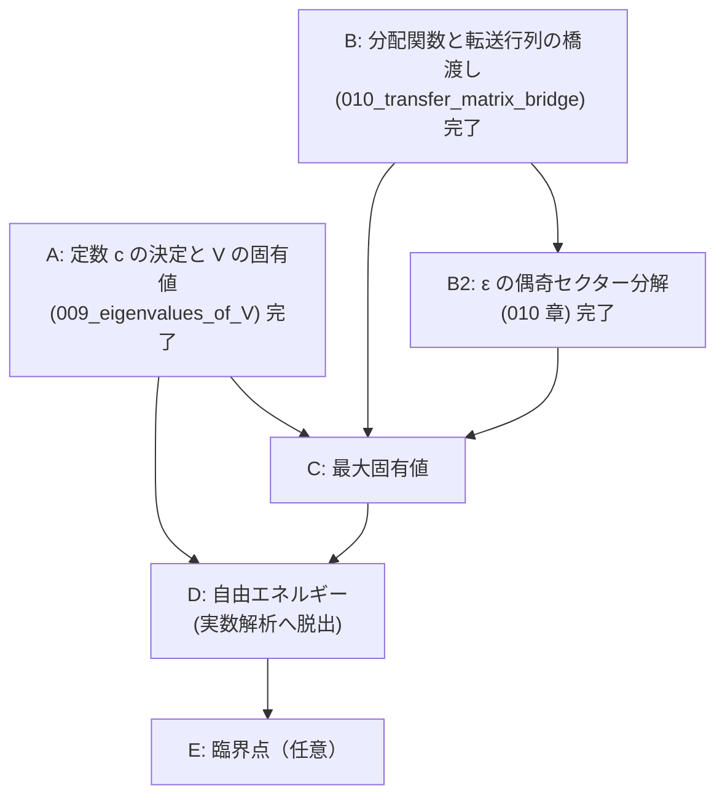

# V = cV' から Onsager の自由エネルギーまで — 章立てと依存順

## 概要

- **スコープ**: free-energy-roadmap
- **タイトル**: 転送行列の定数決定・固有値・分配関数・自由エネルギー・熱力学極限
- **概要**: 本文の証明は `V_eq_Vprime`（$V = cV'$、定数倍を除いて一致）まで到達しているが、
  そこから先——定数 $c$ の決定、$V$ の固有値、分配関数の固有値表式、最大固有値、
  自由エネルギーの閉じた表式、熱力学極限——は本文に**一切存在しない**。
  この文書はその未到達部分を、依存順に並べた章立てとして確定させる。

## 現状の一次情報（着手前に確認した事実）

`structured-latex/content/` を全走査して確認した:

- 「自由エネルギー」「熱力学極限」「free energy」に相当するブロックは content・notes とも **0 件**。
- 到達点は `008_TV1_hatZ_hatY_part2.ts` の `V_eq_Vprime`:
  「ある $c \in \mathbb{C}^\times$ が存在して $V = cV'$」。**$c$ の値は決めていない。**
- `V := (V_1^{(\pm)})^{1/2} V_2 (V_1^{(\pm)})^{1/2}$、
  `V' := exp( Σ_{μ∈{1..M}, γ₂(θ_μ)≠0} γ(θ_μ)(ψ_μ† ψ_{-μ} − 1/2) )`。
- **重大な断絶を発見した**: 001 章の転送行列（`def_transfer_matrix`、成分で定義された
  $V_1,V_2 \in \mathrm{Mat}(2^N,\mathbb{C})$）と、004 章以降の $V_1,V_2 \in \mathrm{Mat}(2,\mathbb{C})^{\otimes M}$
  （$\sigma$ 行列で定義）を**同一視する主張がどこにも無い**。
  `partition_function_via_transfer_matrix`（$Z = \mathrm{tr}((V_1V_2)^M)$）を参照しているブロックは
  content 全体で **0 件**であり、004 章以降は 001 章から切り離された島になっている。
  分配関数へ戻るには、この橋を架けることが必須である。
- **記号の衝突**: 001 章は「$M$ 行 $N$ 列」で $Z=\mathrm{tr}((V_1V_2)^M)$、
  004 章以降は鎖長が $M$（$\mathrm{Mat}(2,\mathbb{C})^{\otimes M}$）。$M$ と $N$ の役割が入れ替わっている。
  橋渡しの章で明示的に対応を取る必要がある。

## 章立て（依存順）

---

### 章 A: 定数 $c$ の決定と $V$ の固有値 ← **本セッションで執筆済み**

ファイル: `structured-latex/content/009_eigenvalues_of_V.ts`

| # | 命題 | ラベル | 状態 |
|---|---|---|---|
| A1 | フェルミオン数演算子 $n_\mu := \psi_\mu^\dagger\psi_{-\mu}$ の定義 | `def_number_operator` | 完了 |
| A2 | $n_\mu^2 = n_\mu$、$\psi_{-\mu}\psi_\mu^\dagger = I - n_\mu$ | `number_operator_idempotent` | 完了 |
| A3 | $\mu \neq \nu$ で $n_\mu n_\nu = n_\nu n_\mu$ | `number_operators_commute` | 完了 |
| A4 | $\mathrm{tr}(n_{\mu_1}\cdots n_{\mu_k}) = 2^{M-k}$（相異なる添字） | `trace_of_number_operator_product` | 完了 |
| A5 | 同時固有空間分解（$2^M$ 個・各 1 次元） | `joint_eigenspace_decomposition` | 完了 |
| A6 | $V'$ の固有値 $\exp(\sum_\mu \gamma(\theta_\mu)(n_\mu - 1/2))$ | `eigenvalues_of_Vprime` | 完了 |
| A7 | $\mathrm{tr}(V') = \mathrm{tr}(V'^{-1}) = \prod_\mu 2\cosh(\gamma(\theta_\mu)/2) > 0$ | `trace_of_Vprime` | 完了 |
| A8 | $iK_1H_1^{(\pm)}$、$iK_2^*H_2$ は実対称 | `iH_is_real_symmetric` | 完了 |
| A9 | $V$ は実対称正定値、ゆえに $\mathrm{tr}(V) > 0$ | `V_is_positive_definite` | 完了 |
| A10 | $U_2 H_1^{(\pm)} U_2^{-1} = -H_1^{(\pm)}$、$U_2 H_2 U_2^{-1} = -H_2$ | `sign_flip_conjugation` | 完了 |
| A11 | $c = (2\sinh 2K_2)^{M/2}$、すなわち $V = (2s_2)^{M/2}V'$ | `constant_c_value` | 完了 |
| A12 | $V$ の固有値 | `eigenvalues_of_V` | 完了 |

**採った証明方針（重要）**: $c$ の決定に行列式（Leibniz 定義・乗法性）を使わずに済ませた。
$\mathrm{tr}(V)/\mathrm{tr}(V^{-1}) = c^2$ と、符号反転共役 $U_2$ による
$\mathrm{tr}(e^{2S}e^{R}) = \mathrm{tr}(e^{-2S}e^{-R})$ から $c^2 = (2s_2)^M$ を出し、
正定値性から $c > 0$ を出して符号を確定する。
行列式経由（$\det V = c^{2^M}\det V'$）でも同じ結果になるが、そちらは
$\det(AB) = \det A \det B$ の証明（置換と符号の一般論）を新たに要するため採らなかった。

### 章 B: 分配関数と転送行列の橋渡し ← **完了**（`structured-latex/content/010_transfer_matrix_bridge.ts`）

**これが無いと、どれだけ固有値を求めても分配関数に戻れない。**

| # | 命題 | ラベル | 状態 |
|---|---|---|---|
| B1 | 記号対応（001 章の `N` = 004 章の `M`、001 章の `M` = `N_row`、`J' = K_1`、`J = K_2`） | 010 章冒頭の remark | 完了 |
| B2 | 配置と標準基底の同一視 `ι` | `def_config_basis_iso` | 完了 |
| B3 | `σ^z_m f_{ι(μ)} = μ(m) f_{ι(μ)}` | `sigma_z_diagonal_action` | 完了 |
| B4 | 対角行列の指数関数 | `exp_of_diagonal_matrix` | 完了 |
| B5 | `V_1` の成分定義とパウリ表示の一致 | `V1_component_equals_pauli` | 完了 |
| B6 | `2×2` の恒等式 `A = (2 sinh 2K_2)^{1/2} exp(K_2^* σ^x)` | `two_by_two_transfer_identity` | 完了 |
| B7 | `V_2` の成分定義とパウリ表示の一致 | `V2_component_equals_pauli` | 完了 |
| B8 | `Z(J,J') = tr((V_1V_2)^{N_row})`（004 章の記号で） | `partition_function_in_pauli_form` | 完了 |

**結合定数の向きの根拠（一次情報）**: 001 章の `V_1` の指数には `J' μ(j)μ(j+1)`、すなわち
**同一の鎖の隣接サイトどうし**の積が現れ、004 章の `V_1 = exp(K_1 Σ σ^z_m σ^z_{m+1})` も同じ。
`V_2` はどちらも隣り合う 2 本の鎖の同じサイトどうしを結ぶ。したがって `K_1 = J'`、`K_2 = J`。
数値でも、`N_row ≠ M` のときに `K_1` と `K_2` を取り違えると `Z` と相対誤差 0.09〜0.44 で
合わないことを確認した（`sagemath/check/043_.../check_04_partition_function.sage`）。

### 章 B2: $\varepsilon$ の偶奇セクター分解 ← **完了**（同じく 010 章）

$V$ は $V_1^{(\pm)}$ を使って定義されており、$V_1^{(\pm)}$ は $\mathcal{F}^{(\pm)}$ 上でのみ $V_1$ と一致する
（`V1_restriction_to_eigenspaces`）。したがって全空間のトレースを $V$ の固有値だけで書くには、
射影子 $P^{(\pm)} := \frac{1}{2}(I \pm \varepsilon)$ による分解が要る。

| # | 命題 | ラベル | 状態 |
|---|---|---|---|
| B2-1 | `P^{(±)} := (I ± ε)/2` の定義 | `def_epsilon_projectors` | 完了 |
| B2-2 | `P^{(±)}` の性質と `im P^{(±)} = F^{(±)}` | `epsilon_projector_properties` | 完了 |
| B2-3 | `ε` が `V_1, V_2, V_1^{(±)}, (V_1^{(±)})^{1/2}` と可換 | `epsilon_commutes_with_transfer_matrices` | 完了 |
| B2-4 | `V_1 P^{(±)} = V_1^{(±)} P^{(±)}` とその冪 | `sector_replacement_of_V1` | 完了 |
| B2-5 | `Z` の偶奇セクター分解（4 項展開も） | `partition_function_sector_decomposition` | 完了 |

**当初 B2-5 に挙げていた「`ε` をフェルミオン数で書く」（`ε = ±Π(I − 2n_μ)` の形）は不要だった。**
射影子 `P^{(±)} = (I ± ε)/2` を使えば、`ε` をフェルミオンで書き直さなくても
`Z = tr(P^{(+)}(V^{(+)})^{N_row}) + tr(P^{(-)}(V^{(-)})^{N_row})` まで到達できる。
ただし章 C で `tr(ε (V^{(±)})^{N_row})` を固有値で評価する段になると `ε` のフェルミオン表示が要る見込みで、
そのときは符号を数値で先に確定させること。

### 章 C: 最大固有値 ← 未着手

| # | 命題 | 内容 |
|---|---|---|
| C1 | $\gamma(\theta_\mu) \geq 0$（`def_gamma_theta_mu` より既知）から、$V$ の固有値の最大は全 $n_\mu = 1$ の配置 |
| C2 | $\Lambda_{\max} = (2s_2)^{M/2}\exp\left(\frac{1}{2}\sum_{\mu=1}^{M}\gamma(\theta_\mu)\right)$ |
| C3 | $\Lambda_{\max}^{N_{\mathrm{row}}} \leq Z \leq 2^M \Lambda_{\max}^{N_{\mathrm{row}}}$（固有値がすべて正であることと、個数が $2^M$ であることから。セクター分解の符号を含めた厳密形は B2 の結果に依存する） |

### 章 D: 自由エネルギーと熱力学極限 ← 未着手。**ここで実数解析へ脱出する**

| # | 命題 | 内容 |
|---|---|---|
| D1 | 自由エネルギーの定義 $f(J,J') := -\lim \frac{1}{M N_{\mathrm{row}}}\log Z$。極限の存在も主張に含める |
| D2 | $N_{\mathrm{row}}\to\infty$: C3 の挟み撃ちから $\frac{1}{M N_{\mathrm{row}}}\log Z \to \frac{1}{M}\log\Lambda_{\max}$。**ここはまだ有限和の評価だけで済む（実数の極限は使うが積分は不要）** |
| D3 | $\gamma(\theta)$ の閉じた表式: $\cosh\gamma(\theta) = \cosh 2K_1\cosh 2K_2^* - \sinh 2K_1 \sinh 2K_2^*\cos\theta$（`def_gamma_theta_mu` + `gamma1_geq_1` から既に得られている。実数値関数として $\theta$ の連続関数であることをここで述べる） |
| D4 | $M\to\infty$: $\frac{1}{M}\sum_{\mu=1}^{M}\gamma(2\pi\mu/M) \to \frac{1}{2\pi}\int_0^{2\pi}\gamma(\theta)\,d\theta$。**★ 実数解析への脱出点。ここで初めて Riemann 積分と連続関数の一様連続性を使う。本文にその旨を明示する** |
| D5 | Onsager の自由エネルギー: $-f = \frac{1}{2}\log(2\sinh 2K_2) + \frac{1}{4\pi}\int_0^{2\pi}\gamma(\theta)\,d\theta$ |
| D6 | 二重積分表示（任意）: $\gamma(\theta)$ の積分表示を経由した Onsager の対称な二重積分形 |

### 章 E: 臨界点（任意） ← 未着手

`critical_condition_c1_eq_s1_c2` は既に $\sinh 2K_1\sinh 2K_2 = 1$ と $\gamma_2$ の零点の対応を確立している。
自由エネルギーの $K$ 依存性の特異性（比熱の対数発散）をここで扱える。README 5 節の「読み物」素材でもある。

---

## 未着手部分の前提として不足しているもの（新たに要る道具）

| 道具 | 要否 | 現状 |
|---|---|---|
| トレースの線型性・巡回性 | **必須**（章 A で使用） | 本文に定義ブロックが無い。章 A で `def_trace` として新規に定義した |
| 行列式の定義と乗法性 | **回避した** | 章 A では使わない方針を採ったため不要。将来必要になれば独立の章として立てる（既存の `det_A_theta` が $2\times2$ で $\det$ を無定義に使っているのは別途の課題） |
| 実対称行列の正定値性 | **必須**（章 A で使用） | 章 A で定義から書き下した |
| 有限次元の同時固有空間分解 | **必須**（章 A で使用） | 章 A で冪等元の直和分解として初等的に書き下した |
| Riemann 和と積分 | 章 D で必須 | 未整備。**実数解析への脱出点なので、そこで定義を導入し脱出を明示する** |
| 対数関数の連続性・単調性 | 章 D で必須 | 未整備 |

## 作業順の推奨

- 章 A（009 章）・章 B・章 B2（010 章）は**完了**。分配関数から固有値までの経路はつながった。
- **次は章 C（最大固有値）。** `partition_function_sector_decomposition` の右辺へ
  `eigenvalues_of_V` の $\Lambda_\epsilon$ を代入するところから始める。
  `tr(\varepsilon (V^{(\pm)})^{N_{\mathrm{row}}})` の項を固有値で評価する段で
  $\varepsilon$ のフェルミオン表示（$\varepsilon = \pm\prod_\mu(I - 2n_\mu)$ の形）が要る見込みなので、
  **符号と有効な $\mu$ の範囲を数値で先に確定させてから**書くこと。
- そのあと章 D。実数解析の導入を伴うので、README 2 節の「脱出点の明示」を必ず守る。
