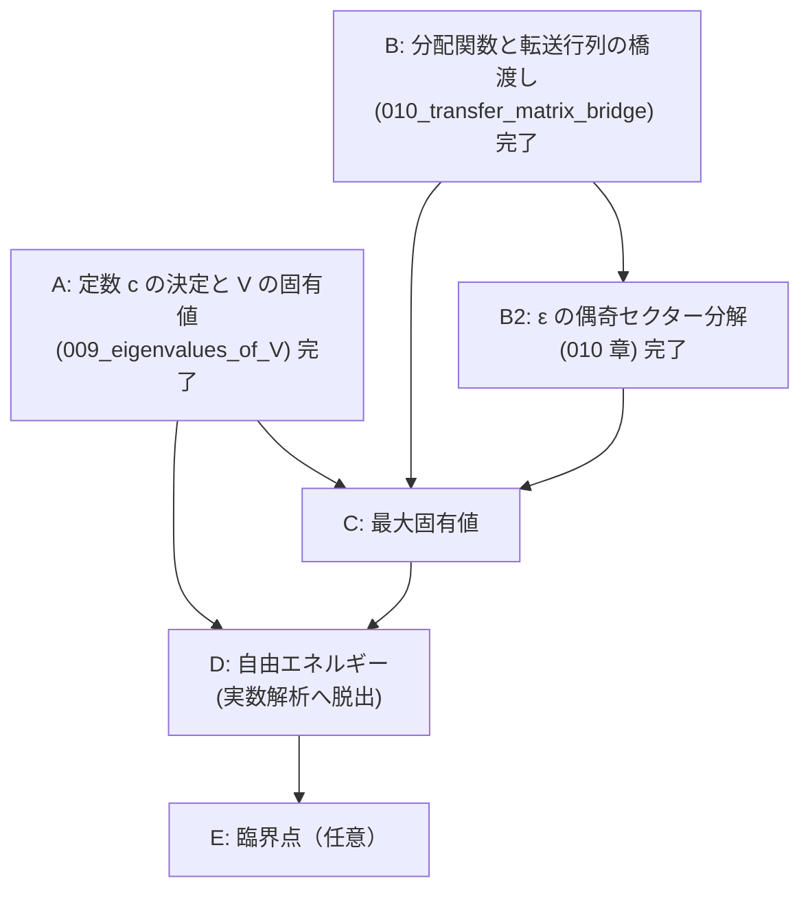

# V = cV' から Onsager の自由エネルギーまで — 章立てと依存順

## 概要

- **スコープ**: free-energy-roadmap
- **タイトル**: 転送行列の定数決定・固有値・分配関数・自由エネルギー・熱力学極限
- **概要**: 本文の証明は `V_eq_Vprime`（$V = cV'$、定数倍を除いて一致）まで到達しているが、
  そこから先——定数 $c$ の決定、$V$ の固有値、分配関数の固有値表式、最大固有値、
  自由エネルギーの閉じた表式、熱力学極限——は本文に**一切存在しない**。
  この文書はその未到達部分を、依存順に並べた章立てとして確定させる。

## 現状の一次情報（着手前に確認した事実）

`structured-latex/content/` を全走査して確認した:

- 「自由エネルギー」「熱力学極限」「free energy」に相当するブロックは content・notes とも **0 件**。
- 到達点は `008_TV1_hatZ_hatY_part2.ts` の `V_eq_Vprime`:
  「ある $c \in \mathbb{C}^\times$ が存在して $V = cV'$」。**$c$ の値は決めていない。**
- `V := (V_1^{(\pm)})^{1/2} V_2 (V_1^{(\pm)})^{1/2}$、
  `V' := exp( Σ_{μ∈{1..M}, γ₂(θ_μ)≠0} γ(θ_μ)(ψ_μ† ψ_{-μ} − 1/2) )`。
- **重大な断絶を発見した**: 001 章の転送行列（`def_transfer_matrix`、成分で定義された
  $V_1,V_2 \in \mathrm{Mat}(2^N,\mathbb{C})$）と、004 章以降の $V_1,V_2 \in \mathrm{Mat}(2,\mathbb{C})^{\otimes M}$
  （$\sigma$ 行列で定義）を**同一視する主張がどこにも無い**。
  `partition_function_via_transfer_matrix`（$Z = \mathrm{tr}((V_1V_2)^M)$）を参照しているブロックは
  content 全体で **0 件**であり、004 章以降は 001 章から切り離された島になっている。
  分配関数へ戻るには、この橋を架けることが必須である。
- **記号の衝突**: 001 章は「$M$ 行 $N$ 列」で $Z=\mathrm{tr}((V_1V_2)^M)$、
  004 章以降は鎖長が $M$（$\mathrm{Mat}(2,\mathbb{C})^{\otimes M}$）。$M$ と $N$ の役割が入れ替わっている。
  橋渡しの章で明示的に対応を取る必要がある。

## 章立て（依存順）

---

### 章 A: 定数 $c$ の決定と $V$ の固有値 ← **本セッションで執筆済み**

ファイル: `structured-latex/content/009_eigenvalues_of_V.ts`

| # | 命題 | ラベル | 状態 |
|---|---|---|---|
| A1 | フェルミオン数演算子 $n_\mu := \psi_\mu^\dagger\psi_{-\mu}$ の定義 | `def_number_operator` | 完了 |
| A2 | $n_\mu^2 = n_\mu$、$\psi_{-\mu}\psi_\mu^\dagger = I - n_\mu$ | `number_operator_idempotent` | 完了 |
| A3 | $\mu \neq \nu$ で $n_\mu n_\nu = n_\nu n_\mu$ | `number_operators_commute` | 完了 |
| A4 | $\mathrm{tr}(n_{\mu_1}\cdots n_{\mu_k}) = 2^{M-k}$（相異なる添字） | `trace_of_number_operator_product` | 完了 |
| A5 | 同時固有空間分解（$2^M$ 個・各 1 次元） | `joint_eigenspace_decomposition` | 完了 |
| A6 | $V'$ の固有値 $\exp(\sum_\mu \gamma(\theta_\mu)(n_\mu - 1/2))$ | `eigenvalues_of_Vprime` | 完了 |
| A7 | $\mathrm{tr}(V') = \mathrm{tr}(V'^{-1}) = \prod_\mu 2\cosh(\gamma(\theta_\mu)/2) > 0$ | `trace_of_Vprime` | 完了 |
| A8 | $iK_1H_1^{(\pm)}$、$iK_2^*H_2$ は実対称 | `iH_is_real_symmetric` | 完了 |
| A9 | $V$ は実対称正定値、ゆえに $\mathrm{tr}(V) > 0$ | `V_is_positive_definite` | 完了 |
| A10 | $U_2 H_1^{(\pm)} U_2^{-1} = -H_1^{(\pm)}$、$U_2 H_2 U_2^{-1} = -H_2$ | `sign_flip_conjugation` | 完了 |
| A11 | $c = (2\sinh 2K_2)^{M/2}$、すなわち $V = (2s_2)^{M/2}V'$ | `constant_c_value` | 完了 |
| A12 | $V$ の固有値 | `eigenvalues_of_V` | 完了 |

**採った証明方針（重要）**: $c$ の決定に行列式（Leibniz 定義・乗法性）を使わずに済ませた。
$\mathrm{tr}(V)/\mathrm{tr}(V^{-1}) = c^2$ と、符号反転共役 $U_2$ による
$\mathrm{tr}(e^{2S}e^{R}) = \mathrm{tr}(e^{-2S}e^{-R})$ から $c^2 = (2s_2)^M$ を出し、
正定値性から $c > 0$ を出して符号を確定する。
行列式経由（$\det V = c^{2^M}\det V'$）でも同じ結果になるが、そちらは
$\det(AB) = \det A \det B$ の証明（置換と符号の一般論）を新たに要するため採らなかった。

### 章 B: 分配関数と転送行列の橋渡し ← **完了**（`structured-latex/content/010_transfer_matrix_bridge.ts`）

**これが無いと、どれだけ固有値を求めても分配関数に戻れない。**

| # | 命題 | ラベル | 状態 |
|---|---|---|---|
| B1 | 記号対応（001 章の `N` = 004 章の `M`、001 章の `M` = `N_row`、`J' = K_1`、`J = K_2`） | 010 章冒頭の remark | 完了 |
| B2 | 配置と標準基底の同一視 `ι` | `def_config_basis_iso` | 完了 |
| B3 | `σ^z_m f_{ι(μ)} = μ(m) f_{ι(μ)}` | `sigma_z_diagonal_action` | 完了 |
| B4 | 対角行列の指数関数 | `exp_of_diagonal_matrix` | 完了 |
| B5 | `V_1` の成分定義とパウリ表示の一致 | `V1_component_equals_pauli` | 完了 |
| B6 | `2×2` の恒等式 `A = (2 sinh 2K_2)^{1/2} exp(K_2^* σ^x)` | `two_by_two_transfer_identity` | 完了 |
| B7 | `V_2` の成分定義とパウリ表示の一致 | `V2_component_equals_pauli` | 完了 |
| B8 | `Z(J,J') = tr((V_1V_2)^{N_row})`（004 章の記号で） | `partition_function_in_pauli_form` | 完了 |

**結合定数の向きの根拠（一次情報）**: 001 章の `V_1` の指数には `J' μ(j)μ(j+1)`、すなわち
**同一の鎖の隣接サイトどうし**の積が現れ、004 章の `V_1 = exp(K_1 Σ σ^z_m σ^z_{m+1})` も同じ。
`V_2` はどちらも隣り合う 2 本の鎖の同じサイトどうしを結ぶ。したがって `K_1 = J'`、`K_2 = J`。
数値でも、`N_row ≠ M` のときに `K_1` と `K_2` を取り違えると `Z` と相対誤差 0.09〜0.44 で
合わないことを確認した（`sagemath/check/043_.../check_04_partition_function.sage`）。

### 章 B2: $\varepsilon$ の偶奇セクター分解 ← **完了**（同じく 010 章）

$V$ は $V_1^{(\pm)}$ を使って定義されており、$V_1^{(\pm)}$ は $\mathcal{F}^{(\pm)}$ 上でのみ $V_1$ と一致する
（`V1_restriction_to_eigenspaces`）。したがって全空間のトレースを $V$ の固有値だけで書くには、
射影子 $P^{(\pm)} := \frac{1}{2}(I \pm \varepsilon)$ による分解が要る。

| # | 命題 | ラベル | 状態 |
|---|---|---|---|
| B2-1 | `P^{(±)} := (I ± ε)/2` の定義 | `def_epsilon_projectors` | 完了 |
| B2-2 | `P^{(±)}` の性質と `im P^{(±)} = F^{(±)}` | `epsilon_projector_properties` | 完了 |
| B2-3 | `ε` が `V_1, V_2, V_1^{(±)}, (V_1^{(±)})^{1/2}` と可換 | `epsilon_commutes_with_transfer_matrices` | 完了 |
| B2-4 | `V_1 P^{(±)} = V_1^{(±)} P^{(±)}` とその冪 | `sector_replacement_of_V1` | 完了 |
| B2-5 | `Z` の偶奇セクター分解（4 項展開も） | `partition_function_sector_decomposition` | 完了 |

**当初 B2-5 に挙げていた「`ε` をフェルミオン数で書く」（`ε = ±Π(I − 2n_μ)` の形）は不要だった。**
射影子 `P^{(±)} = (I ± ε)/2` を使えば、`ε` をフェルミオンで書き直さなくても
`Z = tr(P^{(+)}(V^{(+)})^{N_row}) + tr(P^{(-)}(V^{(-)})^{N_row})` まで到達できる。
ただし章 C で `tr(ε (V^{(±)})^{N_row})` を固有値で評価する段になると `ε` のフェルミオン表示が要る見込みで、
そのときは符号を数値で先に確定させること。

### 章 C: 最大固有値 ← **完了**（`structured-latex/content/011_max_eigenvalue.ts`）

| # | 命題 | ラベル | 状態 |
|---|---|---|---|
| C1 | 対称化転送行列 `W = V_1^{1/2} V_2 V_1^{1/2}` | `def_symmetrized_transfer_matrix` | 完了 |
| C2 | `Z = tr(W^{N_row})` | `Z_equals_trace_of_W` | 完了 |
| C3 | `W` は実対称正定値 | `W_is_real_symmetric_positive_definite` | 完了 |
| C4 | `W` の成分はすべて正 | `W_has_positive_entries` | 完了 |
| C5 | 半正定値形式の Cauchy–Schwarz | `psd_cauchy_schwarz` | 完了 |
| C6 | `c(M) := sup_{‖x‖=1} x^T W x` | `def_rayleigh_sup` | 完了 |
| C7 | `‖Wx‖ ≤ c(M)‖x‖` | `rayleigh_bounds_operator_norm` | 完了 |
| C8 | `c^n ≤ tr(W^n) ≤ 2^M c^n` | `trace_power_sandwich` | 完了 |
| C9 | `c(M)^{N_row} ≤ Z ≤ 2^M c(M)^{N_row}` | `partition_function_sandwich` | 完了 |
| C10 | `c(M) = max(c_+, c_-)`、`W P^{(±)} = V^{(±)} P^{(±)}` | `sector_decomposition_of_rayleigh_sup` | 完了 |

**採った方針（重要）**: **スペクトル定理（実対称行列の対角化可能性）を使わずに**挟み撃ちを出した。
`c(M)` は最大固有値ではなく Rayleigh 商の**上限**として定義し、
上からの評価は `psd_cauchy_schwarz` から出る `‖Wx‖ ≤ c‖x‖`、
下からの評価はモーメント列 `m_k = x^T W^k x` の対数凸性による。
対角化可能性は正しいが本文にまだ無く、挟み撃ちには不要だったため導入しなかった。

### 章 D: 自由エネルギーと熱力学極限 ← **完了**（`structured-latex/content/012_free_energy.ts`）。**実数解析への脱出はここだけ**

| # | 命題 | ラベル | 状態 |
|---|---|---|---|
| D1 | 実数解析へ移行するのはこの章のこの箇所だけ、という宣言と使う外部事実 (R1)(R2) | `remark_real_analysis_escape_point` | 完了 |
| D2 | `γ_1(θ) ≥ cosh(2K_1 − 2K_2^*) ≥ 1`（**すべての実数 θ**） | `gamma1_lower_bound_all_theta` | 完了 |
| D3 | `γ` は `R` 上連続・周期 `2π`（★移行に実際に使う条件） | `gamma_is_continuous` | 完了 |
| D4 | `(1/(M N_row)) log Z → (1/M) log c(M)`（誤差 `≤ log2/N_row`） | `limit_of_log_Z_in_N_row` | 完了 |
| D5 | **★実数解析への移行点**: `(1/M) Σ g(2π(μ−δ)/M) → (1/2π)∫g`、誤差 `≤ ω(2π/M)` | `riemann_sum_to_integral` | 完了 |
| D6 | Onsager の表式（`δ` に依らない） | `onsager_free_energy_expression` | 完了 |
| D7 | 残っている入力の明示 | `remark_remaining_input_even_sector` | 完了 |

**移行点で持ち込んだ外部事実は 2 つだけ**: (R1) Heine–Cantor（有界閉区間上の連続関数は一様連続）、
(R2) 連続関数の Riemann 可積分性（区間加法性・`|∫h| ≤ |I| sup|h|`・定数の積分）。
`δ ∈ [0,1)` を許す形にしたので、整数運動量（`δ=0`）と半整数運動量（`δ=1/2`）を 1 つの主張で扱える。
**どちらでも極限が同じ**であることが、熱力学極限でセクターの区別が消える理由である。

### 章 C′: 偶セクターの固有値（半整数運動量） ← **土台のみ完了**（`structured-latex/content/013_even_sector_modes.ts`）。厳密解へ残っている唯一の入力

章 C・章 D により、分配関数から自由エネルギーまでの経路で**残っているのは 1 点だけ**である：

> `c_+(M)`（`ε` の固有値 `+1` のセクターでの Rayleigh 上限）が `Λ^{(1/2)}_M` に等しいこと。
> すなわち `V^{(+)}` の固有値が**半整数運動量** `2π(μ−1/2)/M` で与えられること。

**本文に無い理由（一次情報で特定済み）**: `def_hatZ_hatY` の `hatZ_μ^{(±)}` は第 1 項に符号 `∓` を持つ。
`commutator_of_H_and_Z_Y` の (C) `[H_2, hatZ_μ^{(-)}] = −2 hatY_μ` は `[H_2, Z_j] = −2Y_j` を
各項に適用して係数を比べる形で示されるが、`hatZ_μ^{(+)}` では第 1 項だけ符号が反転しているため
右辺が `−2 hatY_μ` にならない。したがって 008 章以降は `(−)` セクター専用である。
数値でも `(−)` 側は残差 1e-15、`(+)` 側は残差 1e-3 以上で不成立（`045_.../check_03`）。

#### 完了した部分（013 章、8 ブロック）

| # | 命題 | ラベル | 状態 |
|---|---|---|---|
| C′-1 | 008 章が `(−)` 専用である理由を等式で確定：`[H_2, hatZ^{(+)}_μ] = −2 hatY_μ + 4e^{−iθ_μ}Y_1 ≠ −2 hatY_μ` | `why_008_applies_only_to_minus_sector` | 完了 |
| C′-2 | 半整数運動量の指数和 `Σ_μ e^{ikθ~_μ} = M(−1)^l`（`k=lM`）/ `0` | `antiperiodic_exp_sum` | 完了 |
| C′-3 | `checkZ_μ, checkY_μ` の定義、反周期性 `e^{−iMθ~_μ} = −1`、添字周期性、共役添字 `1−μ` | `def_half_integer_modes` | 完了 |
| C′-4 | (A)〜(D)：`H_1^{(+)}, H_2` との交換関係が 008 章と**同じ形**で閉じる | `commutator_of_H_and_check_Z_Y` | 完了 |
| C′-5 | 反交換関係（対は `μ+ν ≡ 1 (mod M)`） | `anticommutator_of_check_Z_Y` | 完了 |
| C′-6 | 復元公式 `Z_j = (1/M)Σ_μ checkZ_μ e^{ijθ~_μ}` と生成性 | `recover_Z_Y_from_check_Z_Y` | 完了 |
| C′-7 | `H_1^{(+)}, H_2` を `checkZ, checkY` で表す | `H1_H2_via_check_Z_Y` | 完了 |

数値検証は `sagemath/check/046_claim_even_sector_modes/`（3 チェック、全 PASS、`M = 2,3,4,5`）。

**仕組みは 1 つの等式に集約される**: `e^{−iMθ~_μ} = −1`（反周期性）。
`hatZ^{(±)}` が境界の符号を第 1 項に置いていたのに対し、`checkZ` では位相が `j = M` から `j = 0` へ
回るときに自動的に符号を出す。整数運動量では `e^{−iMθ_μ} = +1` なので同じ計算が閉じない。

#### 残っている部分（未着手）

C′-4〜C′-7 は 004 章・006 章・007 章・008 章冒頭に対応する部分である。ここから
`V^{(+)}` の固有値までは、**008 章後半と 009 章と同じ道筋**を半整数運動量で辿る必要がある。

| # | 対応する既存ブロック | 内容 |
|---|---|---|
| C′-8 | `nesting_of_commutator_of_H_and_Z` | (A)〜(D) の n 重交換子 |
| C′-9 | `cosh_sinh_coefficient_conversion` / `extract_taylor_coefficient_of_Z_Y` | 生成子のスケールとテイラー係数の抽出 |
| C′-10 | `ホロノミック量子場_p142下段_1` / `calc_of_TxT_hatZxhatY` | `T_{(V_1^{(+)})^{1/2}}, T_{V_2}` の作用と `B_1(θ~), B_2` |
| C′-11 | `T_V_hatZ_hatY` / `factorization_of_A_theta` | `B_1B_2B_1 = A(θ~)`。**これは θ についての 2×2 の恒等式なので既存ブロックをそのまま使える見込み** |
| C′-12 | `eigenvector_of_A_theta` / `diagonalization_P_D` / `det_A_theta` / `gamma1_geq_1` / `lambda_eq_exp_gamma` | `A(θ~)` の対角化。**これらも θ の関数についての主張なので再利用できる見込み**（ただし θ~ での `γ_2 ≠ 0` の確認が要る。下記） |
| C′-13 | `def_fermi` / `anticommutator_of_psi` | 半整数運動量のフェルミオン `checkψ_μ`。対は `μ+ν ≡ 1` |
| C′-14 | `commutation_V_psi` / `action_of_T_Vprime_on_psi` / `T_V_eq_T_Vprime` / `V_eq_Vprime` | `V^{(+)} = c checkV'` |
| C′-15 | 009 章全体 | 数演算子・同時固有空間分解・`c = (2 sinh 2K_2)^{M/2}`・固有値 |

**簡単になる点（見込み）**: 半整数運動量では `γ_2(θ~_μ) ≠ 0` が**常に**成り立つ。
実際 `γ_2(θ) = 0` は `sin θ = 0` かつ `c_1 cos θ = s_1 c_2` を要するが、
`sin θ~_μ = 0` は `(2μ−1)/M ∈ Z` すなわち `θ~_μ = π`（`M` 奇数）の場合しかなく、
そのとき `cos θ~_μ = −1` で `−c_1 = s_1c_2 > 0` となり不可能である。
したがって 008 章・009 章にあった臨界点の例外処理（`μ = M` の除外、`m = M−1`）が
偶セクターでは**不要**になる。

#### 接続（C′ が済んだあと）

`c_+(M) = Λ^{(1/2)}_M` が確定すれば、`sector_decomposition_of_rayleigh_sup` の
`c(M) = max(c_+, c_-)` と `onsager_free_energy_expression` の
「極限が `δ` に依らない」を合わせて、`(1/M) log c(M)` の極限が Onsager の式に一致する
（`c_-` 側も同じ極限をもつので `max` を取っても変わらない）。これで
`remark_remaining_input_even_sector` が解消され、厳密解が本文で閉じる。

### 章 E: 臨界点（任意） ← 未着手

`critical_condition_c1_eq_s1_c2` は既に $\sinh 2K_1\sinh 2K_2 = 1$ と $\gamma_2$ の零点の対応を確立している。
自由エネルギーの $K$ 依存性の特異性（比熱の対数発散）をここで扱える。README 5 節の「読み物」素材でもある。

---

## 未着手部分の前提として不足しているもの（新たに要る道具）

| 道具 | 要否 | 現状 |
|---|---|---|
| トレースの線型性・巡回性 | **必須**（章 A で使用） | 本文に定義ブロックが無い。章 A で `def_trace` として新規に定義した |
| 行列式の定義と乗法性 | **回避した** | 章 A では使わない方針を採ったため不要。将来必要になれば独立の章として立てる（既存の `det_A_theta` が $2\times2$ で $\det$ を無定義に使っているのは別途の課題） |
| 実対称行列の正定値性 | **必須**（章 A で使用） | 章 A で定義から書き下した |
| 有限次元の同時固有空間分解 | **必須**（章 A で使用） | 章 A で冪等元の直和分解として初等的に書き下した |
| Riemann 和と積分 | 章 D で必須 | 未整備。**実数解析への脱出点なので、そこで定義を導入し脱出を明示する** |
| 対数関数の連続性・単調性 | 章 D で必須 | 未整備 |

## 作業順の推奨

- 章 A（009 章）・章 B・章 B2（010 章）・章 C（011 章）・章 D（012 章）は**完了**。
  章 C′ は**土台（013 章、C′-1〜C′-7）まで完了**。
- **次は章 C′ の C′-8 以降。** (A)〜(D) と反交換関係は 013 章で証明済みなので、
  008 章後半・009 章と同じ順序で辿れる。C′-11・C′-12 は既存ブロックの再利用が効く見込み。
- 章 C′ が済めば `c_+(M) = Λ^{(1/2)}_M` が確定し、章 C・章 D と合わせて
  Onsager の自由エネルギーが本文で閉じる。
- 章 E（臨界点）はそのあと。
