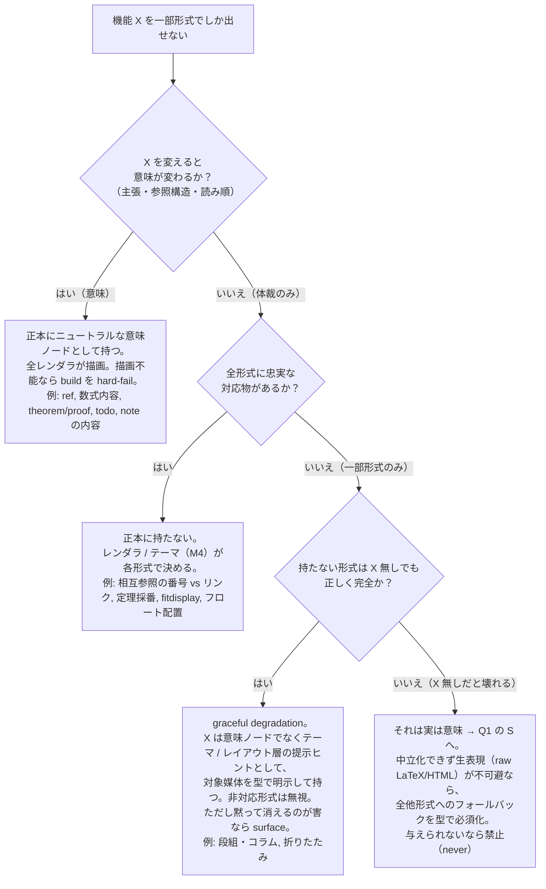
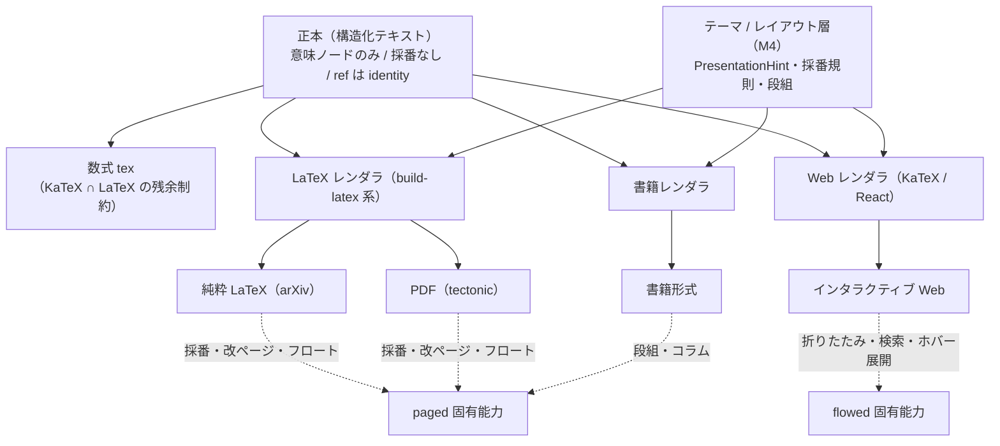

# 出力形式ごとの表現能力と、正本をどこへ寄せるか

## この文書が確定させること

構造化テキスト（正本）から 4 つの出力形式を生成するとき、**形式ごとに表現できることが違う**。
LaTeX にできて Web にできないこと（採番・改ページ）と、その逆（折りたたみ・ホバー展開）がある。
このとき正本の表現をどちらへ寄せるのかを、根拠つきで確定する。

結論を先に述べる:

- **正本は特定の出力形式に寄せない。意味（semantics）だけを持ち、体裁（presentation）は各レンダラが決める。**
  この原則は、先行 2 実装の入力モデルが実際にそう作られていることで裏づけられる（後述 §2）。
- ただし**中立化しきれない残余が 1 つある**: 数式は LaTeX 方言の文字列であり、
  正本は「KaTeX がサポートする LaTeX 数式の部分集合」に閉じるという制約を負う（§3）。
- ある形式でしか表現できないものを正本が持ちたくなったときは、**捨てる／劣化させる／専用表現として持つ**を
  判定手順で機械的に決める（§4）。silent drop は常に禁止（`docs/error-handling-strategy.md` の
  「サイレントキャッチは禁止」）。
- 判定の一部は TypeScript の型（判別共用体・`never`・網羅マップ）で強制できる（§5）。

## 0. 前提と一次情報

正本のモデルは新規に発明しない。先行 2 実装の入力契約を一般化する（`structured-latex-renderer/README.md`
「関連する既存実装」、`docs/milestones.md` M2）。一次情報は次のとおり。

- 正本のスキーマ（意味ノードの閉じた集合）:
  `exact-solution-of-2d-ising-model/structured-latex/schema.ts`、
  `integrable-lattice/structured-latex/schema.ts`、
  `realtime-web-preview/domain-model/src/block.ts`。
- LaTeX / PDF レンダラの実装（体裁がどこで決まるか）:
  `exact-solution-of-2d-ising-model/structured-latex/tools/build-latex.ts`。
- Web レンダラの実装:
  `realtime-web-preview/frontend/src/pages/document-view/ui/nodes.tsx`、`.../ref-resolver.ts`、
  ノート配置 `realtime-web-preview/domain-model/src/block.ts` の `placeNotes`。
- Web 要件: `realtime-web-preview/docs/requirements.md`。

**媒体は 2 種類に分かれる**。この軸が能力差の大半を説明する。

- **ページ組媒体（paged）**: 純粋 LaTeX / PDF / 書籍形式。ページ・改ページ・フロート・段組・自動採番を持つ。
  純粋 LaTeX（arXiv 投稿用 .tex）と PDF は同一の LaTeX 能力プロファイルで、違いは「.tex を渡すか、
  ローカルで tectonic まで回すか」という配送のみ（`build-latex.ts` は `--pdf` の有無で同じ .tex から分岐する）。
- **フロー媒体（flowed）**: インタラクティブ Web。単一の連続フローで、ページの概念を持たない
  （`nodes.tsx` はブロックを連続描画し、`requirements.md` §10 は「連番順の単一ページ」）。

## 1. 出力形式ごとの能力対照表

| 対象 | 純粋 LaTeX | PDF | インタラクティブ Web | 書籍形式 |
|---|---|---|---|---|
| **数式** | 完全な LaTeX 数式（arXiv のコンパイラが処理） | 同左（tectonic が処理） | **KaTeX がサポートする部分集合のみ**（`nodes.tsx` の `katex.renderToString`） | LaTeX と同じ |
| 数式の版面調整 | `\fitdisplay` で幅超過を自動縮小（`build-latex.ts` 冒頭・プリアンブル） | 同左 | 無し（フローなので不要。横スクロール等は CSS 側） | 段幅に対して同種の調整が要る |
| `\tag` 付き数式 | `\fitdisplay` の箱に入れられず素の `equation*` で組む特例（`build-latex.ts` `renderDisplayMath`） | 同左 | KaTeX が `\tag` を描画 | LaTeX と同じ |
| **相互参照** | `\cref{lab:...}` で**自動採番**した番号（「定義 3.2」等）(`build-latex.ts`) | 同左 | **番号を持てない**。id アンカーへの**ハイパーリンク**（`ref-resolver.ts` / `nodes.tsx` の `RefLink`）。表示文字は `label ?? target` | 番号（ページ番号併記も可） |
| 参照の表示テキスト上書き | `ref` の任意 `label` があれば `\hyperref` で採番せずリンク（`build-latex.ts`） | 同左 | `label ?? target` を表示 | LaTeX と同じ |
| 参照のホバー展開 | 不可（静的紙面） | 不可 | 可能（フロー媒体の対話性。現状 `RefLink` は未実装だが媒体としては可能） | 不可 |
| **定理環境の採番** | amsthm の共有カウンタで章内通し番号（`build-latex.ts` プリアンブル `\newtheorem{...}[definition]`） | 同左 | **自動採番なし**。`kind` の見出し語のみ表示（`requirements.md` F-3、`nodes.tsx`） | LaTeX と同じ |
| **ページ / 改ページ / フロート** | あり（`\clearpage`、float 配置、`build-latex.ts` は overfull hbox を検査） | あり | **無し**（連続フロー） | あり |
| **段組・コラム** | 可能（LaTeX の multicol 等） | 可能 | 段組は本質でない（レスポンシブ 1 カラム、`requirements.md` F-8） | **本命**（README「段組・コラムを差し挟む」、M8） |
| **折りたたみ / 展開・検索・ハイライト** | 不可（静的） | 不可（PDF ビューア依存で正本の関与外） | **可能**（対話性はフロー媒体の固有能力） | 不可 |
| **ノート（`notes/`）** | **出版物に混入させない**。`build-latex.ts` は `notes/` を読まない（`verify-no-notes-in-output.ts` が機械検査） | 同左 | **本文と視覚的に区別して表示**（`requirements.md` F-4、`placeNotes` で target ラベル→ブロックへ配置、孤児は surface） | LaTeX と同じ（読み物の解説素材として使うかは書籍レンダラの判断） |
| **TODO ノード** | 目立つ未完マーカー `\textbf{[TODO]}`（`build-latex.ts`、出版物にも出る） | 同左 | 強調バッジ（`nodes.tsx`、`requirements.md` F-12） | LaTeX と同じ |
| **図表** | **現状どのスキーマにも図表ノードが無い**（`schema.ts` の `NODE_TYPES` は paragraph/math/displayMath/list/ref/text/todo のみ。`build-latex.ts` は `graphicx` を読むが使うノードが無い）。未モデル化 | 同左 | 同左（未モデル化） | 同左 |
| **未解決参照** | ビルドを **hard-fail**（`build-latex.ts` は未解決 `\cref` を検出して生成中止） | tectonic ログの undefined reference を検出して失敗 | 赤字・点線下線で**可視化して継続**（`RefLink`、`requirements.md` F-9 画面を落とさない） | LaTeX と同じ |
| **組めない文字** | — | フォント欠落文字は**無言で消える**ため 1 件でも hard-fail（`build-latex.ts` Missing character 検査） | ブラウザフォントで描画（該当検査は不要） | PDF と同じ |

読み取れる非対称性:

- **paged にできて flowed にできないこと**: 自動採番、ページ・改ページ・フロート、段組・コラム。
- **flowed にできて paged にできないこと**: 折りたたみ／展開、検索、ハイライト、参照のホバー展開などの対話性。
- **どちらでも表現でき、見せ方だけ違うもの**: 相互参照（番号 vs リンク）、定理の見出し、TODO の見た目。
- **正本にあるが出力ごとに載せる／載せないが分かれるもの**: ノート（出版物では除外、Web では表示）。

## 2. 原則: 正本は意味だけを持ち、体裁はレンダラが決める

この原則が**すでに先行実装で成立している**ことを一次情報で示す。

- 正本の意味ノードは、体裁概念を 1 つも含まない閉じた集合である。
  `schema.ts` の `NODE_TYPES = { paragraph, math, displayMath, list, ref, text, todo }` には
  page・column・float・番号・折りたたみといった**出力形式固有の語彙が存在しない**。
  「そういうノードが型に無い」こと自体が、体裁を正本へ持ち込ませない仕組みになっている。
- 採番は正本に無い。`sourceOrdinal` は「ソース内の通し番号であって**文書順ではない**」（`schema.ts` コメント）。
  文書に出る「定義 3.2」の番号は `build-latex.ts` の amsthm が生成し、Web は採番しない。
  → **番号は presentation であり、各レンダラが決める**。正本は identity（ラベル）だけを持つ。
- 相互参照も同型。正本の `ref` は `target`（ラベル＝identity）だけを持ち、
  paged は番号、flowed はハイパーリンクに写す。表示文字の上書きが要るときだけ任意 `label` を足す。
- 版面調整（`\fitdisplay`、`\tag` の特例）は **`build-latex.ts` 側のプリアンブルと分岐**にあり、
  正本の `tex` 文字列には無い。数式の縮小は LaTeX レンダラの責務。

したがって「正本＝意味、体裁＝レンダラ」は**残余 1 点を除いて成立する**。

### 成立しない残余: 数式は LaTeX 方言である

数式ノードの `tex` は LaTeX 文字列であり、中立表現ではない。しかもこの同じ文字列を
**paged（フル LaTeX）と flowed（KaTeX）の両方がそのまま消費する**
（`build-latex.ts` は `$...$` / `\fitdisplay{tex}`、`nodes.tsx` は `katex.renderToString(tex)`）。
`build-latex.ts` のコメントは正本を「KaTeX 向けの LaTeX 文字列」と明記している。

**帰結**: 正本の数式は、フル LaTeX の全機能ではなく **「KaTeX がサポートする LaTeX 数式 ∩ LaTeX」** の部分集合に閉じる。
これは中立化できない制約であり、正本を Web に「寄せている」唯一の箇所である。理由は非対称性にある
— KaTeX の対応構文はフル LaTeX の部分集合なので、交差＝ KaTeX 側に律速される。
`\fitdisplay` のような**組版マクロは `tex` の外側**（レンダラのプリアンブル）に置くことで、この制約を数式内容だけに限定する。

## 3. 規約: 一形式でしか表現できないものの扱い

ある機能 X を「一部の形式でしか表現できない」とき、**捨てる / 劣化させる / 専用表現として正本に持つ**の
どれを選ぶかを、次の判定手順で決める。曖昧な語感ではなく、各分岐が一次情報の既存挙動に対応する。



判定基準の言語化（すべて decidable）:

1. **意味か体裁か（Q1）**: X を変えたとき、文書の**数学的主張・参照構造・読み順**が変わるなら意味、
   見た目の配置だけが変わるなら体裁。判定材料は正本の値だけで足りる。
2. **対応物の有無（Q2）**: 各媒体の自然な形へ写せるか。相互参照は paged=番号 / flowed=リンクと
   両媒体に写せる（`build-latex.ts` と `ref-resolver.ts` が現に両方を実装）→ 対応物あり。
3. **欠落しても完全か（Q3）**: X を出せない形式で、意味の欠落なく読めるか。段組・コラムは
   Web で 1 カラムに落ちても証明の意味は完全 → degrade 可。折りたたみは paged で常時展開でも意味は完全 → degrade 可。
4. **「捨てる（drop）」を選んでよいのは**、Q1=体裁 かつ Q3=完全 のものを、非対応形式が**無視する**場合に限る。
   ただし **silent drop は常に禁止**（`error-handling-strategy.md`「サイレントキャッチ禁止 / 伝える必要のないエラーは存在しない」）。
   消えることが害になるなら drop ではなく **degrade（可視な代替で示す）**を選ぶ。先例:
   未解決 ref を赤字点線で surface、孤児ノートを `orphans` として surface（`nodes.tsx` / `placeNotes`）。

既存要素をこの手順に通すと現在の実装と一致する（規約が後付けでないことの確認）:

- ノート → Q1=意味（内容は文書の一部）だが「出版本文の要件ではない補足」。
  正本に**別アグリゲート（`notes/`）**として持ち、各レンダラが載否を決める
  （LaTeX/PDF は除外、Web は表示）。「正しさに必要ならそれは注記ではない」（`schema.ts` コメント）が仕分け基準。
- 採番・相互参照の見せ方 → Q1=体裁, Q2=対応物あり → 正本に持たずレンダラが決める。
- 段組・コラム・折りたたみ → Q1=体裁, Q2=対応物なし, Q3=完全 → **degrade**（テーマ/レイアウト層のヒント、非対応形式は無視）。
- ページ・改ページ・フロート → 同上（paged 専用の presentation。正本の意味ノードには持たない）。

## 4. 型による強制

先行 `schema.ts` の手法（判別共用体・`never`・網羅マップ）を踏襲し、上の規約のうち型で縛れる部分を縛る。

```typescript
/** 出力形式と、それが属する媒体。能力差の大半は媒体で決まる（§0）。 */
export type OutputFormat = 'latex' | 'pdf' | 'web' | 'book'
export type Medium = 'paged' | 'flowed'
export const MEDIUM_OF: Record<OutputFormat, Medium> = {
  latex: 'paged',
  pdf: 'paged',
  web: 'flowed',
  book: 'paged',
}

// (a) 意味ノードは体裁語彙を含まない閉じた集合にする（先行 schema.ts の NODE_TYPES と同じ思想）。
//     page/column/float/番号/折りたたみ等の型が「存在しない」ことが、正本への混入を防ぐ。
//     ページ指示を本文ノードに書く経路は never（そういう variant を作らない）で塞がれている。
export type Node =
  | { type: 'text'; value: string }
  | { type: 'math'; tex: string }        // tex は KaTeX ∩ LaTeX の部分集合（§3 の残余）
  | { type: 'displayMath'; tex: string }
  | { type: 'paragraph'; children: Node[] }
  | { type: 'list'; items: Node[][] }
  | { type: 'ref'; target: string; label?: string } // identity のみ。番号は持たない
  | { type: 'todo'; value: string }
// ここに { type: 'pageBreak' } / { type: 'column' } を足せないのが型による禁止である。

// (b) 一部形式にしか無い体裁（Q3=degrade）は、意味ノードに混ぜず「提示ヒント」として持ち、
//     適用媒体を型に埋める。レンダラは自媒体のヒントだけ受け取り、assertNever で網羅を強制する。
export type PresentationHint =
  | { kind: 'columnBreak'; media: 'paged' }         // flowed には対応物が無い → 型で paged 限定
  | { kind: 'aside'; media: 'paged'; body: Node[] }  // コラム: 二段組みは presentation
  | { kind: 'collapsible'; media: 'flowed'; body: Node[] } // 折りたたみ: paged では常時展開へ degrade

// (c) 中立化できず生表現が不可避な場合（Q1=意味 だが raw が要る）だけ、全形式のフォールバックを
//     網羅マップで必須化する。1 形式ぶんでも欠けると型エラーで構築できない
//     → 「専用表現を持つなら全形式の代替を必ず用意する」という §3 の規約を型で強制する。
export type RawNode = {
  type: 'raw'
  render: { [F in OutputFormat]: string | Node[] } // 全 OutputFormat を網羅しないと不成立
}

/** 網羅性を強制するヘルパ（先行 architecture-overview.md「assertNever で網羅性を保証」）。 */
export function assertNever(x: never): never {
  throw new Error(`unhandled case: ${JSON.stringify(x)}`)
}
```

型で縛れないもの（＝ツール側の実行時検査に回すもの、`docs/type-coverage.md` と同じ切り分け）:

- 数式 `tex` が実際に KaTeX ∩ LaTeX に収まっているか（両レンダラでの試験描画・ログ検査でしか判定できない。
  `build-latex.ts` の tectonic ログ検査、KaTeX の `throwOnError` 描画が実測手段）。
- silent drop をしていないこと（レンダラ実装のレビュー / テストの責務）。

## 5. 依存関係の全体像



正本は 1 つ、体裁は各レンダラ（＋テーマ層）が持つ。paged 固有能力・flowed 固有能力は
出力側にだけ現れ、正本には現れない。数式 tex だけが正本に残る唯一の LaTeX 方言依存である。
