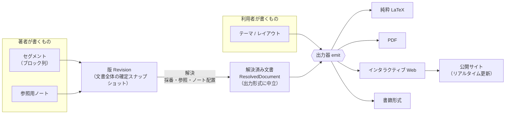
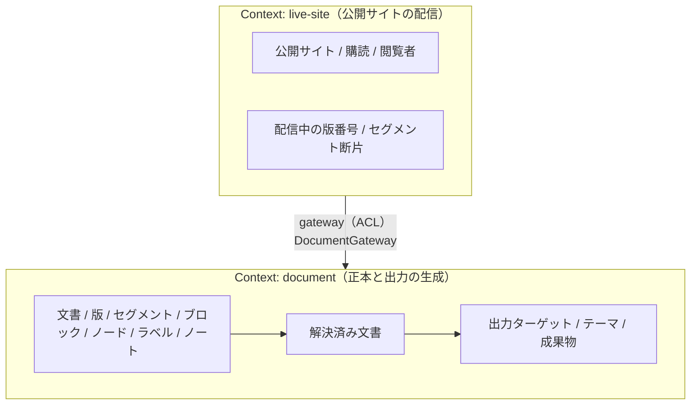
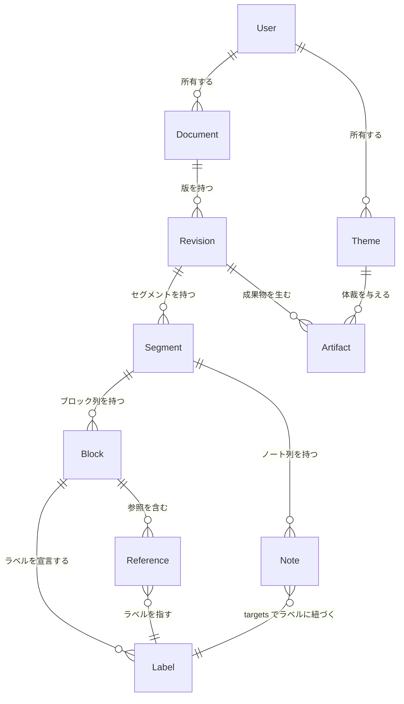
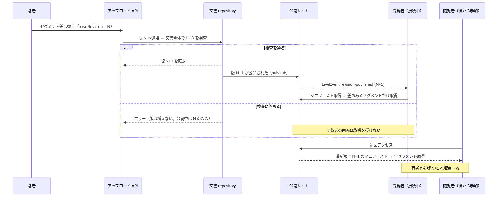

# ドメインモデル

マイルストーン M1（[milestones.md](./milestones.md)）の成果物。
構造化テキストという単一の正本から複数の出力を生成するにあたって、
**何が概念として存在し、どれが同一性を持ち、どの不変条件をどの境界で保つか**を定める。

方針の前提は [programming-philosophy.md](./programming-philosophy.md)（エントロピー最小化・原理主義的 DDD）、
[architecture-overview.md](./architecture-overview.md)（SSOT・依存方向・Bounded Context の分割基準）、
[language-selection.md](./language-selection.md)（型安全を絶対条件とする）である。

本ドキュメントは**白紙から書いていない**。先行 2 実装
（`exact-solution-of-2d-ising-model/structured-latex/`、`realtime-web-preview/`）と
その分岐（`integrable-lattice/structured-latex/`）を一次情報として読み、
そこで既に決まっている事柄を §1 に列挙したうえで、その上に載せている。

個別の設計判断の詳細な根拠は `docs/design-notes/` に分けてある。
本ドキュメントには結論と、モデルに効く部分だけを書く。

---

## 1. 一次情報から既に確定している事実

以下は先行実装のコードとドキュメントに実在する記述であり、**本プロジェクトが決め直す対象ではない**。
モデルはこれらと整合しなければならない。

| # | 事実 | 一次情報 |
|---|---|---|
| F1 | 文書順の正準表現は**ブロック配列の並び**。文書全体の順序は「`content/*.ts` をファイル名昇順に並べ、各ファイル内は配列順」で復元される | `exact-solution-of-2d-ising-model/structured-latex/README.md`（"Document order"）、`tools/content-modules.ts`（`listSourceFiles` が `sort()`） |
| F2 | ブロックは 2 種。**見出し**（`level` 1..6・`title` 必須・本文を持たない）と**定理型**（`theorem`/`definition`/`claim`/`remark`/`note`・`statement` 必須・`proof` 任意）。見出しに本文を書くこと、定理型に `level` を書くことは型で拒否される | `structured-latex/schema.ts`（`HeadingBlock` / `TheoremLikeBlock` の `never` フィールド） |
| F3 | ノードは 7 種（`text`/`math`/`displayMath`/`paragraph`/`list`/`ref`/`todo`）。**数式は KaTeX 向けの LaTeX 文字列**として保持する | `structured-latex/schema.ts`、同 `README.md`（"Mathematical expressions are stored as LaTeX strings intended for KaTeX"） |
| F4 | 相互参照のキーは**ラベル**であって、ファイルパスでもブロック id でもない。ラベルは文書全体で一意。`ref()` の宛先は生成されたラベルのユニオン型に縛られ、存在しないラベルは**コンパイル時**に落ちる | `structured-latex/schema.ts`（`RefNode.target: Label`）、`labels.generated.ts`、`tools/generate-index.ts` |
| F5 | **ノートは文書本体ではない。** 最終成果物の生成は `content/` だけを読み、`notes/` を読まない。ブロックに `notes` フィールドは書けない | `structured-latex/schema.ts`（`notes?: never`）、`tools/build-latex.ts`（`loadNoteFiles` を呼ばない）、`tools/verify-no-notes-in-output.ts` |
| F6 | **体裁の決定は生成器が全部持っている。** `documentclass`・パッケージ・フォント・定理環境名と見出し語・見出し level → `\part`/`\section` の対応・別行立て数式の縮小（`\fitdisplay`）・`ref` → `\cref`。正本側にはこれらの記述が一切ない | `structured-latex/tools/build-latex.ts` |
| F7 | 生成は**検査つきで落ちる**: 未解決参照ゼロ、ラベル重複なし、フォントに無い文字ゼロ、版面外へ出た行ゼロ。1 件でもあれば生成を中止する | `structured-latex/tools/build-latex.ts` |
| F8 | 同じ土台のスキーマが 2 プロジェクトで**複製**され、片方だけがブロックのメタデータを増やした（`habitat` / `realEscape` / `verification` / `lean`）。共有できるのはスキーマとツールだけで、生成物は各プロジェクトの `content/` に強く結びつく | `integrable-lattice/structured-latex/README.md`、同 `schema.ts` |
| F9 | **ラベル → ブロックの解決ロジックが 2 度、独立に実装されている。** LaTeX 生成器の `labelOwner` と、Web ビューアの `buildLabelIndex` / `ref-resolver.ts` | `structured-latex/tools/build-latex.ts`、`realtime-web-preview/domain-model/src/block.ts`、`realtime-web-preview/frontend/src/pages/document-view/ui/ref-resolver.ts` |
| F10 | 既存のリアルタイム機構は `fs.watch` → SSE で `reload` を push → クライアントが**全文書を再取得**。差分は送らない | `realtime-web-preview/docs/architecture.md` §5、`backend/src/entrypoint/handlers/events-handler.ts`、`frontend/src/pages/document-view/fetch/use-document.ts` |
| F11 | `realtime-web-preview` は「所有 entity を永続化しない」ため repository を持たず gateway だけで構成されている | `realtime-web-preview/docs/architecture.md` §1, §5 |

F9 は本プロジェクトの存在理由そのものである。**同じ解決ロジックが出力形式の数だけ増える**のを止めることが、
エントロピー最小化（[programming-philosophy.md](./programming-philosophy.md)）の具体的な適用先になる。

F8 は「スキーマをそのまま共有すると足りない」ことの一次証拠であり、
**プロジェクト固有のメタデータをどう受け入れるか**をモデルが答えなければならないことを示している。

---

## 2. ユビキタス言語

| 用語 | 意味 | 先行実装での対応 |
|---|---|---|
| **文書** Document | 1 本の論文・書籍。正本の単位であり、ラベル一意性・参照解決の効力範囲 | `structured-latex/` ディレクトリ 1 つ |
| **セグメント** Segment | 文書順のキーを持つブロック列。**部分アップロードの単位** | `content/<ファイル名>.ts` の default export 1 本 |
| **ブロック** Block | 見出し、または定理型（定義・主張・定理・注意・ノート） | `ConvertedBlock` |
| **ノード** Node | ブロック本文を構成する要素（地の文・数式・段落・箇条・参照・TODO） | `Node` |
| **ラベル** Label | 相互参照の宛先となる安定識別子。文書全体で一意 | `labels` / `Label` |
| **参照** Reference | あるブロックから別のブロックのラベルへの指示 | `RefNode` |
| **参照用ノート** Note | 文書本体ではない補足。ラベルで本文に紐づく。**出版物には載らない** | `notes/*.ts` の `Note` |
| **版** Revision | ある時点の文書全体の確定スナップショット。単調増加する番号を持つ | （先行実装に対応物なし。本プロジェクトで導入） |
| **解決済み文書** ResolvedDocument | 採番・参照・ノート配置を解決し終えた、**出力形式に中立**な中間表現 | （F9 が 2 度書いたものを 1 つにしたもの） |
| **出力ターゲット** RenderTarget | 純粋 LaTeX / PDF / Web / 書籍形式 | `build-latex.ts` の出力、`realtime-web-preview` の画面 |
| **テーマ** Theme | 解決済み文書を出力へ写すときの体裁の宣言。**利用者が差し替える** | `build-latex.ts` のプリアンブル等がハードコードしている部分 |
| **成果物** Artifact | ある版・あるターゲット・あるテーマから生成された出力 | `build/document.tex`, `build/document.pdf` |
| **購読** Subscription | 公開サイトを閲覧中のクライアント 1 接続 | SSE 接続 |

---

## 3. 全体像



要点は 2 つある。

1. **解決は 1 回だけ行う。** 採番・参照解決・ノート配置は出力形式に依存しないので、
   出力器ごとに書かない（F9 の反復を止める）。
2. **テーマは解決済み文書から先にしか効かない。** テーマは正本にも版にも触れられない。

---

## 4. 境界づけられた文脈（Bounded Context）

[architecture-overview.md](./architecture-overview.md) の分割基準は「関心領域が違うか」ではなく
**ドメイン知識を相互に隔離しなければならないか**であり、判断できないうちは 1 Context にまとめる、である。
これを当てて **2 Context** とする。



### 4.1 なぜ `live-site` を分けるか

- **相互隔離の要請が確定できる。** 正本側は「いま誰が見ているか」「何接続あるか」を知ってはならない。
  知った時点で、配信の都合が正本のモデルへ漏れる。逆に配信側は、ブロックやノードの意味を知らなくても
  仕事ができる（後述のとおり、配信するのは Web ターゲットの成果物断片と版番号だけである）。
- **deployment 起因の分割にも該当する。** 公開サイトは Terraform で構築したクラウドでホスティングする
  （[infrastructure.md](./infrastructure.md)、`README.md`）。純粋 LaTeX / PDF の生成はそれとは別の
  ライフサイクルを持つ。物理境界がある以上、相手は外部 domain であり gateway を挟む
  （[architecture-overview.md](./architecture-overview.md)）。
- **ACL が退化しない。** 分割してもモデルの二重定義にならない。`live-site` が `document` から受け取るのは
  `DocumentManifest`（版番号とセグメントの一覧・内容ハッシュ）と `RenderedFragment`（Web 成果物の断片）だけで、
  `Block` / `Node` を再定義する必要がない。これが「無理に gateway を挟むと不要な ACL を生む」ケースに
  当たらない根拠である。

### 4.2 なぜ「レンダリング」を別 Context にしないか

出力生成は `Block` / `Node` / `Label` という**正本と同一のユビキタス言語**を直接使い、依存は一方向で循環が無い。
分割基準に照らせば「隔離すべきという要請が論理的に確定できない」側に当たるので、同じ Context に置く。

### 4.3 なぜ「テーマ／体裁」を別 Context にしないか

テーマは利用者が書くもので、正本を書く著者とは別人でありうる。しかしテーマが必要とする隔離は
**Context の分割ではなく依存方向の規則で足りる**。すなわち「テーマは解決済み文書より前段には触れない」
という一方向の規則を型で表現できる（§7.3）。ACL を挟む理由が無いので、分割しない。
これは「早すぎる分割を避ける」という同ドキュメントの指示にも一致する。

---

## 5. Context `document` のモデル

### 5.1 集約と同一性

**集約ルートは文書 Document。** 集約の境界は「1 つの文書に属する全セグメント・全ブロック・全ノート・全版」である。

根拠: 守るべき不変条件（後述 I1–I5）が**すべて文書全体にかかる**。ラベルの一意性も参照の解決可能性も、
ブロック単体やセグメント単体では判定できない。不変条件の効力範囲が集約の境界である。

| 概念 | 種別 | 同一性 | 備考 |
|---|---|---|---|
| Document | entity（集約ルート） | `documentId` | 論文 1 本 |
| Revision | entity | `(documentId, number)` | 確定後は不変。番号は 1 始まりの単調増加 |
| Segment | entity | `(revisionId, key)` | `key` が文書順のキー（F1 のファイル名に相当） |
| Block | entity | `id`（文書全体で一意） | **独立したライフサイクルを持たない**（§9） |
| Note | entity | `id`（ブロック id とも衝突しない） | 文書本体ではない |
| Node | 値オブジェクト | なし | 同一性を持たない。丸ごと入れ替わる |
| Label | 値オブジェクト | — | 文書内で一意という制約を持つ識別子 |
| Title / Origin | 値オブジェクト | なし | `Origin` は先行実装の `sourcePath` / `sourceOrdinal` を一般化したもの |
| ResolvedDocument | 投影（projected） | なし | 版と採番方針から**導出**される。永続化しない |
| Theme | entity | `themeId` | 利用者が所有する |
| Artifact | entity | `(revisionId, target, themeId)` | 生成物 |



> この図は**概念どうしの関係**を示すものであって、SSOT の Entity Definition（ER entity の集合）
> そのものではない。どれを ER entity にし、どれを値として持つかは §5.7 で決める。

### 5.2 不変条件

| # | 不変条件 | 効力範囲 | 一次情報 |
|---|---|---|---|
| I1 | ブロック id・ノート id・ラベルは**文書全体で一意**。ノート id はブロック id とも衝突しない | 文書（版） | `structured-latex/document.generated.ts` の `_UniqueBlockIds` / `_UniqueLabels` / `_NoIdCollision` |
| I2 | すべての参照（`ref` の宛先、ノートの `targets`）が実在するラベルへ解決する | 文書（版） | `schema.ts`（`RefNode.target: Label`）、`build-latex.ts`（未解決が 1 件でもあれば生成を中止） |
| I3 | 文書は空でない | 文書（版） | `document.generated.ts` の `_ContentIsNotEmpty`、`generate-index.ts`（ラベル 0 件でエラー） |
| I4 | 見出しは本文を持たず、定理型は `level` を持たない。タイトルは `text` か `tex` の少なくとも一方を持つ | ブロック | `schema.ts` |
| I5 | ノートは出版成果物へ混入しない | 成果物 | `build-latex.ts` が `notes/` を読まない、`verify-no-notes-in-output.ts` |

I1–I3 が**文書全体にかかる**ことが、§9 の更新単位の結論を規定する。

### 5.3 構造化テキストの型（コア）

先行 2 実装（`exact-...` と `integrable-lattice`）に共通する部分だけをコアとし、
分岐した部分（`habitat` 等）は**メタデータの拡張スロット**として型パラメータで受ける。
複製（F8）ではなくパラメータ化で解く。

```typescript
// domain-model/src/structured-text/node.ts

export type TextNode = { type: 'text'; value: string }
export type MathNode = { type: 'math'; tex: string }
export type DisplayMathNode = { type: 'displayMath'; tex: string }
export type TodoNode = { type: 'todo'; value: string }

/** 相互参照。`L` は「その文書に実在するラベル」のユニオン型（生成物）で具体化される。 */
export type RefNode<L extends string = string> = {
  type: 'ref'
  target: L
  /** 参照の表示テキストの上書き。省略時はテーマの採番規則が決める。 */
  label?: string
}

export type Node<L extends string = string> =
  | TextNode
  | MathNode
  | DisplayMathNode
  | RefNode<L>
  | TodoNode
  | { type: 'paragraph'; children: readonly Node<L>[] }
  | { type: 'list'; items: readonly (readonly Node<L>[])[] }
```

```typescript
// domain-model/src/structured-text/block.ts

export type HeadingLevel = 1 | 2 | 3 | 4 | 5 | 6
export type TheoremLikeKind = 'theorem' | 'definition' | 'claim' | 'remark' | 'note'
export type BlockKind = TheoremLikeKind | 'heading'

/** タイトルは text か tex の少なくとも一方が必須（I4 を型で表す）。 */
export type TitleContent = { text: string; tex?: string } | { text?: string; tex: string }

/** 由来。先行実装の sourcePath / sourceOrdinal を一般化したもの（任意）。 */
export type Origin = { path: string; ordinal: number }

type BlockCommon<L extends string> = {
  id: string
  labels: readonly L[]
  origin?: Origin
}

/**
 * 定理型ブロック。`M` がプロジェクト固有のメタデータ。
 * 既定は `unknown`（交差しても何も足さない）なので、拡張しないプロジェクトは意識しなくてよい。
 */
export type TheoremLikeBlock<L extends string = string, M = unknown> = BlockCommon<L> &
  M & {
    kind: TheoremLikeKind
    title?: TitleContent | null
    statement: readonly Node<L>[]
    proof?: readonly Node<L>[]
    /** 見出し専用フィールド。定理型では書けない（コンパイル時に拒否）。 */
    level?: never
    /** 注記欄は持てない。参照用ノートは Note として分離する（I5 の入口を塞ぐ）。 */
    notes?: never
  }

export type HeadingBlock<L extends string = string> = BlockCommon<L> & {
  kind: 'heading'
  level: HeadingLevel
  title: TitleContent
  /** 見出しは本文を持たない（コンパイル時に拒否）。 */
  statement?: never
  proof?: never
  notes?: never
}

export type Block<L extends string = string, M = unknown> =
  | TheoremLikeBlock<L, M>
  | HeadingBlock<L>

/** 参照用ノート。文書本体ではない。targets は 1 件以上（空タプルはコンパイル時に落ちる）。 */
export type Note<L extends string = string> = {
  id: string
  targets: readonly [L, ...L[]]
  title?: TitleContent | null
  origin?: Origin
  body: readonly Node<L>[]
}
```

**メタデータの拡張が定理型ブロックにだけ効く**のは、`integrable-lattice/structured-latex/README.md` が
「`habitat` は本文ブロックでは必須。**見出しには書けない**」と定めていることに合わせている。

### 5.4 プロジェクト固有拡張の受け口

F8 が示すのは「スキーマそのものは共有できるが、生成物（ラベルのユニオン型・文書集約モジュール）は
各プロジェクトの `content/` に結びつく」ということである。したがってレンダラーが提供するのは
**スキーマのファクトリと生成器**であって、スキーマの実体ではない。

```typescript
// domain-model/src/structured-text/schema-factory.ts

export type StructuredTextConfig<MetaShape extends z.ZodRawShape> = {
  /**
   * 定理型ブロックへ追加するメタデータ。プロジェクトが宣言する。
   * 例（integrable-lattice）: habitat / realEscape / verification / lean。
   * ここで宣言されたキーだけが「未知フィールド」検査の許可キーに加わる。
   */
  blockMeta: MetaShape
}

export type StructuredTextSchema<L extends string, M> = {
  /** 1 セグメント分のブロック列を定義する。文書順は配列の並びが正本（F1）。 */
  defineBlocks: <const T extends readonly Block<L, M>[]>(blocks: T & NoDuplicates<T>) => T
  defineNotes: <const T extends readonly Note<L>[]>(notes: T & NoDuplicates<T>) => T
  blockSchema: z.ZodType<Block<L, M>>
  noteSchema: z.ZodType<Note<L>>
}
```

- **`defineBlocks` はセグメント 1 つを作る関数である。** 先行実装の「1 ファイル 1 配列」に一致する。
- ラベルのユニオン型 `L` と、ファイル跨ぎの一意性を主張する集約モジュールは、
  先行実装の `tools/generate-index.ts` と同じ方式でレンダラーが**生成する**
  （`labels.generated.ts` / `document.generated.ts` に相当）。生成物はプロジェクト側に置く。
- **意味の拡張（メタデータ）と体裁の拡張（テーマ）は別機構である。** 根拠は §8。

### 5.5 解決済み文書（ResolvedDocument）

F9 が二重実装していたものを 1 か所へ集約する。**出力形式に中立**であり、
ここまでで採番・参照・ノート配置・文書順の確定がすべて終わる。

```typescript
// domain-model/src/resolved/resolved-document.ts

/** ブロック番号（例: 節 2 の 7 番目 → { section: [2], display: '2.7' }）。 */
export type BlockNumber = { path: readonly number[]; display: string }

export type ResolvedRef = {
  type: 'ref'
  targetBlockId: string
  targetKind: BlockKind
  /** テーマの採番方針で決まった表示文字列（例: '定理 2.7'）。 */
  targetNumber: BlockNumber
  anchor: string
  /** 正本側で表示テキストが上書きされていた場合のみ非 null。 */
  overrideText: string | null
}

export type ResolvedNode =
  | TextNode
  | MathNode
  | DisplayMathNode
  | TodoNode
  | ResolvedRef
  | { type: 'paragraph'; children: readonly ResolvedNode[] }
  | { type: 'list'; items: readonly (readonly ResolvedNode[])[] }

export type ResolvedHeading = {
  kind: 'heading'
  blockId: string
  level: HeadingLevel
  number: BlockNumber
  title: TitleContent
  anchor: string
}

export type ResolvedTheoremLike = {
  kind: TheoremLikeKind
  blockId: string
  number: BlockNumber
  title: TitleContent | null
  statement: readonly ResolvedNode[]
  proof: readonly ResolvedNode[] | null
  anchor: string
  /**
   * プロジェクト固有メタデータ。テーマから**読めるが解釈されない**。
   * 出力器はこれを体裁の判断に使わない（§8 の「意味と体裁を混ぜない」）。
   */
  meta: unknown
}

export type ResolvedBlock = ResolvedHeading | ResolvedTheoremLike

export type ResolvedDocument = {
  documentId: string
  revision: RevisionNumber
  /** 文書順に並んだブロック（F1 の順序をここで確定させる）。 */
  blocks: readonly ResolvedBlock[]
  /** ブロック id → 配置されたノート。出版ターゲットでは常に空（I5）。 */
  notesByBlockId: Readonly<Record<string, readonly ResolvedNote[]>>
  /** 目次。Web の目次と LaTeX の \tableofcontents が同じものから出る。 */
  outline: readonly { blockId: string; level: HeadingLevel; number: BlockNumber; anchor: string }[]
}
```

解決は純関数である。

```typescript
export type ResolveError =
  | { code: 'unresolved_reference'; references: readonly { fromBlockId: string; target: string }[] }
  | { code: 'duplicate_label'; labels: readonly string[] }
  | { code: 'duplicate_block_id'; blockIds: readonly string[] }
  | { code: 'orphan_note'; noteIds: readonly string[] }
  | { code: 'empty_document' }

export const resolve: (
  revision: RevisionSnapshot,
  numbering: NumberingPolicy,
  audience: Audience,
) => Result<ResolvedDocument, ResolveError>
```

- **`audience`** が I5 を型で担う。`'publication'` なら `notesByBlockId` は空で固定され、
  ノートは解決の入力から外れる。`'working'`（Web プレビュー等）ならノートを配置する。
  先行実装が「生成器が `loadNoteFiles` を呼ばない」という**実装上の約束**で守っていたものを、
  引数として明示する。
- **`numbering`（採番方針）はテーマ側の宣言である。** 採番は体裁（何番と呼ぶか）であって意味ではないので、
  テーマが決める。ただし**採番の結果は解決済み文書に固定される**ので、本文の参照と番号が食い違わない。

```typescript
export type Audience = 'publication' | 'working'
```

### 5.6 出力ターゲット・テーマ・成果物

```typescript
export type RenderTarget = 'latex' | 'pdf' | 'web' | 'book'

export const emit: <T extends RenderTarget>(
  document: ResolvedDocument,
  target: T,
  theme: ThemeFor<T>,
) => Result<Artifact, EmitError>
```

テーマの型は §8 で定める。

### 5.7 SSOT の entity にするもの・しないもの

[architecture-overview.md](./architecture-overview.md) の SSOT は
「Entity Definition（ER モデル）から CRUD / DDL / API クライアントを生成する」ものである。
したがって **ER entity にするかどうかの判定は「その概念に CRUD エンドポイントを生成すべきか」**で行う。

| 概念 | ER entity か | 根拠 |
|---|---|---|
| User / Document / Revision / Segment / Theme / Artifact | する | 同一性とライフサイクルを持ち、CRUD の対象になる |
| Block / Node / Note | **しない** | ブロック単体を更新する API は存在しない（§9 の結論）。Node は再帰構造で同一性を持たない。これらは Segment が持つ**値**として Zod スキーマで SSOT に置く（`realtime-web-preview/domain-model/src/block.ts` と同型） |
| ResolvedDocument / LabelIndex | しない（`projected`） | 版と採番方針から導出される投影。永続化しない |
| Requester（認可の主体） | しない（`projected`） | [authorization-strategy.md](./authorization-strategy.md) §2 の指示どおり |
| Subscription | する（`in-memory`） | 自 domain の entity を CRUD / pub-sub するので repository。[architecture-backend.md](./architecture-backend.md) が「in-memory の read model でも repository」と明記している |

`codegen/config/storage.ts` の初期宣言は次のとおりになる（全 entity を過不足なく明示するのが規約）。

```typescript
export type StorageBackend = 'cloud-sql' | 'object-storage' | 'in-memory' | 'projected'

export const storageAssignments: EntityStorage[] = [
  { entity: 'User',         backend: 'cloud-sql' },
  { entity: 'Document',     backend: 'cloud-sql' },
  { entity: 'Revision',     backend: 'cloud-sql' },
  { entity: 'Segment',      backend: 'cloud-sql' },      // ブロック列は JSON として持つ
  { entity: 'Theme',        backend: 'cloud-sql' },
  { entity: 'Artifact',     backend: 'object-storage' }, // PDF / tex / 静的 Web 成果物の実体
  { entity: 'Subscription', backend: 'in-memory' },
  { entity: 'Requester',    backend: 'projected' },
]
```

---

## 6. Context `live-site` のモデル

### 6.1 集約

**集約ルートは公開サイト LiveSite**（＝ある文書の公開面）。境界は「配信中の版番号と、それに紐づく購読の集合」。

| 概念 | 種別 | 同一性 |
|---|---|---|
| LiveSite | entity（集約ルート） | `documentId` |
| Subscription | entity | `subscriptionId`（1 接続） |
| DocumentManifest | 値オブジェクト | なし（版番号とセグメント一覧のスナップショット） |
| RenderedFragment | 値オブジェクト | なし |

不変条件: **配信中の版は常に「不変条件 I1–I3 を満たすと確定した版」のいずれか 1 つである。**
中途半端な状態（一部のセグメントだけ新しい）を閲覧者へ見せない。

### 6.2 `document` Context への ACL

```typescript
// live-site/domain/interfaces/gateways/document-gateway.ts

export interface DocumentGateway {
  /** 現在公開中の版のマニフェスト（版番号 + セグメントの並びと内容ハッシュ）。 */
  getManifest(documentId: string): Promise<Result<DocumentManifest, GetManifestError>>
  /** ある版のあるセグメントの、Web ターゲット成果物断片。 */
  getFragment(
    documentId: string,
    revision: RevisionNumber,
    key: SegmentKey,
  ): Promise<Result<RenderedFragment, GetFragmentError>>
}
```

`live-site` は `Block` / `Node` を知らない。これが §4.1 で述べた「ACL が退化しない」ことの実体である。

---

## 7. 設計判断 1: 正本の表現をどちらへ寄せるか

詳細な対照表は [design-notes/output-format-capabilities.md](./design-notes/output-format-capabilities.md)。

### 7.1 結論

**どちらにも寄せない。正本は意味だけを持ち、出力形式固有の体裁を一切持たない。**

これは新しい方針ではなく、先行実装が既に実践していることの明文化である（F6）。
`build-latex.ts` は `documentclass`・パッケージ・フォント・定理環境名・見出し level → `\part` の対応・
`\fitdisplay` を**すべて生成器側に持ち**、`content/` 側にはそれらの記述が 1 つも無い。
Web ビューア側も同じブロック列から独立に体裁を決めている。
**同じ正本が既に 2 つの体裁へ写っている**ことが、この原則が成立するという一次証拠である。

### 7.2 意味と体裁を分ける判定基準

曖昧な語感で分けない。次の 1 問で判定する。

> **その情報を落として出力ターゲットだけを取り替えたとき、文書が主張している内容は変わるか。**
> 変わるなら意味（正本）、変わらないなら体裁（テーマ）。

適用例:

| 情報 | 判定 | 理由 |
|---|---|---|
| ブロックが定理か定義か | 意味 | 取り替えると主張の身分が変わる |
| 「定理」と呼ぶか "Theorem" と呼ぶか | 体裁 | 主張は変わらない |
| ラベルと参照の関係 | 意味 | どの主張を使ったかが変わる |
| 参照が「定理 2.7」と出るか番号なしリンクで出るか | 体裁 | 指している先は同じ |
| 見出しの階層（level） | 意味 | 論理構造が変わる |
| level 1 を `\part` に写すか `\section` に写すか | 体裁 | 階層関係は同じ |
| 定理番号が節ごとにリセットされるか通しか | 体裁 | どの主張かは変わらない（ただし採番結果は解決済み文書に固定する。§5.5） |
| 改ページ・段組・フロートの配置 | 体裁 | 内容は変わらない |
| 折りたたみ・検索・ホバー展開 | 体裁 | 内容は変わらない |
| ノートが本文か補足か | 意味 | I5 の対象。出版物に載るか載らないかが変わる |
| TODO が残っていること | 意味 | 未完であるという事実そのもの |

### 7.3 中立化できない残余: 数式

**数式だけは中立化できない。** `math` / `displayMath` は LaTeX 文字列であり（F3）、
これは LaTeX 方言そのものである。中立な数式表現（MathML 等）へ置き換える選択肢は取らない。
根拠は先行 3 実装がすべて「KaTeX 向けの LaTeX 文字列」で一致していること（F3）と、
純粋 LaTeX 出力が必須要件であること（`README.md`）である。

したがって**制約として明示する**: 正本に書ける数式は
**「LaTeX（tectonic + amsmath）と KaTeX の両方が解釈できる部分集合」に限る。**
これは妥協ではなく、正本が単一であるための必要条件であり、機械検査の対象にする
（`build-latex.ts` が既に「フォントに無い文字ゼロ」「版面外へ出た行ゼロ」を検査して落としているのと同じ扱い）。

### 7.4 ある形式でしか表現できないものが出てきたときの規約

正本に持ちたくなったとき、次の順で判定する。**「黙って落とす」は常に禁止**（F7 の思想）。

1. **その情報は §7.2 の判定で意味か。** 体裁なら正本に入れない。テーマ／レイアウト側で表現する。終了。
2. 意味である場合、**全ターゲットが劣化つきで表現できるか。** できるなら正本に入れ、
   各ターゲットのテーマが劣化表現を持つことを**型で必須にする**（未実装のターゲットがあれば
   コンパイルが通らない）。例: TODO ノードは LaTeX では太字マーカー、Web では強調表示。
3. 表現できないターゲットがある場合、**生成をエラーで落とす。** 出力から無言で消さない。
4. それでも中立化できず生の表現が要るなら、**全ターゲットぶんの代替表現を型で必須にする**。
   1 つでも欠ければ値を構築できない。これが判定 3 の「黙って落とさない」を型で担保する形である。

```typescript
/**
 * 中立化できず、ターゲットごとの生表現が避けられない要素（例外扱い）。
 * `render` は全 RenderTarget を網羅しないと型として成立しないので、
 * 「専用表現を持つなら全形式の代替を必ず用意する」が強制される。
 */
export type RawNode = {
  type: 'raw'
  render: { [T in RenderTarget]: string | readonly Node[] }
}
```

**劣化で足りるもの（判定 2）は正本に入れない。** 段組・コラム・折りたたみのように
「一部ターゲットにしか対応物が無いが、無くても意味が完全」なものは、正本ではなく
テーマ／レイアウト側の提示ヒントとして持ち、適用媒体を型に埋める。
出力形式は 2 つの媒体に分かれ、能力差の大半はこの軸で説明できる。

```typescript
/** 媒体。ページ組（paged）か連続フロー（flowed）か。 */
export type Medium = 'paged' | 'flowed'
export const MEDIUM_OF: Record<RenderTarget, Medium> = {
  latex: 'paged',
  pdf: 'paged',
  book: 'paged',
  web: 'flowed',
}

/** 提示ヒント。正本ではなくテーマ／レイアウトが持つ。適用媒体を型で限定する。 */
export type PresentationHint =
  | { kind: 'columnBreak'; medium: 'paged' }
  | { kind: 'aside'; medium: 'paged'; body: readonly Node[] }
  | { kind: 'collapsible'; medium: 'flowed'; body: readonly Node[] }
```

### 7.5 既知の欠落: 図表

**現時点のどのスキーマにも図表ノードが存在しない。**
`exact-solution-of-2d-ising-model/structured-latex/schema.ts` の `NODE_TYPES` は
`paragraph` / `math` / `displayMath` / `list` / `ref` / `text` / `todo` の 7 種だけであり、
`tools/build-latex.ts` は `graphicx` を読み込んでいるが**それを使うノードが無い**。

これは本 M1 で埋めない。埋めるべき対象（図をどう持つか、キャプションと採番、参照の対象になるか）が
既存 2 プロジェクトの正本に 1 件も存在せず、一次情報から形を決められないためである。
§7.4 の判定手順に乗せられる状態になった時点で追加する。**M2 への申し送りとする**（§14）。

---

## 8. 設計判断 2: カスタマイズで何を開き、何を開かないか

詳細は [design-notes/customization-boundary.md](./design-notes/customization-boundary.md)。

### 8.1 「利用者」は 3 役ある

| 役割 | 何をする人か | 開く対象 |
|---|---|---|
| **著者** | 構造化テキスト（正本）を書く | 意味。ブロック・ノード・ラベル・ノート、およびプロジェクト固有メタデータの**宣言** |
| **組み込み開発者** | レンダラーを自分の文書に組み込み、体裁を決める | 体裁。テーマ・レイアウト・採番方針 |
| **閲覧者** | 公開サイトを読む | 何も開かない（read-only。`realtime-web-preview/docs/requirements.md` §3.2 が編集を out of scope と定めている前提を踏襲する） |

「デザインとレイアウトは利用者側でカスタマイズできる」（`README.md`）の利用者は**組み込み開発者**である。

### 8.2 判定基準

開く／開かないは次の 2 条件の連言で決める。

> **(a) §7.2 の判定で体裁であること。かつ (b) それを差し替えても不変条件 I1–I5 を破れないこと。**

(b) が効く例: 「参照の表示形式」は体裁なので (a) は満たすが、
参照を**出力しない**という差し替えを許すと I2 の意味が失われる。したがって
「参照をどう見せるか」は開き、「参照を消すか」は開かない。テーマは
`ResolvedRef` を受け取って必ず何かを出力する関数として型付けられ、省略できない。

### 8.3 項目ごとの結論

| 項目 | 開く | 理由 |
|---|---|---|
| LaTeX プリアンブル（documentclass / パッケージ / フォント） | **開く** | 体裁。`build-latex.ts` が固定値で持っている部分そのもの |
| 定理環境の見出し語（「定理」/"Theorem"） | **開く** | 体裁 |
| 採番規則（節ごとリセット / 通し番号 / 環境間で番号を共有するか） | **開く** | 体裁。`build-latex.ts` は 5 環境で番号を共有しているが、これは一つの選択にすぎない |
| 見出し level → 節コマンドの対応 | **開く** | 体裁。`build-latex.ts` が level 1 を `\part` に写した判断は文書ごとに変わる |
| CSS・配色・タイポグラフィ | **開く** | 体裁 |
| ブロック種別ごとの表示コンポーネント | **開く（役割単位で）** | 体裁。ただし §8.4 の器の中でのみ |
| 段組・コラムの配置規則 | **開く** | 体裁 |
| 目次の有無・深さ | **開く** | 体裁 |
| 数式の描画エンジン（KaTeX 以外） | **開く** | 体裁。ただし入力が §7.3 の部分集合であることは動かない |
| **ブロック種別・ノード種別の追加** | **開かない** | 意味。追加すると全ターゲットの出力器が対応を迫られる（§7.4 の判定 2 が型で強制される）。テーマの機構では受けない |
| **プロジェクト固有メタデータの追加** | 開く（ただし**著者**に、テーマとは別機構で） | 意味の拡張。§8.5 |
| **不変条件 I1–I5** | **開かない** | 破れると正本が正本でなくなる |
| **文書順** | **開かない** | F1 が正本の定義そのもの |
| **解決済み文書より前段への介入** | **開かない** | テーマが正本に触れると体裁が意味へ漏れる |

### 8.4 テーマの器

**テーマは宣言的な設定を基本とし、任意コードは許さない。**
根拠は [programming-philosophy.md](./programming-philosophy.md) のエントロピー最小化
（選択肢の多さを減らす）と [language-selection.md](./language-selection.md) の型安全絶対条件である。
テキスト出力（LaTeX / 書籍）は宣言だけで足りる。

Web だけは例外を設けるが、**任意コードではなく「役割ごとの型付きコンポーネント差し替え」**に閉じる。
差し替え可能な役割の集合は閉じたユニオンであり、各コンポーネントの Props は
解決済み文書の型で固定される。ここが「テーマが正本に触れられない」ことを型で保証する箇所である。

```typescript
/** テーマが差し替えられる役割。閉じたユニオン（増やせるのはレンダラー本体だけ）。 */
export type ThemeSlot =
  | 'document' | 'outline'
  | 'heading' | 'theoremLike' | 'statement' | 'proof' | 'note'
  | 'paragraph' | 'list' | 'inlineMath' | 'displayMath' | 'reference' | 'todo'

/** 全ターゲット共通の宣言部分。 */
export type CommonTheme = {
  numbering: NumberingPolicy
  /** kind → 見出し語。全 kind 必須（書き忘れを型で落とす）。 */
  labels: Record<BlockKind, string>
  /** 参照の表示。省略できない（§8.2 の (b)）。 */
  referenceFormat: 'number-with-kind' | 'number-only' | 'title'
}

export type LatexTheme = CommonTheme & {
  documentClass: string
  packages: readonly string[]
  fonts: { cjkMain?: string; cjkSans?: string }
  /** 見出し level → 節コマンド。1..6 すべて必須。 */
  sectionCommands: Record<HeadingLevel, string>
  theoremEnvironments: Record<TheoremLikeKind, { env: string; sharesCounterWith?: TheoremLikeKind }>
}

export type WebTheme = CommonTheme & {
  tokens: StyleTokens
  /** 役割ごとのコンポーネント差し替え。未指定の役割は既定実装が使われる。 */
  components?: Partial<{ [S in ThemeSlot]: ComponentFor<S> }>
}

export type BookTheme = LatexTheme & {
  columns: 1 | 2
  /** コラムの差し込み規則。§13 の承認待ち論点に依存する。 */
  columnPlacement: ColumnPlacementPolicy
}

export type ThemeFor<T extends RenderTarget> = T extends 'latex' | 'pdf'
  ? LatexTheme
  : T extends 'web'
    ? WebTheme
    : BookTheme
```

`Record<BlockKind, string>` / `Record<HeadingLevel, string>` を `Partial` にしないのは、
「宣言の書き忘れを静かに通さない」という [architecture-overview.md](./architecture-overview.md) の
resolver 方針（明示宣言のみを正とし既定で埋めない）をテーマにも適用するためである。

### 8.5 意味の拡張と体裁の拡張は別機構にする

F8 のメタデータ（`habitat` / `realEscape` / `verification` / `lean`）は
**検証のための意味**であって体裁ではない。`integrable-lattice/structured-latex/README.md` は
これを「散文の約束事にせず、本文ブロックの必須フィールドとして型で強制する」ためのものだと明記しており、
体裁を変える目的を持たない。

したがって:

- **意味の拡張**は §5.4 の `blockMeta` で受ける。著者が宣言し、正本の型検査と実行時検証に参加する。
- **体裁の拡張**は §8.4 のテーマで受ける。組み込み開発者が宣言し、解決済み文書より後段でだけ効く。
- **両者を同じ機構にしない。** 混ぜると「メタデータを足すと見た目が変わる」「テーマを変えると検証が変わる」
  という経路ができ、意味と体裁の分離（§7.1）が壊れる。
  解決済み文書の `meta` が `unknown` 型で運ばれ、出力器がそれを体裁の判断に使わないのはこのためである。

---

## 9. 設計判断 3: 部分アップロードにおける更新の単位

詳細は [design-notes/incremental-update-unit.md](./design-notes/incremental-update-unit.md)。

### 9.1 結論

- **アップロード（受け付け）の単位は、セグメント（＝ソースファイル 1 つ分のブロック列）。**
- **公開（確定・配信）の単位は、文書全体の版（Revision）。**

2 つの単位を分けることが結論の中身である。

### 9.2 なぜブロック 1 件ではないか

**文書順の正本はブロック配列の並びである**（F1）。ブロック自身は「自分がどこに入るか」を持っていない。
したがってブロック単体を送っても挿入位置が決まらず、削除・並べ替えも表現できない。
ブロック単位にするには、正本に順序フィールド（`order`）を持たせるしかないが、
それは F1 を書き換えることであり、先行実装 2 つと `realtime-web-preview` の前提を同時に壊す。採らない。

### 9.3 なぜ文書全体ではないか

要件が「構造化テキストを**部分的に**アップロードする」（`README.md`）だからである。
また `realtime-web-preview` の現行方式（全体を読み直す、F10）は、
ローカル 1 プロセス・単一閲覧者・LAN という前提の下でだけ成り立っている
（`realtime-web-preview/docs/requirements.md` §1, §7）。クラウド公開・複数閲覧者では前提が変わる。

### 9.4 なぜセグメントか

セグメントは先行実装で既に実在する単位である。`content/<ファイル名>.ts` が
1 本の `defineBlocks` 配列を default export し、**ファイル名昇順が文書順のキー**になっている（F1）。
つまりセグメントは、

- **順序を持つ**（キーが文書順を決める）ので、挿入位置が一意に決まる。
- **削除を表現できる**（キーを消す）。
- **並べ替えを表現できる**（キーの並びを与える）。
- ブロックより粗いので、1 回のアップロードが自己完結した塊になる。

これらを同時に満たす最小の単位である。

### 9.5 DDD 上の位置づけ

| 問い | 答え |
|---|---|
| セグメントは entity か値オブジェクトか | **entity**。同一性は `(revisionId, key)`。キーが文書順の意味を持つので、内容が入れ替わっても同じセグメントであり続ける |
| ブロックは何か | **集約内の entity**。同一性は `id` だが、独立したライフサイクルを持たない。セグメントの差し替えで丸ごと入れ替わる。ゆえに ER entity にせず（§5.7）、ブロック単体の CRUD API も持たない |
| 集約の境界 | **文書 1 つ**（§5.1）。不変条件 I1–I3 が文書全体にかかるため |
| トランザクション境界 | **文書 1 つ**。同一文書への同時アップロードは直列化する |
| 不変条件をいつ検査するか | **セグメントを適用した結果の文書全体に対して**。個々のセグメント単体では I1–I3 を判定できない |
| 保持するのは repository か gateway か | **repository**。文書・版・セグメントは自 domain が所有する entity であり、その CRUD と変更の pub/sub を担うため。[architecture-backend.md](./architecture-backend.md) が「判定基準は自 domain が所有する entity の CRUD（+ pub/sub）かであって、永続化されているかではない」「in-memory の read model でも repository である」と明記している。一方、PDF ビルダ（tectonic）のような外部プロセスは gateway |

### 9.6 版（Revision）が必要な理由

**必要である。** 理由は 2 つ。

1. **中途半端な状態を見せないため。** セグメント単位で受け付けても、公開してよいのは
   「適用結果が I1–I3 を満たすと確定した文書全体」だけである。この確定したスナップショットが版である。
   検査に落ちたアップロードは版を作らず、**既に公開されている版は壊れない**。
2. **後から来た閲覧者と既にいる閲覧者が同じ状態へ収束するため。** 全員が「現在の最新版番号」を
   基準に取得するので、途中参加でも取りこぼしがあっても、最終的に同じ版に落ち着く。

### 9.7 配信のプロトコル

**差分は送らない。「版 N が公開された」という無効化通知だけを送り、取得はクライアントが行う。**

根拠:

- 差分を push すると、閲覧者ごとに現在版が違うため、欠落したイベントを回復するには
  差分の履歴をサーバが保持しなければならない。保持すべき状態が増える＝エントロピーが増える。
  無効化通知なら、サーバが持つのは「最新版番号」と「版ごとのセグメント別ハッシュ」だけで済む。
- 通知の形は `realtime-web-preview` の SSE `reload`（F10）と同型であり、既に動いている方式を保つ。
- 閲覧者は常に「ある版の文書全体」を見る。**版をまたいで混ざった状態を持たない**ので、
  収束の判定が「自分の版 < 通知された版なら取り直す」だけで済む。

**取得の粒度はモデルの決定事項ではない。** 既定は文書全体の再取得（`realtime-web-preview` と同じ）
とする。マニフェストがセグメント別の内容ハッシュを持つので、
「変わったセグメントだけ取る」差分 pull へ後から移せるが、これは帯域の最適化であって
更新の単位（§9.1）も収束の保証（§9.6）も変えない。差分 pull にしても
サーバが持つ状態は増えない（版ごとのハッシュだけ）ので、必要になった時点で入れる。

**版番号は文字列でなく単調増加する数値**とする。§9.6 の収束保証が
「自分の版 < 通知された版」という順序比較に依存しており、順序が型から読み取れる必要があるためである。

```typescript
// domain-model/api-contract/live-site.ts

export type RevisionNumber = number   // 1 始まり、単調増加
export type SegmentKey = string       // 文書順のキー

export type DocumentManifest = {
  documentId: string
  revision: RevisionNumber
  publishedAt: string
  /** 文書順に並ぶ。contentHash が変わったセグメントだけ取り直せばよい。 */
  segments: readonly { key: SegmentKey; contentHash: string }[]
}

/** SSE で push するイベント。差分は含めない。 */
export type LiveEvent =
  | { type: 'revision-published'; documentId: string; revision: RevisionNumber }
  | { type: 'heartbeat' }
```



### 9.8 アップロードの契約

```typescript
export type UploadSegmentsInput = {
  documentId: string
  /** 楽観ロック。この版を基準にした更新であることを宣言する。 */
  baseRevision: RevisionNumber
  /** キーごとに全置換する（部分マージはしない。マージ規則を持たない分だけ選択肢が減る）。 */
  upserts: readonly { key: SegmentKey; blocks: readonly Block[]; notes?: readonly Note[] }[]
  deletes: readonly SegmentKey[]
}

/** operation ごとに網羅する（error-handling-strategy.md §3）。 */
export type UploadSegmentsError =
  | { code: 'document_not_found' }
  | { code: 'forbidden' }
  | { code: 'revision_conflict'; currentRevision: RevisionNumber }
  | { code: 'validation_error'; issues: readonly ValidationIssue[] }
  | { code: 'duplicate_label'; labels: readonly string[] }
  | { code: 'duplicate_block_id'; blockIds: readonly string[] }
  | { code: 'unresolved_reference'; references: readonly { fromBlockId: string; target: string }[] }
  | { code: 'orphan_note'; noteIds: readonly string[] }
  | { code: 'empty_document' }
  | { code: 'unknown_segment_key'; keys: readonly SegmentKey[] }
  | { code: 'internal_error' }
```

`upserts` を**キー単位の全置換**にするのは、部分マージ規則を持たないためである
（持つと「同じ結果を作る書き方」が複数生まれ、エントロピーが増える）。

---

## 10. 依存方向と配置

```
domain-model/          ← 何にも依存しない（構造化テキストの型・解決済み文書の型・api-contract）
codegen/               ← domain-model に依存（ラベル型・文書集約モジュール・CRUD 一式の生成）
backend/
  document/            ← Context: 正本の受け入れ・検査・版の確定・出力生成
  live-site/           ← Context: 配信（document へは gateway 経由）
frontend/
  _shared/             ← domain-model に依存
  web/                 ← domain-model, _shared に依存
infra/                 ← Terraform（公開サイトのホスティング）
```

逆方向・循環は禁止（[architecture-overview.md](./architecture-overview.md) §3）。
加えて本プロジェクト固有の依存規則を 1 つ足す。

> **テーマは解決済み文書より前段の型に依存してはならない。**
> `LatexTheme` / `WebTheme` / `BookTheme` から `Block` / `Node` / `Segment` を import しない。
> これが §8 の「体裁は意味へ漏れない」を型で保証する箇所である。

`codegen/` が生成するものは、先行実装の `tools/generate-index.ts` に相当するもの
（プロジェクトごとの `labels.generated.ts` / `document.generated.ts`）と、
[architecture-overview.md](./architecture-overview.md) が定める CRUD 一式の両方である。
前者は本プロジェクト固有の generator として `codegen/structured-text-index/` に置く。

---

## 11. エラーの語彙

[error-handling-strategy.md](./error-handling-strategy.md) に従い、
throw ではなく Result で伝搬し、operation ごとに code を網羅する。
本ドキュメントで定義した operation は次の 4 つ。

| operation | エラー型 |
|---|---|
| セグメントのアップロード | `UploadSegmentsError`（§9.8） |
| 解決 | `ResolveError`（§5.5） |
| 出力生成 | `EmitError`（未確定。少なくとも「テーマが表現できない要素があった」「PDF ビルドに失敗した」「版面外へ出た」「フォントに無い文字があった」を含む。最後の 2 つは `build-latex.ts` が実際に検査している） |
| マニフェスト／断片の取得 | `GetManifestError` / `GetFragmentError` |

`internal_error` が返るのは contract の設計漏れである（同ドキュメント §4）。

---

## 12. 認可

[authorization-strategy.md](./authorization-strategy.md) に従い、認可は 100% domain-model に置く。
認可の主体は projected entity として定義する。

```typescript
export const Requester = entity({
  name: 'Requester',
  columns: {
    userId:     z.string().ref(User).nullable(),     // 所有判定の主体
    accountId:  z.string().ref(Account).nullable(),  // 認証済み判定
    operatorId: z.string().ref(Operator).nullable(), // 運営判定
  },
})
```

policy の初期案（全 resource entity を明示するのが規約。action 省略は deny-by-default = admin のみ）:

```typescript
export const policies: ResourcePolicy[] = [
  { entity: 'User',     read: ['owner', 'admin'], create: ['public'], update: ['owner', 'admin'] },
  { entity: 'Account',  read: ['owner', 'admin'], create: ['authenticated'] },
  { entity: 'Document', read: ['public'], create: ['authenticated'], update: ['owner'], delete: ['owner'] },
  { entity: 'Revision', read: ['public'], create: ['owner'] },
  { entity: 'Segment',  read: ['public'], create: ['owner'], update: ['owner'], delete: ['owner'] },
  { entity: 'Theme',    read: ['owner', 'admin'], create: ['authenticated'], update: ['owner'], delete: ['owner'] },
  { entity: 'Artifact', read: ['public'] },
  { entity: 'Subscription', read: ['owner'], create: ['public'], delete: ['owner'] },
]
```

owner の解決は relation graph の FK パスで機械的に行う（同ドキュメント §4）。
本モデルでは `Segment.revisionId → Revision.documentId → Document.userId → User` の多ホップになり、
パスは一意なので resolver が解決できる。

`read: ['public']` としているのは「公開サイトは誰でも読める」という前提を置いているためであり、
これは依頼者の判断を要する（§13 の論点 C）。

---

## 13. 依頼者の承認が必要な残論点

一次情報から一意に決まらず、依頼者の価値判断でしか決まらないものだけを挙げる。

### 論点 A: 書籍形式のコラムの出どころ

書籍形式は「段組やコラムを差し挟んだ読み物」（`README.md`）である。そのコラムの中身をどこから持ってくるか。
`notes/` を使うのは自明に見えるが、**I5（ノートは出版物に載らない）と正面から衝突する**。
`exact-solution-of-2d-ising-model/structured-latex/README.md` はノートを
「出版の解説パートで参照する**素材**」と定めており、そのまま載せるものとは書いていない。

| 選択肢 | 帰結 |
|---|---|
| A-1: コラムを新しいブロック種別として正本に追加し、対象出力を宣言する | 正本が出力形式を知ることになり、§7.1 が崩れる。§7.4 の判定 4（例外扱い）に該当し、追加のたびに全ターゲットの出力器が対応を迫られる |
| A-2: `notes/` を書籍形式でだけ本文へ昇格させる | I5 が「PDF/LaTeX では載らないが書籍では載る」という条件付きになる。ノートの書き方の基準（「正しさに必要ならそれは注記ではない」）が揺らぎ、著者が判断できなくなる |
| A-3（推奨）: 書籍を「本体文書 + 解説文書」の 2 文書の合成として扱い、合成規則をレイアウトが持つ | I5 も §7.1 も保たれる。解説文書はそれ自体が構造化テキストなので、同じ検査（I1–I3）を受けられる。代わりに「文書の合成」という概念がモデルに増える |

**推奨は A-3。** 根拠は、I5 と §7.1 という既に一次情報で確定している 2 つの原則を、いずれも壊さない唯一の案であること。
ただし「解説を別文書として書く」ことが著者の書き方として受け入れられるかは依頼者の判断である。

### 論点 B: Web テーマにおけるコンポーネント差し替えの許容範囲

§8.4 で「役割ごとの型付きコンポーネント差し替え」に閉じるとしたが、その範囲をどこまで開くか。

| 選択肢 | 帰結 |
|---|---|
| B-1: 宣言的設定のみ（コンポーネント差し替えを一切許さない） | エントロピー最小。ただし Web 固有の対話性（折りたたみ・ホバー展開）を利用者が足せず、要求のたびにレンダラー本体を直すことになる。「レンダラー本体を書き換えなくてよい」（`README.md`）に反しうる |
| B-2（推奨）: §8.4 のとおり、閉じた役割ユニオンに限って型付きコンポーネントを許す | 差し替え可能な箇所が型で列挙され、Props が解決済み文書の型で固定される。テーマが正本に触れられないことは型で保証される |
| B-3: 任意のレンダリング関数を許す | 表現力は最大だが、テーマが何をするか型で予測できない。エントロピー最小化と型安全絶対条件の両方に反する |

**推奨は B-2。** 根拠は `README.md` の「レンダラー本体を書き換えなくてよい」を満たす最小の開き方であること。

### 論点 C: 公開サイトの公開範囲

§12 の policy は「文書・版・成果物は誰でも読める」を仮に置いている。
論文を書きかけのまま公開サイトへ載せる使い方（要件にある「リアルタイムに更新しながら複数人が見る」）では、
**未完成の原稿が全世界から読める**ことになる。

| 選択肢 | 帰結 |
|---|---|
| C-1: 完全公開 | 実装が最小。未完成原稿が公開される |
| C-2（推奨）: 文書ごとに公開／限定を選べる。限定時は招待された閲覧者のみ | `Document` に可視性の属性が増え、`read` policy が `owner` と招待関係の OR になる。招待という relation が 1 つ増える |
| C-3: 常に限定公開 | 「Web で公開できるサイト」（`README.md`）という要件を満たさなくなる |

**推奨は C-2。** 根拠は、要件が「Web 公開」と「執筆中のリアルタイム共有」の両方を挙げていること
（`README.md`）で、片方だけを選ぶと他方が満たせないため。

### 論点 D: 数式方言の縛り方

§7.3 で「LaTeX と KaTeX の共通部分集合に限る」とした。この縛りをどう運用するか。

| 選択肢 | 帰結 |
|---|---|
| D-1（推奨）: 共通部分集合を機械検査し、外れたら**生成を落とす** | 「黙って消える」が起きない（`build-latex.ts` が「フォントに無い文字は無言で消える」ので 1 件でも許さない、としているのと同じ扱い）。著者は書ける記法が制限される |
| D-2: LaTeX を正とし、Web 側は描画できないものを代替表示（画像化等）で劣化させる | 著者の自由度は上がる。Web の数式が部分的に画像になり、検索・選択・拡大の対象から外れる |

**推奨は D-1。** 根拠は先行 3 実装がすべて「KaTeX 向けの LaTeX 文字列」で運用済みであり（F3）、
実際に 945 件の相互参照を含む 173 ページの PDF がこの前提で生成できている
（`exact-solution-of-2d-ising-model/structured-latex/README.md` の実測記録）ことから、
共通部分集合が実用上足りていると確認できるためである。

### 論点 E: 複数人が同時に「更新」することを要件に含めるか

`README.md` の要件は「論文をリアルタイムに更新しながら、同じサイトを**複数人が同時に見る**」であり、
複数人が同時に**書く**とは書かれていない。どちらを想定するかで必要なものが変わる。

| 選択肢 | 帰結 |
|---|---|
| E-1（推奨）: 単一の書き手を前提とする。ただし `baseRevision` による楽観ロック（§9.8）は型に残す | lost update は検出でき、拒否して書き手に伝えられる。衝突の**マージ**は作らない。後から複数書き手を要件化しても、契約を壊さずに有効化できる |
| E-2: 複数の書き手の同時更新を初期から支える | セグメント単位のマージ規則が要る。§9.8 で「キー単位の全置換」にしてマージ規則を持たないと決めたことと衝突し、選択肢が増える |

**推奨は E-1。** 根拠は、要件に明示されているのが「複数人で見る」ことだけであり、
書き手の同時性は一次情報にないこと。早すぎる作り込みを避ける
（[programming-philosophy.md](./programming-philosophy.md)）。
M6 の受け入れ基準に「複数人同時更新」を含めるかどうかだけ、依頼者の判断がいる。

---

## 14. M2（入力契約の確定）への引き継ぎ

本ドキュメントで確定したもののうち、M2 が型として実装するのは次の範囲である。

- §5.3 の構造化テキストのコア型と、§5.4 のメタデータ拡張ファクトリ。
- ラベルのユニオン型と文書集約モジュールの生成器（先行実装 `tools/generate-index.ts` の一般化）。
- I1–I5 のうち型で落とせるものと、実行時検証に回すものの切り分け
  （先行実装は `docs/type-coverage.md` にこの切り分けを根拠つきで記録している。同じ形式で残す）。
- §5.5 の解決済み文書の型と `resolve` の契約。
- **図表ノードの要否（§7.5）。** 現時点で先行 2 プロジェクトの正本に図表が 1 件も無く、
  形を一次情報から決められない。M2 で「入れるか、入れずに済ませるか」を決める。

§13 の論点 A・C は M2 の型に影響する（A は文書合成、C は `Document` の属性）。
M2 着手前に依頼者の判断を得る。論点 B・D・E はそれぞれ M4 / M3 / M6 まで影響が出ないので、
各マイルストーンの着手前でよい。

## 15. 設計ノート

各判断の詳細な根拠（能力の対照表・項目ごとの判定・候補の比較）は次に分けてある。

| ノート | 対応する判断 |
|---|---|
| [design-notes/output-format-capabilities.md](./design-notes/output-format-capabilities.md) | §7（正本の寄せ先） |
| [design-notes/customization-boundary.md](./design-notes/customization-boundary.md) | §8（カスタマイズの境界） |
| [design-notes/incremental-update-unit.md](./design-notes/incremental-update-unit.md) | §9（更新の単位） |

3 つのノートは独立に書かれ、いずれも本ドキュメントと同じ結論に達している
（正本は意味だけを持つ／体裁は宣言と閉じたスロットに限って開く／アップロードはソースファイル単位で
確定は文書全体・repository・無効化通知・版が必要）。
用語だけ差があり、本ドキュメントを正とする。ノート側の「ソースファイル `SourceFile` / `path`」は
本ドキュメントの「セグメント Segment / `key`」と同じものを指す
（ホスティング環境ではファイルシステムを前提にできないため、本ドキュメントでは
ファイル名に依存しない語を使う）。
