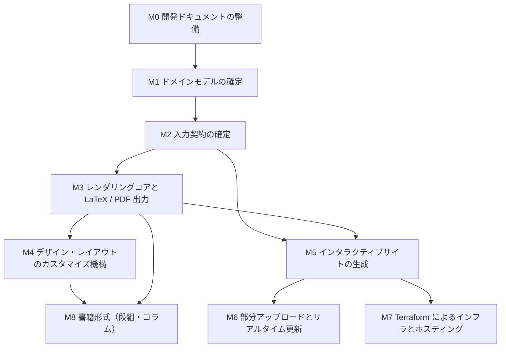

# マイルストーン

構造化テキストのレンダラーを、依存順に並べたゴール単位へ分解したもの。
**各マイルストーンは「依頼者が満たされたと判断できる最終状態」で書く。** 作業手順ではない。

## 依存関係

## 一覧

| # | マイルストーン | 満たされた状態 | 依存 |
| --- | --- | --- | --- |
| M0 | 開発ドキュメントの整備 | テンプレートの `docs/` を複製し、本プロジェクト固有の前提（入力が構造化テキストであること、出力が複数形式であること）を追記した状態 | — |
| M1 | ドメインモデルの確定 | 文書・ブロック・ノード・出力形式・テーマ等の概念と関係が、テンプレートの DDD 方針に沿って定義され、依頼者が承認した状態 | M0 |
| M2 | 入力契約の確定 | レンダラーが受け取る構造化テキストの契約が、既存 2 実装（Ising プロジェクトの構造化テキスト、リアルタイムプレビューの domain-model）を一次情報として一般化され、型で表現された状態 | M1 |
| M3 | レンダリングコアと LaTeX / PDF 出力 | 1 つの入力から、arXiv へ投稿できる純粋な LaTeX と PDF が生成でき、未解決参照ゼロで実際にビルドが通る状態 | M2 |
| M4 | デザイン・レイアウトのカスタマイズ機構 | レンダラー本体を書き換えずに、利用者側の定義だけで出力の体裁を変えられる状態。既定テーマと、それを差し替えた例が動く | M3 |
| M5 | インタラクティブサイトの生成 | 同じ入力から Web サイトが生成され、閲覧者が操作できる（少なくとも参照の相互リンク、目次、数式表示）状態 | M2, M3 |
| M6 | 部分アップロードとリアルタイム更新 | 構造化テキストの一部だけを送ると、閲覧中の全員の画面が更新される状態。複数人が同時に同じサイトを見ながら論文を更新できる | M5 |
| M7 | Terraform によるインフラとホスティング | インタラクティブサイトのホスティング環境が Terraform で構築でき、実際に公開できる状態 | M5 |
| M8 | 書籍形式 | 段組・コラムを差し挟んだ読み物としての出力が生成できる状態 | M3, M4 |

## 進め方

- **1 マイルストーン＝1 セッション**で進める。マイルストーンを跨いだ並列は、依存が無い場合に限る。
- 各マイルストーンの着手時に、`docs/` の思想（特に `programming-philosophy.md` の
  エントロピー最小化と原理主義的 DDD）へ照らして設計を点検する。
- **既存実装を先行事例として必ず読む。** 白紙から設計しない。

## 現在地

- M0: 完了（テンプレートの `docs/` 複製、本ファイル、README）
- M1: **提案完了・依頼者の承認待ち**
  - 成果物: [domain-model.md](./domain-model.md)、根拠は `design-notes/` の 3 本
  - M1 の「満たされた状態」は「依頼者が承認した状態」なので、承認をもって完了とする
  - 承認を要する論点は domain-model.md §13 に 5 件（A: 書籍のコラムの出どころ、
    B: Web テーマの差し替え範囲、C: 公開サイトの公開範囲、D: 数式方言の縛り方、
    E: 複数人同時更新を要件に含めるか）。うち **A と C は M2 の型に影響する**ので、
    M2 着手前に判断が要る
