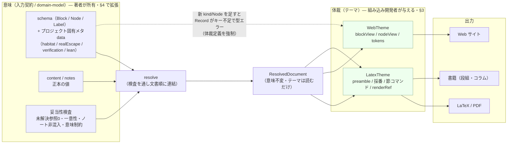

# カスタマイズの境界 — 何を利用者へ開き、何を開かないか

M1（ドメインモデルの確定）の設計判断のうち、「デザインのカスタマイズを利用者へ開くとき、
何を開き、何を開かないか」を一次情報にもとづいて確定させる。根拠はすべて実在ファイルの
実際の記述に置く（憶測・一般論は根拠にしない）。

関連: [プログラミング哲学](../programming-philosophy.md)（エントロピー最小化）、
[言語選択](../language-selection.md)（型安全絶対条件）、
[エラーハンドリング戦略](../error-handling-strategy.md)。

---

## 1. 「利用者」とは誰か

「デザインをカスタマイズできる」という要件（`structured-latex-renderer/README.md` 19–20 行:
「デザイン・レイアウトは利用者側でカスタマイズできる。出力の見た目を変えるのに
レンダラー本体を書き換えなくてよい」）の「利用者」は一意ではない。役割ごとに分ける。

| 役割 | 何をする人か | 一次情報 | この人へ開く対象 |
|---|---|---|---|
| **著者** | 構造化テキスト（`content/*.ts`・`notes/*.ts`）とラベルを書き、正本の**意味**を所有する | Ising `structured-latex/README.md`（`content/` が証明の正本、ラベルが相互参照のキー） | **意味**（ブロック・ノード・ラベル・参照・意味的メタデータ）。体裁は書かない |
| **組み込み開発者** | レンダラーをプロジェクトに組み込み、テーマ/レイアウトを与えて各形式を生成する | `README.md` 19–21 行、`docs/milestones.md` M4（「レンダラー本体を書き換えずに、利用者側の定義だけで出力の体裁を変えられる」） | **体裁**（後述の判定基準を満たす操作のみ） |
| **閲覧者** | 生成された Web サイトを見る | リアルタイムプレビューの `docs/requirements.md` §3.1（別 PC/スマホからの**閲覧 read-only**）、§3.2（ブラウザ側からの編集は out of scope）、§7（認証なし・read-only で許容）。執筆当時は `realtime-web-preview/docs/`、現在は `structured-latex/live-preview/docs/` | **何も開かない**。閲覧は read-only が要件 |

したがって本ドキュメントで「デザインのカスタマイズを開く相手」＝**組み込み開発者**である。
著者へ開くのは意味だけ（体裁を書かせない）、閲覧者へは何も開かない。この 3 者の混同を避けることが、
以下の判定基準を意味のあるものにする前提である。

---

## 2. 開く／開かないの判定基準

### 2.1 基準（判定可能な形）

ある操作 X を組み込み開発者へ開いてよいのは、次を**すべて**満たすときに限る。

- **(a) 正本不変**: X は正本（`content` のブロック値・`notes` のノート値）を変更しない。
  同じ入力に対して、X の適用前後で「何が書かれているか」が一致する。
- **(b) 検査不変**: X は正本の妥当性検査の結果を変えない。ここでいう妥当性検査とは、先行実装が
  機械化している次を指す — **未解決参照ゼロ・ラベル/id の一意性**（Ising
  `tools/generate-index.ts`、`document.generated.ts` の `_Unique*` / `_NoIdCollision` /
  `_NoStale*`）、**ノート非混入**（Ising `schema.ts` の `notes?: never`、build-latex.ts が
  `loadNoteFiles` を呼ばない設計）、および**意味的メタデータの制約**（integrable `schema.ts` の
  `habitat` 必須・`realEscape` 要否）。
- **(c) 体裁限定**: X は出力の「どう見えるか」だけを決め、「何が書かれているか」を決めない。

X がこのいずれかを破るなら、それは**意味の操作**であってデザインのカスタマイズではない。
体裁の器（テーマ）では開かず、§4 の別機構（入力契約＝ domain-model の拡張）で扱う。

この基準は「意味（semantics）は開かず体裁（presentation）だけ開く」という原則を、
判定できる形へ具体化したものである。先行実装で意味と体裁が実際に分離できていることは、
体裁が独立変数として括り出されている事実で裏づけられる — 例えば block-card.tsx の
`kindLabels` / `kindAccent`（表示語・配色）は体裁、`block.kind`（種別）は意味であり、両者は
別の値として並存する。heading-view.tsx の `levelStyles`（level→CSS）も同型で、`level`（意味）は
不変のまま写像先（体裁）だけを差し替えている。

### 2.2 具体項目への適用（すべて結論する）

| 項目 | 結論 | 根拠（一次情報） |
|---|---|---|
| **LaTeX プリアンブル**（documentclass, パッケージ, フォント） | **開く** | build-latex.ts `renderDocument` の `\documentclass` / `\usepackage` / `\setCJKmainfont` は純粋に体裁。(a)(b)(c) を破らない |
| **定理環境の見出し語と採番規則**（`\newtheorem` の連番共有） | **開く** | 見出し語（build-latex.ts `THEOREM_ENVIRONMENTS` の `"定義"` 等）は表示語＝体裁。採番（`[definition]` 連番共有・`[section]` リセット）も体裁: 参照は**ラベル**で解決し（schema.ts `RefNode.target: Label`）、`\cref` は採番の結果を表示するだけ。番号を変えてもアンカーと表示は同じ counter を使うので (b) 未解決参照検査を破らない |
| **見出しレベル→節コマンド**（level 1 を `\part` に写す） | **開く** | build-latex.ts `SECTION_COMMANDS`、heading-view.tsx `levelStyles` はいずれも level→表示の写像。`level`（階層の深さ＝意味）は不変で、写像先だけが体裁 |
| **CSS/配色/タイポグラフィ** | **開く** | block-card.tsx / heading-view.tsx / note-view.tsx の Tailwind クラスは体裁のみ |
| **ブロック種別ごとのコンポーネント差し替え** | **開く**（種別集合は固定） | nodes.tsx `NodeView` / block-card.tsx が kind ごとに描画を分岐。差し替えは体裁。ただし種別を**増減**するのは別（下記） |
| **段組・コラムの配置** | **開く** | `docs/milestones.md` M8（段組・コラムは体裁の出力形式）。レイアウトは (a)(b)(c) を破らない。コラムに載せる素材が `notes` 由来なら、本文へは出さない（(b) ノート非混入）ことと整合させる |
| **ノードの描画方法**（math を KaTeX 以外で描く） | **開く** | nodes.tsx `KatexMath` は差し替え可能な描画点。Node の意味（`tex` 文字列、schema.ts `MathNode`）は不変で、描画エンジンは体裁 |
| **新しいブロック種別・ノード種別の追加** | **開かない**（体裁機構では） | discriminated union（block.ts `nodeSchema` / `blockKindSchema`）への新メンバー追加＝**入力契約の変更**。nodes.tsx `assertNever` の網羅性・全出力ジェネレータ・妥当性検査に波及し (b)(c) を破る。§4 の別機構で扱う |
| **参照の表示形式** | **開く**（表示のみ） | build-latex.ts の `\cref` vs `\hyperref[...]{label}`、nodes.tsx `RefLink` の `displayText`・リンク体裁は表示形式＝体裁。ただし `ref.target`（**どのラベルを指すか**）は意味で不変 |

判定は 9 項目すべてで基準から一意に決まり、依頼者の価値判断を要する未決点は残らない。

---

## 3. カスタマイズを受け取る器（テーマ/レイアウト定義）

### 3.1 テーマは何であって何でないか

- **テーマである**: 意味不変な「解決済み文書」から、各出力ターゲット（LaTeX / PDF / Web / 書籍）の
  **体裁を決める写像の集合**。§2.2 で「開く」とした項目だけを持つ。
- **テーマでない**: 正本の値の変更、妥当性検査の緩和、ブロック/ノード種別の増減、`ref` 先の変更。
  これらは (a)(b)(c) を破るので器に入れない。

### 3.2 任意コードを許すか、宣言に閉じるか

`programming-philosophy.md` のエントロピー最小化（19 行「エントロピー = 選択肢の多さ」）と
`language-selection.md` の型安全絶対条件（5 行「静的解析による型安全が担保されていない言語は
使用しない」）に照らして結論する。

- **レンダラー内部に触れる任意コード・外界（プロセス境界）にアクセスするコードは開かない。**
  選択肢が無限になりエントロピーが発散し、(b) 検査不変も型で守れなくなる。外界アクセスは
  `fetch` レイヤの責務（`architecture-frontend.md`）であって体裁の器の責務ではない。
- **文字列・トークンで表せる体裁は宣言的設定に閉じる**（プリアンブル文字列、見出し語、
  level→節コマンド表、配色トークン、採番規則）。
- **描画だけは「型で境界を閉じた関数スロット」を許す。** math を KaTeX 以外で描く（§2.2）には
  関数が要る（nodes.tsx `KatexMath` は関数コンポーネント）。純宣言では表現できないため。
  ただしこれは「任意コード」ではなく、**レンダラーが定義した固定インターフェースを満たし、
  既存の種別集合を網羅的に埋める関数**に限る。エントロピーは「Record のキーを全部埋める」に
  縛られる。既に block-card.tsx の `kindLabels: Record<TheoremLikeKind, string>` がこの形。

### 3.3 型での表現

```typescript
// 全ターゲット共通の入力: 意味不変な「解決済み文書」。
// ここに現れる Block / Node / Label / LabelIndex は入力契約（domain-model）が定義する。
// テーマはこの値を読むだけで、変更しない（判定基準 (a)）。
type ResolvedDocument = {
  blocks: readonly Block[]        // 配列順が文書順（当時の realtime-web-preview block.ts と同契約。
                                  // 現在の正本は domain-model/structured-text/）
  notes: readonly Note[]          // 本文ではない。ターゲットが本文へ混ぜない（判定基準 (b)）
  labelIndex: LabelIndex          // ラベル → block.id（buildLabelIndex）。ref はこれで解決
}

// --- LaTeX / PDF ターゲットの体裁（§2.2 で「開く」とした項目だけ） ---
type LatexTheme = {
  preamble: string                                   // documentclass / packages / fonts
  // 見出し語（heading）と採番規則（numberedWith）。網羅性を Record で型強制する。
  theoremEnvironments: Record<
    TheoremLikeKind,
    { env: string; heading: string; numberedWith?: TheoremLikeKind | 'section' }
  >
  sectionCommands: readonly [string, string, string, string, string, string] // level 1..6
  renderRef: (ctx: { target: Label; number: string; label?: string }) => string // 参照の表示形式
}

// --- Web ターゲットの体裁 ---
type WebTheme = {
  // kind / Node type ごとの描画。Record が全キーを要求するので、網羅漏れは型で落ちる
  // （＝ nodes.tsx の assertNever と同じ網羅性保証を、差し替え可能な形にしたもの）。
  blockView: Record<BlockKind, BlockComponent>
  nodeView: Record<Node['type'], NodeComponent>      // math を KaTeX 以外にする差し替え点
  headingLevelTag: Record<HeadingLevel, string>      // level → HTML タグ
  tokens: { colors: ColorTokens; typography: TypographyTokens } // 宣言的トークン
  renderRef: (ctx: { target: Label; anchorId: string | undefined; label?: string }) => ReactNode
}
```

`Record<BlockKind, …>` / `Record<Node['type'], …>` が網羅を強制する点が要（`assertNever`、
`architecture-overview.md` 設計原則 1 の網羅性保証）。新しい種別が意味側に増えれば、テーマの
Record がキー不足で**型エラーになり**、体裁の定義を強制する。これは望ましい連結である（§4）。

---

## 4. 意味の拡張と体裁の拡張 — 同じ機構か別機構か

### 4.1 一次証拠

先行 2 実装は schema.ts を**複製して分岐**した。integrable-lattice `schema.ts` は Ising 版に
`habitat` / `realEscape` / `verification` / `lean` を型と実行時の両方で追加している
（`Habitation` 判別共用体、`validateHabitation` / `validateLinkage`）。この分岐は明示的な設計判断で、
integrable `structured-latex/README.md` 10 行「実質的に共有できるのはスキーマとツールだけだから
（複製の方が安全）」、34 行「この基盤は複製である（共有ライブラリではない）」がそれを述べる。
これは「ブロックのメタデータをプロジェクト側で拡張したい」という要求の一次証拠であり、
その拡張が**意味**（可算/非可算の分別、ℝ 脱出の明示、検証との紐づけ）であることを示す。

### 4.2 結論: 別機構にする

**意味の拡張と体裁のカスタマイズは別機構で扱う。**

| 軸 | 意味の拡張 | 体裁のカスタマイズ |
|---|---|---|
| 何を変えるか | 入力契約（domain-model の schema）。新フィールド・新 kind・新 Node type・検査ルール | 解決済み文書からの表示写像（テーマ） |
| 例 | integrable の `habitat` 必須・`realEscape` 要否・`verification` 実在検査 | プリアンブル・配色・節コマンド写像・描画スロット |
| 所有者 | 著者/プロジェクトの数学的要求 | 組み込み開発者の体裁要求 |
| 判定基準 | (a)(b)(c) を**破る**（検査結果・意味を変える） | (a)(b)(c) を**満たす** |
| マイルストーン | M2 入力契約の確定 | M4 カスタマイズ機構 |

別機構にする根拠（一次情報）:

1. **影響範囲が違う。** `habitat` 追加は型検査・`validate-content`・PDF への印字
   （integrable README 23 行「住処と ℝ 脱出は PDF にも印字する」）へ波及＝**妥当性検査そのものを
   変える**。これは判定基準 (b) を破るので、定義上テーマではない。
2. **網羅性の担保が違う。** 意味拡張は discriminated union に新メンバーを足す操作で、nodes.tsx
   `assertNever` が全ジェネレータで網羅漏れをコンパイルエラーにする。体裁拡張は union を増やさず、
   §3.3 の `Record<Kind, View>` で既存キーを埋めるだけ。前者を後者の器に載せると、テーマが種別集合を
   増減でき、種別の網羅性・ラベル一意性・ノート非混入（判定基準 (b)）を破る経路になる。
3. **エントロピーが違う。** 体裁を触るだけの操作に意味変更の自由度を混ぜると選択肢が増える
   （`programming-philosophy.md` 19 行に反する）。関心を分けたままにするのがエントロピー最小。

### 4.3 別機構だが型で連結する

両者は独立だが接続する。意味側で新しい kind / Node type を足すと、§3.3 のテーマの
`Record<BlockKind, …>` / `Record<Node['type'], …>` が**キー不足で型エラーになり**、新しい意味に
対する体裁の定義を強制する。これは当時の realtime-web-preview の Zod スキーマ（block.ts）を入力契約の
SSOT とし、そこから体裁の網羅性を型で導く関係と同型である。「別機構・型で連結」が、
意味と体裁を混ぜずに整合を保つ最小構成になる。

---

## 5. 全体の関係（図）



閲覧者（read-only、requirements §3.1/§7）はこの図のどのノードも書き換えない。生成済みの
「出力」を見るだけである。
