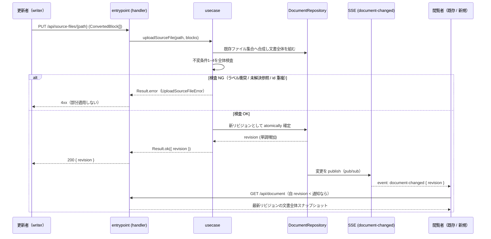
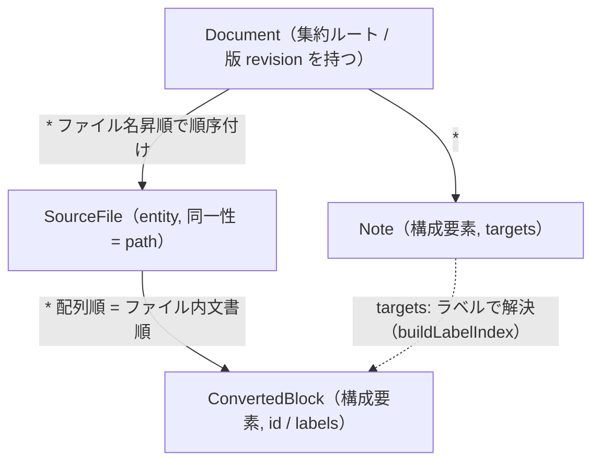

# 部分アップロードとリアルタイム更新の「更新の単位」

M1「ドメインモデルの確定」の設計判断のうち、**「構造化テキストを部分的にアップロードして
リアルタイム更新するとき、更新の単位は何か」** を一次情報に基づいて確定する。

要件の出典: `structured-latex-renderer/README.md`（L22–23「構造化テキストを部分的に
アップロードして画面を更新できる。論文をリアルタイムに更新しながら、同じサイトを複数人が
同時に見る使い方を想定する」）。

## 0. 結論（先に述べる）

- **アップロード（コマンド）の単位 = ソースファイル1つ分のブロック列**（`defineBlocks` が
  定義する `ConvertedBlock[]`。path で同一性を持つ `SourceFile`）。ブロック1件ではなく、
  文書全体でもない。
- **整合性・配信の単位 = 文書全体のスナップショット**。集約（aggregate）は文書全体であり、
  1回のアップロードは集約に対する1コマンド。合成後の文書全体で不変条件を検査してから
  1つの新リビジョンとして確定し、確定済みスナップショットだけを閲覧者へ配る。
- アップロードされた構造化テキストを保持するものは **repository**（gateway ではない）。
- 配信は **無効化通知（新リビジョン番号）を SSE で送り、閲覧者は文書全体を再取得**する。
  差分は送らない。
- 収束保証のため **文書全体に対する単調増加リビジョン（revision）を導入する**。

## 1. 候補の比較

一次情報から導かれる更新の単位の候補は次の3つ。

- **(A) ブロック1件** — 単一の `ConvertedBlock`。
- **(B) ソースファイル1つ分のブロック列** — `defineBlocks` が受け取る `ConvertedBlock[]`
  （`exact-solution-of-2d-ising-model/structured-latex/schema.ts` の `defineBlocks`：
  「1ファイル分のブロック列を定義する。配列の並びが文書順の正準表現」）。
- **(C) 文書全体** — 全ファイルのブロック列 ＋ 全ノート。

| 比較軸 | (A) ブロック1件 | (B) ファイル1つ分 | (C) 文書全体 |
|---|---|---|---|
| **(a) 文書順の正準表現との整合**<br>（先行実装は「ファイル名昇順 × ファイル内配列順」を文書順とする：`schema.ts` の `defineBlocks` 注、`tools/generate-index.ts:181`「文書順（ファイル名昇順 × 配列順）に連結した全ブロック」） | ブロック単体は所属ファイルも順序も持たない。挿入位置・所属を別メタで与えないと文書のどこに入るか表せない → 正準表現の外に順序情報が漏れる | ファイルが順序単位そのもの。ファイル名がファイル間順序、配列がファイル内順序を自己完結して表す。正準表現と一致 | 順序は完全保持。ただし「部分」アップロードではない |
| **(b) ラベル一意性・相互参照の解決**（文書全体にかかる不変条件。`labels.generated.ts` が「実在ラベルのユニオン」を与え `ref` はこれしか指せない。`document.generated.ts`「ファイルを跨いだ一意性は両方を同時に見るこのモジュールでしかできない」） | 送ったブロックのラベルが他ファイルと衝突しないか・`ref` 先が実在するかは文書全体を見ないと不可。検査境界とアップロード境界がずれる | 同上（ファイル跨ぎ一意性はファイル単体では保てない）。ただしアップロード境界＝順序単位境界が一致し、合成→全体検査が素直 | 全体が一度に揃うので検査は自明。だが部分更新の要件を満たさない |
| **(c) 削除・並べ替え・ファイル分割変更の表現** | 削除は可。並べ替え・分割は順序/所属メタが別途必要で表現が増える | ファイル集合への upsert / delete で自然に表現（追加=新 path、削除=path 削除、リネーム=順序変更、分割=1→2 ファイル）。旧Webビューアも `*.ts` をファイル名順に読み、ファイルを順序単位にしていた（現在は git 履歴のみ） | 毎回全差し替えなので何でも表せるが「部分」ではない |
| **(d) 同時閲覧中の一貫性（中途半端を見せない）** | ブロック単位で反映すると、ラベル衝突・未解決参照が一時的に生じた壊れた文書を配信し得る | ファイル単位でも同じ危険はあるが、後述のとおり配信は常に「全体検査を通ったスナップショット」に限るため回避可能 | 全差し替え自体は一貫。ただし帯域と再送コストが大きく、複数閲覧者・部分更新の趣旨に反する |

## 2. 結論と根拠

**アップロードの単位はソースファイル1つ分のブロック列（B）**、**整合性・配信の単位は
文書全体のスナップショット（C）** とする。ブロック1件（A）は採らない。

根拠:

1. **順序が自己完結する（軸 a）**。文書順は「ファイル名昇順 × 配列順」で決まる
   （`generate-index.ts:181`、`schema.ts` の `defineBlocks` 注）。ファイルは順序単位そのものなので、
   ファイル単位アップロードは順序を追加メタなしで表せる。ブロック1件は所属ファイルも順序も
   持たず、挿入位置メタを外付けする必要が生じ、選択肢を増やす
   （`docs/programming-philosophy.md` のエントロピー最小化に反する）。
2. **不変条件はどの粒度でも文書全体でしか保てない（軸 b）**。ラベル・id の一意性と参照解決は
   ファイル跨ぎの性質であり、`document.generated.ts` が「両方を同時に見るモジュールでしか
   判定できない」と明記する。したがって確定は必ず文書全体トランザクション。ならば
   アップロード境界を順序単位（ファイル）に合わせるのが最も素直で、合成→全体検査→確定が
   一直線になる。
3. **削除・並べ替え・分割を単純な代数で表せる（軸 c）**。ファイル集合への upsert / delete だけで
   全操作を表現でき、旧Webビューアのファイル読込・順序モデルとも連続する。

## 3. DDD 語彙での位置づけ

### entity / 値オブジェクト / 集約境界

- **`SourceFile`（ソースファイル1つ分）は entity**。同一性キーは path。中身の `ConvertedBlock[]` が
  差し替わっても「同じファイル」であり続ける（同一性とライフサイクルを持つ）。
- **`Document`（文書全体）が集約ルート（aggregate root）**。集約の境界は
  **文書全体 = 全 `SourceFile` ＋ 全 `Note`**。個々の `ConvertedBlock` / `Note` は集約の
  内部構成要素であり、集約の外から単独で参照・更新される単位にはしない。
- ファイル単体を集約にしてはならない。下記の不変条件がファイル跨ぎだから、集約境界を
  ファイルに縮めると不変条件を集約内で閉じられなくなる。

### 不変条件（invariant）

文書全体（集約）に対して成り立つべき条件。いずれも一次情報に対応する:

1. **ラベルの大域一意性**（`document.generated.ts`「ファイルを跨いだ一意性を主張」）。
2. **ブロック id / ノート id の大域一意性**（同上）。
3. **相互参照の解決可能性**：全 `ref.target` と `note.targets` が実在ラベルへ解決する
   （`labels.generated.ts` は実在ラベルのユニオン、`ref` はそれ以外を指せない。
   ノート解決は当時 `realtime-web-preview/domain-model/src/block.ts` の
   `buildLabelIndex`/`placeNotes`：未解決は `orphans` として捨てず可視化。
   その後この解決はシステムへ吸収され、現在は
   `domain-model/resolved/resolve.ts` の `resolveTolerantly` が `orphanNotes` として返す）。
4. **文書順の全順序が一意に定まる**（ファイル名昇順 × 配列順）。

### トランザクション境界

**トランザクション境界 = 集約 = 文書全体**。1ファイルのアップロードは集約への1コマンド。
処理は「①アップロードされたファイルを既存ファイル集合へ合成 → ②合成後の文書全体で不変条件
1–4を検査 → ③通れば新リビジョンとして atomically 確定、④落ちればアップロード全体を拒否し
部分適用しない」。④により、ラベル衝突や未解決参照が残る中途半端な文書は決して確定・配信
されない（軸 d を保証）。

### repository か gateway か

`docs/architecture-backend.md` の判定基準は **「自 domain が所有する entity の CRUD（+pub/sub）か
（→ repository）、それ以外の外部 domain へのアクセスか（→ gateway）」** であり、同ファイルは
**「永続化の有無で repository か gateway かを分けてはならない」「in-memory の read model でも
自 domain の entity を CRUD/pub-sub するなら repository」** と明記する。

- アップロードされた構造化テキストを保持するものは、**この domain が所有する
  `Document`/`SourceFile` entity を create/update/delete し、変更を pub/sub して閲覧者へ配る**。
  これは「自 domain の entity の CRUD + pub/sub」そのもの → **repository**。
- backing store が in-memory でも repository の分類は変わらない（判定は永続化の有無に依らない）。
  永続化先（in-memory / Cloud SQL / Redis 等）の選択は `codegen/config/storage.ts` の storage 設定の
  別問題であり（`docs/architecture-overview.md` §storage 設定）、repository/gateway の判定を動かさない。

> **旧Webビューア（執筆当時 `realtime-web-preview/`、現在は廃止）との決定的な差**：
> あちらは入力ソース（FS 上の read-only な `.ts`）を
> **読むだけ**なので所有 entity が無く、`BlockSourceGateway`/`SourceWatcherGateway` という
> **gateway** で扱った（同 `docs/architecture.md` §5「所有 entity を持たず
> 永続化しないため repository は無く、外部依存は gateway のみ」）。本プロジェクトは
> **アップロードを受理して保持・pub/sub する**ため、構造化テキストは外部ソースではなく
> 自 domain の所有 entity になり、**repository** が正しい。

## 4. リアルタイム配信

### 現行方式は一般化できるか

旧Webビューアの方式は **fs.watch → SSE `reload` → 全文書再フェッチ**だった:

- `backend/src/preview/adapter/gateways/fs-source-watcher-gateway.ts` が `fs.watch` で
  ローカル dir を監視、`entrypoint/handlers/events-handler.ts` が変更時に
  `event: reload` を push、`frontend/.../fetch/use-document.ts` が `reload` 受信で
  `invalidateQueries` → `GET /api/document` で**全文書を再取得**する。

クラウドホスティング・複数閲覧者・部分アップロードの条件下で、**変わる部分**と
**そのまま一般化できる部分**を分ける。

- **変わる部分（変更検知の起点）**：変更の起点はローカル FS 編集ではなく
  **アップロード API 呼び出し**になる。よって `fs.watch`（ローカル単一マシン前提）は不要になり、
  変更 publish は **repository がアップロード確定（§3 のトランザクション確定）時に自 entity の
  変更イベントを pub/sub する**形に置き換わる（repository の責務に pub/sub が含まれる：
  `docs/architecture-backend.md`）。
- **そのまま一般化できる部分（配信スタイル）**：「無効化通知を SSE で送り、閲覧者は最新の
  文書全体を再取得する」というスタイルは一般化できる。差分計算・順序化・取りこぼし再送を
  クライアントに持ち込まずに済み、エントロピーが最小（`docs/programming-philosophy.md`）。
- **複数閲覧者でのスケール**：SSE の subscriber は配信インスタンスのメモリ内に載る。
  要件（README L22–23）は「複数人が同時に**見る**」＝複数 reader・書き手は論文更新者であり、
  **単一の配信インスタンス（＝単一 writer・in-memory repository）で満たせる**。早すぎる分割を
  避け（`docs/programming-philosophy.md`）、初期は単一インスタンス配信を既定とする。
  配信インスタンスを水平スケールする要件が出た時点で、**pub/sub をプロセス外の共有基盤へ
  広げる**のが唯一の変更点（repository の pub/sub 実装＝adapter の差し替えで閉じる）。

### 配信イベントのペイロード（差分か、無効化通知か）

**無効化通知だけを送り、差分は送らない。** ペイロードには新リビジョンだけを載せる
（差分を載せるとクライアント状態依存の再同期ロジックが要り、収束保証が難しくなる）。

```typescript
// domain-model/api-contract/*.ts — SSE イベント（無効化通知）
export const DOCUMENT_CHANGED_EVENT = 'document-changed' as const

/** ソース変更のたびに push。差分は含めず、変更後リビジョンだけを通知する。 */
export type DocumentChangedEvent = {
  /** 変更後の文書リビジョン。閲覧者は自分の版と比較し、古ければ全文書を再取得する。 */
  revision: DocumentRevision
}
```

## 5. 収束保証と版（revision）

「閲覧中の全員の画面がリアルタイムに更新される」＝ 後から参加した閲覧者と既存の閲覧者が
**同じ状態に収束する**ことを保証する。

- 各閲覧者が見るのは常に「**あるリビジョンの文書全体スナップショット**」。新規参加者は
  `GET /api/document` で最新リビジョンを取得し、既存閲覧者は `document-changed` 受信で
  取り直す。両者とも「最新リビジョンの全文書」に収束する。
- **revision は必要**。根拠:
  1. 通知と再取得の間にさらにアップロードが起きても、`GET` 応答と SSE 通知の双方に revision を
     載せ「自分の revision < 通知の revision なら再取得」とすれば、**単調に最新へ収束**できる
     （版が無いと自分がどの状態を見ているか判定できない）。
  2. revision は**文書全体（集約）に1つ**。ファイル単位ではなく、集約のトランザクション確定
     （§3）ごとに単調増加する。集約境界＝トランザクション境界＝版の付与単位が一致する。
- GET 応答は当時の `realtime-web-preview/domain-model/src/api-contract.ts` の `documentResponseSchema`
  （`blocks` / `notes` / `generatedAt` / `sourceLabel`）を踏襲し、これに `revision` を加える。
  旧ビューア専用契約はアプリとともに廃止した。公開サイトの契約は
  `domain-model/api-contract/live-site.ts` にある。

```typescript
/** 文書全体（集約）確定ごとに単調増加・一意な版識別子。 */
export type DocumentRevision = string

/** GET /api/document の成功応答（当時の realtime-web-preview の DocumentResponseBody に revision を追加）。 */
export type DocumentResponseBody = {
  blocks: ConvertedBlock[]
  notes: Note[]        // 参照用ノート（文書本体ではない）
  revision: DocumentRevision
  generatedAt: string
  sourceLabel: string
}
```

## 6. 型（api-contract 相当）

エラー code は `docs/error-handling-strategy.md` に従い operation ごとに網羅する
（`internal_error` は全 operation に存在するが「実際に返るのは contract の設計漏れ」なので、
下の明示 code で漏れを塞ぐ）。§3 の不変条件違反はすべて明示 code に落とす。

```typescript
// domain-model/api-contract/*.ts — アップロード（コマンド）契約
// PUT    /api/source-files/{path}   ファイル1つ分のブロック列を upsert
// DELETE /api/source-files/{path}   ファイルを削除
// いずれも「合成後の文書全体」を検査してから確定する（部分適用しない）。

export type ValidationIssue = { path: string; message: string }

export type UploadSourceFileError =
  | { code: 'validation_error'; issues: ValidationIssue[] }              // ブロック形状が schema 違反
  | { code: 'duplicate_label'; labels: string[] }                        // 不変条件1: ラベル大域一意性の破れ
  | { code: 'duplicate_id'; ids: string[] }                              // 不変条件2: id 大域一意性の破れ
  | { code: 'unresolved_reference'; refs: { from: string; target: string }[] } // 不変条件3: ref/targets 未解決
  | { code: 'revision_conflict'; currentRevision: DocumentRevision }     // 楽観ロック不一致（§7）
  | { code: 'internal_error' }                                           // 設計漏れの指標

export type DeleteSourceFileError =
  | { code: 'source_not_found' }                                         // 対象 path が無い
  | { code: 'unresolved_reference'; refs: { from: string; target: string }[] } // 削除で他ファイルの参照が切れる
  | { code: 'revision_conflict'; currentRevision: DocumentRevision }
  | { code: 'internal_error' }

/** アップロード成功応答：確定した新リビジョン（閲覧側の収束判定に使う）。 */
export type UploadSourceFileResult = { revision: DocumentRevision }
```

### 状態遷移（アップロード → 確定 → 配信 → 収束）



### 集約の構造



## 7. 依頼者の判断が要る点（1件）

一次情報から一意に決まらず、価値判断が要るのは **複数 writer の並行更新の衝突解決を初期から
必須にするか** の1点のみ。

- README L22–23 の要件は「複数人が同時に**見る**／論文をリアルタイムに更新」であり、
  書き手（論文更新者）が複数同時に write する要求は明示されていない。よって**単一 writer 前提**で
  収束（§5）は満たせる。
- 一方 §6 の型には `revision_conflict`（`PUT`/`DELETE` に「読んだ時の revision」を条件付けて
  lost update を検出する楽観ロック、HTTP の `If-Match` 相当）を**入れてある**。

**推奨：型として `revision_conflict` を用意しておき、初期実装は単一 writer 前提とする**
（並行 write の衝突マージまでは作り込まない）。根拠は早すぎる作り込みを避けること
（`docs/programming-philosophy.md`）と、後から並行 write を要件化しても revision 比較の有効化だけで
済み型契約を壊さないこと。複数人同時 write を M6 の要件に含めるか否かだけ、依頼者に確認したい。
