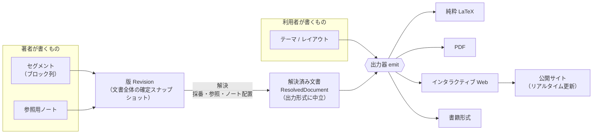
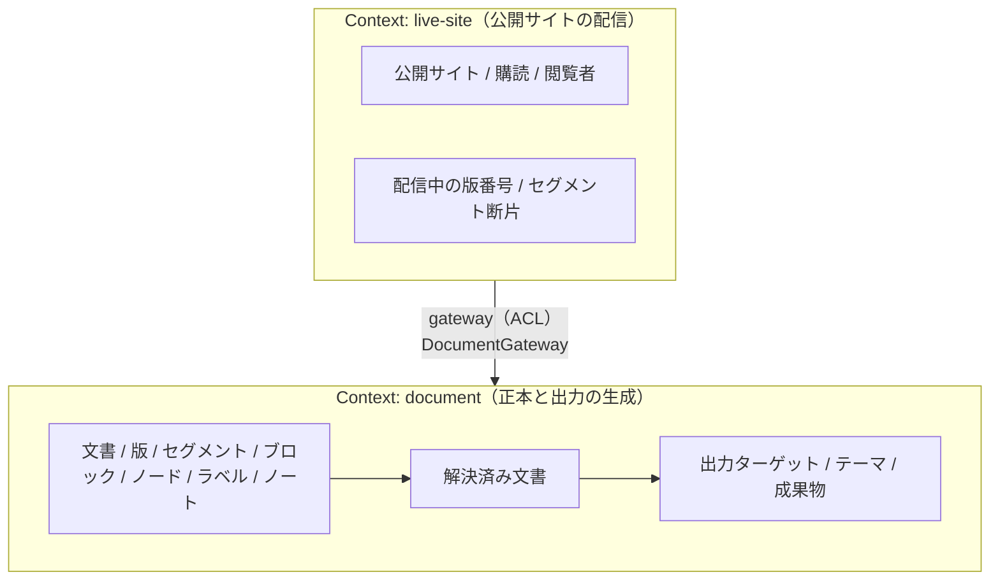
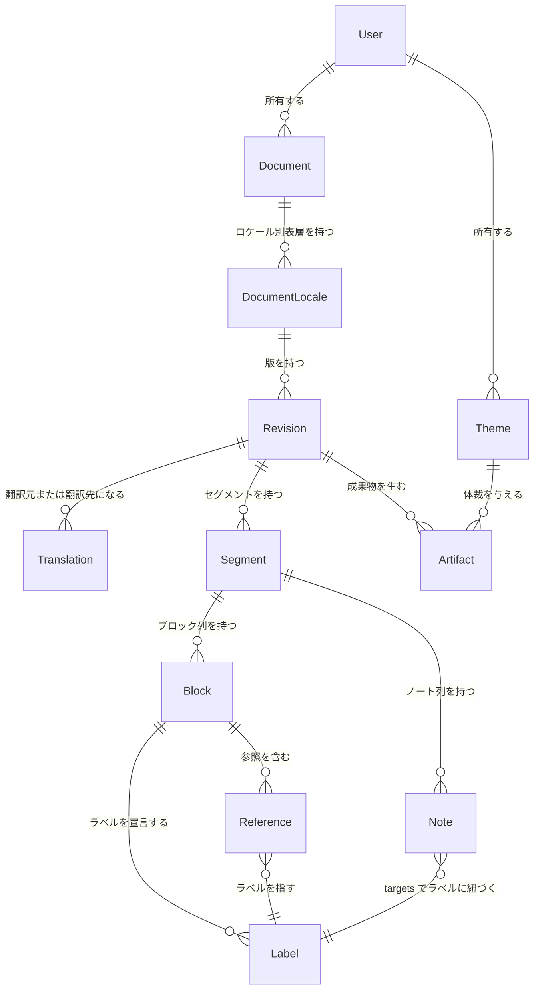
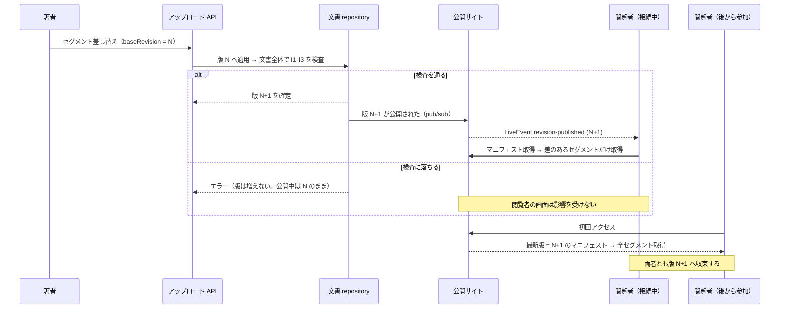

# ドメインモデル

マイルストーン M1（[milestones.md](./milestones.md)）の成果物。
構造化テキストという単一の正本から複数の出力を生成するにあたって、
**何が概念として存在し、どれが同一性を持ち、どの不変条件をどの境界で保つか**を定める。

方針の前提は [programming-philosophy.md](./programming-philosophy.md)（エントロピー最小化・原理主義的 DDD）、
[architecture-overview.md](./architecture-overview.md)（SSOT・依存方向・Bounded Context の分割基準）、
[language-selection.md](./language-selection.md)（型安全を絶対条件とする）である。

本ドキュメントは**白紙から書いていない**。先行 2 実装
（`exact-solution-of-2d-ising-model/structured-latex/`、`realtime-web-preview/`）と
その分岐（`integrable-lattice/structured-latex/`）を一次情報として読み、
そこで既に決まっている事柄を §1 に列挙したうえで、その上に載せている。

> **旧パスの読み替え。** 上記の `realtime-web-preview/`（リポジトリ直下の独立アプリ）は、
> その後システム内のモジュール `structured-latex/live-preview/` へ吸収され、**現存しない**。
> 本ドキュメントで `realtime-web-preview/...` と書かれているものは、
> **当時そこにあった**という歴史の記録である（無かったことにはしない）。現在の対応先は次のとおり。
>
> | 当時の場所 | 現在 |
> |---|---|
> | `realtime-web-preview/backend/`, `frontend/` | `structured-latex/live-preview/backend/`, `frontend/` |
> | `realtime-web-preview/docs/` | `structured-latex/live-preview/docs/` |
> | `realtime-web-preview/domain-model/src/block.ts`（言語の 3 度目の定義。撤去直前は `structured-text.ts` に改名されていた） | 廃止。`structured-latex/domain-model/structured-text/` に一本化 |
> | `realtime-web-preview/domain-model/src/note-placement.ts`, `frontend/src/pages/document-view/ui/ref-resolver.ts`（独自の解決） | 廃止。`structured-latex/domain-model/resolved/resolve.ts` の `resolveTolerantly` に一本化（**F9 は解消済み**） |
> | `realtime-web-preview/domain-model/src/api-contract.ts` | `structured-latex/domain-model/api-contract/live-preview.ts` |

個別の設計判断の詳細な根拠は `docs/design-notes/` に分けてある。
本ドキュメントには結論と、モデルに効く部分だけを書く。

## 0. このシステムが持つもの・持たないもの

**このシステム（`structured-latex/`）が、構造化テキストという入力言語の正本を 1 つだけ持つ。**
レンダラー（出力器）は、そのドメインモデルの上に載る**モジュール**であって、逆ではない。

一次情報が示していたのは、同じ言語が 3 回定義されている状態である。

| 場所 | 何を定義していたか |
|---|---|
| `exact-solution-of-2d-ising-model/structured-latex/schema.ts` | ブロック・ノード・ラベル・ノートの型と実行時検証 |
| `integrable-lattice/structured-latex/schema.ts` | 上を複製し、住処・ℝ 脱出・検証紐づけを追加したもの |
| `realtime-web-preview/domain-model/src/block.ts`（当時のパス。現在は廃止） | 同じ言語の 3 度目の定義（Zod） |

加えて、ラベル → ブロックの解決が 2 回、独立に実装されている（F9）。
**この重複を 1 つにすることが、このシステムの存在理由である。**

したがって所有関係はこうなる。

| 誰が持つか | 何を |
|---|---|
| このシステム | 入力言語の語彙（ブロック・ノードの種別）、検査、解決、生成器 |
| 各プロジェクト | 文書の中身（`content/`）、プロジェクト固有メタデータの**宣言**、生成物 |
| 組み込み開発者 | 体裁（テーマ・レイアウト・採番方針） |

**語彙を増やせるのはこのシステムだけである**（§8.3）。プロジェクト側が増やせるのは
意味のメタデータだけで、これは体裁の拡張（テーマ）とも別機構である（§8.5）。

---

## 1. 一次情報から既に確定している事実

以下は先行実装のコードとドキュメントに実在する記述であり、**本プロジェクトが決め直す対象ではない**。
モデルはこれらと整合しなければならない。

| # | 事実 | 一次情報 |
|---|---|---|
| F1 | 文書順の正準表現は**ブロック配列の並び**。文書全体の順序は「`content/*.ts` をファイル名昇順に並べ、各ファイル内は配列順」で復元される | `exact-solution-of-2d-ising-model/structured-latex/README.md`（"Document order"）、`tools/content-modules.ts`（`listSourceFiles` が `sort()`） |
| F2 | ブロックは 2 種。**見出し**（`level` 1..6・`title` 必須・本文を持たない）と**定理型**（`theorem`/`definition`/`claim`/`remark`/`note`・`statement` 必須・`proof` 任意）。見出しに本文を書くこと、定理型に `level` を書くことは型で拒否される | `structured-latex/schema.ts`（`HeadingBlock` / `TheoremLikeBlock` の `never` フィールド） |
| F3 | ノードは 7 種（`text`/`math`/`displayMath`/`paragraph`/`list`/`ref`/`todo`）。**数式は KaTeX 向けの LaTeX 文字列**として保持する | `structured-latex/schema.ts`、同 `README.md`（"Mathematical expressions are stored as LaTeX strings intended for KaTeX"） |
| F4 | 相互参照のキーは**ラベル**であって、ファイルパスでもブロック id でもない。ラベルは文書全体で一意。`ref()` の宛先は生成されたラベルのユニオン型に縛られ、存在しないラベルは**コンパイル時**に落ちる | `structured-latex/schema.ts`（`RefNode.target: Label`）、`labels.generated.ts`、`tools/generate-index.ts` |
| F5 | **ノートは文書本体ではない。** 最終成果物の生成は `content/` だけを読み、`notes/` を読まない。ブロックに `notes` フィールドは書けない | `structured-latex/schema.ts`（`notes?: never`）、`tools/build-latex.ts`（`loadNoteFiles` を呼ばない）、`tools/verify-no-notes-in-output.ts` |
| F6 | **体裁の決定は生成器が全部持っている。** `documentclass`・パッケージ・フォント・定理環境名と見出し語・見出し level → `\part`/`\section` の対応・別行立て数式の縮小（`\fitdisplay`）・`ref` → `\cref`。正本側にはこれらの記述が一切ない | `structured-latex/tools/build-latex.ts` |
| F7 | 生成は**検査つきで落ちる**: 未解決参照ゼロ、ラベル重複なし、フォントに無い文字ゼロ、版面外へ出た行ゼロ。1 件でもあれば生成を中止する | `structured-latex/tools/build-latex.ts` |
| F8 | 同じ土台のスキーマが 2 プロジェクトで**複製**され、片方だけがブロックのメタデータを増やした（`habitat` / `realEscape` / `verification` / `lean`）。共有できるのはスキーマとツールだけで、生成物は各プロジェクトの `content/` に強く結びつく | `integrable-lattice/structured-latex/README.md`、同 `schema.ts` |
| F9 | **ラベル → ブロックの解決ロジックが 2 度、独立に実装されている。** LaTeX 生成器の `labelOwner` と、Web ビューアの `buildLabelIndex` / `ref-resolver.ts`<br>→ **解消済み**（プレビューをシステムへ吸収した時点）。Web 側の解決は削除し、`domain-model/resolved/resolve.ts` の `resolveTolerantly` 1 つに一本化した。LaTeX 生成器を寄せるのは M3 で残っている | 当時: `structured-latex/tools/build-latex.ts`、`realtime-web-preview/domain-model/src/block.ts`、`realtime-web-preview/frontend/src/pages/document-view/ui/ref-resolver.ts`<br>現在: `structured-latex/domain-model/resolved/resolve.ts` |
| F10 | 既存のリアルタイム機構は `fs.watch` → SSE で `reload` を push → クライアントが**全文書を再取得**。差分は送らない（現在も同じ方式） | 当時: `realtime-web-preview/docs/architecture.md` §5、`backend/src/entrypoint/handlers/events-handler.ts`、`frontend/src/pages/document-view/fetch/use-document.ts`<br>現在: `structured-latex/live-preview/docs/architecture.md`、同 `backend/src/entrypoint/handlers/events-handler.ts`、`frontend/src/pages/document-view/fetch/use-document.ts` |
| F11 | プレビューは「所有 entity を永続化しない」ため repository を持たず gateway だけで構成されている（現在も同じ） | 当時: `realtime-web-preview/docs/architecture.md` §1, §5<br>現在: `structured-latex/live-preview/docs/architecture.md` |

F9 は本プロジェクトの存在理由そのものである。**同じ解決ロジックが出力形式の数だけ増える**のを止めることが、
エントロピー最小化（[programming-philosophy.md](./programming-philosophy.md)）の具体的な適用先になる。

> **F9 の現況**（2026-08-01）: Web 側の重複は消えた。プレビューをシステムへ吸収した際に
> ビューア独自の解決を削除し、`domain-model/resolved/resolve.ts` 1 つへ寄せた
> （厳格な `resolve` と寛容な `resolveTolerantly` が同じ実装を通る）。
> **残っているのは LaTeX 側**で、各プロジェクトの `structured-latex/tools/build-latex.ts` が
> いまも自前の `labelOwner` を持つ。これを解決済み文書へ寄せるのは M3 の作業である。

F8 は「スキーマをそのまま共有すると足りない」ことの一次証拠であり、
**プロジェクト固有のメタデータをどう受け入れるか**をモデルが答えなければならないことを示している。

---

## 2. ユビキタス言語

| 用語 | 意味 | 先行実装での対応 |
|---|---|---|
| **文書** Document | 1 本の論文・書籍。正本の単位であり、ラベル一意性・参照解決の効力範囲 | `structured-latex/` ディレクトリ 1 つ |
| **セグメント** Segment | 文書順のキーを持つブロック列。**部分アップロードの単位** | `content/<ファイル名>.ts` の default export 1 本 |
| **ブロック** Block | 見出し、または定理型（定義・主張・定理・注意・ノート） | `ConvertedBlock` |
| **ノード** Node | ブロック本文を構成する要素（地の文・数式・段落・箇条・参照・TODO） | `Node` |
| **ラベル** Label | 相互参照の宛先となる安定識別子。文書全体で一意 | `labels` / `Label` |
| **参照** Reference | あるブロックから別のブロックのラベルへの指示 | `RefNode` |
| **参照用ノート** Note | 文書本体ではない補足。ラベルで本文に紐づく。**出版物には載らない** | `notes/*.ts` の `Note` |
| **版** Revision | ある時点の文書全体の確定スナップショット。単調増加する番号を持つ | （先行実装に対応物なし。本プロジェクトで導入） |
| **解決済み文書** ResolvedDocument | 採番・参照・ノート配置を解決し終えた、**出力形式に中立**な中間表現 | （F9 が 2 度書いたものを 1 つにしたもの） |
| **出力ターゲット** RenderTarget | 純粋 LaTeX / PDF / Web / 書籍形式 | `build-latex.ts` の出力、`live-preview` の画面 |
| **テーマ** Theme | 解決済み文書を出力へ写すときの体裁の宣言。**利用者が差し替える** | `build-latex.ts` のプリアンブル等がハードコードしている部分 |
| **成果物** Artifact | ある版・あるターゲット・あるテーマから生成された出力 | `build/document.tex`, `build/document.pdf` |
| **購読** Subscription | 公開サイトを閲覧中のクライアント 1 接続 | SSE 接続 |

---

## 3. 全体像



要点は 2 つある。

1. **解決は 1 回だけ行う。** 採番・参照解決・ノート配置は出力形式に依存しないので、
   出力器ごとに書かない（F9 の反復を止める）。
2. **テーマは解決済み文書から先にしか効かない。** テーマは正本にも版にも触れられない。

---

## 4. 境界づけられた文脈（Bounded Context）

[architecture-overview.md](./architecture-overview.md) の分割基準は「関心領域が違うか」ではなく
**ドメイン知識を相互に隔離しなければならないか**であり、判断できないうちは 1 Context にまとめる、である。
これを当てて **2 Context** とする。



### 4.1 なぜ `live-site` を分けるか

- **相互隔離の要請が確定できる。** 正本側は「いま誰が見ているか」「何接続あるか」を知ってはならない。
  知った時点で、配信の都合が正本のモデルへ漏れる。逆に配信側は、ブロックやノードの意味を知らなくても
  仕事ができる（後述のとおり、配信するのは Web ターゲットの成果物断片と版番号だけである）。
- **deployment 起因の分割にも該当する。** 公開サイトは Terraform で構築したクラウドでホスティングする
  （[infrastructure.md](./infrastructure.md)、`README.md`）。純粋 LaTeX / PDF の生成はそれとは別の
  ライフサイクルを持つ。物理境界がある以上、相手は外部 domain であり gateway を挟む
  （[architecture-overview.md](./architecture-overview.md)）。
- **ACL が退化しない。** 分割してもモデルの二重定義にならない。`live-site` が `document` から受け取るのは
  `DocumentManifest`（版番号とセグメントの一覧・内容ハッシュ）と `RenderedFragment`（Web 成果物の断片）だけで、
  `Block` / `Node` を再定義する必要がない。これが「無理に gateway を挟むと不要な ACL を生む」ケースに
  当たらない根拠である。

### 4.2 なぜ「レンダリング」を別 Context にしないか

出力生成は `Block` / `Node` / `Label` という**正本と同一のユビキタス言語**を直接使い、依存は一方向で循環が無い。
分割基準に照らせば「隔離すべきという要請が論理的に確定できない」側に当たるので、同じ Context に置く。

### 4.3 なぜ「テーマ／体裁」を別 Context にしないか

テーマは利用者が書くもので、正本を書く著者とは別人でありうる。しかしテーマが必要とする隔離は
**Context の分割ではなく依存方向の規則で足りる**。すなわち「テーマは解決済み文書より前段には触れない」
という一方向の規則を型で表現できる（§7.3）。ACL を挟む理由が無いので、分割しない。
これは「早すぎる分割を避ける」という同ドキュメントの指示にも一致する。

---

## 5. Context `document` のモデル

### 5.1 集約と同一性

**集約ルートは文書 Document。** 集約の境界は「1 つの文書に属する全セグメント・全ブロック・全ノート・全版」である。

根拠: 守るべき不変条件（後述 I1–I5）が**すべて文書全体にかかる**。ラベルの一意性も参照の解決可能性も、
ブロック単体やセグメント単体では判定できない。不変条件の効力範囲が集約の境界である。

| 概念 | 種別 | 同一性 | 備考 |
|---|---|---|---|
| Document | entity（集約ルート） | `documentId` | 論文 1 本。原文ロケールを持つが、題名は持たない |
| DocumentLocale | entity | `(documentId, locale)` | 題名・公開版・翻訳元ロケールを持つ表層 |
| Revision | entity | `(documentLocaleId, number)` | ロケールごとの確定スナップショット。番号は 1 始まりの単調増加 |
| Translation | entity | `(sourceRevisionId, translatedRevisionId)` | 原文／翻訳版の対応。同一文書・構造一致は受け入れ時に検査 |
| Segment | entity | `(revisionId, key)` | `key` が文書順のキー（F1 のファイル名に相当） |
| Block | entity | `id`（文書全体で一意） | **独立したライフサイクルを持たない**（§9） |
| Note | entity | `id`（ブロック id とも衝突しない） | 文書本体ではない |
| Node | 値オブジェクト | なし | 同一性を持たない。丸ごと入れ替わる |
| Label | 値オブジェクト | — | 文書内で一意という制約を持つ識別子 |
| Title / Origin | 値オブジェクト | なし | `Origin` は先行実装の `sourcePath` / `sourceOrdinal` を一般化したもの |
| ResolvedDocument | 投影（projected） | なし | 版と採番方針から**導出**される。永続化しない |
| Theme | entity | `themeId` | 利用者が所有する |
| Artifact | entity | `(revisionId, target, themeId)` | 生成物 |



> この図は**概念どうしの関係**を示すものであって、SSOT の Entity Definition（ER entity の集合）
> そのものではない。どれを ER entity にし、どれを値として持つかは §5.7 で決める。

### 5.2 不変条件

| # | 不変条件 | 効力範囲 | 一次情報 |
|---|---|---|---|
| I1 | ブロック id・ノート id・ラベルは**文書全体で一意**。ノート id はブロック id とも衝突しない | 文書（版） | `structured-latex/document.generated.ts` の `_UniqueBlockIds` / `_UniqueLabels` / `_NoIdCollision` |
| I2 | すべての参照（`ref` の宛先、ノートの `targets`）が実在するラベルへ解決する | 文書（版） | `schema.ts`（`RefNode.target: Label`）、`build-latex.ts`（未解決が 1 件でもあれば生成を中止） |
| I3 | 文書は空でない | 文書（版） | `document.generated.ts` の `_ContentIsNotEmpty`、`generate-index.ts`（ラベル 0 件でエラー） |
| I4 | 見出しは本文を持たず、定理型は `level` を持たない。タイトルは `text` か `tex` の少なくとも一方を持つ | ブロック | `schema.ts` |
| I5 | ノートは出版成果物へ混入しない | 成果物 | `build-latex.ts` が `notes/` を読まない、`verify-no-notes-in-output.ts` |

I1–I3 が**文書全体にかかる**ことが、§9 の更新単位の結論を規定する。

### 5.3 ブロックとノードの判定基準

「ブロック」「ノード」を語感で分けない。先行実装で**ブロックだけが持ち、ノードが持たないもの**を
並べると、境界は次の 5 点に集約される。

| | ブロック | ノード |
|---|---|---|
| 文書順の中に位置を占めるか | **占める**（配列の並びが文書順の正本。F1） | 占めない（ブロックの内側） |
| 同一性を持つか | **持つ**（`id`。アンカーになる） | 持たない（丸ごと入れ替わる値） |
| 相互参照の**宛先**になれるか | **なれる**（`labels` を宣言する） | なれない |
| 番号が振られるか | **振られる**（「定理 2.7」） | 振られない |
| ノートの紐づけ先になるか | **なる**（`targets` が指すのはブロックのラベル） | ならない |

すなわち **ブロック＝文書の中で名前を持ち、指され、数えられる最小の単位**、
**ノード＝その内側の、同一性を持たない中身**である。

新しい語彙を足すときは、この表に当てて配置を決める。判定は 1 問で済む:

> **それは本文から「〜を見よ」と指され、番号を持つか。**
> 持つならブロック、持たないならノード。

適用例（図表）: キャプションと番号を持ち「図 3 参照」と指される図は**ブロック**。
参照も番号も持たない挿絵は**ノード**でよい。実際に採用した結論は §7.5。

### 5.3.1 構造化テキストの型（コア）

**実装は `domain-model/structured-text/` にある。以下は要約であり、正本はコードである。**

先行 2 実装に共通する部分をコアとし、分岐した部分（`habitat` 等）は
**メタデータの拡張スロット**として型パラメータ `M` で受ける。複製（F8）ではなくパラメータ化で解く。
`L` は「その文書に実在するラベル」のユニオン型（生成物）で具体化される。

```typescript
// domain-model/structured-text/node.ts — 語彙は閉じている（増やせるのはこのシステムだけ）
type TextNode        = { type: 'text'; value: string }
type MathNode        = { type: 'math'; tex: string }        // LaTeX ∩ KaTeX の部分集合（§7.3）
type DisplayMathNode = { type: 'displayMath'; tex: string }
type TodoNode        = { type: 'todo'; value: string }       // 未完であるという事実（意味）
type ImageNode       = { type: 'image'; assetKey: string; alt: string }
type RefNode<L>      = { type: 'ref'; target: L; label?: string }
type ParagraphNode<L>= { type: 'paragraph'; children: readonly Node<L>[] }
type ListNode<L>     = { type: 'list'; items: readonly (readonly Node<L>[])[] }
```

```typescript
// domain-model/structured-text/block.ts
type HeadingLevel    = 1 | 2 | 3 | 4 | 5 | 6
type TheoremLikeKind = 'theorem' | 'definition' | 'claim' | 'remark' | 'note'
type BlockKind       = TheoremLikeKind | 'heading' | 'figure'

/** text か tex の少なくとも一方が必須（I4 を型で表す）。空の {} はコンパイル時に落ちる。 */
type TitleContent = { text: string; tex?: string } | { text?: string; tex: string }

/** 由来。先行実装の sourcePath / sourceOrdinal を一般化したもの。**任意**（下記の注記）。 */
type Origin = { path: string; ordinal: number }

type TheoremLikeBlock<L, M> = { id; labels: readonly L[]; origin?: Origin } & M & {
  kind: TheoremLikeKind
  title?: TitleContent | null
  statement: readonly Node<L>[]
  proof?: readonly Node<L>[]
  level?: never; content?: never; caption?: never; notes?: never   // 他種別のフィールドは書けない
}

type HeadingBlock<L> = { id; labels: readonly L[]; origin?: Origin } & {
  kind: 'heading'
  level: HeadingLevel
  title: TitleContent
  statement?: never; proof?: never; content?: never; caption?: never; notes?: never
}

type FigureBlock<L> = { id; labels: readonly L[]; origin?: Origin } & {
  kind: 'figure'
  content: readonly Node<L>[]        // 画像ノードのほか、数式や箇条で図式を書いてもよい
  caption?: readonly Node<L>[]       // キャプションは**ノード列**（ノートではない。§7.5）
  statement?: never; proof?: never; level?: never; notes?: never
}

type Note<L> = {
  id: string
  targets: readonly [L, ...L[]]      // 1 件以上（空タプルはコンパイル時に落ちる）
  title?: TitleContent | null
  origin?: Origin
  body: readonly Node<L>[]
}
```

**メタデータの拡張が定理型ブロックにだけ効く**のは、`integrable-lattice` が
「`habitat` は本文ブロックでは必須。見出しには書けない」と定めていることに合わせている。
図表にも効かせていないのは、必要とする実例がまだ 1 件も無いためである
（必要になれば `FigureBlock` にも `& M` を足せる。追加は加算で済む）。

**由来（`origin`）を任意にしたのは M2 での変更である。** 先行 2 実装では必須だが、
これは Typst 原本からの移行という一時的な事情に由来するものであって、入力言語の契約ではない
（原本を持たない文書でも正本は成立する）。

### 5.3.2 ローカライズ

**ローカライズは文書の表層を分けるためのドメイン概念であり、出力器のオプションではない。**
文書 ID・原文ロケール・ロケール別版の対応は集約内で管理する。原文ロケールの構造を唯一の
SSOT とし、翻訳は同一文書に属する別の表層である。翻訳を別文書として複製すると、ラベルと
参照の同一性が分裂し、原文と訳文の対応を検査できなくなるため採らない。

```typescript
type LocalizedRevision<L, M> = {
  locale: Locale
  /** 原文は null、翻訳は直近の翻訳元ロケール。 */
  translatedFrom: Locale | null
  /** 翻訳元 locale の対応する版番号。原文は null。 */
  translatedFromRevision: RevisionNumber | null
  revision: RevisionSnapshot<L, M>
}

type LocalizedRevisionSnapshot<L, M> = {
  documentId: string
  sourceLocale: Locale
  localizations: readonly LocalizedRevision<L, M>[]
}
```

ロケールは BCP 47 形式かつ**正準表記**（例: `ja`、`en-US`）であることを実行時に検査する。
BCP 47 は大小文字を区別しないため、`JA` や `en-us` を別ロケールとして保持せず拒否する。型だけでは
外部 JSON の文字列の正当性を保証できない。
`availableLocales` は宣言予定の言語ではなく、原文との対応・構造検査・通常の文書解決をすべて
通過して実際に選択可能なロケールだけから導出する。

| 区分 | 内容 |
|---|---|
| 言語中立 | 文書 ID、セグメント key と順序、ブロック／ノート ID、ラベル、ブロック種別・見出し level、参照先、数式ノードの `tex`、引用キー、画像資産 key、ノート targets、意味メタデータ |
| ロケール固有 | 文書・ブロック・ノートの題名、`text` / `todo` の文言、参照表示上書き、引用箇所、画像代替文 |

題名の `TitleContent` は表層としてロケール固有にする。`tex` には人間語の組版も含められ、
文字列だけから「数式部分」を分離する規則を正しく定義できないためである。数式として共有する
ことを要求する値は、語彙上その意味が明示された `math` / `displayMath` ノードの `tex` に限る。

原文と翻訳では、非テキストノードの位置・ネスト・値を比較する。純粋な地の文だけからなる
段落・箇条は自然な語順変更を許すが、数式・参照・引用・画像を含む箇所は、同じブロック内の
同じ構造位置で一致しなければならない。これにより、翻訳による文章の書き換えを許しながら、
数式・参照・画像の取り違えを構造ドリフトとして検出する。

追加する不変条件は次のとおりである。

| # | 不変条件 | 検査場所 |
|---|---|---|
| I6 | 原文ロケールはちょうど 1 件存在し、`translatedFrom = translatedFromRevision = null` である。翻訳元の連鎖は原文へ到達し循環しない | ローカライゼーション検査 |
| I7 | ロケールは文書内で一意で、要求ロケールは利用可能ロケールに存在する | ローカライゼーション検査／API 境界 |
| I8 | 翻訳は原文と同じセグメント・ブロック・ラベル・共有ノード構造を持つ | ローカライゼーション検査 |
| I9 | 解決済み文書は選択ロケール・原文ロケール・利用可能ロケール・翻訳元と対応する翻訳元版番号を明示する | `ResolvedDocument` と API 契約 |

既存の単一ロケール `RevisionSnapshot` は互換のため維持する。`asSingleLocaleRevision(snapshot,
'ja')` がこれを原文ロケールだけを持つ `LocalizedRevisionSnapshot` へ適応するため、既存の
日本語 `content/` / `notes/` は変更しない。

#### 意図した差の宣言（`LocalizationAllowance`）

I8 は既定であって、免除の無い絶対条件ではない。実在の翻訳（投稿稿）は、原文に無い節を足す・
リポジトリ内部の名前を落とす・数式中の `\text{}` の中身を訳す、といった**意図した差**を持つ。
これを検査の緩和で通すと、意図しない訳し落としまで一緒に通る。

したがって差は **1 件ずつ** `LocalizationAllowance.explain` へ渡し、**説明できなかったものだけ**を
違反として残す。免除の単位は「ブロック」ではなく「差分 1 つ」である（ブロック単位の免除は、
利用側で実際に数式ノード 11 個の脱落を隠した事故を起こしている）。

| # | 不変条件 | 検査場所 |
|---|---|---|
| I8a | 翻訳にしか無いセグメント・ブロックは、allowance が**空でない理由**を与えたものだけ許す。セグメントを認めても、その中のブロックは 1 件ずつ理由を要求する | ローカライゼーション検査 |
| I8b | 原文にあるセグメント・ブロックが翻訳に無いこと（喪失）は allowance へ渡さない。宣言で正当化できない | ローカライゼーション検査 |
| I8c | 対応の取れるセグメント・ブロックの相対順は原文と一致する。同一 locale 内の key / id は一意 | ローカライゼーション検査 |
| I8d | `localeSpecificMetaKeys` に挙げた意味メタデータは値を比較しないが、**宣言の有無は一致**しなければならない | ローカライゼーション検査 |

allowance を宣言しない locale は、一切の差を許さない（従来どおりの I8）。

### 5.4 プロジェクト固有拡張の受け口

F8 が示すのは「スキーマそのものは共有できるが、生成物（ラベルのユニオン型・文書集約モジュール）は
各プロジェクトの `content/` に結びつく」ということである。したがってこのシステムが提供するのは
**スキーマのファクトリと生成器**であって、スキーマの実体ではない。

```typescript
// domain-model/structured-text/schema-factory.ts
const { defineBlocks, defineNotes, ref } = createStructuredTextSchema<Label, Meta>()
```

- **`defineBlocks` はセグメント 1 つを作る関数である。** 先行実装の「1 ファイル 1 配列」に一致する。
- 引数を `T & readonly Block<L, M>[] & …` という**交差**にしてあるのは、`const` 型引数だけだと
  余剰プロパティ検査（`proof` を `proofs` と打ち間違える等）が効かなくなるため（実測。§type-coverage）。
- ラベルのユニオン型 `L` と、ファイル跨ぎの一意性を主張する集約モジュールは
  `codegen/structured-text-index/` が**生成する**。生成物はプロジェクト側に置く。
- **`defineBlocks` は実行時検証をしない（M2 での変更）。** 先行実装は定義時に throw していたが、
  それだと検証の入口が「定義時」と「受け入れ時」の 2 つに割れる。実行時検証は
  `createRuntimeSchema` の 1 か所に集約し、Result で返す（throw しない）。

### 5.5 解決済み文書（ResolvedDocument）

F9 が二重実装していたものを 1 か所へ集約する。**出力形式に中立**であり、
ここまでで採番・参照解決・ノート配置・文書順の確定がすべて終わる。
実装は `domain-model/resolved/`。

```typescript
type BlockNumber = { path: readonly number[]; display: string }   // 例: { path:[2,7], display:'2.7' }

type ResolvedRef = {
  type: 'ref'
  targetBlockId: string
  targetKind: BlockKind
  targetNumber: BlockNumber | null    // 番号を振らない見出しを指すと null
  targetTitle: TitleContent | null
  anchor: string
  overrideText: string | null
}

type ResolvedDocument = {
  documentId: string
  revision: RevisionNumber
  blocks: readonly ResolvedBlock[]                                  // 文書順（F1 をここで確定）
  notesByBlockId: Readonly<Record<string, readonly ResolvedNote[]>>  // 出版では常に空（I5）
  outline: readonly OutlineEntry[]                                   // 目次
}

const resolve: <L, M>(
  revision: RevisionSnapshot<L, M>,
  options: { numbering: NumberingPolicy; audience: Audience; anchorPrefix?: string },
) => Result<ResolvedDocument, ResolveError>
```

契約:

- **`audience` が I5 を型で担う。** `'publication'` なら `notesByBlockId` は空で固定され、
  ノートは配置されない。`'working'`（Web プレビュー等）なら配置する。
  ただし**ノートの id 一意性と targets の解決可能性は、どちらの audience でも検査する**
  （迷子のノートを出版可否と無関係に許さない）。
- **`numbering`（採番方針）はテーマ側の宣言である。** ただし採番結果は解決済み文書に固定されるので、
  本文の参照と番号が食い違わない。見出しがまだ現れていない区間のブロックには前置を付けない
  （「0.1」のような番号を作らない）。
- **`anchorPrefix` は文書合成（論点 A-3）のためにある。** ブロック id は文書内でしか一意でないので、
  「本体文書 + 解説文書」を合成するとアンカーが衝突しうる。合成する側が文書ごとに異なる前置を与える。
- **文書順のキーはセグメントの `key` 昇順**（先行実装のファイル名昇順を一般化したもの）。

```typescript
type ResolveError =
  | { code: 'duplicate_segment_key'; keys: readonly string[] }
  | { code: 'empty_document' }
  | { code: 'duplicate_block_id'; blockIds: readonly string[] }
  | { code: 'duplicate_label'; labels: readonly string[] }
  | { code: 'duplicate_note_id'; noteIds: readonly string[] }
  | { code: 'unresolved_reference'; references: readonly { fromBlockId: string; target: string }[] }
  | { code: 'orphan_note'; noteIds: readonly string[] }
```

**M1 の一覧から 3 種（`duplicate_segment_key` / `duplicate_note_id` / セグメントキー重複）を足した。**
M1 の一覧は不変条件 I1 のうち「ノート id の一意性・ブロック id との非衝突」を取りこぼしていた。

判定の順序は上記のとおり固定する（先に落ちたものだけを返す）。順序を決めておかないと、
同じ入力に対して返る code が実装の都合で変わる。

### 5.6 出力ターゲット・テーマ・成果物

```typescript
export type RenderTarget = 'latex' | 'pdf' | 'web' | 'book'

export const emit: <T extends RenderTarget>(
  document: ResolvedDocument,
  target: T,
  theme: ThemeFor<T>,
) => Result<Artifact, EmitError>
```

テーマの型は §8 で定める。

### 5.7 SSOT の entity にするもの・しないもの

[architecture-overview.md](./architecture-overview.md) の SSOT は
「Entity Definition（ER モデル）から CRUD / DDL / API クライアントを生成する」ものである。
したがって **ER entity にするかどうかの判定は「その概念に CRUD エンドポイントを生成すべきか」**で行う。

| 概念 | ER entity か | 根拠 |
|---|---|---|
| User / Document / DocumentLocale / Revision / Translation / Segment / Theme / Artifact | する | 同一性とライフサイクルを持ち、CRUD の対象になる。`DocumentLocale` が題名・公開版を、`Translation` が版対応を持つ |
| Block / Node / Note | **しない** | ブロック単体を更新する API は存在しない（§9 の結論）。Node は再帰構造で同一性を持たない。これらは Segment が持つ**値**として Zod スキーマで SSOT に置く（当時の `realtime-web-preview/domain-model/src/block.ts` と同型。現在の実体は `domain-model/structured-text/`） |
| ResolvedDocument / LabelIndex | しない（`projected`） | 版と採番方針から導出される投影。永続化しない |
| Requester（認可の主体） | しない（`projected`） | [authorization-strategy.md](./authorization-strategy.md) §2 の指示どおり |
| Subscription | する（`in-memory`） | 自 domain の entity を CRUD / pub-sub するので repository。[architecture-backend.md](./architecture-backend.md) が「in-memory の read model でも repository」と明記している |

**実装は `domain-model/entities/`（`entity()` による SSOT の記述）と
`codegen/config/storage.ts`（保存先の宣言）にある。** 生成物は `domain-model/_gen/`
（entity 定義・relation・storage 割り当ての JSON）で、`codegen/entity-definitions/cli.ts` が作る。
storage 宣言は SSOT と突合され、**未宣言・不明・重複はエラーで落ちる**（書き忘れを静かに通さない）。

ローカライズ導入後の entity は 13 個: `User` / `Account` / `Operator` / `Requester`（認可の主体、projected）/
`Document` / `DocumentInvitation`（論点 C-2）/ `DocumentLocale` / `Revision` / `Translation` / `Segment` /
`Theme` / `Artifact` / `Subscription`。`Document.title` は言語中立ではないため廃止し、ロケール別の
`DocumentLocale.title` へ移した。

**ブロック列は ER の列としては JSON 文字列にしてある。** ブロックは再帰構造（ノードがノードを含む）で、
ER のプロパティ型（primitive / struct / 参照）では表現できないためである
（実測: `z.array(z.unknown())` / `z.record(z.unknown())` はいずれも "Unsupported schema type" になる）。
形の正本は `domain-model/structured-text/` の型と Zod スキーマであり、
アップロードの境界で `createRuntimeSchema` により検証する。

---

## 6. Context `live-site` のモデル

### 6.1 集約

**集約ルートは公開サイト LiveSite**（＝ある文書の公開面）。境界は「配信中の版番号と、それに紐づく購読の集合」。

| 概念 | 種別 | 同一性 |
|---|---|---|
| LiveSite | entity（集約ルート） | `documentId` |
| Subscription | entity | `subscriptionId`（1 接続） |
| DocumentManifest | 値オブジェクト | なし（版番号とセグメント一覧のスナップショット） |
| RenderedFragment | 値オブジェクト | なし |

不変条件: **配信中の版は常に「不変条件 I1–I3 を満たすと確定した版」のいずれか 1 つである。**
中途半端な状態（一部のセグメントだけ新しい）を閲覧者へ見せない。

### 6.2 `document` Context への ACL

```typescript
// live-site/domain/interfaces/gateways/document-gateway.ts

export interface DocumentGateway {
  /** 現在公開中の版のマニフェスト（版番号 + セグメントの並びと内容ハッシュ）。 */
  getManifest(documentId: string): Promise<Result<DocumentManifest, GetManifestError>>
  /**
   * 指定 locale の公開 manifest。利用不能な翻訳は `missing_translation` として返し、
   * 原文へ暗黙にフォールバックしない。
   */
  getLocalizedManifest(
    input: GetLocalizedManifestInput,
  ): Promise<Result<LocalizedDocumentManifest, GetLocalizedManifestError>>
  /** ある版のあるセグメントの、Web ターゲット成果物断片。 */
  getFragment(
    documentId: string,
    revision: RevisionNumber,
    key: SegmentKey,
  ): Promise<Result<RenderedFragment, GetFragmentError>>
}
```

`live-site` は `Block` / `Node` を知らない。これが §4.1 で述べた「ACL が退化しない」ことの実体である。

---

## 7. 設計判断 1: 正本の表現をどちらへ寄せるか

詳細な対照表は [design-notes/output-format-capabilities.md](./design-notes/output-format-capabilities.md)。

### 7.1 結論

**どちらにも寄せない。正本は意味だけを持ち、出力形式固有の体裁を一切持たない。**

これは新しい方針ではなく、先行実装が既に実践していることの明文化である（F6）。
`build-latex.ts` は `documentclass`・パッケージ・フォント・定理環境名・見出し level → `\part` の対応・
`\fitdisplay` を**すべて生成器側に持ち**、`content/` 側にはそれらの記述が 1 つも無い。
Web ビューア側も同じブロック列から独立に体裁を決めている。
**同じ正本が既に 2 つの体裁へ写っている**ことが、この原則が成立するという一次証拠である。

### 7.2 意味と体裁を分ける判定基準

曖昧な語感で分けない。次の 1 問で判定する。

> **その情報を落として出力ターゲットだけを取り替えたとき、文書が主張している内容は変わるか。**
> 変わるなら意味（正本）、変わらないなら体裁（テーマ）。

適用例:

| 情報 | 判定 | 理由 |
|---|---|---|
| ブロックが定理か定義か | 意味 | 取り替えると主張の身分が変わる |
| 「定理」と呼ぶか "Theorem" と呼ぶか | 体裁 | 主張は変わらない |
| ラベルと参照の関係 | 意味 | どの主張を使ったかが変わる |
| 参照が「定理 2.7」と出るか番号なしリンクで出るか | 体裁 | 指している先は同じ |
| 見出しの階層（level） | 意味 | 論理構造が変わる |
| level 1 を `\part` に写すか `\section` に写すか | 体裁 | 階層関係は同じ |
| 定理番号が節ごとにリセットされるか通しか | 体裁 | どの主張かは変わらない（ただし採番結果は解決済み文書に固定する。§5.5） |
| 改ページ・段組・フロートの配置 | 体裁 | 内容は変わらない |
| 折りたたみ・検索・ホバー展開 | 体裁 | 内容は変わらない |
| ノートが本文か補足か | 意味 | I5 の対象。出版物に載るか載らないかが変わる |
| TODO が残っていること | 意味 | 未完であるという事実そのもの |

### 7.3 中立化できない残余: 数式

**数式だけは中立化できない。** `math` / `displayMath` は LaTeX 文字列であり（F3）、
これは LaTeX 方言そのものである。中立な数式表現（MathML 等）へ置き換える選択肢は取らない。
根拠は先行 3 実装がすべて「KaTeX 向けの LaTeX 文字列」で一致していること（F3）と、
純粋 LaTeX 出力が必須要件であること（`README.md`）である。

したがって**制約として明示する**: 正本に書ける数式は
**「LaTeX（tectonic + amsmath）と KaTeX の両方が解釈できる部分集合」に限る。**
これは妥協ではなく、正本が単一であるための必要条件であり、機械検査の対象にする
（`build-latex.ts` が既に「フォントに無い文字ゼロ」「版面外へ出た行ゼロ」を検査して落としているのと同じ扱い）。

### 7.4 ある形式でしか表現できないものが出てきたときの規約

正本に持ちたくなったとき、次の順で判定する。**「黙って落とす」は常に禁止**（F7 の思想）。

1. **その情報は §7.2 の判定で意味か。** 体裁なら正本に入れない。テーマ／レイアウト側で表現する。終了。
2. 意味である場合、**全ターゲットが劣化つきで表現できるか。** できるなら正本に入れ、
   各ターゲットのテーマが劣化表現を持つことを**型で必須にする**（未実装のターゲットがあれば
   コンパイルが通らない）。例: TODO ノードは LaTeX では太字マーカー、Web では強調表示。
3. 表現できないターゲットがある場合、**生成をエラーで落とす。** 出力から無言で消さない。
4. それでも中立化できず生の表現が要るなら、**全ターゲットぶんの代替表現を型で必須にする**。
   1 つでも欠ければ値を構築できない。これが判定 3 の「黙って落とさない」を型で担保する形である。

```typescript
/**
 * 中立化できず、ターゲットごとの生表現が避けられない要素（例外扱い）。
 * `render` は全 RenderTarget を網羅しないと型として成立しないので、
 * 「専用表現を持つなら全形式の代替を必ず用意する」が強制される。
 */
export type RawNode = {
  type: 'raw'
  render: { [T in RenderTarget]: string | readonly Node[] }
}
```

**劣化で足りるもの（判定 2）は正本に入れない。** 段組・コラム・折りたたみのように
「一部ターゲットにしか対応物が無いが、無くても意味が完全」なものは、正本ではなく
テーマ／レイアウト側の提示ヒントとして持ち、適用媒体を型に埋める。
出力形式は 2 つの媒体に分かれ、能力差の大半はこの軸で説明できる。

```typescript
/** 媒体。ページ組（paged）か連続フロー（flowed）か。 */
export type Medium = 'paged' | 'flowed'
export const MEDIUM_OF: Record<RenderTarget, Medium> = {
  latex: 'paged',
  pdf: 'paged',
  book: 'paged',
  web: 'flowed',
}

/** 提示ヒント。正本ではなくテーマ／レイアウトが持つ。適用媒体を型で限定する。 */
export type PresentationHint =
  | { kind: 'columnBreak'; medium: 'paged' }
  | { kind: 'aside'; medium: 'paged'; body: readonly Node[] }
  | { kind: 'collapsible'; medium: 'flowed'; body: readonly Node[] }
```

### 7.5 図表（M2 で確定）

M1 の時点では、どのスキーマにも図表のノードが存在しなかった
（`exact-solution-of-2d-ising-model/structured-latex/schema.ts` の語彙は 7 種で、
`tools/build-latex.ts` は `graphicx` を読み込んでいるのに**それを使うノードが無い**）。
M2 で、依頼者の判断を受けて次のとおり確定した。

**結論: 語彙に 2 つだけ足す。図表は**ブロック**、画像は**ノード**。**

```typescript
type ImageNode  = { type: 'image'; assetKey: string; alt: string }
type FigureBlock<L> = {
  id; labels: readonly L[]
  kind: 'figure'
  content: readonly Node<L>[]     // 画像ノードを含む本体
  caption?: readonly Node<L>[]    // キャプション（段落・数式・参照が書ける）
}
```

根拠:

1. **図表がブロックであること**は §5.3 の判定基準から出る。文書順に位置を占め、`id` を持ち、
   `labels` を宣言して「図 3 参照」の宛先になり、番号が振られる。ノード（同一性を持たない中身）では
   これを満たせない。一方、参照も番号も持たない挿絵はノード（`image`）で足りる。**両方を用意した**のは、
   実例がどちらにも寄りうるためである。
2. **キャプションはノード列であって、ノート（`Note`）ではない。** ノートは出版物に載らない補足（I5）で
   あり、キャプションをそこへ置くと出版物から図の説明が消える。ノード列にすることで、
   キャプションの中に数式や相互参照を書ける（既存の語彙をそのまま再利用する）。
3. **画像の実体は正本に置かない。** LaTeX ではビルドディレクトリ相対パス、Web では配信 URL と
   解決規則が違う。正本が持つのは資産の名前（`assetKey`）だけで、ターゲットごとの解決は
   出力器へ渡す資産解決器が持つ。これを守らないと、正本が出力形式を知ることになり §7.1 が崩れる。
4. **`alt` は必須。** §7.4 の判定 2（全ターゲットが劣化つきで表現できること）を満たすための最低条件で、
   テキストしか出せない文脈へ落とせない要素を正本に入れないため。

**「LaTeX を正本にしてレンダー時にパースする」案は採らない。** 技術的には可能で
（`unified-latex` / LaTeXML / tex4ht などが実在する）、数式が既に LaTeX 文字列であることとも整合するが、
(a) TeX はマクロ展開系なので「宣言した部分集合」しか扱えず、その部分集合の維持コストが正本側へ移る、
(b) `\ref{}` が単なる文字列になり、**未解決参照・フィールドの打ち間違い・固有メタデータの型検査が
すべて失われる**（先行実装が 945 件の相互参照を守っている仕組みそのもの）、
(c) 図表に限っても `\includegraphics` のパス解決は結局ターゲットごとに要るので、
図表という概念は消えず**宣言されずに文字列へ埋もれる**だけになる。
LaTeX を書き味として使いたい要求は、正本の表現ではなく**入力経路**の側で満たす（§16）。

**資産（画像ファイル）の受け入れと配信は M2 の範囲外である。** `assetKey` から実体への解決は
M5（Web 生成）と M7（ホスティング）で決める。正本側の契約は上記で閉じており、後から
資産の entity を足しても入力言語は変わらない。

---

## 8. 設計判断 2: カスタマイズで何を開き、何を開かないか

詳細は [design-notes/customization-boundary.md](./design-notes/customization-boundary.md)。

### 8.1 「利用者」は 3 役ある

| 役割 | 何をする人か | 開く対象 |
|---|---|---|
| **著者** | 構造化テキスト（正本）を書く | 意味。ブロック・ノード・ラベル・ノート、およびプロジェクト固有メタデータの**宣言** |
| **組み込み開発者** | レンダラーを自分の文書に組み込み、体裁を決める | 体裁。テーマ・レイアウト・採番方針 |
| **閲覧者** | 公開サイトを読む | 何も開かない（read-only。`live-preview/docs/requirements.md` §3.2 が編集を out of scope と定めている前提を踏襲する） |

「デザインとレイアウトは利用者側でカスタマイズできる」（`README.md`）の利用者は**組み込み開発者**である。

### 8.2 判定基準

開く／開かないは次の 2 条件の連言で決める。

> **(a) §7.2 の判定で体裁であること。かつ (b) それを差し替えても不変条件 I1–I5 を破れないこと。**

(b) が効く例: 「参照の表示形式」は体裁なので (a) は満たすが、
参照を**出力しない**という差し替えを許すと I2 の意味が失われる。したがって
「参照をどう見せるか」は開き、「参照を消すか」は開かない。テーマは
`ResolvedRef` を受け取って必ず何かを出力する関数として型付けられ、省略できない。

### 8.3 項目ごとの結論

| 項目 | 開く | 理由 |
|---|---|---|
| LaTeX プリアンブル（documentclass / パッケージ / フォント） | **開く** | 体裁。`build-latex.ts` が固定値で持っている部分そのもの |
| 定理環境の見出し語（「定理」/"Theorem"） | **開く** | 体裁 |
| 採番規則（節ごとリセット / 通し番号 / 環境間で番号を共有するか） | **開く** | 体裁。`build-latex.ts` は 5 環境で番号を共有しているが、これは一つの選択にすぎない |
| 見出し level → 節コマンドの対応 | **開く** | 体裁。`build-latex.ts` が level 1 を `\part` に写した判断は文書ごとに変わる |
| CSS・配色・タイポグラフィ | **開く** | 体裁 |
| ブロック種別ごとの表示コンポーネント | **開く（役割単位で）** | 体裁。ただし §8.4 の器の中でのみ |
| 段組・コラムの配置規則 | **開く** | 体裁 |
| 目次の有無・深さ | **開く** | 体裁 |
| 数式の描画エンジン（KaTeX 以外） | **開く** | 体裁。ただし入力が §7.3 の部分集合であることは動かない |
| **ブロック種別・ノード種別の追加** | **開かない** | 意味。追加すると全ターゲットの出力器が対応を迫られる（§7.4 の判定 2 が型で強制される）。テーマの機構では受けない |
| **プロジェクト固有メタデータの追加** | 開く（ただし**著者**に、テーマとは別機構で） | 意味の拡張。§8.5 |
| **不変条件 I1–I5** | **開かない** | 破れると正本が正本でなくなる |
| **文書順** | **開かない** | F1 が正本の定義そのもの |
| **解決済み文書より前段への介入** | **開かない** | テーマが正本に触れると体裁が意味へ漏れる |

### 8.4 テーマの器

**テーマは宣言的な設定を基本とし、任意コードは許さない。**
根拠は [programming-philosophy.md](./programming-philosophy.md) のエントロピー最小化
（選択肢の多さを減らす）と [language-selection.md](./language-selection.md) の型安全絶対条件である。
テキスト出力（LaTeX / 書籍）は宣言だけで足りる。

Web だけは例外を設けるが、**任意コードではなく「役割ごとの型付きコンポーネント差し替え」**に閉じる。
差し替え可能な役割の集合は閉じたユニオンであり、各コンポーネントの Props は
解決済み文書の型で固定される。ここが「テーマが正本に触れられない」ことを型で保証する箇所である。

```typescript
/** テーマが差し替えられる役割。閉じたユニオン（増やせるのはレンダラー本体だけ）。 */
export type ThemeSlot =
  | 'document' | 'outline'
  | 'heading' | 'theoremLike' | 'statement' | 'proof' | 'note'
  | 'paragraph' | 'list' | 'inlineMath' | 'displayMath' | 'reference' | 'todo'

/** 全ターゲット共通の宣言部分。 */
export type CommonTheme = {
  numbering: NumberingPolicy
  /** kind → 見出し語。全 kind 必須（書き忘れを型で落とす）。 */
  labels: Record<BlockKind, string>
  /** 参照の表示。省略できない（§8.2 の (b)）。 */
  referenceFormat: 'number-with-kind' | 'number-only' | 'title'
}

export type LatexTheme = CommonTheme & {
  documentClass: string
  packages: readonly string[]
  fonts: { cjkMain?: string; cjkSans?: string }
  /** 見出し level → 節コマンド。1..6 すべて必須。 */
  sectionCommands: Record<HeadingLevel, string>
  theoremEnvironments: Record<TheoremLikeKind, { env: string; sharesCounterWith?: TheoremLikeKind }>
}

export type WebTheme = CommonTheme & {
  tokens: StyleTokens
  /** 役割ごとのコンポーネント差し替え。未指定の役割は既定実装が使われる。 */
  components?: Partial<{ [S in ThemeSlot]: ComponentFor<S> }>
}

export type BookTheme = LatexTheme & {
  columns: 1 | 2
  /** コラムの差し込み規則。§13 の承認待ち論点に依存する。 */
  columnPlacement: ColumnPlacementPolicy
}

export type ThemeFor<T extends RenderTarget> = T extends 'latex' | 'pdf'
  ? LatexTheme
  : T extends 'web'
    ? WebTheme
    : BookTheme
```

`Record<BlockKind, string>` / `Record<HeadingLevel, string>` を `Partial` にしないのは、
「宣言の書き忘れを静かに通さない」という [architecture-overview.md](./architecture-overview.md) の
resolver 方針（明示宣言のみを正とし既定で埋めない）をテーマにも適用するためである。

### 8.5 意味の拡張と体裁の拡張は別機構にする

F8 のメタデータ（`habitat` / `realEscape` / `verification` / `lean`）は
**検証のための意味**であって体裁ではない。`integrable-lattice/structured-latex/README.md` は
これを「散文の約束事にせず、本文ブロックの必須フィールドとして型で強制する」ためのものだと明記しており、
体裁を変える目的を持たない。

したがって:

- **意味の拡張**は §5.4 の `blockMeta` で受ける。著者が宣言し、正本の型検査と実行時検証に参加する。
- **体裁の拡張**は §8.4 のテーマで受ける。組み込み開発者が宣言し、解決済み文書より後段でだけ効く。
- **両者を同じ機構にしない。** 混ぜると「メタデータを足すと見た目が変わる」「テーマを変えると検証が変わる」
  という経路ができ、意味と体裁の分離（§7.1）が壊れる。
  解決済み文書の `meta` が `unknown` 型で運ばれ、出力器がそれを体裁の判断に使わないのはこのためである。

---

## 9. 設計判断 3: 部分アップロードにおける更新の単位

詳細は [design-notes/incremental-update-unit.md](./design-notes/incremental-update-unit.md)。

### 9.1 結論

- **アップロード（受け付け）の単位は、セグメント（＝ソースファイル 1 つ分のブロック列）。**
- **公開（確定・配信）の単位は、文書全体の版（Revision）。**

2 つの単位を分けることが結論の中身である。

### 9.2 なぜブロック 1 件ではないか

**文書順の正本はブロック配列の並びである**（F1）。ブロック自身は「自分がどこに入るか」を持っていない。
したがってブロック単体を送っても挿入位置が決まらず、削除・並べ替えも表現できない。
ブロック単位にするには、正本に順序フィールド（`order`）を持たせるしかないが、
それは F1 を書き換えることであり、先行実装 2 つと `live-preview` の前提を同時に壊す。採らない。

### 9.3 なぜ文書全体ではないか

要件が「構造化テキストを**部分的に**アップロードする」（`README.md`）だからである。
また `live-preview` の現行方式（全体を読み直す、F10）は、
ローカル 1 プロセス・単一閲覧者・LAN という前提の下でだけ成り立っている
（`live-preview/docs/requirements.md` §1, §7）。クラウド公開・複数閲覧者では前提が変わる。

### 9.4 なぜセグメントか

セグメントは先行実装で既に実在する単位である。`content/<ファイル名>.ts` が
1 本の `defineBlocks` 配列を default export し、**ファイル名昇順が文書順のキー**になっている（F1）。
つまりセグメントは、

- **順序を持つ**（キーが文書順を決める）ので、挿入位置が一意に決まる。
- **削除を表現できる**（キーを消す）。
- **並べ替えを表現できる**（キーの並びを与える）。
- ブロックより粗いので、1 回のアップロードが自己完結した塊になる。

これらを同時に満たす最小の単位である。

### 9.5 DDD 上の位置づけ

| 問い | 答え |
|---|---|
| セグメントは entity か値オブジェクトか | **entity**。同一性は `(revisionId, key)`。キーが文書順の意味を持つので、内容が入れ替わっても同じセグメントであり続ける |
| ブロックは何か | **集約内の entity**。同一性は `id` だが、独立したライフサイクルを持たない。セグメントの差し替えで丸ごと入れ替わる。ゆえに ER entity にせず（§5.7）、ブロック単体の CRUD API も持たない |
| 集約の境界 | **文書 1 つ**（§5.1）。不変条件 I1–I3 が文書全体にかかるため |
| トランザクション境界 | **文書 1 つ**。同一文書への同時アップロードは直列化する |
| 不変条件をいつ検査するか | **セグメントを適用した結果の文書全体に対して**。個々のセグメント単体では I1–I3 を判定できない |
| 保持するのは repository か gateway か | **repository**。文書・版・セグメントは自 domain が所有する entity であり、その CRUD と変更の pub/sub を担うため。[architecture-backend.md](./architecture-backend.md) が「判定基準は自 domain が所有する entity の CRUD（+ pub/sub）かであって、永続化されているかではない」「in-memory の read model でも repository である」と明記している。一方、PDF ビルダ（tectonic）のような外部プロセスは gateway |

### 9.6 版（Revision）が必要な理由

**必要である。** 理由は 2 つ。

1. **中途半端な状態を見せないため。** セグメント単位で受け付けても、公開してよいのは
   「適用結果が I1–I3 を満たすと確定した文書全体」だけである。この確定したスナップショットが版である。
   検査に落ちたアップロードは版を作らず、**既に公開されている版は壊れない**。
2. **後から来た閲覧者と既にいる閲覧者が同じ状態へ収束するため。** 全員が「現在の最新版番号」を
   基準に取得するので、途中参加でも取りこぼしがあっても、最終的に同じ版に落ち着く。

### 9.7 配信のプロトコル

**差分は送らない。「版 N が公開された」という無効化通知だけを送り、取得はクライアントが行う。**

根拠:

- 差分を push すると、閲覧者ごとに現在版が違うため、欠落したイベントを回復するには
  差分の履歴をサーバが保持しなければならない。保持すべき状態が増える＝エントロピーが増える。
  無効化通知なら、サーバが持つのは「最新版番号」と「版ごとのセグメント別ハッシュ」だけで済む。
- 通知の形は `live-preview` の SSE `reload`（F10）と同型であり、既に動いている方式を保つ。
- 閲覧者は常に「ある版の文書全体」を見る。**版をまたいで混ざった状態を持たない**ので、
  収束の判定が「自分の版 < 通知された版なら取り直す」だけで済む。

**取得の粒度はモデルの決定事項ではない。** 既定は文書全体の再取得（`live-preview` と同じ）
とする。マニフェストがセグメント別の内容ハッシュを持つので、
「変わったセグメントだけ取る」差分 pull へ後から移せるが、これは帯域の最適化であって
更新の単位（§9.1）も収束の保証（§9.6）も変えない。差分 pull にしても
サーバが持つ状態は増えない（版ごとのハッシュだけ）ので、必要になった時点で入れる。

**版番号は文字列でなく単調増加する数値**とする。§9.6 の収束保証が
「自分の版 < 通知された版」という順序比較に依存しており、順序が型から読み取れる必要があるためである。

```typescript
// domain-model/api-contract/live-site.ts

export type RevisionNumber = number   // 1 始まり、単調増加
export type SegmentKey = string       // 文書順のキー

export type DocumentManifest = {
  documentId: string
  revision: RevisionNumber
  publishedAt: string
  /** 文書順に並ぶ。contentHash が変わったセグメントだけ取り直せばよい。 */
  segments: readonly { key: SegmentKey; contentHash: string }[]
}

/** SSE で push するイベント。差分は含めない。 */
export type LiveEvent =
  | { type: 'revision-published'; documentId: string; revision: RevisionNumber }
  | { type: 'heartbeat' }
```



### 9.8 アップロードの契約

```typescript
export type UploadSegmentsInput = {
  documentId: string
  /** 楽観ロック。この版を基準にした更新であることを宣言する。 */
  baseRevision: RevisionNumber
  /** キーごとに全置換する（部分マージはしない。マージ規則を持たない分だけ選択肢が減る）。 */
  upserts: readonly { key: SegmentKey; blocks: readonly Block[]; notes?: readonly Note[] }[]
  deletes: readonly SegmentKey[]
}

/** operation ごとに網羅する（error-handling-strategy.md §3）。 */
export type UploadSegmentsError =
  | { code: 'document_not_found' }
  | { code: 'forbidden' }
  | { code: 'revision_conflict'; currentRevision: RevisionNumber }
  | { code: 'validation_error'; issues: readonly ValidationIssue[] }
  | { code: 'duplicate_label'; labels: readonly string[] }
  | { code: 'duplicate_block_id'; blockIds: readonly string[] }
  | { code: 'unresolved_reference'; references: readonly { fromBlockId: string; target: string }[] }
  | { code: 'orphan_note'; noteIds: readonly string[] }
  | { code: 'empty_document' }
  | { code: 'unknown_segment_key'; keys: readonly SegmentKey[] }
  | { code: 'internal_error' }
```

複数ロケールを扱う入口は既存の単一ロケール契約を変更せず、`UploadLocalizedSegmentsInput` と
`LocalizedDocumentManifest` を別に持つ。前者は `sourceLocale` / `locale` / `translatedFrom` /
`translatedFromRevision` を、
後者はそれに `availableLocales` を加える。受け入れ側は locale ごとのセグメントをまとめて
ローカライゼーション検査へ渡す。構造ドリフト・翻訳元不整合・不正ロケールを通常のアップロード
エラーへ曖昧に混ぜず、ローカライズ入口のエラーとして返す。

`upserts` を**キー単位の全置換**にするのは、部分マージ規則を持たないためである
（持つと「同じ結果を作る書き方」が複数生まれ、エントロピーが増える）。

---

## 10. 依存方向と配置

```
domain-model/          ← 何にも依存しない（構造化テキストの型・解決済み文書の型・api-contract）
codegen/               ← domain-model に依存（ラベル型・文書集約モジュール・CRUD 一式の生成）
backend/
  document/            ← Context: 正本の受け入れ・検査・版の確定・出力生成
  live-site/           ← Context: 配信（document へは gateway 経由）
frontend/
  _shared/             ← domain-model に依存
  web/                 ← domain-model, _shared に依存
infra/                 ← Terraform（公開サイトのホスティング）
```

逆方向・循環は禁止（[architecture-overview.md](./architecture-overview.md) §3）。
加えて本プロジェクト固有の依存規則を 1 つ足す。

> **テーマは解決済み文書より前段の型に依存してはならない。**
> `LatexTheme` / `WebTheme` / `BookTheme` から `Block` / `Node` / `Segment` を import しない。
> これが §8 の「体裁は意味へ漏れない」を型で保証する箇所である。

`codegen/` が生成するものは、先行実装の `tools/generate-index.ts` に相当するもの
（プロジェクトごとの `labels.generated.ts` / `document.generated.ts`）と、
[architecture-overview.md](./architecture-overview.md) が定める CRUD 一式の両方である。
前者は本プロジェクト固有の generator として `codegen/structured-text-index/` に置く。

---

## 11. エラーの語彙

[error-handling-strategy.md](./error-handling-strategy.md) に従い、
throw ではなく Result で伝搬し、operation ごとに code を網羅する。
本ドキュメントで定義した operation は次の 4 つ。

| operation | エラー型 |
|---|---|
| セグメントのアップロード | `UploadSegmentsError`（§9.8） |
| 解決 | `ResolveError`（§5.5） |
| 出力生成 | `EmitError`（未確定。少なくとも「テーマが表現できない要素があった」「PDF ビルドに失敗した」「版面外へ出た」「フォントに無い文字があった」を含む。最後の 2 つは `build-latex.ts` が実際に検査している） |
| マニフェスト／断片の取得 | `GetManifestError` / `GetFragmentError` |

`internal_error` が返るのは contract の設計漏れである（同ドキュメント §4）。

---

## 12. 認可

[authorization-strategy.md](./authorization-strategy.md) に従い、認可は 100% domain-model に置く。
認可の主体は projected entity として定義する。

```typescript
export const Requester = entity({
  name: 'Requester',
  columns: {
    userId:     z.string().ref(User).nullable(),     // 所有判定の主体
    accountId:  z.string().ref(Account).nullable(),  // 認証済み判定
    operatorId: z.string().ref(Operator).nullable(), // 運営判定
  },
})
```

policy（全 resource entity を明示するのが規約。action 省略は deny-by-default = admin のみ）:

```typescript
export const policies: ResourcePolicy[] = [
  { entity: 'User',     read: ['owner', 'admin'], create: ['public'], update: ['owner', 'admin'] },
  { entity: 'Account',  read: ['owner', 'admin'], create: ['authenticated'] },
  { entity: 'Operator', read: ['admin'] },
  // 論点 C-2: 公開／限定を文書ごとに選ぶ。read は「公開設定 ∨ 所有者 ∨ 招待された閲覧者」。
  { entity: 'Document', read: ['visibility:public', 'owner', 'invitee'], create: ['authenticated'], update: ['owner'], delete: ['owner'] },
  { entity: 'DocumentInvitation', read: ['owner-of-document', 'invitee'], create: ['owner-of-document'], delete: ['owner-of-document'] },
  { entity: 'DocumentLocale', read: ['via:Document'], create: ['owner-of-document'], update: ['owner-of-document'], delete: ['owner-of-document'] },
  { entity: 'Revision', read: ['via:DocumentLocale'], create: ['owner-of-document'] },
  // Translation は source / translated revision の 2 経路を持つため、原文側を明示する。
  { entity: 'Translation', read: ['via:sourceRevision'], create: ['owner-of-source-document'], delete: ['owner-of-source-document'] },
  { entity: 'Segment',  read: ['via:DocumentLocale'], create: ['owner-of-document'], update: ['owner-of-document'], delete: ['owner-of-document'] },
  { entity: 'Theme',    read: ['owner', 'admin'], create: ['authenticated'], update: ['owner'], delete: ['owner'] },
  { entity: 'Artifact', read: ['via:Document'] },
  { entity: 'Subscription', read: ['owner'], create: ['via:Document'], delete: ['owner'] },
]
```

owner の解決は relation graph の FK パスで機械的に行う（同ドキュメント §4）。
`Segment.revisionId → Revision.documentLocaleId → DocumentLocale.documentId → Document.ownerUserId → User`
の多ホップになり、
パスは一意なので resolver が解決できる。

**ただし `DocumentInvitation` は owner subject への FK パスが 2 本ある**
（`documentId → Document.ownerUserId → User` と `inviteeUserId → User`）。
認可戦略 §4.2 は「パスが一意でない entity はエラーにする」と定めているので、
この entity については**経路を明示する**（上の `owner-of-document` / `invitee`）。
これは設計上の曖昧さを deny-by-default で隠さないための明示である。

`Translation` も source / translated の Revision をともに参照するため owner subject への FK パスが
2 本ある。翻訳先を差し替えて別文書へ紐づける権限を作らないため、policy は**原文側の経路**を
`via:sourceRevision` として明示する。これにより `DocumentLocale` と `Translation` を CRUD entity に
加えたことと「全 resource entity を policy に明示する」規約が一致する。

`read: ['visibility:public', …]` は論点 C-2 の確定（文書ごとに公開／限定を選べる）による。
M1 が仮に置いていた「誰でも読める」は、未完成の原稿が全世界から読める状態を意味していた。

---

## 13. 依頼者の判断を要した論点（すべて確定済み）

一次情報から一意に決まらず、依頼者の価値判断でしか決まらないものを挙げていた。
**M2 着手時にすべて確定した。以下は確定内容と、確定によって何が決まったかである。**
各論点の選択肢の比較（採らなかった案の帰結）は
[design-notes/settled-questions.md](./design-notes/settled-questions.md) に退避してある。

| 論点 | 確定 | モデルへの影響 |
|---|---|---|
| A: 書籍形式のコラムの出どころ | **A-3**: 書籍は「本体文書 + 解説文書」の 2 文書の合成として扱い、合成規則はレイアウトが持つ | I5 と §7.1 のどちらも壊れない。代わりに「文書の合成」がモデルに増える。M2 では `resolve` の `anchorPrefix` として現れる（合成時にアンカーが衝突しないため） |
| B: Web テーマの差し替え範囲 | **B-2**: 閉じた役割ユニオンに限って型付きコンポーネントの差し替えを許す | 差し替え可能な箇所が型で列挙され、Props が解決済み文書の型で固定される。実装は M4 |
| C: 公開サイトの公開範囲 | **C-2**: 文書ごとに公開／限定を選べ、限定時は招待された閲覧者のみ | `Document.visibility` と `DocumentInvitation` が entity に増え、read policy が OR になる（§12） |
| D: 数式方言の縛り方 | **D-1**: LaTeX と KaTeX の共通部分集合を機械検査し、外れたら生成を落とす | コア型は変わらない（数式は今も LaTeX 文字列）。検査は生成段（M3）に置く |
| E: 複数人の同時更新 | **E-1**: 書き手は単一。`baseRevision` による楽観ロックは型に残す | マージ規則を作らない。契約は §9.8 のまま。将来のゼミ形式への拡張は §16 |
| 図表 | **語彙に `figure` ブロックと `image` ノードを足す** | §7.5 |
| 正本の表現 | **宣言のまま（§7.1 を維持）。LaTeX は入力経路として受ける（将来）** | §7.5 の後半と §16 |

## 14. M2（入力契約の確定）の実装

M2 で実装したものと、その置き場。**正本はコードであり、本ドキュメントは要約である。**

| 実装 | 置き場 | 対応する節 |
|---|---|---|
| 入力言語（L1）の型 | `domain-model/structured-text/{node,block}.ts` | §5.3.1 |
| メタデータ拡張のファクトリ | `domain-model/structured-text/schema-factory.ts` | §5.4 |
| 一意性の型ユーティリティ | `domain-model/structured-text/uniqueness.ts` | I1 |
| 実行時検証（Zod・Result） | `domain-model/structured-text/validate.ts` | I4・未知フィールド |
| 解決済み文書（L3）と `resolve` | `domain-model/resolved/` | §5.5 |
| 配信・受け入れの契約 | `domain-model/api-contract/live-site.ts` | §6, §9 |
| SSOT の entity と保存先 | `domain-model/entities/`, `codegen/config/storage.ts` | §5.7 |
| ラベル型・文書集約モジュールの生成器 | `codegen/structured-text-index/` | §5.4 |
| ER 定義の生成器 | `codegen/entity-definitions/` | §5.7 |
| 利用例（生成器と型検査の実証対象） | `examples/minimal-document/` | — |

検査は `npm run check` で一括して回る（ER 定義の鮮度 → 生成物の鮮度 → 型検査 → 依存方向 →
単体テスト → 負テスト）。**負テストは「誤った入力で型検査が実際に落ちること」を 16 ケース×(正/誤) で
確かめる。** 型で落ちるもの・落とせないものの切り分けと根拠は
[type-coverage.md](./type-coverage.md) に記録した。

M2 の範囲外（次のマイルストーンで決めるもの）:

- テーマの型（§8.4）と数式部分集合の検査（D-1）… M3 / M4
- 資産（画像ファイル）の受け入れと配信 … M5 / M7
- 文書合成の規則（A-3 の合成そのもの）… M8。M2 では `anchorPrefix` として受け口だけ用意した

## 16. 将来要求（設計がこれを排除しないことを保証する）

いま実装しないが、**契約を壊さずに満たせることを設計で保証しておく**もの。

### 16.1 ゼミ形式の共同執筆（編集権の受け渡し）

複数の著者が 1 本の論文を書き上げるが、**同時に編集できるのは常に 1 人**とし、編集権を受け渡す。

現在の契約（E-1 の確定）は「基準版を宣言した、**キー単位の全置換**」であり、マージ規則を持たない。
ここへ編集権を足すのは**加算だけ**で済む。

| 増えるもの | 変わらないもの |
|---|---|
| 文書の著者集合（多対多の関係） | アップロード入力の形（`UploadSegmentsInput`） |
| 編集権（保持者は常に高々 1 人。期限を持つ） | 全置換という規則（マージ規則は依然として不要） |
| アップロードのエラー 1 種（編集権を持っていない） | 楽観ロックの意味（`baseRevision`） |

**マージが要らない理由**: 編集が編集権によって直列化されるので、衝突の解消が発生しない。
すなわち **E-1 の「マージを作らない」という決定が、そのままゼミ形式の成立条件になっている**。
楽観ロックは無駄にならず、「編集権を受け渡した後に、前の保持者が古い版を基準に投げてきた」場合の
検出器として働く。

**排除しないために、いま守る制約**:

1. 所有者を「文書に 1 人だけ」と型で固定しない。`Document.ownerUserId` は所有（課金・削除の主体）で
   あって執筆者集合ではない。著者集合は後から別 entity として足せる。
2. アップロードのエラーを閉じた union として持ち、code の追加が破壊的変更にならないようにする
   （FE は code から文言へ写す規約なので、追加時に未対応の code がコンパイル時に見つかる）。
3. アップロードの受け入れを「認可 → 検証 → 版の確定」の順に保つ。編集権の判定は認可の段に入るだけで、
   検証と確定には触れない。

### 16.2 LaTeX を入力経路として受ける

正本の表現は宣言のまま（§7.1）とし、**LaTeX は「入力の便宜」として受ける**。
著者が LaTeX を貼ると、変換ツールがブロック／ノードへ落とす（執筆時の変換であって、
レンダー時のパースではない）。既存 2 プロジェクトが Typst 原本から構造化テキストへ移行した経路と同じ形。

- 変換できない記法はその場でエラーになる（黙って落とさない）。
- 正本に入った後は、型と不変条件がすべて効く。
- **レンダー時に LaTeX をパースしない。** 出力ごとに解釈が揺れる経路を作らないため。

## 15. 設計ノート

各判断の詳細な根拠（能力の対照表・項目ごとの判定・候補の比較）は次に分けてある。

| ノート | 対応する判断 |
|---|---|
| [design-notes/output-format-capabilities.md](./design-notes/output-format-capabilities.md) | §7（正本の寄せ先） |
| [design-notes/customization-boundary.md](./design-notes/customization-boundary.md) | §8（カスタマイズの境界） |
| [design-notes/incremental-update-unit.md](./design-notes/incremental-update-unit.md) | §9（更新の単位） |

3 つのノートは独立に書かれ、いずれも本ドキュメントと同じ結論に達している
（正本は意味だけを持つ／体裁は宣言と閉じたスロットに限って開く／アップロードはソースファイル単位で
確定は文書全体・repository・無効化通知・版が必要）。
用語だけ差があり、本ドキュメントを正とする。ノート側の「ソースファイル `SourceFile` / `path`」は
本ドキュメントの「セグメント Segment / `key`」と同じものを指す
（ホスティング環境ではファイルシステムを前提にできないため、本ドキュメントでは
ファイル名に依存しない語を使う）。
