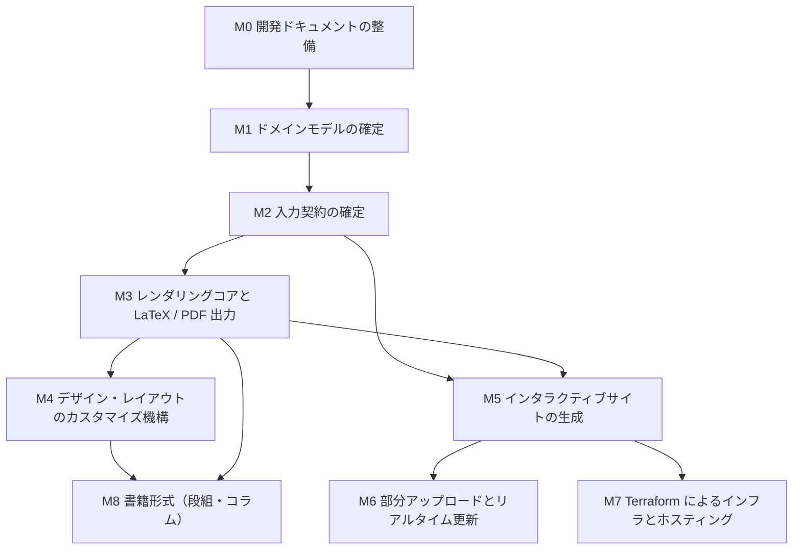

# マイルストーン

構造化テキストのレンダラーを、依存順に並べたゴール単位へ分解したもの。
**各マイルストーンは「依頼者が満たされたと判断できる最終状態」で書く。** 作業手順ではない。

## 依存関係

## 一覧

| # | マイルストーン | 満たされた状態 | 依存 |
| --- | --- | --- | --- |
| M0 | 開発ドキュメントの整備 | テンプレートの `docs/` を複製し、本プロジェクト固有の前提（入力が構造化テキストであること、出力が複数形式であること）を追記した状態 | — |
| M1 | ドメインモデルの確定 | 文書・ブロック・ノード・出力形式・テーマ等の概念と関係が、テンプレートの DDD 方針に沿って定義され、依頼者が承認した状態 | M0 |
| M2 | 入力契約の確定 | レンダラーが受け取る構造化テキストの契約が、既存 2 実装（Ising プロジェクトの構造化テキスト、旧Webビューアの domain-model）を一次情報として一般化され、型で表現された状態 | M1 |
| M3 | レンダリングコアと LaTeX / PDF 出力 | 1 つの入力から、arXiv へ投稿できる純粋な LaTeX と PDF が生成でき、未解決参照ゼロで実際にビルドが通る状態 | M2 |
| M4 | デザイン・レイアウトのカスタマイズ機構 | レンダラー本体を書き換えずに、利用者側の定義だけで出力の体裁を変えられる状態。既定テーマと、それを差し替えた例が動く | M3 |
| M5 | インタラクティブサイトの生成 | 同じ入力から Web サイトが生成され、閲覧者が操作できる（少なくとも参照の相互リンク、目次、数式表示）状態 | M2, M3 |
| M6 | 部分アップロードとリアルタイム更新 | 構造化テキストの一部だけを送ると、閲覧中の全員の画面が更新される状態。複数人が同時に同じサイトを見ながら論文を更新できる | M5 |
| M7 | Terraform によるインフラとホスティング | インタラクティブサイトのホスティング環境が Terraform で構築でき、実際に公開できる状態 | M5 |
| M8 | 書籍形式 | 段組・コラムを差し挟んだ読み物としての出力が生成できる状態 | M3, M4 |

## 進め方

- **1 マイルストーン＝1 セッション**で進める。マイルストーンを跨いだ並列は、依存が無い場合に限る。
- 各マイルストーンの着手時に、`docs/` の思想（特に `programming-philosophy.md` の
  エントロピー最小化と原理主義的 DDD）へ照らして設計を点検する。
- **既存実装を先行事例として必ず読む。** 白紙から設計しない。

## 現在地

- M0: 完了（テンプレートの `docs/` 複製、本ファイル、README）
- M1: **完了**（依頼者が承認した）
  - 成果物: [domain-model.md](./domain-model.md)、根拠は `design-notes/`
  - 承認を要した 5 論点はすべて確定（A-3 / B-2 / C-2 / D-1 / E-1）。
    採らなかった案とその帰結は [design-notes/settled-questions.md](./design-notes/settled-questions.md)
  - 併せて、システムの名称を `structured-latex` に確定した（ドメインモデルが中心で、
    レンダラーはその上のモジュール）。入力言語の正本はこのシステムが 1 つだけ持つ
- M2: **完了**
  - 入力言語（L1）・解決済み文書（L3）・配信契約の型、ラベル型と文書集約モジュールの生成器、
    SSOT の entity 定義（`zod-to-entity-definitions`）と保存先宣言を実装
  - 図表を語彙に追加（`figure` ブロックと `image` ノード）。判断の根拠は domain-model.md §7.5
  - 型で落とすもの／実行時に残すものの切り分けを [type-coverage.md](./type-coverage.md) に記録
  - `npm run check` が全項目通る（単体テスト 30 件、負テスト 16 ケース × 正誤）
  - 将来要求（ゼミ形式の共同執筆、LaTeX 入力経路）を domain-model.md §16 に記録
- M3〜M8: **未着手**。次は M3。
- 旧Webビューアは廃止・削除済み。そこで実証した寛容な解決だけをドメインモデルへ残した。
- 各論文には静的HTML生成器があり、章ナビゲーションの既定UIだけを `renderers/html/` へ共有した。
  生成器全体と解決はまだ各論文側にあるため、M5 のシステム共通出力器は未完了である。

  | 事項 | 状態 |
  | --- | --- |
  | 解決（採番・参照解決・ノート配置）の実装がシステムに 1 つだけになった（F9 の解消） | **済**。`domain-model/resolved/resolve.ts`。厳格な `resolve` と寛容な `resolveTolerantly` が同じ実装を通る |
  | 静的 HTML + KaTeX 表示、`ref` の相互リンク | **済**。各論文の `tools/build-html.ts` |
  | 目次でのナビゲーション | **済**。`renderers/html/chapter-navigation.ts` を各静的HTML生成器が共有。スマートフォン幅ではハンバーガーから入れ子を含む全階層の目次を開く |
  | 公開 Web サイトの**システム共通生成器** | **未**。生成器本体は各論文側に残るため M5 は未完了 |
  | **部分**アップロードによる更新（セグメント単位の受け入れ API、版と楽観ロック） | **未**。M6 は未完了 |
  | 複数人が同時に同じサイトを見ながら更新する運用 | **未** |
